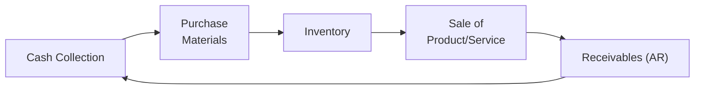

## Introduction
Working capital management can appear intimidating at first glance—cash moving in, cash moving out, inventory piling up, and a mountain of invoices waiting to get paid. But, in practice, it’s all about balancing the short-term financial “ins and outs” in a way that helps the company stay healthy and run smoothly. I remember once advising a small family-run business that felt forever strapped for cash. They had healthy sales, decent profit margins, and a loyal customer base. Yet, they always seemed to struggle to pay bills on time. It turned out that their receivables were far from well-managed—they were letting big customers stretch payments for months. That was the wake-up call!

In this section, we’ll take a deep dive into managing receivables, payables, and inventory. We’ll also check out some helpful methods, best practices, and potential pitfalls. Along the way, we’ll slip in a few personal takes and real-world anecdotes to make things more, um, relatable, you know?

## The Working Capital Cycle
Before diving into specifics, it helps to visualize how cash flows through a typical business—sometimes called the “cash conversion cycle” or “working capital cycle.” Here’s a simple diagram using Mermaid to show the flow between cash, inventory, sales, receivables, and back to cash:



In a perfect world, money flows seamlessly from one stage to the next. But in reality, each stage introduces timing differences and potential costs. Let’s see how strategic management of each component can alleviate bottlenecks and free up valuable cash.

## Receivables Management
Receivables are essentially money owed to you by your customers. While it might feel great to see a lot of sales on the books, you have to remember that sales aren’t truly sales until you collect the cash.

### Credit Policies and Terms
One of my mentors once told me, “Never let your eagerness for sales override the need for sound credit decisions.” That’s huge. If you extend credit to customers who can’t or won’t pay, it can turn into bad debt. A well-structured credit policy typically covers:
• Credit terms: For instance, you might offer terms like 2/10, net 30, giving a 2% discount if the invoice is paid within 10 days, otherwise it’s due in 30 days.
• Credit standards: You define a minimum level of creditworthiness for new and existing customers. This might involve pulling credit reports or reviewing financial statements.
• Collection processes: Outline how you’ll follow up on overdue payments—when do you send reminders? When do you escalate to a collections agency?

As an example, if your terms are 2/10, net 30, you might want to compare the cost of offering that discount to the value of receiving funds early. The annualized cost of forgoing a 2% discount over a 20-day extension can be approximated by:


\text{Cost of Trade Credit} = \left(\frac{0.02}{1 - 0.02}\right) \times \left(\frac{365}{30 - 10}\right) \times 100\%


Which is often quite high—so many companies prefer to pay early if they can.

### Monitoring Accounts Receivable
To ensure you’re not handing out “free money,” you need robust tracking. Two common metrics/practices are:

• Days Sales Outstanding (DSO). A quick version of DSO is  

\text{DSO} = \frac{\text{Accounts Receivable}}{\text{Average Daily Sales}}
  
If your DSO is, say, 60 days, but your terms are net 30, that might suggest you’re letting customers slide. Not good for cash flow.

• Aging Schedule. This is just a breakdown of who owes you money and how long they’ve owed it—e.g., 0–30 days, 31–60 days, 61–90 days, etc. A quick look at an aging schedule can reveal if a few large accounts are perpetually late, or if you’re letting an entire customer segment push you around.

### IFRS vs. US GAAP Considerations for Receivables
Under IFRS (International Financial Reporting Standards), receivables are typically measured at amortized cost, and allowances for doubtful accounts are guided by the “expected credit loss” model (IFRS 9). US GAAP has a similar approach called the CECL (Current Expected Credit Loss) model. Both require you to estimate losses on receivables early—historical patterns, current conditions, and forward-looking info are all used to come up with your best estimate of uncollectible amounts.

### Quick Python Snippet
Sometimes, it’s useful to automatically flag overdue accounts. Below is a tiny python snippet (just for illustration) that can help identify customers who are significantly behind:

```python
import pandas as pd

data = {
    'Customer':['A','B','C','D'],
    'Amount':[10000, 5000, 8000, 12000],
    'DaysOutstanding':[15, 45, 90, 10]
}
df = pd.DataFrame(data)

df['Overdue'] = df['DaysOutstanding'] > 30

print(df)
```

While simplistic, it demonstrates how technology can simplify the watch process.

## Payables Management
Next, let’s see the flip side: the money you owe to suppliers. I’ve seen businesses that obsess about collecting from customers quickly and then pay their own suppliers late. Well, it saves short-term cash, but trust me, if you push it too far, you might damage relationships, or force suppliers to demand cash on delivery (COD).

### Balancing Payment Timing
The goal? Pay your supplier on—or near—the due date and take advantage of discounts if they make sense. Pouncing on an early payment discount can yield an attractive return on your cash. For instance, a 2% discount for paying 20 days earlier can be an annualized rate of over 36%. That’s enormous compared to many short-term financing options.

### Supplier Goodwill
If you let accounts payable balloon indefinitely, your suppliers might eventually cut you off or raise prices to cover higher risk. Keeping them in the loop—really just being open and honest if you are in a crunch—helps preserve goodwill. You never want a supplier to assume the worst about your financial stability.

### IFRS vs. US GAAP Considerations for Payables
For payables, IFRS (IAS 37) and US GAAP (ASC 450/460) mostly align in requiring accrual of liabilities when an obligation is probable and can be reliably measured. Where differences sometimes show up is in how you treat provisions, contingent liabilities, or discounting for long-term payables. But for short-term trade payables, you won’t typically see major differences.

### Payment Schedule Example
Suppose you buy $50,000 in raw materials every month. The supplier offers a 1% discount for payment within 10 days. Doing a quick estimate of the cost of trade credit can show you whether paying on day 10 is better than paying on day 30.


\text{Annualized Cost} = \left(\frac{0.01}{1 - 0.01}\right) \times \left(\frac{365}{20}\right) 


If that’s higher than  your short-term borrowing cost, you can save money by paying early.

## Inventory Management
Inventory might seem like a separate conversation, but it’s crucial to the working capital puzzle. Holding too much means you’ve tied up money in assets that aren’t generating income. Holding too little might lead to stockouts—and that can drive customers straight into a competitor’s arms.

### Approaches to Inventory Control
• Economic Order Quantity (EOQ). EOQ is a classic formula that helps you balance the trade-offs between ordering costs (e.g., shipping, setup) and holding costs (e.g., insurance, storage). The formula is:


\text{EOQ} = \sqrt{\frac{2AS}{h}}


where:  
A = Demand in units over a period  
S = Ordering cost per order  
h = Holding cost per unit per period  

It’s an old-school formula but still relevant if your demand is fairly steady.

• Just-in-Time (JIT). Popularized by Toyota, JIT attempts to keep inventory levels minimal—components arrive just when needed. While JIT can slash holding costs, it demands a very reliable supply chain. A single delay can halt production.

• Material Requirements Planning (MRP). MRP systems use forecast demand, bills of materials, and production schedules to figure out what you need to produce (or order) and when. Great for complex products with many interdependent components.

### ABC Analysis
Often used to segment inventory into three categories:
• A-items: High-value or high importance. Think a vital component in a car engine.  
• B-items: Mid-range.  
• C-items: Low value or infrequent sales.  

You focus the bulk of your attention on A-items, ensuring you never run out, while applying looser controls for C-items.

### IFRS vs. US GAAP Inventory Nuances
The main difference you’ll see is that IFRS bans the use of LIFO (Last-In, First-Out) while US GAAP allows it. Under IFRS (IAS 2), you generally use FIFO (First-In, First-Out) or Weighted Average. Meanwhile, US GAAP says, “Use whichever method you want—LIFO, FIFO, Average—just be consistent.” Also, IFRS requires inventory to be measured at the lower of cost and net realizable value, whereas US GAAP typically follows lower of cost or market, with a slightly different definition of “market.”

## Real-World Case Studies
Sometimes I think about the infamous 1990s story of a major PC manufacturer that adopted JIT inventory practices. They drastically cut the time products spent on the shelf, which saved them millions in storage costs. The approach rocketed them to become a leading low-cost provider. However, I’ve also seen companies that tried slightly sloppy JIT and ended up missing key shipments. Talk about whiplash from too little inventory on hand.

Then there’s the scenario with a medium-size retailer that extended 60-day credit to certain big clients. Their sales soared—great!—but they ended up missing payroll a couple times because cash didn’t show up for two months. In the end, they had to negotiate lines of credit to tide them over. Good example of how you really want to match up your outflows with your inflows.

## Common Challenges and Tips
• Matching Inflows and Outflows: If your customers are paying you net 60, but you pay your suppliers net 15, that mismatch can be brutal.  
• Overzealous Credit Policies: Extending easy credit can boost sales, but be mindful of credit risk.  
• Ignoring Early Payment Discounts: If the discount is giving you a higher benefit than your short-term investment returns, you’re missing out.  
• Excess vs. Lean Inventory: You’ve got to find the sweet spot—enough to avoid stockouts but not so much that your storage costs skyrocket.

## Conclusion
Managing your receivables, payables, and inventory shouldn’t be a rigid, one-size-fits-all affair. It’s about understanding your business’s unique cash flow needs, cost structures, and supply chain dynamics. By applying a thoughtful approach to each component—credit policies, payment terms, and inventory strategies—you can free up cash, reduce risk, and enhance profitability. And honestly, you’ll probably sleep better at night knowing you have your short-term finances in check.

## References and Further Reading
- Gitman, L. (2018). Principles of Managerial Finance. Pearson.  
- Hill, N. & Sartoris, W. (1992). Short-Term Financial Management. Macmillan.  
- CFA Institute. (n.d.). “Managing Receivables, Payables, and Inventory.”  
  (https://www.cfainstitute.org/)  

## Test Your Knowledge: Managing Receivables, Payables, and Inventory Quiz



### A company offers 2/10 net 30 terms. What is the primary reason a customer might pay early?

- [x] To benefit from an effective annual discount rate that is often quite high
- [ ] To improve the supplier’s cash cycle
- [ ] Because the firm’s credit policy prohibits late payments
- [ ] Because the net amount owed is immaterial

> **Explanation:** The main rationale is the effective annual rate of return when taking the discount. Forgoing a 2% discount in 20 days can be significantly more expensive than it seems at face value.

### Which of the following best describes the purpose of an aging schedule?

- [ ] To track inventory transformations from raw materials to finished goods
- [x] To identify how long each receivable has been outstanding
- [ ] To determine a firm’s reorder point for inventory
- [ ] To measure a firm’s payables turnover ratio

> **Explanation:** An aging schedule categorizes accounts receivable by the length of time they have been outstanding, helping firms pinpoint overdue accounts.

### Under IFRS, which inventory costing method is disallowed?

- [ ] Weighted Average
- [ ] FIFO
- [x] LIFO
- [ ] Specific Identification

> **Explanation:** IFRS (IAS 2) prohibits LIFO. US GAAP allows LIFO, but IFRS does not.

### What is the primary risk of extending credit too leniently?

- [ ] Increased net income in the short term
- [ ] Decline in sales
- [ ] Immediate improvement in cash flow
- [x] Excessive bad debt expenses and potential cash flow strains

> **Explanation:** Extending credit without sufficient checks can result in higher accounts receivable that go uncollected and hurt the firm’s liquidity.

### In a JIT inventory system, a primary risk is:

- [ ] Over-paying suppliers for inventory
- [x] Stockouts if suppliers fail to deliver on time
- [ ] Increased holding costs
- [ ] Having excess finished goods

> **Explanation:** JIT reduces holding costs but also means any delay from suppliers can halt production entirely, leading to potential stockouts.

### Which of the following is an advantage of taking an early payment discount from a supplier?

- [x] Reduces the effective interest cost on payables
- [ ] Maximizes the use of the firm’s cash
- [ ] Increases the days payable outstanding
- [ ] Allows the firm to carry more inventory

> **Explanation:** Early payment discounts often yield a high effective return on cash, effectively reducing interest costs compared to other short-term financing options.

### Which of the following is a key component in determining the Economic Order Quantity (EOQ)?

- [x] Holding costs
- [ ] Aging schedule categories
- [x] Ordering costs
- [ ] Quick ratio

> **Explanation:** EOQ relies on balancing ordering costs (e.g., cost each time you place an order) and holding costs (e.g., cost per unit of holding inventory).

### Firm ABC has net 45-day terms with most customers but pays suppliers net 15 days. What is the most direct cash flow consequence?

- [x] Potential liquidity squeezes if receivables are not collected in a timely manner
- [ ] Cash flow is improved as payables turnover is lower than receivables turnover
- [ ] Immediate rise in net income
- [ ] No effect as long as the firm is profitable

> **Explanation:** Such a mismatch can cause a short-term financing gap, requiring additional liquidity to cover outflows before inflows arrive.

### A typical measure for evaluating how effectively a firm’s customers pay on time is:

- [x] Days Sales Outstanding (DSO)
- [ ] Inventory Turnover
- [ ] Current Ratio
- [ ] Debt/Equity Ratio

> **Explanation:** DSO quantifies the average number of days it takes customers to pay the firm, directly reflecting receivables management efficiency.

### Some practitioners view paying suppliers slightly after the official due date as:

- [x] True
- [ ] False

> **Explanation:** True—some companies do it to improve their own cash flow. However, it can risk damaging supplier relationships and result in penalties or stricter payment terms later.


