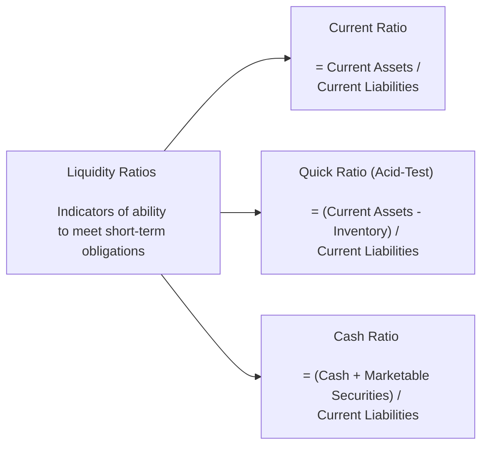
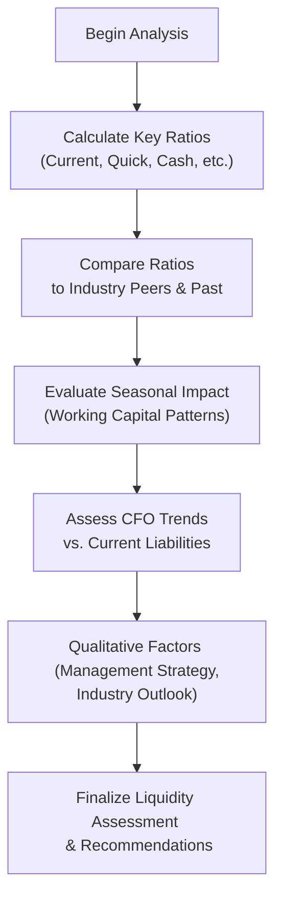

## Introduction to Liquidity

Sometimes I think back to when I helped manage a small local bakery. You know, there’d be weeks where cash was tight because flour prices skyrocketed or customers were fewer than expected—especially right after the holiday season when folks were done indulging. It was nerve-racking to face short-term bills, and it made me realize how important it is to keep an eye on what we in finance call “liquidity.” Liquidity, in a nutshell, is about whether an organization has enough resources on hand to meet its short-term obligations. For a corporate issuer—from that small bakery to a massive multinational conglomerate—a good handle on liquidity is vital for day-to-day survival.

In corporate finance, liquidity analysis helps us gauge how effectively an organization is managing its working capital (current assets minus current liabilities), how comfortably it can handle unexpected expenses, and how it compares to industry peers. While prioritizing long-term profitability is clearly essential, companies also need to ensure that they have adequate short-term resources to avoid liquidity crunches. A robust measure of liquidity, therefore, can reveal whether the firm is prepared to weather sudden, short-term financial storms.

## Why Liquidity Matters for Corporate Issuers

Corporations—public or private—must manage their liabilities in a timely manner to maintain stakeholder confidence, preserve credit ratings, and avoid the costs of financial distress. Liquidity metrics help investors, creditors, and management see if the company has:

• Adequate resources to cover immediate payments (wages, supplier invoices, interest on debt, etc.).  
• Enough flexibility to capitalize on urgent or timely opportunities (like purchasing discounted raw materials).  
• Proper balance between investing for growth and keeping enough short-term assets to cover upcoming bills.

Moreover, insufficient liquidity often leads to default risk spiraling upwards, increased cost of capital, and in extreme cases, bankruptcy or restructuring. By contrast, holding too many liquid assets might limit the company’s potential returns; thus, firms aim for a healthy balance—covering short-term liabilities without hoarding excess cash that could otherwise be invested in profitable opportunities.

## Core Liquidity Ratios

### Current Ratio

The Current Ratio is often the first stop when assessing liquidity because it provides a quick snapshot of how many dollars of current assets the organization holds for each dollar of current liabilities:

$$
\text{Current Ratio} = \frac{\text{Current Assets}}{\text{Current Liabilities}}
$$

• A ratio above 1 typically means the firm has more current assets than short-term obligations.  
• Different industries have different norms. A heavy manufacturing company could have a higher current ratio due to large inventory holdings, whereas a technology services firm might operate comfortably at or below 1.  
• While a healthy current ratio is usually viewed positively, an excessively high ratio might indicate underutilized assets or inefficiencies in working capital management.

If you think about our bakery example, a current ratio above 1 might mean we have enough flour, sugar, and short-term receivables to pay off our monthly lease, utilities, and payroll. But if it’s too high, we might be sitting on too many sacks of flour that we don’t need right now—or maybe we’re not strategically investing our extra cash.

### Quick (Acid-Test) Ratio

Inventory is not always quickly convertible to cash. A classic example is a car dealership: sure, they have a lot of vehicles on the lot, but those cars can stay unsold for months. The Quick Ratio (sometimes called the Acid-Test Ratio) takes the concept of the Current Ratio and excludes inventory, providing a tighter measure of a firm’s ability to meet obligations with its most liquid assets:

$$
\text{Quick Ratio} = \frac{\text{Current Assets} - \text{Inventory}}{\text{Current Liabilities}}
$$

• This ratio is particularly useful for companies that hold significant inventories prone to volatility or obsolescence.  
• A ratio well below 1 might indicate that the firm is heavily reliant on selling inventory or obtaining external financing to cover short-term debts.  
• Because it focuses on near-cash assets, it can be a more conservative liquidity measure than the Current Ratio.

### Cash Ratio

The Cash Ratio is the strictest measure of liquidity, looking exclusively at cash and near-cash securities. It’s like asking, “If I had to pay my bills tomorrow morning, do I have enough immediate cash on hand—no strings attached—to settle them?”

$$
\text{Cash Ratio} = \frac{\text{Cash} + \text{Marketable Securities}}{\text{Current Liabilities}}
$$

• Often, this ratio hovers well below 1, because most firms prefer to deploy cash in revenue-generating activities rather than keep it idle.  
• A higher Cash Ratio can be beneficial, especially for businesses facing cyclical downturns, but may also suggest a firm is missing out on higher-return opportunities for that cash.  
• This ratio offers the little voice in the CEO’s ear that says, “Show me the money, right now.”

Below is a quick visual overview of these three main liquidity ratios:

## Working Capital Turnover

Working capital turnover gauges how efficiently a company uses its net working capital (current assets minus current liabilities) to generate revenues:

$$
\text{Working Capital Turnover} = \frac{\text{Revenue}}{\text{Average Working Capital}}
$$

• A higher turnover suggests the firm is efficient in using its working capital to support sales.  
• Note that too high a turnover might also indicate that the firm is running too lean—particularly risky if there’s a sudden spike in demand or supply chain disruption.  
• This metric can vary considerably among industries. Retail and fast-moving consumer goods (FMCG) firms often display high turnover because of quick inventory turnover and short operating cycles, whereas heavy machinery producers might have lower turnovers.

Remember how it was at the bakery? If I was turning my flour and other ingredients into pastries and then into revenue quickly, my working capital turnover would look great. But if I was hoarding bags of flour or letting accounts receivable build up, the turnover metric would drop.

## Cash Flow from Operations (CFO) and Liquidity

Measuring operational cash flow helps analysts see how much cash a firm’s core operations truly produce—separate from financing or investing activities. One way to contextualize CFO in terms of liquidity is to look at CFO relative to average current liabilities, which gives a sense of how consistently operations generate enough cash to cover near-term obligations.

• When CFO is consistently high relative to short-term liabilities, the firm appears self-sufficient.  
• A declining CFO trend might signal weakening demand or rising costs—both red flags for liquidity.  
• In cyclical industries, analysts often explore CFO patterns across multiple business cycles to gauge how well the firm can handle recessions or off-peak seasons.

## Trend Analysis and Peer Comparisons

Assessing liquidity is not just a one-time event. Observing changes in these ratios over several periods and comparing them with industry peers is critical. Many cyclical businesses experience substantial peaks and troughs in inventory and receivables based on seasonality, so a point-in-time ratio can be misleading. Borrowing short-term funds or settling seasonal obligations immediately before closing the books, for instance, can temporarily inflate or deflate key ratios.

Thus, an analyst might:  
• Look at quarterly or monthly data to pinpoint seasonal trends.  
• Compare the firm’s liquidity ratios against a peer group of similar size, industry, and business model.  
• Examine projections of CFO relative to upcoming capital expenditures and scheduled debt maturities.  

## Real-World Considerations

When I was at the bakery, one big challenge was the holiday cycle: we’d hire extra staff in December, buy more inventory, and see a spike in payables. Our liquidity metrics often dipped during the pre-holiday build-up but then shot up right after everything sold. Carefully interpreting that type of cyclical fluctuation was crucial. Larger corporations face similar patterns—especially those dealing with agricultural or other seasonal goods.  

Another interesting scenario is technology hardware firms that carry high inventory of components with volatile price points or short product lifespans. A big chunk of inventory that goes obsolete can distort a quick ratio or hamper future CFO.

## IFRS vs. US GAAP Classification

Under both IFRS and US GAAP, current assets and current liabilities are typically those expected to be used or settled within 12 months (or one operating cycle). However, subtle differences in definition or in the required note disclosures can affect how certain items appear on the balance sheet. For instance:

• IFRS may allow broader flexibility in classification of short-term vs. long-term liabilities (e.g., refinanced debt near the balance sheet date).  
• Presentation requirements for inventory or financial instruments can differ slightly.  

Despite these nuances, the core idea remains: short-term items belong on the current section of the balance sheet, facilitating ratio calculation.

## Potential Pitfalls and Best Practices

• Over-Reliance on a Single Ratio: No single ratio gives a complete picture. A high Current Ratio might hide slow-moving inventory or looming payables spikes.  
• Seasonal Distortions: Ratios taken at year-end might not reflect average conditions. Analysis of interim periods or rolling averages is recommended.  
• Window Dressing: Firms sometimes use short-term financing to pay down liabilities right before the reporting date, artificially improving liquidity ratios.  
• Industry Differences: A Current Ratio of 1.2 might be unimpressive for a retailer but quite strong for, say, a telecom services firm with negative working capital cycles.  
• Trend Lines vs. Snapshots: Liquidity ratios can shift abruptly due to macroeconomic shocks or internal policy changes, so keep an eye on the bigger historical and forward-looking narrative.  
• Consider CFO Strength: Even if a firm’s Current and Quick Ratios look strong, negative long-term trends in CFO can signal deeper liquidity problems ahead.

## Mermaid Diagram: Liquidity Analysis Decision Flow

Below is a simplified conceptual flow on how one might approach liquidity analysis, from ratio calculation to deeper interpretive steps:

## Practical Example

Let’s consider a hypothetical electronics distributor, ElecMart, that sells smartphone components. A quick snapshot of their balance sheet data for the past two years shows:

• Current Assets increased from \$500 million to \$700 million.  
• Current Liabilities rose from \$400 million to \$620 million.  
• Inventory made up 40% of Current Assets last year but 50% this year.  
• Cash + Marketable Securities accounted for 20% of Current Assets last year but 15% this year.  

Calculating their ratios:

• Last Year:  
  – Current Ratio = 500 / 400 = 1.25  
  – Quick Ratio = (500 – 200) / 400 = 300 / 400 = 0.75  
  – Cash Ratio = (100) / 400 = 0.25  

• This Year:  
  – Current Ratio = 700 / 620 = 1.13  
  – Quick Ratio = (700 – 350) / 620 = 350 / 620 ≈ 0.56  
  – Cash Ratio = (105) / 620 ≈ 0.17  

At first glance, ElecMart’s Current Ratio dropped from 1.25 to 1.13. But more drastically, their Quick Ratio fell from 0.75 to around 0.56, while their Cash Ratio also declined. This suggests the company is relying more heavily on inventory that might not be as liquid. If these components become outdated, the firm could struggle to meet obligations without converting inventory or relying on external financing.

ElecMart’s CFO statement might show that they had robust operational cash flows in the past, but recently CFO turned negative due to a buildup of receivables as well. Taken in combination, these changes indicate that management should explore ways to ensure short-term financing lines can cover a potential liquidity gap—or reduce the inventory carrying period.

## Strategies to Overcome Liquidity Challenges

• Improve Receivable Collection: Tightening credit terms, offering discounts for early payment, or using factoring can accelerate cash inflows.  
• Optimize Inventory Levels: Using just-in-time (JIT) or other efficient inventory control systems can prevent excessive stock buildup.  
• Maintain Adequate Cash Reserves: Align with the firm’s risk appetite to handle unforeseen shortfalls while avoiding excessive idle cash.  
• Diversify Funding Sources: Having a credit facility or commercial paper program can help manage short-term spikes in working capital needs.  
• Regular Monitoring: Periodic ratio analysis helps identify trends early, reducing the risk of sudden liquidity crises.

## Conclusion

Liquidity measures are vital gauges of a company’s short-term financial health. While the Current Ratio, Quick Ratio, and Cash Ratio each examine slightly different aspects of near-term solvency, they are most powerful when used together—along with complementary metrics like Working Capital Turnover and CFO-based measures. Interpreting these ratios requires attention to industry norms, seasonal patterns, and broader strategic choices about how the firm balances risk and reward.

Whether you’re running a small bakery or a global tech giant, keeping an eye on liquidity can help you sleep a bit better at night, knowing you’ve got enough in the piggy bank for tomorrow’s obligations. Just remember to compare multiple time periods and look for patterns that signal underlying issues or strengths. In other words, real liquidity analysis is about so much more than just plugging numbers into a formula and calling it a day—context is king.

## References and Further Reading

- Subramanyam, K. R., & Wild, J. (2017). “Financial Statement Analysis.” McGraw-Hill Education.  
- CFA Institute. (n.d.). “Financial Analysis Techniques.”  
  (https://www.cfainstitute.org/)  

- “International Financial Reporting Standards (IFRS).”  
  (https://www.ifrs.org/)  

- “US Generally Accepted Accounting Principles (US GAAP).”  
  (https://www.fasb.org/)  

- “Working Capital and Liquidity,” Chapter 4.1 and Chapter 4.2 in CFA® 2025 Level I, Volume 3: Corporate Issuers.

## Test Your Knowledge: Liquidity Ratios and Metrics



### Among the common liquidity metrics, which ratio offers the strictest assessment of a company's ability to meet short-term obligations?

- [ ] Current Ratio
- [ ] Quick Ratio
- [x] Cash Ratio
- [ ] Working Capital Turnover

> **Explanation:** The Cash Ratio focuses solely on cash and marketable securities relative to current liabilities, making it the most conservative measure of near-term solvency.

### An unusually high Current Ratio might indicate which potential issue for a company?

- [x] Excess underutilized assets
- [ ] Insufficient inventory for operations
- [ ] Overly restrictive credit policy
- [ ] Low potential for future growth

> **Explanation:** While a high Current Ratio is often seen as a sign of liquidity strength, it can also mean that the company is not deploying assets efficiently, possibly indicating idle cash or excess inventory.

### The Quick Ratio excludes inventory because:

- [ ] Inventory counts as a non-current asset for ratio analysis.
- [x] Inventory may not be readily convertible to cash.
- [ ] Firms should always have zero inventory on hand.
- [ ] Inventory is only measured on an annual basis.

> **Explanation:** By removing inventory from current assets, the Quick Ratio measures only the most liquid assets (cash, equivalents, receivables). Inventory may be illiquid or subject to markdowns, especially in industries with rapidly changing products.

### If a company’s Cash Ratio is 1.5, it implies:

- [ ] The company cannot meet its short-term liabilities with its current cash holdings.
- [x] The company has 1.5 times the immediate liquid resources needed to cover short-term liabilities.
- [ ] The company’s liabilities are 1.5 times its cash and marketable securities.
- [ ] The company needs to raise more debt to cover upcoming obligations.

> **Explanation:** A Cash Ratio of 1.5 means the firm’s cash and marketable securities exceed its current liabilities by 50%. This is quite high and could signify excessive cash reserves.

### A rising Working Capital Turnover ratio generally suggests:

- [ ] The firm is accruing more long-term debt.
- [x] The firm is generating more sales per unit of working capital.
- [ ] The number of suppliers is increasing significantly.
- [ ] The firm is converting long-term assets into short-term assets.

> **Explanation:** Working Capital Turnover = Revenue / Average Working Capital. An increase indicates that the firm uses its working capital more efficiently to drive sales.

### One reason to examine CFO relative to average current liabilities is to:

- [ ] Forecast the firm’s dividend payout ratio.
- [x] Assess how effectively operations cover periodic short-term obligations.
- [ ] Evaluate the payback period of capital projects.
- [ ] Compare net income across peer firms.

> **Explanation:** CFO (Cash Flow from Operations) offers insight into the cash a firm’s core operations generate. Comparing it to current liabilities gauges how well the firm’s operational cash can handle near-term obligations.

### Seasonal companies often see large swings in their inventory and payables. To address this issue when analyzing liquidity, an analyst should:

- [ ] Rely solely on year-end figures for consistency.
- [x] Review quarterly or monthly liquidity ratios to adjust for seasonality.
- [ ] Use only the Cash Ratio to ignore inventory fluctuations.
- [ ] Conclude that the business is always illiquid.

> **Explanation:** A one-time “snapshot” might not accurately depict the liquidity of seasonal businesses. Interim data helps capture the full operational cycle.

### A retail firm with rapid inventory turnover might prefer the Current Ratio over the Quick Ratio because:

- [ ] The Current Ratio is always higher.
- [ ] The Quick Ratio ignores days payable outstanding.
- [x] Inventory is quickly sold, so it remains a fairly liquid current asset.
- [ ] The Quick Ratio is rarely used in retail.

> **Explanation:** In retail, inventory tends to convert to cash quickly, making it relatively more liquid. The Quick Ratio removes inventory from consideration, so it may underestimate a retailer’s true liquidity.

### In a scenario where a firm’s CFO is declining while its Current Ratio remains stable, which action might be most prudent for an analyst?

- [x] Investigate the quality of earnings and any rising operational costs.
- [ ] Ignore the discrepancy, as the Current Ratio is the only valid measure of liquidity.
- [ ] Immediately conclude the firm is insolvent.
- [ ] Focus on the debt-to-equity ratio as the primary metric.

> **Explanation:** CFO captures the actual cash generated from operations. A stable Current Ratio might mask potential issues if CFO is deteriorating, so digging deeper is necessary.

### True or False: Under IFRS and US GAAP, current assets and current liabilities are always classified identically with no substantive differences.

- [ ] True
- [x] False

> **Explanation:** While both IFRS and US GAAP share broad principles for current vs. non-current classification, there can be subtle but meaningful differences in presentation and disclosure requirements that influence reported liquidity.


