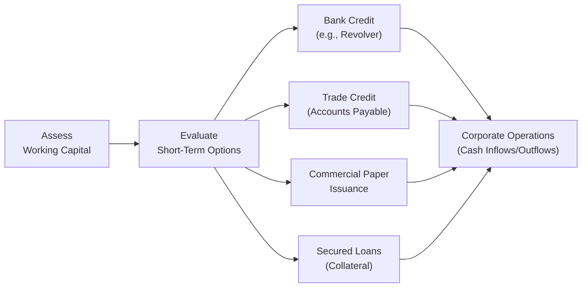

## Overview and Importance

Short-term funding plays a crucial role in working capital management. It’s the financial lifeblood that keeps everyday operations moving—just like how we might need an occasional bridge loan from a friend to cover us until payday. Companies tap into short-term finance when seasonal cash flows ebb, when inventory needs spike, or simply to smooth out the lumps in their operational cycles. Sourcing these funds effectively can be the difference between a business that thrives and one that struggles with liquidity problems.

This section builds on our discussion of working capital metrics (see earlier sections in Chapter 4) by focusing on the specific instruments companies can use to satisfy short-term financing needs. We’ll take a look at various sources—from credit lines to commercial paper—while also touching on key considerations like collateral, creditworthiness, and cost.

## Key Funding Instruments and Strategies

### Bank Credit Lines
Bank credit lines—or lines of credit—are sort of like a corporate credit card. Ah, I remember this from my early finance days, feeling a bit like discovering a magic "draw when you need it" pot. Companies establish a maximum borrowing limit with a bank; they can then draw down any portion of that limit to finance temporary cash shortfalls or support short-term business operations. Two common forms include:

• Uncommitted Credit Lines  
• Committed Credit Lines (often called Revolving Credit Facilities)

#### Revolving Credit Facilities
A revolving credit facility (often just called a “revolver”) is a formal legal commitment by the lender. As a result, interest rates and fees might be slightly higher compared to an uncommitted line, but the certainty of funding can be invaluable—especially during unexpected cash crunches. Be mindful of covenant requirements under IFRS and US GAAP, which could dictate how the facility is presented on the balance sheet.

### Trade Credit
Trade credit arises naturally as businesses purchase goods or services from suppliers on terms like "net 30" or "net 60," effectively deferring payment. It’s considered a “spontaneous” source of financing because it tends to expand as the company’s operations (and thus payables) grow.

While it's tempting to use trade credit as a go-to source of funding (“why pay now when you can pay later?”), it’s not free. If a supplier offers a discount for prompt payment, you might face a hidden cost by not taking it. For instance, to figure out if you’re missing out on a benefit, you can estimate the annualized cost:


\text{Cost of trade credit} = \left(\frac{\text{Discount}}{1 - \text{Discount}}\right)
\times \left(\frac{360}{\text{Full credit period} - \text{Discount period}}\right)


I once worked for a midsized manufacturer that routinely skipped the early payment discount. Oops. Over time, that “savings” turned into a much higher implied interest rate than even a short-term bank loan.

### Commercial Paper
Commercial paper (CP) is a short-term unsecured note issued by large, creditworthy institutions. Typically, maturities range from just a few days to a maximum of 270 days (to avoid certain registration requirements under U.S. securities law). CP generally has a lower cost than comparable bank financing—assuming the issuer has strong credit ratings.

However, CP depends heavily on market confidence. If investors lose faith in the issuer's credit quality, rates spike or funding dries up. This was quite evident during periods of credit market stress, where even top-rated issuers faced higher yields or lost market access.

### Secured Short-Term Lending
When a firm needs financing at a lower rate but doesn’t have an unconditional high credit rating, it may pledge assets like accounts receivable or inventory as collateral. These arrangements come in two broad flavors:

• Receivables-Backed Loan: Collateral is a company’s outstanding invoices.  
• Inventory-Backed Loan: Collateral is physical inventory (e.g., raw materials, finished goods).

Because there’s a tangible asset for the lender to claim if the company defaults, interest rates tend to be more favorable than unsecured arrangements. However, the availability and value of collateral fluctuate over time, which can introduce complexity.

### Lines of Credit vs. Working Capital Loans
While a line of credit works like a credit card with on-demand withdrawals, a working capital loan is typically a lump sum disbursed to the borrower. Think of it like getting a single chunk of cash up front to cover immediate needs—such as seasonal build-up in inventory—versus having ongoing access to funds. Although working capital loans can be renewed or “rolled over,” they’re less flexible than a revolving credit facility and can come with stricter usage covenants.

## Diagram: Short-Term Funding Overview

Below is a Mermaid diagram that illustrates how short-term funds can move in and out of a corporate issuer’s balance sheet:

Companies typically start by assessing their working capital positions. If the gap is large or seasonal, they evaluate the short-term financing toolbox—credit lines, trade credit, commercial paper, or secured loans—to bridge any cash flow mismatches.

## Best Practices and Key Considerations

• Strive to maintain a balanced approach that combines spontaneous financing (like trade credit) with more formal arrangements (credit lines).  
• Understand the covenants: Committed facilities may come with financial ratios you must maintain under IFRS or US GAAP.  
• Keep a close eye on risk diversification. Overreliance on one funding source (like unsecured CP) can expose you to market volatility if conditions deteriorate.  
• Retain capacity for emergencies. A line of credit fully utilized offers less of a safety net if an unexpected shortfall hits.  
• Evaluate hidden costs. Each financing tool—especially trade credit—may have opportunity costs and fees that can exceed the “sticker price.”  
• Communicate with stakeholders, including your board, creditors, and investors, to ensure transparency and compliance with the CFA Institute Code and Standards.

## Practical Example

Let’s say a company has a large seasonal sales peak every November and December. In September, the firm must ramp up inventory to prepare for holiday shipments—tying up cash in goods that won’t convert to receivables until mid-December or January. They face a short-term cash flow gap. Possible solutions might include:

• Drawing on a revolving credit facility to finance the increased inventory. Once the sales receipts come in, the firm pays down the credit line.  
• Issuing commercial paper, if the firm is solidly rated, to capture a potentially lower interest rate than the bank line.  
• Negotiating extended trade credit terms with suppliers, though this might mean not taking advantage of early payment discounts.  

In practice, the firm might combine these tactics—perhaps using some trade credit for raw materials while simultaneously deploying a line of credit to cover other operational costs.

## Common Pitfalls
• Ignoring Discount Opportunities: Failing to take advantage of trade discounts can be costly in the long run.  
• Over-Leveraging Short-Term Debt: Relying too heavily on short-term debt for long-term needs can trigger liquidity problems if lenders suddenly withdraw support.  
• Mismanagement of Collateral: With secured loans, collateral values can fluctuate, prompting lenders to reassess and demand partial repayment.  
• Covenant Breaches: Missing certain financial covenants can lead to accelerated repayment demands or higher interest rates.

## Exam Tips and Time Management
In the CFA Level III exam, scenario-based questions often make you compare different short-term funding options for a company facing a liquidity crunch or operational expansion. Watch for details on interest rates, credit ratings, discount terms, or covenants. Your analysis should show:

• Which funding tool is most cost-effective (hint: don’t forget the cost of missing trade discounts!).  
• How each choice might impact liquidity ratios and compliance with IFRS or GAAP presentation.  
• Potential risks, especially if the firm’s creditworthiness is uncertain.  

You might see a constructed response question that asks you to justify your recommendation. Aim for a concise yet thorough answer. Time management is critical—practice “bullet point style” responses where you state the recommended approach, the rationale, and relevant calculations.

## References and Further Reading
• Fabozzi, F. (2019). Capital Markets: Institutions, Instruments, and Risk Management. MIT Press.  
• CFA Institute. (n.d.). “Short-Term Funding and Liquidity Management.” [CFA Institute](https://www.cfainstitute.org/)  
• Official CFA Program Curriculum. (Various topics on short-term liquidity and working capital)  

Remember to bring these references into your discussion if the exam question demands a deeper theoretical framework or cites guidelines from the CFA Institute Code and Standards.

---

## Test Your Mastery: Short-Term Funding Strategies and Sources Quiz



### Which of the following best describes a revolving credit facility?
- [ ] It is a one-time lump sum loan with a fixed repayment schedule.
- [x] It is a committed line of credit allowing multiple drawdowns up to a limit.
- [ ] It is an uncommitted line of credit used solely for equipment purchases.
- [ ] It is a form of unsecured commercial paper with flexible maturity dates.

> **Explanation:** A revolving credit facility is a formal commitment where a borrower can draw and repay up to a prescribed limit multiple times.

### Suppose a supplier offers 2/10 net 30 terms. The company does not pay within 10 days and thus loses the discount. Which financial concept is most relevant for measuring the cost of this decision?
- [x] The cost of trade credit
- [ ] The discount rate in a discounted cash flow model
- [ ] The internal rate of return for a capital project
- [ ] The effective tax rate on short-term income

> **Explanation:** The cost of trade credit captures the implied interest expense of forgoing a discount. It reflects an annualized rate based on the discount percentage and the difference in payment dates.

### A firm with a strong credit rating wants to raise short-term funds at the lowest cost possible, but is concerned about market sentiment. Which instrument is most likely to meet their needs?
- [x] Commercial paper
- [ ] Secured mortgage loan
- [ ] Common equity issuance
- [ ] Factoring arrangement

> **Explanation:** Commercial paper generally offers lower interest rates than bank loans or factoring, provided the company has a solid credit rating and stable market conditions.

### Which of the following is a spontaneous form of short-term financing?
- [ ] Secured inventory loan
- [ ] Commercial paper issuance
- [x] Trade credit
- [ ] Bond issuance

> **Explanation:** Trade credit is considered spontaneous because it arises naturally in the normal course of business, coinciding with the purchase of goods and services.

### When a firm pledges receivables or inventory for a loan, this arrangement is called:
- [ ] Commercial paper
- [ ] A self-liquidating loan
- [x] Secured lending
- [ ] A line of credit

> **Explanation:** Secured lending involves pledging specific assets. This reduces the lender’s risk and often lowers interest costs for the borrower.

### Which statement is true about committed lines of credit?
- [ ] They are not legally binding on the lender.
- [ ] They do not require financial covenants.
- [x] They usually involve a commitment fee charged by the lender.
- [ ] They can never be renewed or extended.

> **Explanation:** A committed line of credit (e.g., a revolving credit facility) requires a commitment fee on the unused portion, as the lender is obligated to provide funds when requested.

### One potential drawback of using commercial paper for short-term financing is:
- [ ] Its interest rates are higher than most bank loans.
- [x] It relies heavily on maintaining a strong credit rating and market confidence.
- [ ] It has a statutory maturity limit of 365 days.
- [ ] It cannot be purchased by institutional investors.

> **Explanation:** Commercial paper is unsecured and depends on the issuer’s creditworthiness. A drop in the issuer’s rating or adverse market sentiment can drastically affect the company’s ability to issue CP at favorable rates.

### In comparing a revolving line of credit and a one-year working capital loan:
- [ ] Both offer identical flexibility in timing of drawdowns.
- [ ] Revolving credit typically requires use of collateral, while working capital loans do not.
- [x] Revolving credit has flexible drawdowns; working capital loans provide lump-sum funding.
- [ ] Working capital loans are more suitable when seasonal needs are uncertain.

> **Explanation:** The distinguishing feature of a revolving credit facility is that the borrower can draw, repay, and re-borrow within the agreed limit at any time. A working capital loan generally provides one sum at origination.

### Which is a key benefit of a secured short-term loan compared to an unsecured one?
- [x] It often comes with a lower interest rate due to collateral.
- [ ] It never has covenants.
- [ ] It is always convertible into equity.
- [ ] It carries zero default risk.

> **Explanation:** With secured lending, collateral reduces the lender’s risk, often resulting in more favorable (lower) interest rates for the borrower.

### True or False: Overreliance on short-term debt for financing long-term assets can create liquidity risks.
- [x] True
- [ ] False

> **Explanation:** Matching the duration of debt with the useful life of assets is critical. Using short-term debt to fund long-term needs can lead to rollover and refinancing risks, especially if market conditions change.


