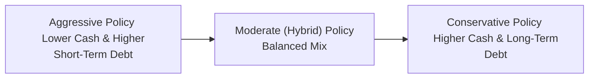

## Introduction
Working capital policy involves deciding how much cash, receivables, and inventory your company should keep on hand, as well as how best to finance these current assets. This seemingly simple topic can get surprisingly tricky, especially when you have to weigh liquidity risk against profitability goals. Some firms keep large cash buffers, invest heavily in inventory, and rely mostly on long-term debt to avoid sudden liquidity hiccups. Others streamline receivables, keep minimal inventory, and use more short-term financing to boost returns—at the expense of higher risk. Anyway, there’s no single “right” approach; each firm’s strategy depends on its risk tolerance, market stability, and growth aspirations.

In prior sections of this chapter (e.g., “4.1 Cash Conversion Cycle Components and Analysis,” “4.2 Managing Receivables, Payables, and Inventory”), we explored the mechanics of day-to-day working capital management. Here, we’ll zoom out a bit to understand the overall policy choices—aggressive versus conservative—and how these approaches influence the firm’s liquidity profile, risk exposure, and bottom line.

## Key Concepts and Policy Spectrum
At its core, a working capital policy specifies:
• The desired level of current assets.  
• How these current assets will be financed (i.e., short-term vs. long-term funding).  

The level of current assets and the choice of funding sources form two primary levers that corporate management can adjust. If you dial down current assets and favor short-term financing, you’d be adopting a more aggressive policy. By contrast, if you dial up cash reserves, hold larger inventory balances, and finance them with stable, longer-term debt, that’s a more conservative stance.

Below is a simple diagram illustrating the continuum of approaches:

### Net Working Capital Formula
At a high level, net working capital (NWC) is defined as:

\text{Net Working Capital} = \text{Current Assets} - \text{Current Liabilities}.

A higher NWC often indicates a more conservative approach (assuming those current assets are liquifiable). A lower NWC, on the other hand, signals that the firm is willing to operate with a tighter liquidity cushion.

## Aggressive Policy
An aggressive working capital policy entails:
• Holding relatively low levels of current assets, such as minimal cash balances and lean inventories.  
• Financing a significant portion of those current assets with short-term debt.  

### Rationale
Some firms choose an aggressive policy to enhance returns on equity (ROE). Since short-term debt typically carries lower interest rates—but must be rolled over or refinanced periodically—this approach can reduce the weighted-average cost of capital (WACC). Also, lower balances of idle cash reduce the opportunity cost of holding non-earning (or low-earning) assets on the balance sheet.

### Risks and Challenges
• Liquidity Crunch: If credit markets tighten or unexpected cash shortfalls arise (e.g., from delayed customer payments), the firm could face difficulty refinancing its short-term obligations.  
• Volatility in Interest Rates: Reliance on short-term financing means the firm often faces variable or fluctuating interest rates, which can hamper profitability if rates spike.  
• Operational Disruptions: With less inventory on hand, a minor supply chain hiccup may directly translate into lost sales.  

### Example
Imagine a fast-growing tech start-up deciding to rely on a revolving credit facility to finance production of its new gadgets. The CFO has embraced an aggressive stance, keeping inventory light to avoid tying up cash. Everything seems to work fine as long as product demand is predictable, supply chain partners are dependable, and short-term interest rates remain stable. But if an unexpected spike in component costs or a sudden delay in customer payments occurs, the start-up could be scrambling for funds—illustrating the liquidity risk that is part and parcel of an aggressive policy.

## Conservative Policy
A conservative working capital policy involves:
• Maintaining higher levels of current assets, such as plenty of cash on hand and healthy inventory.  
• Financing most of these current assets via longer-term debt or equity, or a mix of both.  

### Rationale
Firms adopt a conservative policy to reduce liquidity risk and ensure smoother operations, especially under uncertain business conditions. By having a robust cash balance and perhaps even some marketable securities, the company is better able to cope with unexpected events—like abrupt sales shortfalls or credit tightenings—without resorting to high-interest, emergency borrowing.

### Trade-Offs
• Higher Carrying Costs: Excess inventory costs can mount quickly (warehousing, insurance, spoilage, and obsolescence). Holding large sums of cash means forfeiting higher returns that might be earned in longer-term investments.  
• Potentially Lower Returns: Because more capital is “parked” in low-yielding assets, overall return metrics such as ROA (return on assets) and ROE (return on equity) may dip.

### Example
Consider a large distributor in a stable—but slightly slow-growth—industry. Management decides to keep inventories high to secure volume discounts and maintain product availability for key clients. They finance these inventory piles with long-term bonds, locking in a fixed interest expense for several years. This arrangement grants a buffer against short-term swings in interest rates or supply chain disruptions, letting managers sleep better at night. However, the trade-off is the cost of carrying all that inventory and missing out on other investment opportunities that could generate higher returns.

## The Trade-Off
So, which policy is better? Perhaps the best answer is: neither—by itself. Most firms adopt a policy somewhere along the continuum of aggressive to conservative. The selection depends on:
• Industry Characteristics: Some industries, like retail or consumer electronics, can manage with just-in-time inventory and lean procedures. Others, such as industrial machinery or pharmaceuticals, might require large safety stocks to avoid production shutdowns or stockouts.  
• Economic Environment: When short-term interest rates are very low, a more aggressive policy might be cost-effective—until market conditions change. In uncertain times, adopting a conservative stance might protect the firm from credit crunches or interest rate shocks.  
• Management Risk Tolerance and Strategy: A higher growth ambition often goes hand in hand with a slightly more aggressive stance. A firm with stable operations and a desire to preserve capital might choose a conservative stance.  

Sometimes, management blends approaches—keeping a moderate liquidity buffer while also relying partly on short-term funding. This “hybrid” approach attempts to optimize the trade-off by balancing day-to-day operational needs with cost considerations. In practice, the firm might maintain a minimum level of current assets solvency and keep a portion of working capital financed with short-term lines of credit, reviewing that balance monthly or quarterly.

## Monitoring and Adjusting Working Capital Policy
Regardless of the chosen approach, continuous monitoring is essential. A policy that is perfect today might become outdated tomorrow. Consider changes in:
• Market Sentiment and Credit Conditions: Tightening credit markets or changing borrowing spreads can quickly make an aggressive policy riskier.  
• Exchange Rates and Commodity Prices: Multinational firms or those heavily reliant on raw materials must watch out for fluctuations that can amplify volatility in payables or inventories.  
• Business Growth Stage: Start-ups and high-growth firms often outgrow their initial working capital plan as soon as they expand into new product lines or geographies.  

### Scenario and Stress Testing
It becomes imperative to conduct scenario analyses to see how different events—interest rate surges, dips in demand, supply chain disruptions, or defaults by major customers—could impact the firm’s liquidity. Stress testing, so common in risk management, helps management assess whether they have enough of a liquidity cushion and whether short-term financing might dry up in adverse conditions.

For instance:
• Definition of a “Worst-Case Scenario”: Suppose your top 10% of customers delay payments by 60 days. Can you still settle your payroll, interest, and supplier obligations on time? If not, a more conservative approach may be needed.  
• Macro Shocks: What if inflation pushes short-term interest rates significantly higher, or a currency crisis devalues your local currency, thereby increasing your import bills?  

Plotting these scenarios clarifies how dangerously close you might come to a liquidity shortfall.

## Practical Examples and Case Studies

### Manufacturing Firm “ALPHA Tools”
A hypothetical mid-sized manufacturer, ALPHA Tools, produces specialized drilling equipment. Management recently considered shifting to an aggressive working capital policy—lowering on-hand inventory from three months’ supply to one month, financing the rest through a short-term line of credit. Initial results looked promising: the interest savings from cheaper short-term debt improved ROE, while working capital decreased, freeing up funds to invest in new product lines.

Then a sudden raw materials shortage hit the market. ALPHA Tools found itself scrambling to replenish stock at higher spot prices. Even though they were saving money on interest, the operational disruption from a stockout cost them in terms of lost orders and expedited shipping fees. This real-world scenario of adopting an aggressive policy, then facing an external supply shock, underscores why some managers remain cautious about leaning too aggressively on short-term financing and minimal inventory levels.

### E-Commerce Retailer “ZEUS Online”
ZEUS Online, a growing e-commerce platform, runs a fairly conservative policy. They keep comfortable cash reserves and a well-stocked warehouse to offer two-day shipping on orders. They finance these items primarily with longer-term debt. The CFO claims: “I’d rather pay a bit more in carrying costs than risk losing our top customers from stockouts.” During a time of intense competition and supply chain volatility, ZEUS Online’s approach paid off, enabling them to fulfill orders quickly when competitors ran out of key products. Their brand reputation improved, albeit with a slight drag on short-term profitability.

## Best Practices, Common Pitfalls, and Strategies
Below are some practical takeaways that bridge the gap between aggressive and conservative stances.

### Best Practices
• Align Policy with Strategy: Ensure the working capital policy supports the firm’s growth trajectory, risk appetite, and capital structure strategy (see Chapter 6 for more on capital structure).  
• Perform Regular Liquidity Forecasts: Conduct rolling forecasts to spot potential cash gaps early. Consider worst-case scenarios.  
• Diversify Funding Sources: Even in an aggressive approach, avoid relying solely on a single type of short-term financing. Spread your bets across credit lines, commercial paper, or other avenues where possible.  
• Revisit Inventory Policies: Inventory management techniques like just-in-time (JIT), vendor-managed inventory, or consignment can reduce carrying costs without compromising supply.  

### Common Pitfalls
• Overreliance on Short-Term Credit: When markets or banks pull back, your short-term credit line may vanish at precisely the worst time.  
• Misjudging the Opportunity Cost of Excess Cash: While it’s nice to have a big cushion, too much cash can dilute returns if not put to productive use.  
• Inadequate Risk Assessment: Failing to stress test for supply chain breakdowns, economic downturns, or interest rate spikes can lead to sudden liquidity surprises.  

### Strategies to Overcome These Issues
1. Establish Clear Liquidity Targets: Decide on a target current ratio or quick ratio that aligns with your risk tolerance and rating objectives (for instance, if you aim to preserve an investment-grade credit rating).  
2. Use Contingent Financing Options: Have standby credit facilities or shelf registrations for bond issuance to quickly pivot if short-term financing dries up.  
3. Tiered Inventory Approach: Classify inventory by turnover rate or criticality. Keep ample “A-list” items in stock, while “C-list” items might be held in smaller quantities or produced on demand.  

## Regulatory and Accounting Considerations
While IFRS and US GAAP do not mandate a specific working capital policy, they do determine how current assets and liabilities are classified, which can affect certain ratios and covenants. In some jurisdictions, short-term obligations that are regularly rolled over may still be classified as long-term if the rollover is contractually guaranteed, potentially masking the real short-term leverage. Firms must be transparent in financial reporting to ensure stakeholders accurately perceive liquidity risk.

From a CFA Institute Code and Standards perspective, a firm’s approach to working capital must be presented fairly to investors, with no obfuscation of liquidity or financing structures. Ethical obligations also compel management to consider the potential harm of overly ambitious strategies if they jeopardize shareholder or stakeholder interests in uncertain market conditions.

## Conclusion
Working capital policy is a delicate balance between risk and return. An aggressive stance can be profitable but entails more vulnerability to market fluctuations and operational hiccups—particularly around short-term financing renewals and inventory management. A conservative route fosters stability and resilience but often comes at the price of lower returns on capital. Many businesses adopt a hybrid position, continually monitoring market signals, adjusting their approach, and recalibrating asset levels and financing sources.

I recall a funny conversation with a CFO who said, “I’d rather keep a chunk of cash unused and trade some returns for the privilege of sleeping peacefully.” Her colleague shot back, “Sure, but while you’re sleeping, we could be using that cash to invest in a new product line!” That conversation captures the essence of this entire discussion: it all comes down to how the firm views risk versus reward. By staying alert to economic signals, regularly reviewing liquidity positions, and aligning working capital policy with broader strategic goals, companies can find the sweet spot that suits them best.

## Final Exam Tips
• Connect the dots to other chapters: For instance, short-term financing decisions (Chapter 4.4) are tightly linked to your choice of working capital policy. Also consider how your capital structure decisions (Chapter 6) influence how much short-term debt you want to hold.  
• Watch out for “trick” exam scenarios: Often in the constructed-response portion of the CFA exam, you’ll find a scenario with stable short-term rates suddenly disrupted by an unexpected interest rate hike or supply chain glitch. Evaluate how well the firm’s policy holds up.  
• Manage time effectively: Exam questions might ask you to propose adjustments to a firm’s working capital policy, so be ready to justify each recommendation with both quantitative (liquidity ratios, cost of capital) and qualitative (operational stability, strategic goals) reasons.  
• Don’t forget ethics and disclosures: If the firm’s CFO is painting a rosy picture while downplaying the level of short-term liabilities, this raises red flags under the CFA Institute Code and Standards.  

## References and Further Reading
• Weston, F., & Brigham, E. (1981). “Essentials of Managerial Finance.” The Dryden Press.  
• CFA Institute. (n.d.). “Working Capital Approaches (Aggressive vs. Conservative).”  
  https://www.cfainstitute.org/  

--------------------------------------------------------------------------------

## Test Your Knowledge: Working Capital Policy Quiz



### Which of the following best describes an aggressive working capital policy?  
- [ ] Maintaining high cash reserves and financing them with long-term debt.  
- [x] Maintaining minimal current assets and relying on short-term financing.  
- [ ] Holding significant inventory as a buffer and avoiding short-term credit.  
- [ ] Using primarily equity financing to fund current assets.  

> **Explanation:** An aggressive policy focuses on minimizing cash and other current assets, while using short-term loans or other short-term instruments to finance working capital.

### A firm adopting a conservative working capital policy is most likely to:  
- [ ] Minimize carrying costs by reducing inventory.  
- [ ] Heavily utilize short-term debt for financing.  
- [ ] Offer extremely lenient credit terms to boost sales.  
- [x] Maintain higher levels of current assets and rely on long-term financing.  

> **Explanation:** A conservative policy maintains ample liquidity in the form of larger current assets (e.g., cash, inventory) and usually funds them with longer-term, stable financing sources.

### Which of the following is a primary advantage of an aggressive working capital strategy?  
- [x] Potential for higher returns on equity.  
- [ ] Reduced volatility in interest rates.  
- [ ] Lower risk of liquidity crunch in a downturn.  
- [ ] Higher levels of safety stock in inventory.  

> **Explanation:** The primary advantage of an aggressive approach is that it can enhance returns by minimizing idle assets and lowering financing costs through short-term, lower-rate borrowing.

### One key drawback of a conservative working capital policy is that it:  
- [ ] Often limits the ability to meet short-term obligations.  
- [x] Results in potentially higher carrying costs for excess cash or inventory.  
- [ ] Implies minimal reliance on long-term financing and reduces interest expenses.  
- [ ] Necessitates frequent refinancing.  

> **Explanation:** A conservative approach can lead to unused cash or slow-moving inventory on the balance sheet, which incurs carrying costs and yields lower returns.

### In stress testing a firm’s working capital policy, management should primarily focus on:  
- [ ] Maximizing immediate profitability without any regard for risk.  
- [x] Assessing how the firm would cope with adverse shifts in interest rates and sales patterns.  
- [ ] Ensuring net income never falls below zero.  
- [ ] Maintaining the same level of short-term debt under all conditions.  

> **Explanation:** The objective of stress testing is to see how robust the firm’s liquidity and financing arrangements are under stressful market or operational scenarios.

### A hybrid (or moderate) working capital approach often involves:  
- [x] Maintaining a baseline level of current assets and financing partially with short-term and partially with long-term debt.  
- [ ] Storing excessive amounts of inventory without considering cost.  
- [ ] Strictly using short-term debt for all financing needs.  
- [ ] Solely relying on equity financing.  

> **Explanation:** A moderate approach blends elements of both aggressive and conservative policies, balancing risk and return.

### If a firm wants to minimize financing costs by taking advantage of historically low short-term interest rates but is also worried about risk, it might:  
- [ ] Fully move to a conservative approach and use only long-term debt.  
- [ ] Eliminate its cash buffer completely to maximize returns.  
- [x] Keep some short-term financing but establish backup credit lines or commercial paper programs.  
- [ ] Adopt automatic renewal provisions on all short-term debts, guaranteed with no further conditions.  

> **Explanation:** The firm can partially use short-term debt for cost-effectiveness but mitigate risk by diversifying financing sources or keeping fallback options.

### An organization that values seamless operations over maximizing returns on assets is most likely to:  
- [ ] Adopt an extremely aggressive approach to working capital.  
- [ ] Eliminate all forms of debt.  
- [ ] Keep minimal inventory to avoid storage costs entirely.  
- [x] Maintain a conservative level of current assets and use stable long-term financing.  

> **Explanation:** Prioritizing operational stability generally means maintaining a larger liquidity buffer and favoring longer-term, more predictable financing sources.

### Which scenario exemplifies a pitfall of an aggressive working capital policy?  
- [x] A raw material shortage leads to stockouts, causing lost sales and extra shipping costs.  
- [ ] Secured, long-term lines of credit reduce monthly interest expense.  
- [ ] High volumes of safety stock cause storage costs to skyrocket.  
- [ ] The firm obtains lower cost financing through a bond issuance.  

> **Explanation:** In an aggressive policy, minimal inventory and reliance on short-term procurement can result in difficulties if supply chain disruptions occur.

### True or False: The CFA Institute Code and Standards would view obfuscation of a firm’s extensive reliance on short-term debt as unethical.  
- [x] True  
- [ ] False  

> **Explanation:** Per the CFA Institute Code and Standards, full and fair disclosure of the firm’s financial condition and risks is essential. Concealing or misrepresenting significant short-term obligations could mislead investors.


