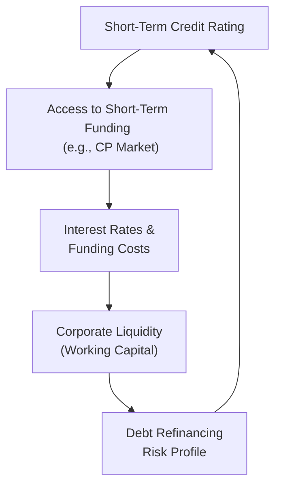

## Overview and Context

Short-term credit ratings can feel, you know, a bit niche when first encountered, but they’re actually major gearwheels in a firm’s overall financial engine. In this section, we’ll explore the ins and outs of short-term credit ratings, how they’re assigned, and what their fluctuations mean for companies seeking to manage liquidity and navigate the complexities of working capital. We’ll touch on rating agencies, real-world examples, best practices, and even a few personal anecdotes (like something I learned the hard way in corporate treasury—more on that later!).

We’ll also highlight practical steps to maintain or improve a short-term credit rating, the ramifications of sudden downgrades, and how all of this ties right back to your cost of capital and liquidity ratio management.

## Understanding Short-Term Credit Ratings

Short-term credit ratings are basically an independent, professional opinion on a company’s (or issuer’s) ability to meet obligations coming due within a year. As you may recall, short-term borrowing is common when companies issue commercial paper (CP) or tap into revolving credit lines for day-to-day operations. The better the short-term rating, the more easily and cheaply a company can access these funding sources.

### Major Credit Rating Agencies

Three principal players—Standard & Poor’s (S&P), Moody’s, and Fitch—dominate the credit rating scene. Each agency uses a slightly different scale for short-term ratings, typically signified by letters and numerals (e.g., S&P’s A-1+, A-1, A-2; Moody’s P-1, P-2, P-3; and Fitch’s F1+, F1, F2). Higher categories indicate lower default risk, translating into lower interest costs when tapping short-term debt markets.

For example, S&P’s top short-term rating for commercial paper is A-1+, signifying that the issuer has an extremely strong capacity to meet short-term financial commitments. A rating a notch or two down (e.g., A-2 or A-3) hints at a less robust capacity, potentially leading to higher funding costs. If you’ve ever worked in a corporate treasury, you know how a single notch down can trigger a wave of phone calls, urgent Slack messages, and a CFO’s frown.

Below is a simplified table illustrating short-term rating categories from each agency:

| Agency          | Highest Category    | Second-Tier Category | Third-Tier Category |
|-----------------|---------------------|-----------------------|---------------------|
| Standard & Poor’s (S&P) | A-1+                | A-1                   | A-2                 |
| Moody’s         | P-1                 | P-2                   | P-3                 |
| Fitch           | F1+                | F1                   | F2                 |

*Note: Each agency may have additional modifiers or designations.*

## Key Determinants of Short-Term Ratings

### 1. Liquidity Ratios

Credit rating analysts typically look at a variety of metrics that assess liquidity, including:
• Current Ratio (Current Assets ÷ Current Liabilities)  
• Quick Ratio ((Cash + Marketable Securities + Receivables) ÷ Current Liabilities)  
• Cash Conversion Cycle metrics  

A company boasting a consistently strong current ratio is in a better position to handle near-term liabilities with available short-term resources, which is a plus in rating agencies’ eyes.

### 2. Cash Flow Stability

A robust cash flow is like a safety harness: it cushions you when markets wobble and the cost of funds starts to climb. Firms with diversified operations, stable margins, or predictable revenue streams (think subscription-based businesses, or those with well-structured long-term contracts) are more likely to earn stronger short-term ratings. Analysts also review free cash flow generation and track record of disciplined capital expenditures—after all, repeated overspending can strain future liquidity.

### 3. Refinancing Risk and Debt Coverage

Refinancing risk is the possibility that maturing debt cannot be replaced or rolled over on favorable terms. If a significant chunk of a company’s total debt matures soon—or if the company is highly dependent on short-term funding—it can unnerve rating agencies. They may pay special attention to:
• Maturity distribution of outstanding debt  
• Diversity and reliability of funding sources  
• Potential covenants that could accelerate repayment obligations  

Let’s say a company has most of its short-term financing in commercial paper markets. If that firm sees a rating downgrade from A-2 to A-3, it might be forced to roll over its CP at higher rates or scramble to find alternative financing. That’s not a trivial matter—it can cost millions more in interest and hamper daily liquidity.

### 4. Overall Capital Structure

Short-term credit ratings don’t exist in a silo. Agencies examine how short-term liabilities fit within the entire capital stack—both debt and equity. Does the company have too much leverage, putting them at higher risk of liquidity constraints? Are there structural subordination issues between operating subsidiaries and the parent company? A strong equity base and well-managed long-term debt can reinforce confidence that short-term obligations will be met without constant refinancing drama.

## Short-Term Rating Upgrades: Benefits and Drivers

When a firm’s short-term rating gets bumped up, it is often accompanied by:
• Lower interest rates on new or refinanced short-term debt  
• Greater demand for the firm’s commercial paper  
• Easier access to lines of credit  
• Improved confidence from vendors that extends favorable payables terms  

I remember a mid-sized industrial manufacturer I worked with (back in my days at a corporate advisory firm). They had good fundamentals but a shaky short-term credit rating caused by a messy acquisition. After management streamlined operations and improved their liquidity metrics, the rating agencies upgraded their short-term rating from A-3 to A-2. The CFO literally exclaimed, “We’ve saved half a million dollars in interest—overnight!” This might sound like small change to some large multinationals, but to them, that was a new piece of equipment or breathing room to invest in product development. That’s real power.

## Short-Term Rating Downgrades: Consequences and Risks

Conversely, a downgrade can be a real punch to the gut—yet it often doesn’t come out of the blue. Rating agencies typically place issuers on a “Credit Watch” or “Negative Outlook” first. If warning signals go unheeded, the official downgrade arrives, bringing:
• Higher interest costs on commercial paper and other short-term borrowings  
• Potential reluctance among counterparties to accept the firm’s paper  
• Stricter covenants demanded by banks or bondholders  
• Weaker negotiating power with suppliers on trade credit terms  

The irony is that a downgrade can quickly become self-fulfilling. If short-term rates spike, the company’s cost of capital goes up, draining free cash flow and possibly pushing liquidity ratios in the wrong direction—further validating rating agencies’ concerns. Firms with skeletons (like looming litigation or an overly aggressive share repurchase program that drained liquidity) may find themselves stuck in a downward spiral.

## Proactive Strategies to Maintain Strong Short-Term Ratings

### Maintaining Ample Liquidity

Keeping a healthy buffer in the form of cash, marketable securities, or easy-to-access credit lines lessens the risk that short-term hiccups become crises. Many companies aiming for an A-1 rating hold enough cash or undrawn revolving credit lines to cover near-term debt service for at least a few quarters—even if a short-term funding market temporarily seizes up.

### Prudent Working Capital Management

Your working capital structure—how you manage receivables, payables, and inventory—directly impacts liquidity. A disciplined approach to cash conversion cycles can:
• Ensure cash inflows (like customer payments) line up effectively against outflows (like payroll, supplier invoices).  
• Allow you to handle unexpected events like a surge in raw material costs or a slowdown in sales.  

Lowering days sales outstanding (DSO) and lengthening days payables outstanding (DPO)—in a responsible way that doesn’t alienate suppliers—can free up incremental liquidity and positively nudge short-term metrics.

### Diversification of Funding Sources

Relying on a single short-term funding source (e.g., commercial paper) is risky. A negative rating action or a broad market freeze (like the 2008 global financial crisis) can shut down that door. Depending on local or global operations, a firm might use:
• Bank credit lines (syndicated or bilateral)  
• Asset-backed commercial paper programs  
• Trade finance or supply chain financing  
• Factoring or discounting of receivables  

Staying nimble across different sources helps maintain a strong footing, with or without pristine ratings.

### Communication with Rating Agencies

Most rating agencies encourage open dialogue. They typically don’t appreciate surprises—like a shock bankruptcy filing or the hush-hush assumption of large off-balance-sheet liabilities (which might come to light only when the next financial statement is due). Proactive communication about operating performance, strategic initiatives, and changes in the corporate structure helps reduce uncertainty. That is, it sets an expectation: “Here’s what we’re planning, and here’s the possible impact on our short-term liquidity.” Transparency fosters trust.

## A Visual Guide: Ratings, Cost of Capital, and Liquidity

Below is a simple Mermaid diagram representing how short-term credit ratings connect to broader corporate finance elements:

In this cycle, a high credit rating yields cheaper access to short-term funds, strengthening a firm’s liquidity. Solid liquidity in turn reduces debt refinancing risk, supporting the rating. Conversely, break any of these links—say, a liquidity crunch emerges—and the feedback loop can turn negative, forcing up funding costs and threatening a rating downgrade.

## Case Study: A Quick Turnaround from Rating Trouble

Imagine Company X, a telecommunications firm navigating a saturated market. They faced a short-term rating cut to A-3 (S&P scale) because of concerns about stiff competition, uncertain cash flows from new investments, and high short-term debt. After a tense meeting with major shareholders and rating agency reps, the CFO took decisive action:

1. Entered a strategic partnership that provided guaranteed usage fees to bolster cash flow.  
2. Restructured some high-interest, short-term debt into a slightly longer maturity, alleviating near-term pressure.  
3. Issued new equity to shore up the balance sheet, increasing the equity cushion.  
4. Improved net working capital by optimizing inventory management and renegotiating supplier contracts.  

Within a year, Company X earned an upgrade back to A-2, effectively lowering interest expenses and economic risk. The CFO’s entire approach underlined the interplay between working capital discipline, stable cash flow generation, and proactive communication.

## Monitoring and Ongoing Best Practices

Short-term credit ratings aren’t one-and-done. Continuous monitoring is crucial. Firms should:
• Conduct regular “what-if” scenario analyses (e.g., interest rates suddenly spike by 100 basis points, or a big client defaults).  
• Stress test their liquidity under different revenue or cost conditions.  
• Keep rating agencies in the loop about significant changes to capital allocation, dividend policies, or M&A activity.  

Anyway, the net effect is that you keep your CFO and board comfortable, and rating agencies see fewer red flags.

## Ethical and Regulatory Considerations

From an ethical standpoint, the CFA Institute’s Code of Ethics emphasizes fair dealing, integrity, and transparency in all communications. Issuers are expected to provide accurate financial statements under IFRS or US GAAP and refrain from manipulative transfers or concealing liabilities. Rating agencies, for their part, have also faced scrutiny over potential conflicts of interest—particularly when the issuer pays their fees. To maintain the credibility of short-term credit ratings, both sides must follow high professional standards.

## Exam Tips for CFA Candidates

• Grasp the relationship between working capital management and short-term ratings. Don’t just memorize formulas; understand real-world domino effects.  
• Be comfortable with rating nomenclature—A-1, A-2 or P-1, P-2, etc.—and how each category might affect cost of capital.  
• If you see a case-study style question, focus on liquidity ratios, potential refinancing risk, and the issuer’s communication with credit rating agencies.  
• The exam might include a scenario hinting at an upcoming downgrade; you might need to recommend corrective measures—like immediate cost cutting, refinancing, or changes in capital structure.  
• Time management on essay or item-set questions: quickly identify key terms like “negative outlook” or “credit watch” to structure your response accordingly.

## References and Further Exploration

• Standard & Poor’s (n.d.). “Short-Term Issue Credit Ratings.”  
  S&P Global Ratings:  
  https://www.standardandpoors.com/  

• Moody’s Investors Service (n.d.). “Short-Term Ratings Methodology.”  
  Moody’s:  
  https://www.moodys.com/  

• CFA Institute (2022). CFA® Program Curriculum, Level I–III Volumes.  
  (Particularly sections on financial reporting, working capital, and credit risk analysis)

• Fitch Ratings (n.d.). “Rating Definitions.”  
  https://www.fitchratings.com/

--------------------------------------------------------------------------------

## Test Your Knowledge: Short-Term Credit Rating Implications



### Which of the following most directly benefits from a stronger short-term credit rating?

- [ ] Larger tax deductions on interest expenses
- [x] Lower interest costs on commercial paper
- [ ] Improved brand recognition among consumers
- [ ] Additional long-term bond issuance capacity

> **Explanation:** A higher short-term credit rating reduces the cost of issuing short-term debt such as commercial paper. While it may indirectly help with long-term bond issuance, the immediate benefit is cheaper short-term funding.

### A firm with a short-term credit rating of A-1 (S&P) generally indicates:

- [x] A strong capacity to meet financial commitments in the near term
- [ ] A relatively weak capacity for long-term obligations
- [ ] Pending default on short-term obligations
- [ ] A rating that applies only to equity securities

> **Explanation:** An A-1 rating by S&P implies a robust ability to repay short-term debt. It does not necessarily speak to the firm’s long-term obligations, nor does it suggest default.

### Which agency’s short-term ratings are typically denoted as P-1, P-2, or P-3?

- [ ] Standard & Poor’s
- [ ] Fitch
- [x] Moody’s
- [ ] DBRS

> **Explanation:** Moody’s uses the P-1, P-2, and P-3 system for its prime short-term ratings.

### When a firm’s short-term credit rating is downgraded:

- [x] It may pay higher interest on its commercial paper
- [ ] Its shares automatically get delisted from the stock exchange
- [ ] Its frequency of financial reporting can decrease
- [ ] It can only issue bonds in the secondary market

> **Explanation:** A downgrade often raises the cost of short-term borrowing, such as commercial paper, and can limit a company’s access to certain low-cost funding channels.

### Which factor is least likely to cause a downgrade in short-term credit rating?

- [ ] Worsening liquidity ratios
- [ ] Substantial one-off legal settlements draining cash
- [x] Launch of a new product with high demand and stable cash flows
- [ ] Fall in free cash flow generation

> **Explanation:** A successful new product launch that boosts cash flow would typically support or improve a short-term rating, not harm it.

### A “Credit Watch” designation by a rating agency generally suggests:

- [x] A rating is under review for a potential upgrade or downgrade
- [ ] The firm has been placed in bankruptcy protection
- [ ] The firm can no longer issue short-term debt
- [ ] The firm’s rating is permanently frozen for at least 12 months

> **Explanation:** “Credit Watch” or “Watchlist” status indicates that the rating agency is carefully evaluating the firm for a potential rating change, up or down.

### Which element is most important in determining a firm’s short-term rating?

- [x] Ability to repay maturing debt within one year
- [ ] Historical dividend yield
- [ ] Success of prior equity issuances
- [ ] Quality of intangible assets

> **Explanation:** Short-term ratings focus on a company’s capacity to meet near-term (under 12-month) financial obligations. While intangible assets might help in the long run, immediate liquidity and debt coverage carry more weight for short-term ratings.

### A primary benefit of proactive communication with rating agencies is:

- [ ] Automatically securing the highest possible rating
- [ ] Delaying the disclosure of adverse financial information
- [x] Reducing uncertainty around potential rating changes
- [ ] Outsourcing working capital management to the agency

> **Explanation:** Clear and transparent communication with rating agencies can help reduce surprises and mitigate the risk of rapid, unexpected rating changes.

### To offset a weak short-term credit rating, firms often:

- [x] Diversify their sources of short-term capital
- [ ] Rely solely on commercial paper issuance
- [ ] Eliminate all short-term debt
- [ ] Ignore liquidity ratios and focus on stock repurchases

> **Explanation:** When short-term ratings are suboptimal, diversifying funding sources (e.g., bank credit lines, asset-backed facilities, etc.) mitigates reliance on a potentially expensive or limited commercial paper market.

### A short-term rating reflects a firm’s ability to meet obligations typically due:

- [x] Within 12 months
- [ ] Within 2 years
- [ ] Over 5 years
- [ ] At any time in the future

> **Explanation:** Short-term credit ratings apply to obligations generally due within a year, indicating the level of confidence in the issuer’s near-term liquidity.


