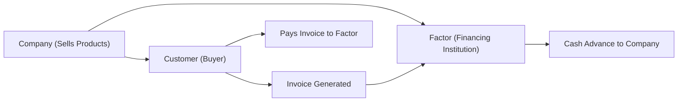

## Introduction to Working Capital Solutions Beyond Traditional Loans

At some point—maybe it was during your undergrad finance class, or when listening to a friend share her start-up’s struggles—you might have heard about factoring, asset-based lending (ABL), or modern crowdfunding platforms. These are not only buzzwords; they’re powerful options for companies looking to boost their working capital and liquidity. And, yes, in the context of the CFA Program’s focus on Corporate Issuers and short-term financing decisions, these tools matter a lot.

Working capital is all about ensuring the company can cover its day-to-day expenses. Most folks first think of standard bank lines of credit or shorter-term notes. But sometimes those lines get tapped out, or maybe the bank just isn’t comfortable lending more without additional collateral or track record. That’s where factoring, ABL, and alternative financing channels step in. In this section, we will highlight each of these methods and walk through their features, benefits, and pitfalls for corporate issuers seeking liquidity.

## Factoring: A Key Tool for Liquidity Management

Factoring involves selling a firm’s receivables at a discount to a third party—often called a “factor.” It’s basically a quick way to convert pending customer payments into actual cash today, removing a good chunk of the messy collection risk from your balance sheet (especially if you opt for “without recourse” factoring). Let’s break it down.

### Factoring Basics

Factoring is straightforward in principle. A company that generates sales on credit terms—like a manufacturing outfit that invoices their wholesale customers, or maybe an IT services firm that bills major corporate clients—often has to wait 30, 60, or even 90 days for a check to come in. Meanwhile, the company needs cash to pay salaries, buy raw materials, or handle other operating expenses. Instead of twiddling their thumbs waiting for dollars to arrive, the company can go to a factor and say, “Hey, I’ve got $1 million in outstanding receivables. Would you like to purchase them at, say, $950,000?” The factor might charge an upfront fee, plus other admin fees, to cover credit risk and the overhead of collecting from the customers.

If it all checks out, the factor gives the company some percentage (often 70–90% of the invoice value) up front and typically holds a reserve. When the customer finally pays, the factor remits the remaining balance minus any additional fees (if applicable). This arrangement provides immediate liquidity to the company.

Here’s a visual depiction in a Mermaid diagram:

### With Recourse vs. Without Recourse

A big difference in factoring lies in whether it’s with or without recourse:

• With recourse: The company must reimburse the factor (or repurchase the receivables) if customers fail to pay. Essentially, the company still carries the default risk. Fees here are usually lower, because the factor isn’t bearing as much risk.

• Without recourse: The factor takes on the credit and collection risk—if the customer doesn’t pay, that’s the factor’s loss. Because the factor shoulders more risk, fees are higher and the initial discount is larger.

Companies frequently choose without recourse factoring to transfer default risk off their balance sheets—assuming they are comfortable paying more in fees. And from an accounting perspective, these arrangements can, under IFRS 9 or US GAAP (ASC 860), remove receivables entirely if certain criteria are met (e.g., the transfer is considered a “true sale”). 

### Key Costs and Considerations

Factoring can plug liquidity gaps, but it’s hardly free. In fact, factoring can be an expensive source of financing—especially for smaller companies with riskier receivables. The effective annualized rate can soar if collection takes a while. You know how short-term interest calculations are: a 2% factoring fee for 30 days can look quite hefty if you annualize it!

Some additional points to weigh:

• Creditworthiness of customers: The factor is more willing to accept receivables from creditworthy buyers—and may refuse or heavily discount those from questionable customers.

• Operational complexity: You might have to coordinate with the factor on invoicing procedures, customer statements, and other operational tasks. This can be a relief if the factor handles all collection, but it can also require adjustments to your accounts receivable process.

• Customer relationship: Some customers might be puzzled (or even frustrated) to discover they should pay a separate factor rather than you. Ensuring a smooth handover can be important for maintaining relationship capital.

Despite these complexities, factoring remains a lifesaver when urgent liquidity is needed and conventional lines of credit are unavailable or insufficient. Particularly in industries with lengthy customer payment cycles—like manufacturing or construction—factoring is a widely recognized practice.

## Asset-Based Lending (ABL)

Asset-based lending (ABL) is another major approach to bridging that working-capital gap. This time, instead of outright selling receivables, a company pledges its assets (usually accounts receivable, inventory, or even equipment) as collateral to secure a loan. I remember an old colleague from the automotive sector explaining how their big seasonal ramps were financed through an ABL facility tied to the volume of projected inventory and receivables. When production soared, the line of credit automatically rose—providing the funds to keep the assembly lines humming.

In many ways, ABL is reminiscent of a line of credit. The difference is that the borrowing base is determined by the value of the pledged assets, which the lender continuously monitors. This dynamic structure can be beneficial to firms with large, high-turnover inventories or stable, collectible receivables.

### Collateral and Monitoring

Under an ABL arrangement, the lender frequently updates the “borrowing base” based on:

• The level and aging of accounts receivable.  
• The quantity and salability of inventory.  
• Sometimes the appraised value of equipment or other tangible assets.

Expect frequent audits by the lender. They’ll want to be sure that the pledged collateral is in good shape and that your receivables are legitimate. And if it’s part of the agreement, they might impose constraints that certain customers can’t exceed a particular weight in the overall receivables portfolio, or that your inventory turnover can’t fall below a set threshold.

### Loan Structure, Covenants, and Rates

ABLs typically come with floating interest rates tied to a reference index (like LIBOR, SOFR, or prime rate). The margin above the index correlates with the perceived credit risk, the quality of the collateral, and the overall market environment. Because asset-based loans are secured, they can offer lower rates than unsecured lines, particularly for firms with robust collateral.

But watch out: lenders often require operational and financial covenants. For instance, you might need to maintain certain liquidity ratios, or keep a minimum net worth. Violating these covenants can lead to stiff penalties or immediate repayment demands.

### Pros and Cons of ABL

Pros:
• Higher borrowing capacity if you have valuable collateral.  
• Potentially lower cost of capital than unsecured credit, thanks to reduced lender risk.  
• May scale with business growth if your asset base rises.

Cons:
• Ongoing collateral monitoring and compliance can be cumbersome (and expensive).  
• You risk losing your assets if you default and the lender seizes collateral to satisfy the debt.  
• Lenders apply strict eligibility rules to collateral—aged inventory or slow-paying receivables might be excluded.

From a working capital perspective, asset-based lending can be more stable than factoring. You’re not selling anything outright; you’re borrowing against your resources. That said, factoring can be more flexible in transferring credit risk, while ABL simply uses that credit risk as collateral.

## Alternative Financing

As the finance ecosystem evolves, we see more non-traditional routes emerging for raising capital—especially for smaller firms or start-ups that lack a robust track record or big-bank relationships. “Alternative financing” is an umbrella term covering everything from peer-to-peer (P2P) loans to crowdfunding campaigns, “angel” investing platforms, or specialized invoice financing websites.

### Peer-to-Peer (P2P) Lending

P2P lending platforms match borrowers (often individuals or small businesses) directly with investors willing to extend credit. By cutting out the traditional bank middleman, P2P lenders promise a fast underwriting process and competitive rates. But that’s also partly because the borrowers’ risk might be higher. P2P lenders typically operate online and rely heavily on credit-scoring algorithms. For liquidity management, a company might apply for a short-term P2P loan to handle a temporary cash crunch.

### Crowdfunding

Crowdfunding is something you might have seen used to fund interesting consumer gadgets or creative projects. Start-ups and more established ventures alike are using crowdfunding to test demand and generate capital. Sometimes it’s reward-based (backers get a product sample or some unique perk), sometimes it’s equity-based (users effectively invest in your company), and sometimes it’s debt-based (much like P2P lending).

When used thoughtfully, crowdfunding can provide not just capital but also a marketing push as your brand or product is circulated on the platform. Of course, it’s not always guaranteed to succeed—plenty of crowdfunding campaigns fail to reach their fundraising target.

### Invoice Financing Platforms

These specialized platforms are a bit like factoring but typically revolve around an online marketplace concept. You post your invoices, and investors bid on financing them. Once a deal is struck, you get immediate funds minus a discount, and the platform’s investors collect the receivable when paid. It’s similar to factoring but with more fluid matching of supply and demand for short-term trade finance.

## Integration with Working Capital Management

How do these financing options fit into the broader working capital strategy? Generally:

• Factoring and invoice financing help reduce days sales outstanding (DSO) by converting receivables into immediate cash.  
• Asset-based lending can finance both receivables and inventory, making it helpful for cyclical or seasonal businesses.  
• Alternative financing plugs the gap for businesses that can’t snag a bank loan or want faster, more flexible funding.

From a strategic CFO’s perspective, the choice between these methods depends on the cost, risk tolerance, ease of obtaining the financing, and the relationships you want to nurture (e.g., factoring might sour some customer relations if not handled delicately). Also remember to consider IFRS and US GAAP disclosure rules: if factoring or alternative financing leads to off-balance-sheet claims, you have to ensure transparency to comply with accounting standards and ethical obligations (per the CFA Institute Code of Ethics and Standards of Professional Conduct).

## Illustrative Example: Tech Supplier Inc.

Let’s put this into a slightly more concrete scenario:

Imagine Tech Supplier Inc., a mid-sized electronics distributor, sells specialized computer components to large manufacturers. Their average receivable collection period is 60 days. They want to ramp up inventory for a new product release but can’t wait 60 days for their biggest invoices to be paid. They have three choices:

• Use factoring: They can sell $500,000 of receivables at a 2% discount to a factor. They receive $490,000 immediately (less some potential administrative fees). They lose a bit of profit, but they’re able to launch the new product on time.  
• Use an asset-based loan: The company pledges not only the $500,000 in receivables but also $200,000 in inventory. The bank offers a credit facility that covers, say, up to 80% of receivables and 60% of inventory. If Tech Supplier is disciplined about the borrowing base reports, they may secure up to $460,000 to $500,000 in financing.  
• Explore a P2P platform: There, a short-term loan might demand 12% annual interest and perhaps a 1% origination fee. The total cost might be less or more than factoring, depending on how quickly they repay the loan. The P2P route is potentially simpler (fewer collateral checks), but could be more expensive if Tech Supplier fails to repay quickly.

Which route they choose depends on their cost of capital, internal controls, tolerance for giving up control over receivables, and the general credit environment.

## Practical Considerations for Implementation

• Conduct a thorough cost-benefit analysis, factoring in not only explicit fees but also intangible factors like administrative burden and customer relationships.  
• Assess the credit strength of your receivables. If you have reliable large customers, factoring or an invoice platform might be simpler and cheaper. If you have a variety of smaller accounts or riskier receivables, expect higher rates or discounted advance rates.  
• Ensure robust systems for monitoring collateral or collecting payments. For example, in ABL deals, you must have reliable inventory accounting, frequent aging analyses, and a disciplined approach to reconciling daily transactions.  
• Maintain transparent reporting. Under IFRS and US GAAP, special attention must be paid to whether a factoring arrangement qualifies as a “true sale.” Meanwhile, for ABL, you’ll need to disclose pledged assets or potential defaults.

## Key Takeaways

• Factoring: Quick access to cash, but can be costly. “Without recourse” factoring can remove default risk from your books—helpful for uncertain times or for companies wanting to offload risky receivables.  
• Asset-Based Lending: Uses receivables, inventory, (and possibly other assets) as collateral. Allows higher borrowing capacity than unsecured credit, but requires strict collateral monitoring and compliance with covenants.  
• Alternative Financing: A wide net that includes P2P loans, crowdfunding, and invoice financing platforms. Especially popular among smaller firms or early-stage ventures needing a funding channel that’s flexible and either complements or replaces traditional bank financing.  
• Working Capital Integration: Each financing route aims to smooth out day-to-day cash flow needs, but the choice depends on cost, speed, control, reputational effects, and your firm’s operational profile.

## Final Exam Tips

• Remember that at the CFA Level III exam, they often present scenario-based or item set questions dealing with working capital optimization, and you might be asked to pick the most cost-effective or strategically relevant approach to financing short-term needs.  
• Understand how factoring affects financial statements and ratios—particularly liquidity (like the current ratio) and leverage ratios. They could test your knowledge of IFRS 9 vs. US GAAP perspectives on de-recognizing receivables.  
• Evaluate trade-offs: For example, you might get a question about a company with lower collection risk but seasonal backlog. Are they better off with an ABL facility pegged to inventory or factoring that quickly recycles cash from large, creditworthy customers?  
• Practice quick math: factoring fees, effective annual rates, or how changes in borrowing base might affect available credit. You might see such calculations in item sets or short-answer questions.  
• Emphasize risk management angles (aligning with the broader corporate governance theme). Over-leveraging or relying too heavily on one type of financing might spike risk.  
• Stay mindful of the ethics dimension: transparency, disclosures, and honest communication with investors about off-balance-sheet financing.

## References

CFA Institute. (n.d.). “Factoring and Asset-Based Lending.” Retrieved from:  
https://www.cfainstitute.org

Mian, S. (2011). “Finance of International Trade.” International Trade Press.

## Test Your Knowledge of Factoring, ABL, and Alternative Financing



### Which of the following best describes factoring?

- [ ] A secured loan backed by specific inventory.  
- [ ] A direct equity injection from institutional investors.  
- [x] The sale of receivables to a third party at a discount.  
- [ ] Raising small funds from many investors via an online platform.  

> **Explanation:** Factoring involves selling receivables at a discount to a factor in exchange for immediate cash.

### Which statement is true regarding “without recourse” factoring?

- [ ] The factor shares default risk equally with the original seller.  
- [ ] The factor recovers any defaulted invoices from the original seller.  
- [x] The factor bears the full default risk if customers do not pay.  
- [ ] The original seller pays no factoring fees at all.  

> **Explanation:** Under without recourse factoring, the factor assumes the collection risk, resulting in higher factoring fees but relieving the seller of bad-debt risk.

### In an asset-based lending arrangement, the lending limit is most directly tied to:

- [ ] The total revenues of the borrowing firm.  
- [ ] The credit quality of the borrowing firm’s owners.  
- [x] The value of the collateral (e.g., receivables, inventory).  
- [ ] The debt-to-equity ratio of the borrowing firm.  

> **Explanation:** ABL lines base their maximum lending amount on the value and quality of collateral pledged, often measured through periodic audits.

### Which is a primary disadvantage of asset-based lending for working capital?

- [ ] Potentially lower borrowing base compared to unsecured funding.  
- [x] Continuous collateral monitoring and compliance obligations.  
- [ ] Reliance on the factor to handle customer collections.  
- [ ] Lack of any security for the lender.  

> **Explanation:** Borrowers using ABL must endure frequent checks and audits, incurring higher administrative burdens.

### Which of the following best describes peer-to-peer (P2P) lending?

- [x] Matching borrowers with individual investors via an online platform.  
- [ ] Selling equity ownership to a venture capital firm.  
- [x] Potentially higher interest rates if borrower risk is significant.  
- [ ] Tied strictly to brand-new start-up companies.  

> **Explanation:** P2P platforms connect borrowers with investors online and can charge higher interest rates, especially for higher-risk profiles.

### Under IFRS or US GAAP, factoring receivables “without recourse” may allow:

- [x] Removal of those receivables from the balance sheet if certain criteria are met.  
- [ ] The receivables to remain as an asset until customer payment.  
- [ ] The factor to list your receivables as their liability.  
- [ ] Complete avoidance of any disclosure requirements.  

> **Explanation:** Accounting standards require that a “true sale” occur before you can de-recognize receivables from the balance sheet in a without recourse factoring arrangement.

### Which factor is most likely to increase the cost of factoring for a given firm?

- [x] Slow-paying customers resulting in a longer collection period.  
- [ ] A robust system for managing large, diverse receivables.  
- [x] Higher perceived client default risk by the factor.  
- [ ] Immediate settlement of receivables by customers.  

> **Explanation:** Factors charge higher fees when the client or its customers pose higher credit risk or collect slowly. Immediate or quick payment reduces the factor’s risk.

### A company using an alternative financing approach like crowdfunding might benefit from:

- [x] Access to a large pool of small investors.  
- [ ] Zero fees or interest obligations.  
- [ ] Full government guarantees for repayment.  
- [ ] Guaranteed success if a campaign is launched.  

> **Explanation:** Crowdfunding connects a business with many potential backers, but it does not guarantee success. Fees and interest might still apply, depending on the platform.

### A potential requirement in an asset-based loan agreement could be:

- [ ] No disclosure of collateral to investors.  
- [x] Maintenance of certain net working capital or coverage ratios.  
- [ ] Permission to continue (and hide) additional non-secured borrowing.  
- [ ] No periodic audits of pledged collateral.  

> **Explanation:** ABL lenders typically include maintenance covenants like minimum net working capital or coverage ratios and require periodic audits of pledged collateral.

### When is factoring generally more advantageous than ABL?

- [x] When the firm wants to transfer default risk to the financing entity.  
- [ ] When the firm wants to secure funds strictly with inventory.  
- [ ] When a firm has few receivables and plenty of fixed assets.  
- [ ] When the firm has minimal concerns over bad debt.  

> **Explanation:** Factoring can help remove default risk if done without recourse, which is a key difference from ABL (where the firm still holds the risk).


