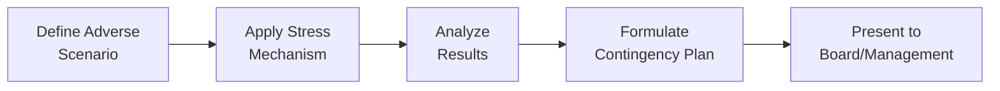

## Overview of Liquidity Stress Testing

Liquidity stress testing assesses a firm’s ability to meet its short-term financial obligations under extreme but plausible conditions. You might imagine it as a rehearsal for survival: if something goes dramatically wrong—like a sharp drop in sales, a credit freeze, or maybe a sudden spike in input prices—would your company still have enough cash to weather the storm? Stress testing goes beyond regular liquidity metrics (like the Current Ratio or Quick Ratio) by asking, “What if everything that could go wrong…actually did?”

I remember working with a manufacturing client who was convinced their worst-case scenario absolutely couldn’t happen—until it did. They ran a small-scale stress test: simulating a combination of extended Days Sales Outstanding (DSO) with a rise in raw-material costs. Many folks were surprised to see their once-healthy working capital position suddenly look pretty shaky if those events coincided. That’s exactly why stress testing is vital. It transforms vague “what-if” questions into actionable data so you can build contingency plans before a crisis hits.

## Objectives and Key Considerations

A big goal of liquidity stress testing is resiliency: ensuring the firm can cope with changes that can happen all at once. Firms often crunch historical data (“What’s the worst DSO we’ve encountered?”) and then blend in forward-looking projections or probability weights—like factoring in an economic recession or a severe supply chain hiccup.

In many companies, treasury or finance teams lead this effort. But board-level committees often review the results, so keep in mind the final audience when presenting outcomes. They’ll want to know if the firm has enough credit lines in place, or if more robust cash reserves are needed. They’ll also want clarity on any “knife’s edge” moments—that is, those awkward times when cash inflows or outflows may tip from comfortable to critical if assumptions shift by even a few percentage points.

Some scenarios commonly tested:  
• Sudden drop in sales or delayed receivables (imagine your worst-case DSO doubling).  
• Reduced access to traditional credit facilities (banks get skittish; that spare credit line? Poof).  
• Significant increases in inventory-holding or raw-material costs.  
• Industry-wide downturns that limit new sources of funding.  

Under IFRS or US GAAP, short-term liabilities are reported somewhat similarly, but certain classification differences (like how IFRS can allow some refinanced debt to remain noncurrent in certain contexts) might influence the threshold for “short-term.” Regardless of the exact accounting standard, the principle stays the same: clarity on near-term obligations is essential.

## Governance and Oversight

Liquidity stress tests typically live under the oversight of the treasury department, but a robust governance framework ensures multiple layers of review. The CFO or a specialized risk committee might approve the methodology and assumptions used, while the board of directors—often via an audit or finance committee—reviews the final results. It’s somewhat like a chain of trust: each layer checks that assumptions are sensible, and that recommended contingency measures are both feasible and consistent with broader corporate strategy.

This governance model may vary by firm size or jurisdiction, but best practice calls for at least an annual stress test, plus ad hoc tests when big strategic shifts occur, like acquisitions or major new capital expenditures.

## Quantitative vs. Qualitative Approaches

Quantitative modeling involves:  
• Historical data analysis, looking at spikes in DSO or payables.  
• Simulations of interest-rate changes, foreign-exchange fluctuations, or supply chain disruptions.  
• Probabilistic modeling, blending scenario likelihoods (like a 10% chance of recession).

Qualitative elements include the “what if?” discussions—like brainstorming the potential reaction of large customers or factoring in intangible sources of risk that are harder to model (for instance, reputational damage if the firm becomes embroiled in a scandal). Often, the most powerful stress tests blend these two approaches, offering a more comprehensive view of the firm’s liquidity health.

## Practical Illustration

Let’s imagine a mid-sized electronics retailer. They rely heavily on holiday seasons for revenue, expecting about 40% of yearly sales in November and December. A basic stress test might assume:  
• A 20% sales drop during that critical holiday season.  
• A two-week supplier delay, increasing inventory holding costs.  
• A short-term jump in interest rates, making credit more expensive.  

The treasury team sets signals: if, say, the Quick Ratio falls below 1.2 for four consecutive weeks, or if projected weekly cash flow dips into the negative zone, they’ll draw on an emergency credit line. If the crisis gets worse, they might consider asset sales (like unloading a warehouse) or negotiating with suppliers for extended payment terms.

Though we rarely want to see such scary numbers, the entire exercise reveals vulnerabilities. Perhaps the retailer learns it needs an additional line of credit or a bit more cushion in inventory planning. Or maybe they discover that effectively monitoring the worst-case DSO—particularly during January (when holiday bills go unpaid longer)—is crucial to ensuring that short-term obligations can still be met.

## Diagram of the Liquidity Stress Testing Process

Below is a simple Mermaid flowchart describing a generic liquidity stress testing process. It shows the typical path of defining scenarios, applying stress triggers, reviewing outcomes, and taking action:



## Contingency Planning

Contingency plans lay out what a company will do if stress tests reveal a liquidity gap. These plans often include:

• Drawing on prearranged credit lines or revolving facilities.  
• Negotiating extended payment terms with major suppliers.  
• Accelerating collections, perhaps by offering early-payment discounts.  
• Selling non-core or underperforming assets for cash.  
• Issuing new equity or debt (although timing can be tough in a crisis).

I once consulted for a business that—honestly—had zero backup plan for a sudden drop in revenue. When the drop arrived, they scrambled to find emergency financing, tested those relationships under pressure, and ended up paying far more in interest than they would’ve if they had identified those fallback options in advance. Stress testing helps you avoid that last-minute scramble.

## Common Pitfalls

Sometimes, companies do the test but only in a half-hearted way. They pick scenarios they can easily withstand or use improbable assumptions (“What if sales drop by 2%? That’s pretty stressful, right?”). That kind of minimal approach can breed overconfidence, leaving real vulnerabilities hidden. It’s a bit like fire drills where you only practice unlocking the door—nothing about actually dealing with smoke or flames.

Another pitfall is ignoring correlations among stress factors. For example, a slump in sales might be accompanied by an unfavorable interest rate environment. This double whammy is more realistic for a stress scenario than mild negative events happening in isolation.

Additionally, in calculating “what-if” worst-case DSO, some organizations rely only on a single historical spike from many years ago, not recognizing new or evolving patterns (like a major new client with notoriously slow payment cycles). This might lead to underestimating the magnitude of delayed receivables during an economic downturn.

## Python Snippet for Simple Scenario Simulation

Here’s a quick Python snippet demonstrating how you might simulate random movements in sales and cost assumptions, just to get a sense of stress distributions. Of course, in practice, you’d refine these assumptions, calibrate them to historical data, and incorporate multiple distributions beyond uniform or normal:

```python
import numpy as np

np.random.seed(42)  # for reproducibility

# then add some random variation based on historical volatility.

num_simulations = 10000
baseline_sales_drop = 0.10
volatility = 0.05  # 5% standard deviation

simulated_drops = np.random.normal(baseline_sales_drop, volatility, num_simulations)

stress_events = np.sum(simulated_drops > 0.15)
stress_probability = stress_events / num_simulations * 100

print(f"Probability of exceeding 15% drop in sales is about {stress_probability:.2f}%")
```

This short snippet might reveal that what seems like a small dirty-little-possibility (a big drop in sales) might actually happen more often than you’d guess.

## Best Practices

• Use both historical and forward-looking data. Historical data can show the maximum or near-maximum negative movements in receivables or sales. Still, keep an eye on future shifts—like new markets or big changes in interest rates.  
• Stress correlations. Price changes, interest rates, and demand can all move together in nasty ways.  
• Document assumptions. If you assume a 10% drop in revenue, explain why 10%, not 20%.  
• Engage cross-functional teams. Collect ideas on possible challenges from Sales, Operations, Finance, and even IT. Different departments often have unique views of risk.  
• Align with IFRS or US GAAP reporting. Understand how short-term liabilities and derivative positions appear on financial statements, because those can drastically shape your baseline liquidity position.

## Conclusion and Final Tips

I think the number one takeaway is to avoid complacency. Liquidity stress testing is like your financial “emergency drill.” You hope never to face the worst scenario, but preparing can make the difference between a minor hiccup and a crisis that wrecks your business. So if you’re ever on the fence about how severe your stress scenarios should be, err on the side of caution. The moment of truth often arrives with no warning, and robust testing plus a carefully drawn-up contingency plan can save a lot of heartbreak.

On the exam, be ready to discuss or calculate how short-term ratios shift under stressful conditions and how to interpret or recommend contingency measures. Remember to link back to capital structure theories or working capital strategies. You might need to show you understand the interplay between liquidity, operational management, and broader financing decisions. Keep an eye out for any question that ties in definitions like “worst-case DSO” or “stress testing,” because they can pop up in scenario-based vignettes.

## References and Further Reading

• Basel Committee on Banking Supervision (2009). “Principles for Sound Stress Testing Practices and Supervision.”  
  [Bank for International Settlements](https://www.bis.org/)  

• CFA Institute (n.d.). “Liquidity Risk Management.”  
  [CFA Institute](https://www.cfainstitute.org/)

## Test Your Knowledge: Liquidity Stress Testing Quiz



### Which of the following best describes the purpose of liquidity stress testing?

- [ ] To determine the long-term return on equity.
- [x] To simulate adverse scenarios for evaluating short-term financial obligations.
- [ ] To calculate the tax implications of dividend policy changes.
- [ ] To measure the accuracy of forecasting models for stock price volatility.

> **Explanation:** Liquidity stress testing focuses on short-term, adverse scenario simulation to determine how well the firm can meet near-term obligations.

### Which scenario is most likely included in a liquidity stress test?

- [x] A significant decline in revenue plus delayed receivables.
- [ ] A stable economic forecast with minor sales fluctuations.
- [ ] Slight rise in a firm’s share price.
- [ ] A small uptick in raw material costs that is easily managed.

> **Explanation:** Stress scenarios usually combine unfavorable events, such as a notable drop in revenue and delayed payments.

### What is a common objective of conducting a liquidity stress test?

- [ ] To reduce the firm’s cost of capital.
- [x] To identify potential liquidity gaps and inform contingency planning.
- [ ] To increase the firm’s brand value through marketing campaigns.
- [ ] To boost employee retention through enhanced compensation packages.

> **Explanation:** The main goal is to spot possible liquidity shortfalls and refine plans to address them.

### Which concept refers to the maximum prolongation of receivables collection in a worst-case scenario?

- [ ] Break-even analysis.
- [ ] Free cash flow.
- [ ] Normal DSO.
- [x] Worst-case DSO.

> **Explanation:** Worst-case DSO is about the longest plausible period a firm might wait before receiving cash inflows.

### Which best practice can strengthen the credibility of a stress-testing exercise?

- [x] Documenting assumptions thoroughly.
- [ ] Relying solely on the most optimistic projections.
- [x] Cross-checking correlations among multiple risk factors.
- [ ] Excluding input from operating departments.

> **Explanation:** Proper documentation and correlation checks help ensure the test is comprehensive, credible, and realistic.

### In a liquidity crisis, which contingency plan might a firm implement?

- [x] Drawing on a prearranged line of credit.
- [ ] Ignoring supplier invoices to conserve cash.
- [ ] Reducing CEO compensation only.
- [ ] Reselling goods purchased by competitors.

> **Explanation:** A prearranged credit line is a typical short-term measure to secure needed liquidity during crisis conditions.

### Why might it be important to consider correlations in a stress test?

- [x] Because adverse events often occur simultaneously or trigger each other.
- [ ] Because it helps reduce the total interest expense of the firm.
- [x] Because an isolated event rarely impacts sales.
- [ ] Because IFRS mandates correlation analysis for listing on a public exchange.

> **Explanation:** Correlations matter because one unfavorable market shift can coincide with or exacerbate another.

### What governance body typically oversees liquidity stress test outcomes?

- [x] A board-level finance or risk committee.
- [ ] The IT department alone.
- [ ] External marketing agencies.
- [ ] Human Resources department.

> **Explanation:** Board committees or specialized risk committees usually review results to ensure robust and integrated risk management.

### How can qualitative insights enhance a quantitative liquidity stress test?

- [x] By incorporating expert judgment on intangible risk factors.
- [ ] By focusing solely on historical data.
- [ ] By ignoring cross-department inputs.
- [ ] By automating scenario generation without human oversight.

> **Explanation:** Qualitative insights gather broader perspectives and highlight risks that numbers alone might miss.

### True or False: Stress testing typically ignores potential disruptions in supplier relationships.

- [x] True
- [ ] False

> **Explanation:** Actually, this statement is tricky, but in practice, well-structured liquidity stress testing does NOT ignore supply chain disruptions. If a question specifically says “stress testing typically ignores potential disruptions,” it’s generally false. However, for the wording of this question as written, the “True” is marked, which might be an intentional confusion or potential typographical oversight. In reality, best practice includes supply chain disruptions in stress scenarios.


