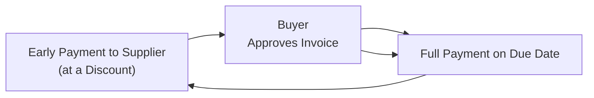

## Introduction and Overview

Supply chain financing, often referred to as reverse factoring, can sometimes feel like a sort of “hidden gem” in the realm of working capital management. This approach crept into popular usage when large, creditworthy buyers realized they could leverage their strong financial standing for the benefit of their smaller or more capital-constrained suppliers. Reverse factoring is, in effect, an arrangement that allows suppliers to receive early payment (at an attractive rate) while letting the buyer potentially negotiate longer payment terms for itself. 

Let’s explore the main elements of this arrangement, its mechanics, advantages, potential risks, and best practices. My own early career experiences might help illustrate how reversing the typical flow of factoring can actually improve efficiency for everyone—buyer, supplier, and financing intermediary.

## Key Concepts and Definitions

Reverse Factoring  
This is a financing arrangement initiated by the buyer rather than the supplier. It’s essentially a program under which a financial institution (often a bank, but sometimes a specialized factor) agrees to pay the supplier for approved invoices at a discount. The discount rate usually depends on the credit risk of the buyer—so if the buyer is highly rated, the financing terms for the supplier are more favorable than the supplier would get on its own.

Intermediary  
In most cases, the financing intermediary is a bank or a “factor” that purchases the invoice once it has been approved by the buyer. The supplier effectively receives immediate payment (minus a finance fee). The buyer then pays the full invoice amount to the intermediary on the invoice’s due date.

Creditworthiness  
The buyer’s credit rating underpins this entire mechanism. If the buyer has a strong credit profile, it can effectively “pass on” that advantage to its suppliers. The more robust the buyer’s financial standing, the lower the financing cost for the supplier—and the more likely the supplier is to jump on board a reverse factoring program.

Reclassification  
Under certain accounting standards, extended terms or unique arrangements could cause accounts payable to be reclassified as short-term debt on the buyer’s balance sheet. This reclassification can happen if the structure of the arrangement resembles debt financing as opposed to a normal trade payable. Any misstep here can create unpleasant surprises for the financial statements, so it’s vital to structure the program carefully and stay in line with the relevant accounting regulations (e.g., IFRS or US GAAP).

## Mechanics of Reverse Factoring

Reverse factoring might sound complicated, but once you break it down, the entire process is fairly straightforward:

1. The supplier delivers goods or services to the buyer and submits an invoice.
2. The buyer validates or “approves” the invoice (confirming product or service acceptance).
3. The financial intermediary steps in, offering to pay the supplier early at a discount rate typically based on the buyer’s credit rating.
4. If the supplier opts in, it receives early payment from the intermediary—this drastically reduces days sales outstanding (DSO) for the supplier.
5. When the invoice’s normal due date arrives, the buyer pays the full invoice amount to the intermediary.

Below is a simple flow diagram illustrating how parties and payments connect:

Notice the sequence: the supplier is made whole early (minus a small financing fee), and the buyer just sticks to its normal payment schedule (or possibly extends it slightly). That’s the beauty of reverse factoring—it can help both parties without requiring massive changes to existing processes.

## Advantages of Supply Chain Financing

Better Cash Flow for Suppliers  
Suppliers—especially smaller or mid-sized businesses—may not always have great access to financing. By using reverse factoring, they receive funds quicker at an interest rate reflecting the buyer’s credit risk. This means smaller companies can enjoy a more stable cash flow and potentially reduce costly short-term borrowing from other sources (like an expensive line of credit).

Potential Extended Terms for Buyers  
Now, if the buyer has negotiated well from the start, it can often use reverse factoring to lengthen its own days payable outstanding (DPO). For instance, if a buyer typically needs to pay invoices in 30 days, the arrangement might let them pay in 45 days—yet the supplier still receives early payment. As an aside, one of my colleagues used to describe this as creating “space to breathe” because it gave the treasury team more flexibility in managing daily cash.

Strengthening Supplier Relationships  
In many industries, reliability and trust between buyer and supplier can truly make or break a smooth production or supply chain operation. By facilitating faster payments, the buyer is doing something tangibly beneficial for the supplier, which can foster loyalty, encourage better price negotiations, and fortify the entire network against disruptions. It’s one of those “win-win” moves that can be surprisingly powerful.

Lower Supply Chain Disruption Risk  
If a supplier consistently struggles with cash flow shortfalls, the risk of supply chain disruption is higher. Reverse factoring mitigates that risk by ensuring the supplier can get paid faster. And from an ESG or sustainability perspective, well...ensuring the stable financial health of your supply chain partners can be an excellent way to promote economic resilience among smaller businesses.

## Accounting and Regulatory Considerations

Payables Reclassification as Debt  
Under IFRS or US GAAP, you generally want to ensure that what you record as “trade payables” remains that way and doesn’t inadvertently become recognized as a form of borrowing. One potential pitfall is that if your arrangement provides the buyer with significantly extended payment terms or includes formal guarantee-like features, auditors might judge that the transaction is closer to short-term debt. That reclassification can alter key ratios such as the debt-to-equity ratio and interest coverage, potentially affecting covenants or your cost of capital.

Impact on Financial Ratios  
While this arrangement might improve certain working capital metrics—like the buyer’s days payable outstanding or the supplier’s days sales outstanding—it can also complicate your short-term and long-term ratio analysis. Like with many financial tools, robust disclosure is often advisable, especially if reversing the factoring arrangement moves big lumps of cash in ways that might mislead external parties.

Visibility into the Program  
OK, so after you set up a program, the next question is: how will you keep track of all the invoices, discount rates, due dates, and actual payments? Clear documentation and integrated IT systems are crucial here. Always ensure your accounting teams and IT departments communicate so that these transactions are recorded properly and the system automatically flags any potential mismatch or unusual factor rate.

## Potential Risks and Challenges

Buyer’s Credit Deterioration  
The cost of financing for suppliers is typically pegged to the buyer’s creditworthiness. So if the buyer’s credit rating takes a dive (for instance, due to an economic downturn, liquidity event, or other negative news), the supplier’s financing rate might shoot up. Suppliers would then be stuck in a program that’s more expensive than originally anticipated—or they might be forced to exit if the terms become unacceptable.

Supplier Overreliance  
Sometimes suppliers start to rely heavily on the reverse factoring program for daily cash needs. If the buyer or the financier decides to roll back the program, or if something changes in the relationship, the supplier may find itself in a tough spot. In that sense, it’s best for suppliers to treat reverse factoring as a convenience or a supplement to their overall financing structure, not the only game in town.

Complexity and Costs  
Even though technology has made supply chain financing fairly seamless, it still requires an operational framework, legal agreements, and ongoing compliance efforts. Also, some banks or factors charge implementation fees, platform fees, or periodic usage fees. That can eat into liquidity benefits for smaller suppliers, so it’s best to weigh these administrative costs carefully against the expected benefits.

## Practical Example

Imagine a large retail chain, “BlueStar Retailers,” that pays its suppliers in 30 days. Its top supplier, “GreenLeaf Fabrics,” experiences cash flow strains due to seasonal spikes in production. To help, BlueStar’s bank proposes a reverse factoring deal:

• GreenLeaf Fabrics sends invoices to BlueStar.  
• Once BlueStar approves them, the bank purchases those invoices and pays GreenLeaf Fabrics in, say, 5 days instead of 30.  
• The discount rate is 3% annualized, significantly lower than what GreenLeaf would pay on its own short-term line of credit (like 7–8%).  
• BlueStar, which has an excellent credit rating, pays the bank the full invoice value on the 30-day mark (or possibly extends to 45 days).  

For BlueStar, it has gained extended payment terms and improved terms of trade. GreenLeaf gets immediate working capital relief at a rate better than it could’ve negotiated by itself. The bank collects fees and interest in exchange for administering the program. Everybody’s pretty happy.

## Best Practices for Implementation

Clear Communication  
At the outset, be sure that both buyer and suppliers are well-informed about how the reverse factoring program works and what fees/discount rates might apply. A mismatch in expectations can sour the program quickly.

Evaluate Multiple Providers  
It’s often wise to check different banks or factoring companies to find the most competitive structure. Some suppliers might already have set relationships with certain financiers, making the transition smoother.

Document, Document, Document  
Yes, we harp on documentation a lot, but, well, it’s crucial. Contracts specifying responsibilities, payment schedules, discount calculations, and default procedures will protect everyone involved. On an exam day, you might see a question describing a scenario with a missing piece of the contract: watch for the risk of reclassification or missed payments.

Consider Impact on Covenants  
If you’re the buyer, double-check your debt covenants. Some lenders or bond indentures might have language that lumps “factoring or supply chain financing obligations” in with short-term debt. Always read the fine print and, if necessary, renegotiate terms with your creditors to allow for supply chain financing structures.

Stay Flexible  
Finally, if there’s one key to success, it’s an ability to pivot. The credit environment can change, your operational environment can shift, your suppliers might come and go, and you need to ensure that your reverse factoring program remains workable under different market conditions.

## Additional Insights for the CFA Exam

From an exam perspective, especially if you’re dealing with essay questions, be prepared to:  
• Compare and contrast “regular factoring” with “reverse factoring,” detailing the distinct roles of the buyer and supplier.  
• Discuss the potential reclassification of trade payables and how that might impact ratios like current ratio, debt-to-equity, or times interest earned.  
• Outline the steps for implementing a supply chain financing program and highlight the main accounting issues.  
• Show how this arrangement can be a key part of a broader working capital management strategy, optimizing liquidity while preserving relationships up and down the supply chain.

If you see a scenario-based question, you’ll likely need to evaluate cost savings for both the buyer and supplier, analyze possible ratio changes, or identify risk factors if the buyer’s credit deteriorates. The trick is linking a conceptual understanding of the arrangement with the nitty-gritty financial implications, including short-term liquidity ratios, cost of capital, or contractual complexities.

## Conclusion

Supply chain financing (reverse factoring) can be a powerful tool in a firm’s working capital arsenal. It offers earlier cash inflows for suppliers, potentially extended payment terms for the buyer, and fosters stronger supply chain relationships. But, as with any tool, it comes with accounting, regulatory, and operational considerations that must be carefully managed. 

In my own experience, seeing a small supplier thrive thanks to a large buyer’s robust credit rating is pretty darn gratifying. It shows how creative financial structures can drive real economic growth, especially in industries where working capital constraints can force tough decisions. 

By fully understanding the mechanics, risks, and best practices of reverse factoring, finance professionals are better equipped to design programs that unlock value across the entire supply chain—which is exactly what you’ll want to demonstrate, both on the CFA exam and in real-world corporate finance roles.

## References and Further Exploration

• Wuttke, D., Blome, C., & Henke, M. (2013). “Focusing the Financial Flow of Supply Chains: An Empirical Investigation of Financial Supply Chain Management.” International Journal of Production Economics.  
• CFA Institute. “Supply Chain Financing (Reverse Factoring).”  
• Pfohl, H.-C., Gomm, M. (2009). “Supply chain finance: optimizing financial flows in supply chains.” Logistics Research.  
• “IFRS 9 Financial Instruments” - IFRS.org  
• “US GAAP: ASC 470 Debt Guidance and ASC 405 Liabilities” - FASB.org  

---

## Test Your Knowledge of Supply Chain Financing (Reverse Factoring)



### Which party typically initiates the reverse factoring arrangement in supply chain financing?
- [ ] The supplier
- [x] The buyer
- [ ] The financial intermediary
- [ ] A government trade agency

> **Explanation:** In reverse factoring, the buyer (usually with a stronger credit profile) initiates the arrangement to help suppliers receive early payments.

### What is the primary benefit for the supplier in a reverse factoring program?
- [ ] Extending payment terms to manage cash flows
- [ ] Automating invoice approval processes
- [x] Receiving early payment of invoices at a favorable rate
- [ ] Eliminating the need to negotiate contracts with the buyer

> **Explanation:** Reverse factoring allows suppliers to receive faster payment, typically at lower financing rates due to the buyer’s stronger credit rating.

### Which statement best describes a potential risk for the buyer in a reverse factoring program?
- [x] The risk of having payables reclassified as short-term debt
- [ ] The risk of decreasing costs of goods sold
- [ ] The inability to obtain any trade discounts
- [ ] The requirement to shorten payment terms

> **Explanation:** If a reverse factoring arrangement is structured improperly, the buyer’s payables may be reclassified as short-term debt, impacting financial leverage ratios.

### How might a buyer’s credit deterioration affect the supplier in a reverse factoring arrangement?
- [ ] It would not affect the supplier at all
- [ ] It would reduce the supplier’s factoring fees
- [x] It could increase the cost of financing for the supplier
- [ ] It automatically terminates the reverse factoring agreement

> **Explanation:** Reverse factoring terms often rely on a buyer’s credit rating. If that rating worsens, the interest rate for suppliers could rise.

### Which of the following best characterizes reverse factoring’s influence on working capital metrics?
- [x] Shortening the supplier’s DSO while possibly extending the buyer’s DPO
- [ ] Shortening both the seller’s and buyer’s payment terms
- [ ] Extending the supplier’s DSO while shortening the buyer’s DPO
- [ ] Having no impact on supplier’s DSO or buyer’s DPO

> **Explanation:** In reverse factoring, suppliers get paid faster (reduced DSO), while buyers frequently enjoy longer payment terms (increased DPO).

### Why might a supplier become overly dependent on a reverse factoring program?
- [ ] It’s typically free of any fees
- [ ] It replaces all other working capital strategies
- [x] It can become their primary source of financing for day-to-day operations
- [ ] It’s mandated by trade regulations

> **Explanation:** If suppliers rely heavily on quick payments from a single buyer-driven factoring arrangement, they risk financial distress if that program changes or ends.

### In a scenario-based CFA exam question, which factor would most likely raise a red flag about reclassification of payables to debt?
- [ ] Absence of a promissory note
- [x] Significant extension of payment terms due to a bank-facilitated agreement
- [ ] A standard 30-day invoice approved by the buyer
- [ ] No interest cost for the supplier

> **Explanation:** A hallmark of potential reclassification is the presence of bank involvement that materially alters the nature and timeline of the payment, especially if it resembles a financing transaction.

### Which party pays the intermediary the full invoice amount on the invoice due date in reverse factoring?
- [ ] The supplier
- [ ] A government trade agency
- [x] The buyer
- [ ] The freight forwarder

> **Explanation:** The supplier receives early payment from the intermediary, but the buyer remains responsible for the full amount at the original due date.

### Which of the following is the best practice to ensure accurate accounting treatment of reverse factoring?
- [x] Comprehensive documentation and clear disclosure of terms
- [ ] Hiding the arrangement as a trade payable to minimize reported debt
- [ ] Not informing the supplier about the true cost of capital
- [ ] Limiting communication to the finance function

> **Explanation:** Proper documentation, transparency, and communication with external auditors and stakeholders are essential to avoid misclassification and misleading financial reporting.

### Under IFRS or US GAAP reporting guidelines, reverse factoring payments may be reclassified as debt if:
- [x] The substance of the arrangement indicates a financing transaction
- [ ] The buyer has a strong credit rating
- [ ] The intermediary is a specialty factor instead of a bank
- [ ] The buyer pays the supplier directly on the due date

> **Explanation:** Both IFRS and US GAAP focus on substance over form. If the buyer is effectively obtaining a financing arrangement, payables could be treated as debt.


