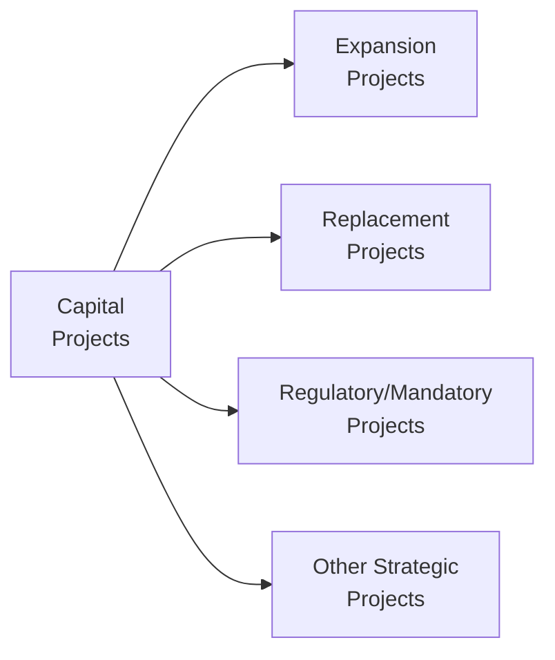

## Overview

Let’s talk about capital projects—those big, long-term investments that organizations undertake to shape their future competitiveness and performance. If you’re studying for your CFA or you’ve been in corporate finance for a while, you’ve probably seen how crucial these can be. When I first started analyzing capital investments, it felt a bit overwhelming. There were feasibility studies, risk assessments, regulatory checks—um, a whole mountain of tasks. But once you break it down into categories (expansion, replacement, regulatory/mandatory, and strategic “other” projects), it starts to make a lot more sense.

At the heart of all this is the need to manage and allocate resources efficiently. Sometimes, companies deploy large amounts of cash to expand their business lines, and other times they invest in simply replacing archaic technology. Other projects are mandated by law or environmental regulation, meaning there’s no choice but to comply. And still other projects revolve around building intangible assets like brand equity or investing in R&D. The variety can feel overwhelming, and this is exactly why a solid framework is critical for effective capital allocation—especially when you have to answer tricky scenario-based questions in a CFA exam setting.

## Key Considerations in Identifying Capital Project Types

Before diving into the categories, it’s worth noting that each type of project usually needs its own evaluation criteria. A project that’s meant to comply with environmental regulations might not carry the same direct revenue streams as, say, a giant expansion into a new geographic region. Companies must factor in both tangible and intangible benefits. That’s why it’s important to have a structured governance process. In fact, many firms use a tiered priority system—regulatory projects tend to get first priority because non-compliance can mean big fines or production stoppages, while expansion or strategic projects might sink or swim depending on their net present value (NPV) or internal rate of return (IRR).

## Expansion Projects

• Purpose: Increase capacity, enter new markets, or produce new products.  
• Typical Analysis Focus: Revenue forecasts, market demand, competitive advantage, cost of capital.  
• Challenges: High uncertainty in demand forecasts and pricing, new competitive landscapes, possible technological disruption.

Expansion projects often represent a company’s push for growth. If you’re adding a new assembly line to produce more cars, or opening retail stores across a new continent, you’re firmly in expansion territory. These projects frequently have higher risk profiles because they involve untested markets or technologies, and the future cash flows might be less certain. Still, they are often critical for companies that need to maintain or enhance their market share.

Let’s say a manufacturing firm invests $100 million in a new plant to produce electric vehicle batteries. The CFO might build forecasts of how many units they can sell at different price points. But there’s always a chance that demand for EV batteries grows slower—or faster—than expected. Analysts must plug in best-case, worst-case, and base-case scenarios to estimate the potential future cash flows. For coverage of how to discount these flows using methods like IRR or NPV, see later sections in this chapter (e.g., 5.2 Discounted Cash Flow Analysis).

## Replacement Projects

• Purpose: Replace outdated or worn-out assets, lower operating costs, or maintain production efficiency.  
• Typical Analysis Focus: Cost savings, reliability improvements, incremental benefits over existing operations.  
• Challenges: Balancing the cost of new equipment versus the cost of continuing with older assets.

There’s a simpler story behind replacement projects. A firm usually replaces its assets when the old machines become either too costly to operate or too slow. For example, you might have 20-year-old manufacturing equipment that routinely breaks down, causing production delays. Replacing that equipment could reduce maintenance costs, shorten downtime, and maybe even offer some minor expansions in capacity. 

I recall working briefly with a mid-sized auto parts supplier that was hesitating to modernize its manufacturing lines. They were worried about the upfront cost. But after seeing how many staff-hours and resources were going into patching up older machines, it became clear that a replacement was the prudent choice. You know, sometimes the intangible cost of disruptions can be huge in the long run.

## Regulatory or Mandatory Projects

• Purpose: Comply with legal or regulatory requirements (environmental standards, safety protocols, etc.).  
• Typical Analysis Focus: Minimal or no direct financial returns, but high compliance value, avoidance of penalties, intangible reputational benefits.  
• Challenges: Hard to measure direct revenue impact; must comply regardless of NPV.

Regulatory or mandatory projects are sort of the “no choice” scenario. These arise when a government or standard-setting body requires the firm to meet certain guidelines. Maybe it’s new emissions controls or new safety equipment for employees. Although these initiatives may not generate obvious revenue, the cost of ignoring them—legal penalties, facility shutdowns, or severe reputational damage—can be staggering, overshadowing any lost opportunity from tying up capital. Sometimes, these projects also improve the company’s standing among stakeholders who value corporate social responsibility, which can indirectly lead to higher brand equity.

## Other Strategic Projects (R&D, Brand Building, etc.)

• Purpose: Conduct R&D, develop intangible assets, form strategic alliances, or test new business models.  
• Typical Analysis Focus: Long-term intangible benefits, synergy with future projects, brand awareness.  
• Challenges: Benefits are hard to quantify in monetary terms; payback periods can be fuzzy and extend well into the future.

These are the projects with a less tangible payoff—maybe you’re funding a multi-year research initiative that might someday produce a blockbuster drug, or you’re running a marketing campaign to solidify your brand in an emerging market. In these cases, financial metrics like IRR or NPV might not fully capture the strategic value. Managers often rely on qualitative factors—does it position the firm for future breakthroughs? Does it strengthen our competitive moat? The trick here is to ensure that the decision-making process captures both quantitative and qualitative considerations.

## Governance and Alignment with Strategic Objectives

Capital allocation can’t just be a free-for-all, especially if you want to pass your CFA exam’s scenario-based questions on corporate governance (and trust me, these topics do arise!). Firms need a governance process that sets:

• Guidelines: For prioritizing expansion vs. replacement vs. regulatory vs. strategic.  
• Approval Levels: A typical approach is that very large or high-risk projects require board ratification, while smaller routine ones might need only mid-level manager sign-off.  
• Reporting and Monitoring: Ongoing oversight ensures that if a project isn’t meeting milestones, the firm can make corrective tweaks or even terminate the project.

Firms sometimes adopt multi-year capital planning frameworks, evaluating how each project supports the overall mission. If a new technology direction aims to reduce product carbon footprints, for instance, the board might give regulatory and environmentally friendly projects higher priority.

## Visualizing Capital Project Types

Below is a simple Mermaid diagram to illustrate the different types of capital projects. Note that these categories are not always perfectly distinct—some projects, such as a large-scale replacement initiative, might also have a strategic expansion component.



## Financial Examples and Project Valuation

To analyze these various capital projects, practitioners often use Discounted Cash Flow (DCF) techniques, among others. Some relevant formulas:


\text{NPV} = \sum_{t=0}^{T} \frac{CF_t}{(1 + r)^t}


• CFₜ: Cash flow in period t  
• r: Discount rate (often the project’s required rate of return or the firm’s weighted average cost of capital)  

A positive NPV indicates the project is expected to add value. For expansions, the incremental cash inflows are typically major drivers. For replacement projects, cost savings and improved efficiencies might be the key factors. For regulatory projects, the “cash inflows” are often avoided penalties or intangible reputational benefits. And for strategic projects, linking intangible outcomes to an NPV can become more art than science.

Here’s an example Python snippet to illustrate a quick NPV/IRR calculation. Imagine you have a set of cash flows for a new product launch:

```python
import numpy as np

cash_flows = [-800000, 250000, 300000, 400000, 200000]

npv_value = np.npv(0.10, cash_flows)
irr_value = np.irr(cash_flows)

print("NPV: ", npv_value)
print("IRR: ", irr_value)
```

The function npv calculates the project’s Net Present Value given the discount rate, and irr finds the discount rate at which the project’s NPV = 0. Although you won’t have Python in your CFA exam arsenal, the logic is consistent with standard capital budgeting methods you’ll see on the test.

## Best Practices and Common Pitfalls

Best Practices:  
• Align projects with company goals: Always connect each project to broader strategic objectives.  
• Perform scenario and sensitivity analyses: This is vital for expansions and R&D projects with uncertain cash flows.  
• Use consistent metrics: Compare projects on the same baseline, employing consistent discount rates and evaluation frameworks.  
• Incorporate risk management: Evaluate how each category might be susceptible to market, operational, or regulatory risk.

Pitfalls:  
• Overoptimism in forecasts: Particularly for expansion or brand-building initiatives, beware inflated demand projections.  
• Underestimating replacement costs: Delaying asset replacement can lead to higher maintenance expenses, supply chain disasters, and intangible hits to reputation if you can’t meet customer deliveries.  
• Neglecting intangible values: Dismissing or poorly quantifying intangible benefits or regulatory risk avoidance can lead to a suboptimal capital allocation strategy.  
• Ignoring synergy or cannibalization: Sometimes a new product can draw away sales from an existing product line. Factor that in.  

## Exam Relevance and Practical Applications

In a Level III CFA exam context, you might get an essay question describing a hypothetical company with a series of proposed capital projects. Your task would be to evaluate (1) the strategic fit of each project; (2) compute or interpret the relevant capital budgeting metrics; (3) consider the impact of each project type—such as how a mandatory project might be prioritized even if its direct NPV is zero; and (4) comment on the governance process or approval thresholds.

You could also see item set questions that break down various expansions, replacements, and so forth, then ask you to choose which project the firm should take on based on certain metrics or to identify hidden pitfalls—like the possibility that continuing an older machine might create higher risk exposure than previously assumed. Mastery of these details is essential for applied portfolio management scenarios—and also for real-life corporate finance responsibilities.

## Final Exam Tips

• Familiarize yourself with each type of project and its unique risk-return profile.  
• Don’t skip intangible benefits. On exam day, demonstrate you can factor in brand value, synergy, or avoided legal penalties.  
• Practice DCF techniques repeatedly. Speed and accuracy matter in both essay and item set questions.  
• Incorporate a holistic perspective: governance, ethical considerations, and alignment with the company’s mission or investor expectations.  

## References and Further Reading

• Berk, J., & DeMarzo, P. (Corporate Finance): Chapters on capital budgeting.  
• Ross, S., Westerfield, R., & Jaffe, J. (Corporate Finance): Sections covering capital allocation and types of projects.  
• CFA Institute Level I & II Curriculum: Quantitative and Corporate Issuers materials.  
• Harvard Business Review articles on capital allocation and corporate strategy:  
  https://hbr.org/  

## Assessing Your Knowledge of Different Capital Project Types



### A project intended to open a new plant in an overseas market is most likely classified as:
- [ ] Replacement project
- [x] Expansion project
- [ ] Regulatory project
- [ ] Mandatory project

> **Explanation:** Because it aims to enter a new market to increase capacity or sales, it’s categorized as an expansion project.

### A firm investing in new machinery solely to comply with updated safety regulations is primarily undertaking:
- [ ] An expansion project
- [ ] A replacement project
- [x] A mandatory or regulatory project
- [ ] A strategic R&D project

> **Explanation:** When the project is driven by compliance requirements, it’s considered regulatory or mandatory.

### Which of the following best characterizes a replacement project?
- [x] Replacing outdated equipment to reduce operating costs
- [ ] Developing an advanced product for untapped markets
- [ ] Funding intangible brand-building campaigns
- [ ] Meeting environmental regulations

> **Explanation:** A replacement project focuses on updating existing assets to maintain or improve efficiency.

### One major pitfall in expansion project evaluations is:
- [ ] Overestimating the cost of capital
- [x] Overoptimism in future demand forecasts
- [ ] Ignoring all intangible benefits
- [ ] Avoiding discount rates entirely

> **Explanation:** Expansion projects can suffer from overly optimistic forecasts of market demand or revenue potential.

### Which of the following represent intangible benefits in a capital project analysis?  
- [x] Improved brand image  
- [ ] Increased scrap waste  
- [x] Enhanced stakeholder goodwill  
- [ ] Lower discount rates  

> **Explanation:** Intangible benefits can include brand image enhancement and increased goodwill. Scrap waste is simply an incremental cost, and the discount rate is a financial input, not a benefit.

### If a project has zero direct cash flow enhancements but avoids potential fines and negative publicity, it may still be acceptable because:
- [x] Regulatory avoidance or reputational protection provides indirect benefits
- [ ] NPV will always be greater than zero
- [ ] Financial returns are guaranteed
- [ ] It is a strategic expansion

> **Explanation:** Regulatory or mandatory projects often don’t show direct profit but protect the firm from costly penalties, shutdowns, and reputational harm.

### In a multi-project scenario, which project typically has the highest priority when allocating capital resources?
- [x] Regulatory or mandatory projects
- [ ] Expansion projects with the highest IRR
- [x] Strategic R&D projects with intangible benefits
- [ ] Replacement projects with moderate savings 

> **Explanation:** Regulatory or mandatory projects often must be undertaken to avoid legal risks, so they get top priority, even if other projects have higher returns.

### A good governance process for capital budgeting should:
- [x] Set approval thresholds based on project size or risk
- [ ] Only allow top executives to vote on any project
- [ ] Prioritize intangible projects at all times
- [ ] Eliminate risk from all future endeavors

> **Explanation:** Good governance involves structured approval levels, not eliminating risk outright or focusing on a single type of project exclusively.

### Which is a key difference between expansion and replacement capital projects?
- [x] Expansion projects generally focus on generating additional revenues; replacement projects often focus on cost savings
- [ ] Expansion projects reduce capacity; replacement projects increase capacity
- [ ] Expansion projects are mandatory; replacement projects are optional
- [ ] Expansion projects rarely involve market forecasts

> **Explanation:** Expansions deal primarily with scoping new revenue opportunities, whereas replacements emphasize operational savings or efficiency gains.

### A project that invests in brand-building without immediate measurable returns is an example of:
- [x] True
- [ ] False

> **Explanation:** Such a capital investment falls under “Other Strategic Projects,” where intangible benefits like brand enhancement may not yield immediate measurable cash inflows.


