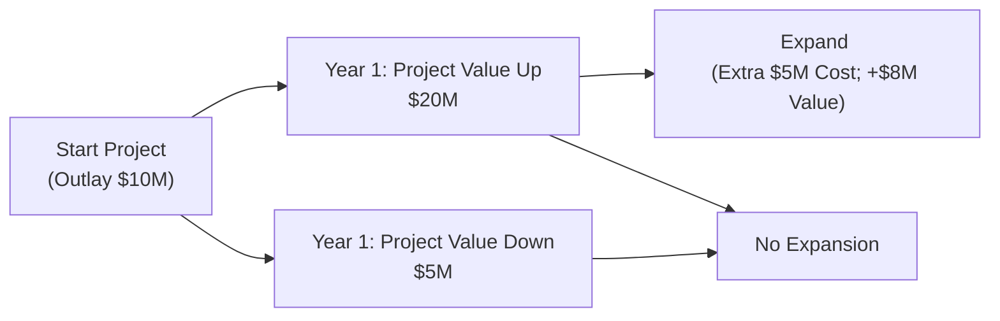
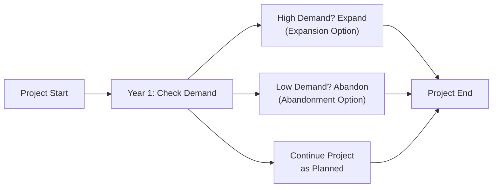

## Overview

Project interactions can get really interesting—sometimes downright complicated—when we’re deciding how to invest an organization’s limited resources. Um, personally, I’ve found that recognizing these interactions is almost like learning to juggle: once you figure out how one project might impact another, you realize each decision is rarely isolated. And if you take it step by step, you can avoid trouble and maybe even open up profitable possibilities. 

In this section, we’ll dig into various types of project interactions (like mutually exclusive, complementary, and substitute projects) and explore the concept of real options. Real options let you adapt your decisions as new information reveals itself. Imagine being able to “pivot” mid-project because you see a better opportunity or to “pause” while you gather more data. That’s the essence of real options.

Our discussion will blend conceptual overviews with practical examples and even a few personal reflections to help these ideas stick. We’ll also touch on how you can factor in real option values when performing those good old net present value (NPV) calculations. Finally, we’ll round off with some references for further study and a quick knowledge check.

## Understanding Project Interactions

### Types of Projects and Their Interactions

1. Mutually Exclusive Projects  
   If projects are mutually exclusive, you can only choose one (e.g., either build a plant in Boston or in Seattle, but not both). Let's say your company wants to expand into a region with two possible sites. You can’t just build in both places because maybe you have limited capital, or else the granularity of the business model only allows one location. The key is that selecting one project prevents you from taking the other.

2. Complementary Projects  
   Complementary projects are like two good friends who support each other. Implementing one could boost the performance of another. A classic example is building an advanced distribution center that improves logistics for all your product lines. The distribution center might reduce costs or speed up delivery for each product, thereby enhancing the cash flows for other projects you already have under way.

3. Substitute (or Competing) Projects  
   Substitute projects effectively compete for the same market share, or one could cannibalize the sales of another. Picture a car manufacturer that’s launching two similar car models that overlap in target demographics. If one catches on, it may eat into the sales of the second. Understanding these competing interactions helps you forecast combined cash flows more accurately.

### Why Interactions Matter

Project interactions matter because ignoring them can lead to misguided capital budgeting decisions. Over the years, I’ve seen well-intentioned people simply add up NPVs of individual projects without considering overlap or mutual exclusivity. Sometimes it works out, but often it doesn’t. Imagine selecting an entire set of projects that each independently looks good, only to discover that combined they require more resources than you have or that they undermine each other in the marketplace.

• With mutually exclusive projects, you might pick the project that has the highest net present value or the best internal rate of return (IRR) relative to risk.  
• With complementary projects, synergy can lead to a greater combined benefit than individually calculated.  
• With substitute or competing projects, you must evaluate the impact of lost sales or overlapping operational costs.

## Introduction to Real Options

Real options give managers the flexibility to adapt project decisions based on evolving information. Let’s say you’ve decided to build a new manufacturing plant. Halfway through construction, you see market demand skyrocketing—maybe you’ll expand capacity while you still can. Or if you see demand unraveling, you might scale back or even abandon some parts of the plan.

A real option is exactly what it sounds like: an option—similar to a financial option in the stock market—attached to a real (tangible) asset or real-life business decision. Instead of calls and puts on equities or indexes, you have choices like “expand,” “delay,” or “abandon.” Traditionally, your straightforward net present value might ignore these dynamic decisions. However, factoring them in can significantly impact the true economic value of a project.

### Types of Real Options

• Expansion Option  
  If demand proves better than expected, you can scale up. This might mean building additional production lines or investing in a new service. The payoff from such an option is the incremental cash flow that arises if business conditions are strong.

• Abandonment Option  
  This option says, “Wow, this is looking bad—let’s get out while we can,” limiting further losses. You salvage some value by shutting down production or selling assets instead of continuing to throw good money after bad.

• Timing or Deferral Option  
  Sometimes you can delay a project until more details (market data, competitor moves, regulatory approvals) are known. For instance, a pharmaceutical company might wait for Phase II trial results before scaling up manufacturing. The value here is about making decisions when uncertainty is lower.

• Flexibility Option  
  This is about being able to pivot processes or swap inputs if costs or prices change unexpectedly. For instance, if a company’s power plant can run on both natural gas and oil, you can choose whichever is cheaper at the time. That flexibility can be extremely valuable in volatile commodity markets.

## Valuing Real Options: Conceptual Overview

Working real options into your valuation analysis requires a slightly different mindset. Instead of forcing yourself into a one-shot NPV calculation, you may embrace scenario analysis or formal option pricing approaches (like a binomial model).  

A simplified approach could involve the following steps:  
1. Calculate a project’s base-case NPV (assume no real options).  
2. Identify possible states of the world—usually a range of “good,” “average,” and “bad” outcomes.  
3. For each scenario, gauge the strategic action (expand, abandon, or defer) that a manager would realistically take to maximize value.  
4. Estimate the payoff from that decision (e.g., if you abandon, you salvage some value, so your total project payoff in that scenario might be higher than if you had no such flexibility).  
5. Combine (i.e., probability-weight) these payoffs to see if the option yields a net incremental value over the base NPV.  

If deeper rigor is required—some large capital projects demand it—you might do a binomial tree or adapt the Black–Scholes option pricing formula. Real option modeling can get quite mathematical, but the big takeaway is that these options typically add to the project’s overall value.

### Example: Binomial Model for an Expansion Option

Imagine you have a project with an initial outlay of $10 million. At the end of one year, the value of the project can go either up (to $20 million) or down (to $5 million). If it goes up, you’ll consider expanding, which will cost another $5 million but boost the final value by an additional $8 million. If it goes down, you skip expansion.

Analyzing the project through a standard NPV might lead you to an acceptance or rejection decision without truly considering the extra payoff from expansion. However, once you factor in the expansion option, you might find the project’s overall NPV is higher, reflecting the upside potential.  

By adopting a binomial approach—where you lay out the states for “up” or “down” in future years and incorporate the additional $8 million payoff if the expansion is exercised—you can better capture the project’s potential. This could mean the difference between rejecting a borderline project and seeing it as a winner once the real option is recognized.

Below is a simple Mermaid diagram illustrating how such a tree might look. This is, of course, a deliberately simplified representation:

## Integrating Project Interactions With Real Options

Many times, real options themselves create or interact with multiple projects. For instance, a large infrastructure investment might open the door to new complementary projects in distribution, marketing, or product development. By acknowledging these possibilities up front, you can identify and link multiple capital projects under a unified strategic umbrella.

• Mutually Exclusive + Real Options:  
  If you’re dealing with mutually exclusive projects, one might feature a valuable real option while the other lacks any embedded flexibility. That intangible difference might tip the scales in favor of the project with the embedded option—even if its initial base-case NPV is a bit lower.  

• Complementary Projects + Real Options:  
  Sometimes complementary projects, each with its own real options, compound overall flexibility. If you have a synergy between two or more segments—like a production facility and a distribution center—each could have distinct expansion or flexibility levers. The combined effect might enhance the entire corporate strategy.  

• Substitute Projects + Real Options:  
  With competing projects, you want to be especially mindful of how real options might help mitigate risk. Suppose you have two new product lines, and each has an abandonment option. If one product flops, you can pivot focus to the other. This interplay of strategic backups could be the reason you pursue both projects on a smaller scale initially, waiting to see which one thrives faster.

## Practical Example: Food Processor Expansion

Let’s consider a mid-sized food processing company that sees an opportunity to expand into organic product lines. The immediate question: build a new factory from scratch (Project A) or retrofit an existing facility (Project B)? These projects appear mutually exclusive; you can’t do both with finite capital.

• Project A has a stable 8% IRR if everything goes as planned but it also includes a real option to expand production lines if consumer demand for “organic” skyrockets. This expansion would cost an additional $2 million but could raise annual cash inflows significantly. In other words, Project A’s base NPV might be unimpressive, but including the expansion option might push the overall value up.

• Project B yields a somewhat higher base-case NPV from standard production. However, it has no obvious real option to expand because the facility’s layout can’t accommodate additional equipment easily.  

After thoroughly analyzing possible scenarios, Project A might look more compelling due to a significantly higher potential payoff in an upside scenario. This is a real-world demonstration of picking a project for its strategic flexibility rather than simply going with the biggest short-term ROI.

## Qualitative Factors Affecting Real Option Decisions

Quantitative analysis alone, while important, may not capture the full story. Business managers deal with regulatory shifts, competitor actions, and macroeconomic changes. Perhaps a competitor invests heavily in the same region, or new environmental regulations make your expansion option more difficult to exercise cheaply.

Additionally, corporate culture plays a role. I once consulted with a firm that had a golden expansion option (almost guaranteed success if exercised), but the management team was so risk-averse it never felt confident enough to pull the trigger. Qualitative elements such as leadership style, an organization’s tolerance for uncertainty, and the timing of product launches are tough to jam into a formula but are no less important to the ultimate outcome.

## Best Practices and Common Pitfalls

• Be Thorough With Interactions:  
  Don’t oversimplify. Include synergy or cannibalization effects in detailed cash flow forecasts.  

• Avoid Overlooking Real Options Value:  
  Skipping the real options approach might make you too quick to reject projects that have valuable upside potential.  

• Don’t Overpay for Flexibility:  
  Real options add value, but the cost of implementing the flexibility can be steep. For instance, building a facility with easy scalability might mean higher construction expenses. Make sure the potential payoff outweighs the cost.  

• Exercise Caution With Over-Optimism:  
  It’s easy to paint a rosy picture of how you’ll always make the right call at the right time. Factor in realistic constraints—organizational inertia, regulatory approvals, or supply chain complexities might slow your ability to pivot.  

• Evaluate Interplay of Multiple Options:  
  Often, you’ll have more than one real option embedded in a single project. Don’t just value them in isolation; an expansion option might be less valuable if you also plan to invest in a separate complementary project.  

## Quick Numerical Illustration: Real Option in NPV

Let’s walk through a simplified numeric example:

1. Base-Case NPV Without Real Options:  
   • Initial investment: $15 million.  
   • Present value of future cash inflows (discounted): $17 million.  
   • Base-case NPV = $17 million – $15 million = $2 million.

2. Considering an Abandonment Option:  
   • Let’s say if the project’s performance dips below a certain threshold in year two, you can sell the assets for $6 million.  
   • If that negative scenario has a 20% chance of happening and would otherwise reduce your investment’s terminal value to $0, the abandonment option effectively protects you from losing that $6 million.  
   • Incremental benefit in bad scenario = salvage value – $0 = $6 million. Probability = 20%, so expected benefit = $6 million * 0.20 = $1.2 million.  

   Now, discount that expected benefit back to present value (assume a discount factor of 0.9, just for illustration). Present value of the additional “abandonment” payoff = $1.2 million × 0.9 = $1.08 million.  

   So your revised NPV with the abandonment option might be roughly $2 million + $1.08 million = $3.08 million. That’s a major boost in your project’s value simply by factoring in the real option that helps you limit downside risk.

## Diagrams and Tables

You could also create a flowchart showing cash flows and triggers for your real options in more complex projects. For instance:

• A table with possible states (market booms vs. slumps) and the manager’s best action.  
• A timeline diagram indicating at which stage each real option can be exercised.

Below is a quick, high-level Mermaid diagram illustrating a decision tree with multiple real options:

## Exam Tips and Final Thoughts

In a CFA® exam context, especially for more advanced levels, you might see scenario-based questions that test your ability to incorporate real options into a capital budgeting analysis. Always:

• Identify if a project is mutually exclusive, complementary, or substitute.  
• Check if there are any real options—expansion, abandonment, timing, or flexibility—and how they might alter the projected cash flows.  
• Perform a brief “option-enhanced” scenario analysis.  
• Discuss the qualitative or strategic issues that could impede or facilitate exercising those options.

Time management is crucial in exam settings. A quick formula or tabular approach to incorporate real options might save you from overly complicated calculations. If the question is purely conceptual, emphasize how real options can enhance or protect value, and how project interactions might shift the overall corporate investment strategy.

Remember, real options can turn an ordinary project into a strategic gem. Simultaneously, watch out for misapplications where you rely on unrealistic assumptions about perfect managerial agility.

## References and Further Reading

• Trigeorgis, L. Real Options in Capital Investment. (Comprehensive exposition on real option models and pricing techniques.)  
• Amram, M., & Kulatilaka, N. Real Options. (Case studies illustrating the application of real options in corporate strategy.)  
• CFA Institute Level II Curriculum (Corporate Issuers, Real Options Readings).  
• CFA Institute, "Corporate Finance and Equity," for additional context on advanced capital budgeting techniques.

-----

## Test Your Knowledge of Project Interactions and Real Options



### Which of the following best describes mutually exclusive projects?

- [ ] Projects that operate in unrelated markets.
- [x] Projects where only one can be chosen from a set.
- [ ] Projects that can be pursued in multiple geographic locations simultaneously.
- [ ] Projects that do not require significant capital expenditures.

> **Explanation:** Mutually exclusive projects directly compete with one another such that selecting one rules out the others, typically due to limited resources or strategic necessity.

### What is a real option in capital budgeting?

- [ ] An opportunity to invest in government bonds with a fixed rate.
- [x] A managerial choice to modify a project’s course based on new information.
- [ ] A technical tool to analyze the sensitivity of net present value to discount rate changes.
- [ ] A standard call or put option on a stock index or commodity.

> **Explanation:** A real option is the right, but not the obligation, to make business decisions—such as expanding, abandoning, or deferring—based on evolving conditions, thereby adding flexibility beyond a static NPV approach.

### Which of the following scenarios most clearly illustrates a substitute or competing project interaction?

- [x] A new product expected to eat into the sales of a company’s existing product line.
- [ ] Two new projects each aiming to enhance the other’s performance.
- [ ] A scenario in which projects can be completed concurrently without overlap.
- [ ] A project to replace older equipment that no longer contributes to revenue.

> **Explanation:** Substitute projects reduce or cannibalize an existing project’s cash flows, which indicates competition for the same customer base or market need.

### What is the main benefit of the abandonment option?

- [ ] Achieving higher sales in strong markets.
- [ ] Gaining immediate synergy with complementary projects.
- [x] Limiting losses by discontinuing a failing project and recovering residual value.
- [ ] Doubling the capacity at no additional cost.

> **Explanation:** The abandonment option allows you to stop an underperforming project partway and salvage some value, thus preventing additional losses.

### Which statement about real options is most accurate?

- [x] Real options can add value to a project by providing flexibility to respond to market changes.
- [ ] Real options typically decrease NPV because they introduce more uncertainty.
- [x] Real options are only relevant for projects valued over $100 million in capital outlay.
- [ ] Real options eliminate all risk from capital budgeting.

> **Explanation:** Real options introduce strategic flexibility that can increase overall project value. They do not necessarily apply only above a certain threshold, nor do they remove all risk (they just help manage it).

### You’re evaluating two projects, Project X and Project Y, which are mutually exclusive. Project X has a lower estimated NPV but includes a valuable expansion option, while Project Y has a higher static NPV but no real option. Which factor is most critical to consider?

- [x] The potential additional value of the real option in Project X.
- [ ] Using the highest discount rate available.
- [ ] The marketing budget allocations for each project.
- [ ] The payback period for Project Y only.

> **Explanation:** When projects are mutually exclusive, you must consider whether the option-based flexibility in Project X could lead to a higher overall expected value, beyond the static NPV comparison.

### What is a key pitfall when valuing real options?

- [ ] Overestimating the discount rate.
- [x] Assuming perfect managerial execution and unlimited agility.
- [ ] Forgetting to factor in annual personnel expenses.
- [ ] Using probability-weighted scenarios.

> **Explanation:** Overoptimism regarding managerial execution can inflate the real option’s perceived value. In reality, constraints like time, bureaucracy, or competition can limit the ability to exercise the option optimally.

### Which of the following best describes how real options and complementary projects might interact?

- [ ] Real option value is diminished if a project is complementary.
- [ ] Complementary projects must be abandoned together if one fails.
- [x] Two projects, each with its own real option, can compound flexibility and synergy.
- [ ] Complementary projects always reduce total risk to zero.

> **Explanation:** When projects are complementary, they may support each other and even create additional real options or synergies that further increase overall flexibility and value.

### You calculate a project’s NPV at $2 million without considering any real options. Adding an abandonment option, you estimate an additional expected value of $1.5 million. What is the revised NPV?

- [x] $3.5 million
- [ ] $2.5 million
- [ ] $1.5 million
- [ ] $0.5 million

> **Explanation:** The incremental option value is added to the original NPV, so the revised NPV is $2 million + $1.5 million = $3.5 million.

### The presence of a timing (deferral) option suggests:

- [x] The company may choose to delay starting the project to gather more information and reduce uncertainty.
- [ ] Taking immediate action is always optimal to secure first-mover advantages.
- [ ] The NPV is irrelevant when deciding when to begin a project.
- [ ] Real options cannot be used unless the project has a large intangible component.

> **Explanation:** A timing option allows the firm to defer investment until market conditions (or other factors) become more favorable, which can greatly reduce risk.


