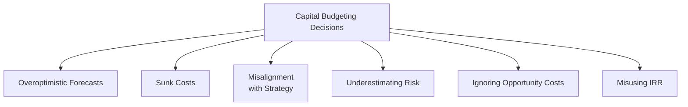

## Introduction
Let’s talk about capital budgeting—a vital process in corporate finance where firms decide which long-term investments to undertake. When done well, capital budgeting helps allocate resources to the most value-enhancing projects and thereby supports the company’s strategic objectives. But in practice, lots of folks run into the same traps over and over. I once saw a manager (John, let’s call him)—he was so thrilled about this “can’t miss” project that he basically forgot to do a thorough risk analysis. It turned out the “can’t miss” project was actually full of hidden expenses that tanked the returns. Believe me, it wasn’t fun cleaning up that mess afterward.

In this section, we’ll walk through some of the common pitfalls in capital budgeting. You’ll see how overoptimism sneaks in, why ignoring opportunity costs is a recipe for trouble, how IRR can be confusing, and a bunch of other mistakes that can erode project value. Our goal is to help you recognize these traps so you can steer clear. Anyway, let’s jump right into it.



## Overoptimistic Forecasts
It’s totally normal to be enthusiastic about your company’s future. But that excitement can sometimes lead to what we call “optimism bias,” where we inflate revenue estimates and downplay cost projections. It’s like thinking you’re going to run a marathon in your personal best time when you’ve barely trained. Sure, it could happen, but maybe we should be a tad more realistic.

• Why This Matters:  
  - Overstating future cash flows can inflate project valuations, making borderline projects look irresistible.  
  - In the real world, these inflated numbers might lead to negative net present value (NPV) when actual costs appear or revenue growth stalls.  

• How to Mitigate It:  
  - Use conservative estimates and sensitivity analyses.  
  - Incorporate third-party validations—an independent team or external advisor can provide fresh eyes.  
  - Keep track of forecasting errors from past projects. Evaluate how often your projections were off and by how much.  

It’s helpful to run multiple scenarios. If your “pessimistic scenario” still suggests a decent return, you can be more confident about forging ahead. If not, you may need to refine your plan or even drop the project altogether.

## Inclusion of Sunk Costs
Have you ever spent money on a car repair and then realized it might have been better just to buy a new car? Those repairs—once paid for—are sunk costs. In capital budgeting, sunk costs are expenses that have already been incurred and are non-recoverable. If you’ve invested $1 million in R&D on a product that’s clearly a dud, that $1 million shouldn’t factor into your decision to proceed or abandon. In practice, we often get so fixated on “recouping” that cost, we pour in even more resources.

• Why This Matters:  
  - Making decisions based on sunk costs can lead to the “escalation of commitment,” where a firm invests more and more in a doomed project just because it’s already sunk a large amount of money.  
  - Only future incremental cash flows—costs and revenues that will change based on your decision—really matter for capital budgeting.  

• How to Mitigate It:  
  - Train finance teams and project managers to recognize and exclude sunk costs from calculations.  
  - Base accept–reject decisions on incremental benefits, not on already-incurred expenditures.  

## Misalignment with Strategic Objectives
I’ve seen companies chase any project that has a high NPV on paper, but later they realize it undermines their brand or distracts them from core competencies. Even if a project is profitable in isolation, it may not be the right move if it doesn’t push your firm’s broader mission or strategic direction. 

• Why This Matters:  
  - Resources are finite; allocating time, money, and labor is a big deal, especially in smaller firms.  
  - Projects that fail to align with corporate strategy can hamper synergy, brand strength, or organizational focus.  

• How to Mitigate It:  
  - Evaluate project proposals not just by NPV but also by “strategic fit.”  
  - Incorporate a screening step in the capital budgeting process that ensures projects align closely with long-term goals.  

Sometimes, the best business decisions are about what you don’t do, not just what you do.

## Underestimating Risk
It’s tempting to assume “everything will go right,” but that rarely holds true in real-life capital budgeting. You might have supply-chain bottlenecks, regulatory changes, or even competitor innovations that disrupt your plans.

• Why This Matters:  
  - A single risk factor—like raw material shortages—can derail projected cash flows.  
  - Failing to factor in systematic or unsystematic risk yields inaccurate cost-of-capital calculations and potentially overstates a project’s attractiveness.  

• How to Mitigate It:  
  - Perform sensitivity and scenario analyses that adjust revenue/cost assumptions.  
  - Use Monte Carlo simulations or advanced risk metrics if the project is large or especially complex.  
  - Review macroeconomic indicators and market trends. Does your discount rate reflect realistic inflation expectations and risk premiums?  

In the CFA context, you’ll often see references to Weighted Average Cost of Capital (WACC) or scenario analyses under IFRS or US GAAP guidelines. Regardless of the framework, it’s critical to incorporate tangible risk buffers into your calculations.

## Ignoring Opportunity Costs
Opportunity cost is one of those terms people learn in Economics 101, but it can slip our minds when we’re juggling multiple potential investments. If you commit capital and management time to one project, you’re automatically forfeiting the chance to use those resources for a different, potentially better project.

• Why This Matters:  
  - Missing out on a more lucrative project is an indirect cost that can overshadow anything you do with the chosen investment.  
  - Often, ignoring opportunity costs can lead to resource underutilization or the acceptance of suboptimal proposals.  

• How to Mitigate It:  
  - Evaluate all feasible projects together within the capital budgeting framework (especially in capital rationing scenarios).  
  - Explicitly calculate the potential returns of the next-best alternative and incorporate that into your decision-making model.  

Sometimes, the second-best option might be your best long-term bet.

## Misusing IRR
The Internal Rate of Return (IRR) is popular for its intuitive “percentage” metric, but it has limitations. It can be misleading if the project has non-conventional cash flows (e.g., cash outflows after inflows begin), or if there are multiple IRRs. And a single IRR might not reflect the realistic reinvestment rate of the project’s intermediate cash flows.

• Why This Matters:  
  - A high IRR can mask negative NPV projects if the discount rate or cash flow timing is unusual.  
  - Multiple IRRs can cause confusion about which IRR to use.  
  - IRR implicitly assumes reinvestment of interim cash flows at the IRR itself—a questionable assumption if actual reinvestment rates differ.  

• How to Mitigate It:  
  - Compare IRR with NPV to get a more accurate reading.  
  - Use the Modified Internal Rate of Return (MIRR), which addresses the reinvestment rate assumption.  
  - If capital budgeting guidelines rely heavily on IRR, confirm the pattern of your project’s cash flows is standard (one sign change from negative to positive).  

Below is an illustrative Python snippet that demonstrates how easily you can compute a project’s NPV and IRR—plus how you might detect multiple IRRs if the project experiences multiple sign changes in its cash flows:

```python
import numpy as np

cash_flows = [-100000, 20000, 30000, 40000, 50000]
discount_rate = 0.10

npv = sum([cf / (1 + discount_rate)**t for t, cf in enumerate(cash_flows)])
print("NPV:", round(npv, 2))

# Note: This approach may return one IRR even if multiple exist
def npv_func(r, cash_flows):
    return sum([cf / (1 + r)**t for t, cf in enumerate(cash_flows)])

irr_guess = 0.10
result = np.irr(cash_flows)  # Numpy's built-in IRR function
print("IRR:", round(result, 4))

sign_changes = 0
for i in range(1, len(cash_flows)):
    if cash_flows[i] * cash_flows[i-1] < 0:
        sign_changes += 1
print("Sign changes in the series:", sign_changes)
if sign_changes > 1:
    print("Multiple IRRs may exist.")
```

## Best Practices and Practical Tips
• Cross-Check with Other Metrics: Relying on a single measure (like IRR) can be risky. Use NPV, Payback Period, and maybe even MIRR collectively.  
• Align with Corporate Governance: Ensure the Board of Directors or an investment committee reviews large-scale projects, consistent with good corporate governance (see Chapter 3 for governance mechanisms).  
• Document Assumptions: If you ever want to revisit a project’s estimates, you’ll need to know the assumptions that went into your “base case” scenario.  

## KaTeX Formula Illustration
Occasionally, you might need to present your discounting or capital budgeting formula in a neat mathematical format. For example, the NPV (Net Present Value) of a series of cash flows CF at times t = 0, 1, 2, …, n can be shown as:


\mathrm{NPV} = \sum_{t=0}^{n}\frac{\mathrm{CF}_t}{(1 + r)^t}


Here, r is the discount rate or cost of capital. The project is acceptable (assuming no capital rationing) if:


\mathrm{NPV} \ge 0.


## Glossary
• Sunk Cost: An expense already incurred and not recoverable. Sunk costs should not factor into future decisions.  
• Opportunity Cost: The value of the best alternative forgone when a particular project is chosen.  
• Optimism Bias: The tendency to overestimate favorable outcomes (like higher revenue) and underestimate negative outcomes.

## References and Further Reading
• Baker, M., & Wurgler, J. (Various Papers): Insightful research on behavioral finance biases in capital budgeting and corporate finance decision-making.  
• CFA Institute Level I & II Curriculum: For deeper discussions on behavioral biases that creep into corporate finance.  
• Bazerman, M., & Moore, D.: Books on decision-making, cognitive biases, and the perils they pose to rational financial analysis.  
• IFRS & US GAAP: Always consult the relevant accounting standards for expense recognition, asset capitalization, and compliance for consistent capital project evaluation.

## Final Exam Tips
• Watch Out for Behavioral Bias: The biggest pitfall is letting biases overtake data-driven analysis.  
• Master Multiple Measures: IRR, NPV, Payback, and MIRR all have roles in your exam (and real life).  
• Keep Projects in the Bigger Picture: Tie back to strategic objectives, stakeholder interests, and corporate governance frameworks.  
• Time Management: For constructed-response questions, outline your approach first—then dive into calculations.  

You’re almost on the home stretch! Capital budgeting can be intricate, but with practice—and by avoiding these pitfalls—you’ll be well-prepared for tackling exam questions and real-world financial challenges.

## Test Your Knowledge: Common Pitfalls in Capital Budgeting Quiz



### Which of the following best describes “optimism bias” in capital budgeting?

- [ ] The tendency to excessively focus on sunk costs.  
- [x] The tendency to overestimate favorable outcomes (e.g., revenues) and underestimate risks.  
- [ ] The tendency to underestimate the time needed for project completion.  
- [ ] The assumption that the reinvestment rate always equals the IRR.  

> **Explanation:** Optimism bias is the inclination to form overly positive projections—whether it’s revenue, unit sales, or cost savings.  

### When deciding whether to continue a project, sunk costs should:

- [ ] Always be factored in if the amount is large enough.  
- [x] Never be included in the decision-making process, since they cannot be recovered.  
- [ ] Only be included if the project is profitable.  
- [ ] Be allocated evenly to each future year’s cash flows.  

> **Explanation:** Sunk costs are irrecoverable and should not influence future decisions.  

### In evaluating a project with a very high IRR and irregular cash flow patterns (multiple positive and negative cash flows), which approach is most appropriate?

- [ ] Trust the IRR if it is higher than the cost of capital.  
- [ ] Only use the Payback Period.  
- [ ] Accept the project if the IRR is positive.  
- [x] Calculate the project’s NPV and/or MIRR to address potential multiple IRRs.  

> **Explanation:** When cash flows have multiple sign changes, IRR can be misleading. NPV or MIRR is more reliable.  

### Which of the following scenarios most clearly illustrates an opportunity cost?

- [ ] A company invests in a project to recoup sunk costs from a past investment.  
- [x] Using cash to fund Project A means forfeiting the returns that would have been generated by Project B.  
- [ ] A project that yields a negative NPV but still moves forward for strategic reasons.  
- [ ] A situation where divergent IRRs complicate decision-making.  

> **Explanation:** Opportunity cost is the value of the highest-valued alternative foregone when resources are used for another project.  

### A firm’s capital budgeting process systematically rejects projects with positive NPVs that do not align with its long-term strategy. This strategy is:

- [x] Sensible if those projects ultimately detract from the firm’s core objectives.  
- [ ] Always value-destructive because positive NPV projects should be accepted.  
- [x] Potentially beneficial if it preserves corporate identity and synergy.  
- [ ] Illegal under most governance regulations.  

> **Explanation:** Even a positive NPV project may not be wise if it disrupts or contradicts a firm’s strategic path.  

### Underestimating risk in capital budgeting can be mitigated by:

- [ ] Disregarding scenario analysis for simpler projects.  
- [ ] Using a single IRR approach.  
- [x] Performing sensitivity analyses, Monte Carlo simulations, and thorough risk assessments.  
- [ ] Relying fully on bottom-up cost estimates.  

> **Explanation:** Techniques such as scenario analysis, sensitivity tests, and Monte Carlo simulations help ensure that risk is more accurately captured.  

### Which of the following statements is most accurate regarding sunk costs?

- [x] Sunk costs remain the same regardless of whether the project moves forward.  
- [ ] Sunk costs generally increase if a project is accepted.  
- [x] They have no bearing on future cash flow decisions.  
- [ ] They are recoverable if the NPV is high enough.  

> **Explanation:** Sunk costs cannot be altered by future actions, so they should not be incorporated into decision-making.  

### A major advantage of using the Modified Internal Rate of Return (MIRR) instead of IRR is:

- [x] MIRR incorporates a realistic reinvestment rate for positive cash flows.  
- [ ] MIRR always yields the same result as NPV.  
- [ ] MIRR assumes no cost of capital.  
- [ ] MIRR is exempt from sign-change issues in cash flows.  

> **Explanation:** MIRR addresses the unrealistic assumption that all project cash flows can be reinvested at the project’s internal rate of return.  

### A best practice for aligning projects with strategic objectives is to:

- [x] Integrate a strategic “checkpoint” in the project screening phase.  
- [ ] Skip any project that requires new technology.  
- [ ] Accept a project solely on the basis of a high IRR.  
- [ ] Focus exclusively on intangible benefits without financial metrics.  

> **Explanation:** Including a clear strategic-fit review ensures the project supports the firm’s broader mission and goals.  

### True or False: If a project’s net present value (NPV) is positive, the firm will always benefit from accepting it, regardless of strategy or opportunity costs.

- [x] True  
- [ ] False  

> **Explanation:** Actually, it’s generally true that a positive NPV indicates value creation. However, in a strict sense, a project may conflict with strategic priorities or create an opportunity cost by precluding a better project. Still, from a purely numerical standpoint, a positive NPV in isolation suggests the firm could benefit financially. The deeper question is whether intangible or strategic considerations override that.  


