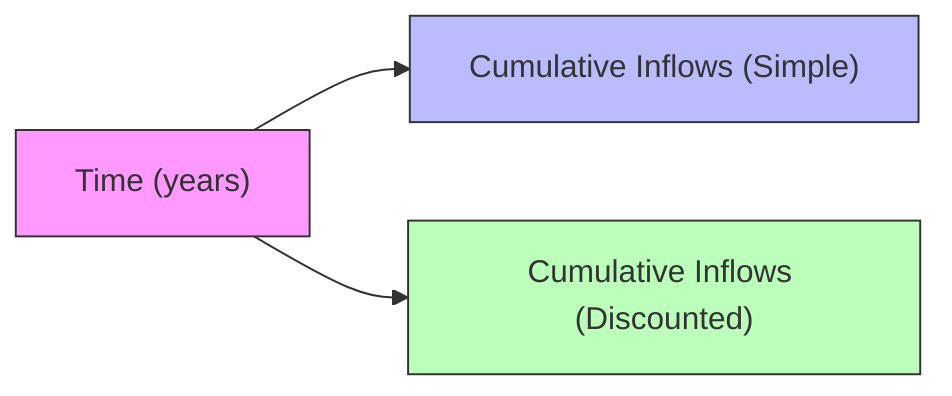

## Introduction
Project evaluation isn’t always straightforward, especially when liquidity is a prime concern or when you want a quick sense of how soon your investment might be recouped. While Net Present Value (NPV) and Internal Rate of Return (IRR) remain the gold standards in modern capital budgeting, the Payback Period and Discounted Payback Period methods provide quick—and sometimes comfortingly simple—insights. In corporate finance, you’ll see these “payback” criteria pop up when time is of the essence or when managers face financing constraints.

I remember a friend’s family business that was investing in a new bottling machine. They didn't go into complicated models right away. They just asked: “How many months—yes, months—until we get our money back?” This question nicely captures the essence of the Payback Period method. Of course, they eventually calculated a more thorough NPV, but the payback question gave them a helpful initial filter.

Below, we dive into both the Payback Period and the Discounted Payback Period. We’ll examine why these methods might come in handy, their shortcomings, and how you might see them show up in your exam or in real practice.

## Payback Period Basics
The Payback Period calculates how long it takes for a project’s cumulative cash inflows to equal the original investment. If a company invests USD 100,000 in a project, and it generates USD 25,000 in net cash inflows each year (assuming no complication from taxes or capital structure), the payback time is 4 years. It can’t get simpler than that, right?

This measure can be quite useful if:
• You need a rough, intuitive gauge of project’s payback horizon.  
• Liquidity constraints are severe, so the firm wants its cash recovered quickly.  
• The project is small, or the manager wants a “quick and dirty” measure before doing deeper analysis.

But the simplicity of Payback Period is also its Achilles’ heel. It doesn’t account for the time value of money (i.e., a dollar received later is worth less than a dollar received now). And it doesn’t consider what happens after that payback cutoff. You could have a project that recovers its costs in four years but yields massive returns in years 5, 6, and beyond. Under a naive payback rule, that robust future cash flow gets totally ignored after the cutoff is reached.

### Payback Period Formula
Although the Payback Period is conceptually straightforward, it helps to see a formulaic approach. If “Investment” is the initial outlay and “Annual Cash Inflow” is the uniform annual inflow:

Payback Period = Investment ÷ Annual Cash Inflow

This, however, only works when annual cash inflows are uniform. If cash flows fluctuate, you typically accumulate them period by period until you reach the initial outlay.

## Discounted Payback Period
Because missing time value of money is a big oversight, the Discounted Payback Period improves on the original approach by discounting each future cash flow to its present value. So you still track how many years (or months, or quarters) it takes to cover the initial outlay, but each cash inflow is first brought back to present-day dollars. That makes the measure more accurate.

### Advantages of Discounted Payback Period
• Incorporates time value of money, giving a more conservative and realistic outlook.  
• Still straightforward and easy to explain—albeit slightly more complex than the plain Payback Period.  
• Potentially more suitable when a firm is extremely risk-averse and wants to ensure it recovers its money (in present value terms) rapidly.

### Limitations
• Ignores cash flows beyond the cutoff—the same shortcoming as the simple Payback Period.  
• Typically yields a longer payback horizon than the simple payback method, which could cause managers to reject projects that might be good in the long run.  
• Doesn’t directly measure profitability, only time to get your money back in present value terms.

### Discounted Payback Calculation
Let’s consider a quick example. Suppose you invest USD 100,000 in a project that yields the following net after-tax cash flows at year-end:

• Year 1: USD 20,000  
• Year 2: USD 30,000  
• Year 3: USD 40,000  
• Year 4: USD 50,000  

Assume a 10% cost of capital (or discount rate). We discount each cash flow:

Present Value of Cash Flow in Year t = (Cash Flow in Year t) ÷ (1 + r)^(t)

So:

• PV at end of Year 1: 20,000 ÷ (1.10)^1 = 18,182  
• PV at end of Year 2: 30,000 ÷ (1.10)^2 = 24,793  
• PV at end of Year 3: 40,000 ÷ (1.10)^3 = 30,053  
• PV at end of Year 4: 50,000 ÷ (1.10)^4 = 34,155  

You accumulate these discounted values until you reach the initial 100,000 outlay:

• End of Year 1: 18,182  
• End of Year 2: 18,182 + 24,793 = 42,975  
• End of Year 3: 42,975 + 30,053 = 73,028  
• End of Year 4: 73,028 + 34,155 = 107,183  

We see the initial cost of 100,000 is fully recovered sometime between Year 3 and Year 4—because at the end of Year 3, the total is 73,028, which is still below 100,000, but after Year 4 it’s 107,183. If you do a fractional approach, you see how many months into Year 4 it takes. Roughly you need (100,000 – 73,028) = 26,972 more to break even on a discounted basis. Since the Year 4 discounted inflow is 34,155, you can estimate:

Fraction in Year 4 = 26,972 ÷ 34,155 ≈ 0.79 of a year.

Hence, the Discounted Payback Period for this project is about 3.79 years.

## Illustrative Diagram
It sometimes helps to visualize the difference between the two measures. Below is a Mermaid diagram showing cumulative cash inflows (simple vs. discounted) catching up to the initial outlay:



Imagine that B rises more quickly (because it’s not discounted) while C rises more slowly. Both eventually meet and surpass the initial cost. B signals the regular Payback Period, C signals the Discounted Payback Period.

## Practical Use Cases
• Liquidity Screening: Firms that worry about short-term liquidity often prefer simpler methods that measure how fast cash outlays can be recovered.  
• High Risk or Rapidly Changing Technology: When obsolescence is a concern, managers may want to see if the project can repay itself before potential technology or regulatory shifts wipe out the project’s viability.  
• Support for NPV/IRR Decisions: Major capital budgeting decisions ordinarily rely on NPV or IRR. However, payback calculations can offer a “sanity check” or a quick initial screen.

## Integrating with Regulatory Frameworks
While IFRS or US GAAP do not directly dictate which capital budgeting approach a firm should use, they do guide how firms record capital expenditures, depreciation, and the treatment of intangible assets. For instance:  
• Depreciation under IFRS or US GAAP can affect the after-tax cash flows you use for payback calculations, though the payback methods themselves are typically done on a cash flow basis (not purely accounting income).  
• If your firm capitalizes certain development costs (under IFRS) that would be expensed under US GAAP, the timing of cash flows might be different in practice.  

Neither standard endorses or forbids the Payback or Discounted Payback methods. In a real corporate environment, these simpler metrics might appear alongside official budgeting documents that project future financial statements. Ultimately, compliance with your chosen financial reporting framework doesn’t tell you how to choose a capital budgeting method—it just helps ensure you record capital flows consistently.

## Best Practices and Common Pitfalls
• Don’t Rely on Payback Alone: While the payback approach is a useful screening tool—and definitely easier to explain in a casual conversation—great (and profitable) projects might have a long payback period that extends well beyond your cut-off.  
• Careful with Rough Discount Rates: If you’re doing discounted payback, ensure the discount rate is reflective of the project’s actual cost of capital. Using a single firm-wide cost of capital might also be misleading if the project risk differs from the firm’s average.  
• Watch Out for Office Politics: Sometimes, managers use the quickest measure (Payback Period) simply because it’s the easiest to “sell” to internal stakeholders. But skipping advanced methods can lead to misallocation of capital.  
• Incorporate Realistic Cash Flow Estimates: Overly optimistic or simplistic cash flow forecasts can cause payback-based decisions to be flawed. If your incoming cash flows are significantly off, the entire concept of “recouping your investment” may be moot.

## A Quick Python Calculation Snippet
For those who like to see it in code, here’s a small Python example showing how you might compute the discounted payback for an array of cash flows (assuming a uniform discount rate). This snippet might help you handle a scenario with irregular flow patterns:

```python
import numpy as np

initial_investment = 100000
cash_flows = [20000, 30000, 40000, 50000]
discount_rate = 0.10

discounted_sum = 0
years = 0

for i, cf in enumerate(cash_flows, start=1):
    pv = cf / ((1 + discount_rate) ** i)
    discounted_sum += pv
    if discounted_sum >= initial_investment:
        # Fractional year calculation
        overshoot = discounted_sum - initial_investment
        fraction = 1 - (overshoot / pv)
        years = i - 1 + fraction
        break

print(f"Discounted Payback Period: {years:.2f} years")
```

You’d see the snippet giving you the same 3.79 years we discussed in the earlier example.  

## Comparing Payback to NPV and IRR
Although the Payback and Discounted Payback approaches do factor into exam questions (especially the more conceptual ones), remember that the standard value-maximizing metric in corporate finance is Net Present Value (NPV), or equivalently, IRR if you interpret it carefully. Here’s why NPV and IRR remain the go-to:

• NPV explicitly values all project cash flows over the entire life of the project and uses your actual cost of capital.  
• IRR provides a single rate of return associated with those cash flows.  
• Both NPV and IRR reflect the time value of money for every period (not just up to the payback cutoff).  

Still, from a practical standpoint, if you have 10 potential projects in front of you and you need a quick, gut-check metric, a short payback might signal a lower risk of capital loss—especially in industries with uncertain futures.

## Exam Relevance
On the CFA exam (particularly at Levels I and II), you might see direct questions about computing both the Payback Period and the Discounted Payback Period. Even at advanced levels, there may be scenario-based questions highlighting the strengths and weaknesses of these methods in comparison to more comprehensive tools like NPV or IRR. Expect questions that test your conceptual understanding—like why a discounted payback is typically longer than a simple payback, or how to handle irregular cash flows. You could also get item set or constructed-response scenarios where you must weigh the impetus for short-term liquidity with the long-term viability of a project.

## Final Exam Tips
• Understand the Mechanics: Practice calculating both payback metrics using uniform and non-uniform cash flows. Know how to dissect the fraction-of-year calculation.  
• Interpret the Result in Context: Be ready to explain why managers might prefer these quick metrics in certain high-risk or high-uncertainty environments.  
• Integrate with Other Methods: On the exam, do not mention that payback is “better” or “worse” in isolation without referencing NPV or IRR. Typically, exam rubrics reward holistic comparisons.  
• Watch for Trick Questions: Some items might highlight that payback metrics overlook significant cash inflows that occur right after the cutoff. Make sure you highlight that deficiency in your answer.  
• Manage Time: Computations are generally quicker than NPV or IRR. Still, keep an eye on your time. For constructed-response, a neat layout of your calculations is essential.

## References
• Ross, S., Westerfield, R., & Jaffe, J. Corporate Finance. (Various editions)  
• CFA Institute Level I Curriculum, Capital Budgeting Readings  
• Emergent CFO Blogs on Capital Allocation for SMEs  

## Test Your Knowledge: Payback and Discounted Payback Metrics



### Which of the following best describes the primary weakness of the simple Payback Period approach?

- [ ] It overly discounts cash flows beyond the payback date.  
- [ ] It uses complex discount rates that change over time.  
- [x] It does not consider the time value of money or cash flows after the cutoff period.  
- [ ] It overemphasizes the project's terminal value.  

> **Explanation:** The simple Payback Period ignores both the time value of money and any cash flows that occur after the point at which the initial investment is recovered.

### A project has an upfront cost of $500,000 and generates the following yearly cash inflows: $150,000 in Year 1, $200,000 in Year 2, $200,000 in Year 3, and $100,000 in Year 4. Under the simple Payback Period method, in which year will the investment be fully recovered?

- [ ] Year 1  
- [ ] Year 2  
- [x] Year 3  
- [ ] Year 4  

> **Explanation:** By the end of Year 2, total inflows are $350,000; still short of $500,000. By end of Year 3, total inflows reach $550,000, which covers the investment. 

### Using the same project above (cost = $500,000), if your discount rate is 10%, which statement best characterizes the Discounted Payback Period relative to the simple Payback?

- [ ] The Discounted Payback is shorter because the discount rate is relatively low.  
- [x] The Discounted Payback is longer because discounting reduces each annual cash flow.  
- [ ] Both are the same because 10% is not significant.  
- [ ] They cannot be compared at any discount rate.  

> **Explanation:** When you discount future cash flows, you accumulate value more slowly, meaning it takes longer to recover the initial outlay.

### In which of the following scenarios would the Payback Period method likely prove most useful?

- [x] When the firm faces severe liquidity constraints and needs to recover cash as soon as possible.  
- [ ] When the project cash flows are risk-free.  
- [ ] When the firm wants to maximize net present value regardless of liquidity.  
- [ ] For projects that extend far beyond 10 years.  

> **Explanation:** A short payback can be crucial for companies that can’t afford to keep funds tied up. The other scenarios would likely lean more on NPV or IRR.

### Which of these is a true statement about integrating IFRS or US GAAP into the Payback Period approach?

- [ ] IFRS requires the Payback Period to be disclosed in financial statements.  
- [ ] US GAAP prohibits using the Payback Period for internal management decisions.  
- [ ] Both IFRS and US GAAP mandate using the Discounted Payback Period.  
- [x] Neither IFRS nor US GAAP mandates a specific capital budgeting approach.  

> **Explanation:** Accounting standards do not dictate which capital budgeting metric a firm must use. They only guide how to recognize and measure accounting items, not the internal decision-making techniques.

### A manager is debating between two investments: Project A has a 3-year simple payback and Project B has a 4-year payback but a higher NPV. The manager chooses Project A. Which phenomenon is most evident here?

- [ ] Time value of money.  
- [ ] Sunk cost fallacy.  
- [ ] Overestimation of synergy.  
- [x] Emphasis on liquidity over overall profitability.  

> **Explanation:** Selecting the project with a shorter payback and ignoring the higher-NPV alternative shows a preference for quicker cash recovery, possibly sacrificing higher total returns.

### During the calculation of Discounted Payback Period, an analyst obtains a partial year result. What is the usual approach to interpret this?

- [ ] Round down to the nearest year.  
- [ ] Assume the partial year is zero for practical purposes.  
- [x] Convert the fractional period to months (or another fraction) to be precise.  
- [ ] Discard the result as unreliable.  

> **Explanation:** The conventional way is to take the fraction of the final year needed and convert it to months or a decimal fraction for better precision.

### If a project’s Discounted Payback Period is 5.2 years while its economic life is estimated at 5 years, and it has not yet recovered its investment at that point, which statement is correct?

- [ ] The project must be accepted if payback is under 6 years.  
- [ ] The project likely has a high IRR.  
- [x] The project fails to recover the initial investment in present-value terms before it ends.  
- [ ] The project must have a positive NPV.  

> **Explanation:** A discounted payback exceeding the project’s own life means it doesn’t fully recover its investment on a present-value basis before the project terminates.

### What is a key difference between Discounted Payback Period and NPV?

- [ ] NPV considers total cost of capital while Discounted Payback does not.  
- [x] NPV accounts for all cash flows throughout the project’s life, while Discounted Payback stops counting after the recovery of the initial investment.  
- [ ] There is no difference in the treatment of cash flows.  
- [ ] Discounted Payback Period always requires taxes, while NPV does not.  

> **Explanation:** Discounted Payback, like the Payback Period, stops its focus once the initial outlay is recovered. NPV measures all subsequent cash flows to compute a present-value measure of the project’s profitability.

### True or False: A Payback Period analysis should be a manager’s primary decision metric for large-scale, long-term capital investments.

- [ ] True  
- [x] False  

> **Explanation:** For large and long-duration capital projects, methods such as NPV or IRR are more thorough because they account for all future cash flows and discount them properly.


