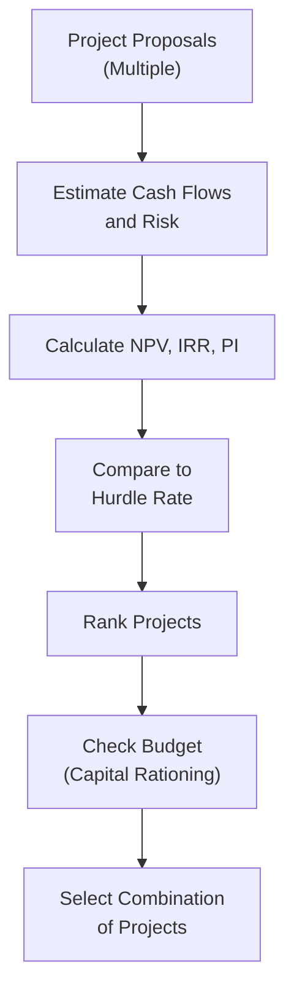

## Introduction
Capital rationing and hurdle rate determination might sound a bit intricate, but—trust me—once you see how these concepts tie together, you’ll realize they are basically about balancing resources against opportunities. And, well, we all do that in everyday life, right? If you’ve ever allocated your monthly budget among groceries, rent, and a (small) personal splurge, you already get the idea of “rationing” money. In corporate finance, it’s just on a bigger scale, with more constraints and some fancy names.

This section dives into why a company might choose to limit the amount of money it invests—referred to as capital rationing—and explores how they decide the minimum acceptable return, known as the hurdle rate, for their projects. These two ideas really shape how firms decide which projects to accept and which ones to pass on. We’ll cover everything from risk considerations to internal vs. external constraints, and we’ll wrap up with some best practices so you’ll know exactly where the pitfalls lurk. Ready? Let’s go.

## Understanding Capital Rationing
Capital rationing is the practice of restricting a company’s new investments to a certain amount of funding, even if there may be multiple projects that appear to have positive Net Present Values (NPVs). I remember back in my early days as an analyst, watching my first CFO decide how much we could invest that year. I naively asked, “If these projects are profitable, why can’t we do them all?” He gave me a look—like “you’ll learn, kid”—and explained that the company had a specific strategic plan, along with constraints from our lenders and risk appetite. That’s the gist of capital rationing: you can’t do everything at once, so you have to pick your best bets.

### Internal vs. External Constraints
A firm can impose these limits on itself (internal rationing) or they can be imposed by outsiders (external rationing).

- **Internal Capital Rationing:** This might happen if the board or top management sets a strict budget cap. Often it’s part of a bigger strategy—maybe they want to focus on lower-risk projects this year, or they just prefer a certain debt-to-equity ratio and don’t want to raise more funds. Firms may also impose this to maintain a certain credit rating or to avoid overstretching managerial bandwidth.

- **External Capital Rationing:** This usually surfaces because there’s a financing constraint in the market. Perhaps the firm’s credit rating is weak or the capital markets are tight. Lenders might be skittish and only willing to lend so much at a feasible interest rate. Or maybe new equity issuance isn’t attractive because the stock price is depressed.

### Why Ration?
So, you might wonder, why not just keep investing if each project is profitable? For one, there’s the question of risk. The fact that a project looks profitable on paper doesn’t mean it will pan out in reality. Additionally, management resources (and time) are finite. If you try to do too many projects at once, you might wind up misallocating your human capital.

On top of that, the intangible considerations—like maintaining a certain corporate identity or focusing on areas that align with the firm’s strategic objectives—may trump the purely quantitative measures. Whether it’s a desire to maintain a healthy cushion for unforeseen circumstances or a plan to preserve liquidity, these factors can justify a cap on total investments.

## Project Ranking Tools under Capital Constraints
When you face capital rationing, you need to decide which projects to pick within your limited budget. Remember that each project could have a different initial cost, different risk profiles, and different expected cash flows. The question becomes: “Which combination of investments yields the highest overall benefit given a fixed budget?”

Two popular approaches—though certainly not the only ones—are:

- **Profitability Index (PI)**: The PI is essentially the ratio of the present value of a project’s future cash flows (discounted at the hurdle rate) to the initial investment. Mathematically:

  
  \text{PI} = \frac{\text{PV of future cash flows}}{\text{Initial Investment}}
  

  A project with a PI above 1 indicates a positive NPV. Among multiple competing investments, a higher PI typically ranks better.

- **NPV Ranking**: Sometimes, you simply rank by each project’s NPV—biggest NPV first, then so on down the line until you run out of budget. This method focuses on maximizing shareholder value directly, since NPV is arguably the foremost measure of value creation.

As an example, suppose you have four projects with the following data (all figures in thousands):

| Project | Initial Investment | NPV ($)    | Profitability Index |
|---------|--------------------|------------|---------------------|
| A       | \$100             | \$30       | 1.30               |
| B       | \$200             | \$50       | 1.25               |
| C       | \$150             | \$40       | 1.27               |
| D       | \$80              | \$20       | 1.25               |

If your total available budget is \$250, you might pick Project A and C if you’re going by the highest PIs (1.30 and 1.27), assuming no other constraints. But if you go strictly by NPV, projects B and A combined might yield the highest total NPV (\$80), although that combination costs \$300—exceeding your \$250 budget. So you see how the ranking can lead to different selection decisions depending on your metric and constraints. That’s the art and science of capital rationing.

## Determining the Hurdle Rate
The hurdle rate, also known as the required rate of return, is the minimum return a potential project must offer for management to consider it worthy. From a theoretical standpoint, the hurdle rate is often based on the firm’s Weighted-Average Cost of Capital (WACC). But in practice, companies frequently tweak it upwards to build in a cushion for risk, or they might lower it for particularly strategic projects.

### Weighted-Average Cost of Capital (WACC)
WACC is the blended cost of all the firm’s sources of capital—typically debt, equity, and possibly preferred stock or other funding. Conceptually, you weight each category by its proportion in the capital structure:


\text{WACC} = \left(\frac{E}{V}\right)\,r_\text{e} + \left(\frac{D}{V}\right)\,r_\text{d}\,(1 - T) + \left(\frac{P}{V}\right)\,r_\text{p}


Where:  
- \\( E \\) = market value of equity  
- \\( D \\) = market value of debt  
- \\( P \\) = market value of preferred stock (if applicable)  
- \\( V = E + D + P \\) = total market value of the firm’s capital  
- \\( r_\text{e} \\) = cost of equity  
- \\( r_\text{d} \\) = cost of debt  
- \\( r_\text{p} \\) = cost of preferred stock  
- \\( T \\) = corporate tax rate (since interest is typically tax-deductible)

In many simpler cases, you might just see WACC computed with debt and equity alone. The key takeaway: WACC is like the firm’s “mixed” cost of obtaining money. For a project to create value, it should, at the very least, generate a return above the WACC.

### Risk Adjustments to the Hurdle Rate
But let’s face it: not all projects carry the same risk profile as the core business. If your company is in stable manufacturing but is considering a foray into biotech R&D, the inherent risk is different. So, how do you reflect that difference? You add a premium to the WACC if the project is riskier than the firm’s average project. Conversely, if it’s a safer bet, you might apply a slightly lower discount rate.

Imagine you run a utility company with a stable, regulated business. Your WACC might be around 6%. However, you consider investing in a new, unregulated renewable energy venture. Because the risk is higher than your usual electricity distribution operations, you might tack on, say, 2% to 4% to the baseline 6%, setting a hurdle rate in the 8%–10% range.

## Using a Premium Above WACC
Some firms choose a simple rule of thumb: “We accept projects only if they return, say, WACC + 3%.” This can be an internal type of capital rationing, as it effectively imposes a higher bar than the pure cost of capital. On the plus side, it’s simple and provides a buffer for unforeseen complications. On the downside, it might tempt managers to abandon decent projects that are still above the WACC but below the artificial hurdle. If your WACC is 9% and you set the hurdle at 12%, a really good 11% return project may not get funding.

## Visualizing the Capital Rationing and Hurdle Rate Process

Below is a simple Mermaid diagram illustrating a typical decision process—from project proposals to final acceptance—incorporating both capital rationing constraints and the determination of a hurdle rate:

Here’s the gist:  
1. Potential projects are proposed.  
2. Management estimates their cash flows and risk levels.  
3. Valuation metrics are calculated (NPV, IRR, profitability index, etc.).  
4. These projects are compared against the hurdle rate to see if they even meet the minimum threshold.  
5. Qualifying projects are then ranked, often by NPV or PI.  
6. Budget constraints (capital rationing) are applied.  
7. Management chooses the final portfolio of projects that (hopefully) maximizes shareholder value within the limited budget.

## Practical Example: A Case Study
Let’s walk through a quick scenario that might bring these ideas to life. Suppose you’re CFO at “GreenTronics,” a mid-sized electronics manufacturer facing a \$500,000 cap on new projects this year. You’ve got three potential projects:

1. **Project Solar:** Expand into solar-powered gadgets (cost \$300,000, estimated return 13%, standard deviation of returns moderately high).  
2. **Project EcoCharge:** A new line of eco-friendly chargers (cost \$200,000, estimated return 10%, standard deviation of returns lower than the core business).  
3. **Project NextGen:** A next-generation product line in a brand-new market (cost \$250,000, estimated return 16%, risk significantly higher).  

Your firm’s WACC is 9%. After reviewing the overall risk:  
- For Project Solar, you decide a 1% premium to WACC is enough. So the target is 10%. The project’s expected 13% return is above 10%. Good.  
- For EcoCharge, it actually might be less risky, so you keep the hurdle at WACC (9%). Its 10% expected return is above 9%. Good.  
- For NextGen, you might feel you need a 4% premium, so your hurdle becomes 13%. The expected return is 16%, which is above 13%. Also good.

At first glance, all projects clear their respective hurdle rates. Unfortunately, you can only spend \$500,000 total. If you try to fund NextGen and Solar, that’s \$550,000—above your budget. So you might do NextGen (\$250k) plus EcoCharge (\$200k) for \$450k total, leaving you with \$50k unspent. Or you might do Solar plus EcoCharge exactly at \$500k. At that point, you’d weigh the combined synergy, overall NPV, or PI. Maybe NextGen’s net present value is so large that you jump on it, even though it has higher risk. That’s capital rationing in action.

## Best Practices and Common Pitfalls
### Best Practices
- **Consistent Methodology**: Keep your project evaluation methods consistent (whether using IRR, NPV, or PI) across proposals. That helps avoid biases in project selection and ensures comparability.  
- **Risk-Adjusted Hurdle Rates**: Carefully calibrate the hurdle rate for each project’s risk level. If you skip this, you might invest in project disasters simply because they appear to deliver high returns at the standard WACC.  
- **Strategic Fit**: Factor in strategic and qualitative considerations. Sometimes intangible benefits can be critical (like brand strengthening or entering a vital new market for long-term positioning).

### Common Pitfalls
- **Overly High “Safety Premium”**: Stacking a big premium on the WACC can lead to missed opportunities. Some decent projects fall just below that arbitrary bar.  
- **Inconsistent or Biased Forecasts**: If cash flow estimates are systematically over-optimistic, even a well-chosen hurdle rate won’t protect you.  
- **Ignoring Project Interdependencies**: When you have multiple projects that might overlap or create synergies, simply looking at them in isolation can cause you to pick suboptimal combos.

## Brief Note on Links to Other Topics
Capital rationing and hurdle rate decisions often interact heavily with topics such as leverage (discussed in Chapter 6: Capital Structure), because a higher debt load might constrain the firm’s ability to raise additional capital. They also tie back to intangible considerations of business models (Chapter 7) and how innovative or disruptive certain expansions might be. Ultimately, it’s all part of strategic capital allocation in corporate finance.

## Conclusion
Capital rationing is essentially the art and science of selecting projects given limited funds, while the hurdle rate ensures that each project at least meets or exceeds the return threshold necessary for the firm. These twin concepts ensure that the firm prioritizes its best, most strategic opportunities and that it grows at a pace aligned with its risk appetite and resource availability. That’s good for the firm—and for shareholders over the long haul.

Before you head off, I’d gently remind you: capital rationing and hurdle rate determination aren’t “one-size-fits-all.” They require ongoing reassessment, especially as market conditions, strategic objectives, or your firm’s capital structure change. In practice, it’s a learning-by-doing experience, shaped by real-world constraints, risk appetites, and strategic imperatives.

## References and Further Reading
- Modigliani, F. and Miller, M.: Seminal papers on capital structure and cost of capital.  
- CFA Institute Level I & II Curriculum: Sections on Cost of Capital and Capital Budgeting.  
- Financial Analyst Journal: Articles on risk-adjusted capital allocation, capital rationing, and corporate governance considerations.  

---

## Test Your Knowledge: Capital Rationing and Hurdle Rate Quiz



### Which of the following best describes the concept of capital rationing?

- [ ] Financing all positive NPV projects.  
- [x] Limiting total capital expenditures based on internal or external constraints.  
- [ ] Setting the hurdle rate equal to the risk-free rate.  
- [ ] Selecting the project with the lowest cost of capital only.  

> **Explanation:** Capital rationing refers to situations where a firm restricts its total investment spending, even if multiple projects appear attractive. This can be due to internal choices (like strategy) or external constraints (like limited financing).

### In a situation where a firm imposes its own limit on annual capital spending, the capital rationing is best described as:

- [ ] External capital rationing.  
- [x] Internal capital rationing.  
- [ ] Residual capital policy.  
- [ ] None of the above.  

> **Explanation:** Internal capital rationing arises from self-imposed company policies or strategic choices, whereas external rationing often stems from market or credit constraints.

### When selecting among multiple projects under a strict budget cap, which ranking measure is often used to prioritize projects?

- [ ] Net Operating Profit After Tax (NOPAT).  
- [ ] Payback Period.  
- [x] Profitability Index.  
- [ ] Return on Equity (ROE).  

> **Explanation:** The Profitability Index (PI) helps rank projects by the present value of future cash flows per dollar invested, making it useful for determining project priority when funding is limited.

### If a project’s expected return is above the Weighted-Average Cost of Capital (WACC), and all other factors are average for the firm, the project:

- [ ] Is always rejected due to higher risk.  
- [ ] Is automatically accepted.  
- [x] Should be further evaluated as it exceeds the firm’s blended cost of financing.  
- [ ] Must be adjusted downward by the inflation rate.  

> **Explanation:** Although exceeding WACC is a good sign for potential value creation, further analysis is needed to assess project-specific risk, strategic fit, and synergy before final acceptance.

### The rationale for adding a premium over WACC in determining the hurdle rate is primarily:

- [ ] To ensure the payback period is minimized.  
- [ ] To reduce the firm’s weighted cost of debt.  
- [x] To account for higher-than-average project risk or uncertainty.  
- [ ] To maximize the number of projects accepted.  

> **Explanation:** A premium above the standard WACC is used to reflect that a project carries more uncertainty or risk than the firm’s core operations.

### Which of the following is a potential downside of setting a hurdle rate significantly higher than the firm’s WACC?

- [x] Missing out on profitable projects that fall just below the elevated bar.  
- [ ] Reducing the internal rate of return on existing projects.  
- [ ] Forcing the project to have a negative NPV.  
- [ ] Lowering the firm’s debt capacity.  

> **Explanation:** An excessively high hurdle rate may cause the firm to reject projects that could have created shareholder value.

### A firm has \$500,000 to invest and two independent projects—Project X with an NPV of \$90,000 requiring \$300,000, and Project Y with an NPV of \$70,000 requiring \$200,000. Which of the following actions maximizes total NPV under capital rationing?

- [ ] Choose Project X only.  
- [ ] Choose Project Y only.  
- [x] Choose both X and Y if possible, because combined cost is \$500,000.  
- [ ] None; the firm should divide the budget between them equally.  

> **Explanation:** Both X and Y provide high NPVs, and combined they fit within the \$500,000 budget. Selecting both maximizes total NPV (\$160,000).

### One advantage of using the profitability index (PI) approach over raw NPV in capital rationing is:

- [ ] It guarantees projects have the longest payback period.  
- [x] It captures the immediate “bang for the buck” per dollar invested.  
- [ ] It ignores risk considerations better.  
- [ ] It’s less sensitive to discount rate changes.  

> **Explanation:** PI measures how much return you get per unit of investment, making it handy for allocating limited capital.

### Which statement about hurdle rates is most accurate?

- [x] The hurdle rate can be higher or lower than the WACC depending on project risk.  
- [ ] The hurdle rate must always equal the current dividend yield.  
- [ ] The hurdle rate cannot deviate from the firm’s cost of equity.  
- [ ] The hurdle rate is the same as the firm’s marginal tax rate.  

> **Explanation:** The required rate of return can vary from the baseline WACC to reflect project-specific risk estimates.

### A firm’s Weighted-Average Cost of Capital (WACC) is 8%. True or False: By definition, any project offering a 7% return is considered to be adding value for the firm.

- [ ] True  
- [x] False  

> **Explanation:** A 7% return is below the 8% WACC. Thus, it destroys rather than creates value for shareholders.


