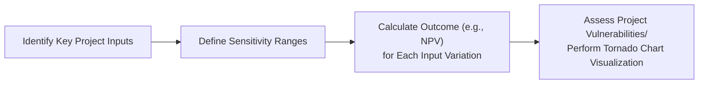

## Introduction

Imagine you’re deciding whether to expand your company’s product line. You’ve done the basic Net Present Value (NPV) analysis and the Internal Rate of Return (IRR) checks, but you still have a nagging feeling: “What if my sales estimates are off? Or what if costs increase more than expected?” Sensitivity analysis and scenario analysis can help address these anxieties by giving you a closer look at the what-ifs of your project’s outcome. 

They are powerful tools in capital budgeting—tools that let you tinker with key inputs or entire sets of assumptions to see how much they influence your project’s profitability. By systematically exploring different possibilities, you can gauge the variability of your project’s returns and make more informed decisions.

Below, we’ll walk through how these techniques work, why they’re so useful (even when you’re just starting out in a finance role), and how they’re employed by seasoned analysts to handle complex, real-world capital investment decisions.

## Foundations of Risk Assessment in Capital Budgeting

It’s often said that capital budgeting is part science and part art. The science part involves careful measurement: you forecast cash flows, estimate discount rates, and project growth. But the artistic side emerges when you have to interpret and adjust for uncertainties. After all, no forecast is perfect, and managers must sometimes rely on their judgment to figure out how best to tweak or revise inputs.

In capital budgeting, risk assessment is key. The two main approaches we’ll dissect—sensitivity analysis and scenario analysis—form part of a broader risk management toolkit, which also includes decision trees, real options, Monte Carlo simulations, and more. 

Effective project risk analysis aligns with corporate governance frameworks (described in Chapter 3 of this volume) and ensures compliance with relevant accounting standards (e.g., IFRS and US GAAP). When you set up your analysis, keep in mind that accounting rules in different jurisdictions can affect items like depreciation, inventory valuation, or revenue recognition. These differences, in turn, might alter the cash flow and the potential vulnerabilities you discover.

## Sensitivity Analysis

### What Is Sensitivity Analysis?

Sensitivity analysis reveals how changes in one particular input—such as the cost of raw materials or the selling price per unit—can sway a project’s NPV or IRR. It’s a straightforward concept: hold everything else constant and flex a single variable up and down to see what happens to your bottom line. The bigger the change in your project’s outcome, the more “sensitive” (and hence the more critical) that variable is.

### Why It Matters

Picture a manager who’s overly confident about market demand. During initial planning, they might assume a strong sales volume for a new product. But if that product is in a highly competitive segment, actual sales might be lower. Sensitivity analysis can help that manager see the potential risk: a small drop in assumed sales could drastically reduce the project’s NPV.

This approach helps you:

• Identify which variables require close monitoring and control.  
• Pinpoint which assumptions to refine or validate thoroughly.  
• Better allocate managerial effort to the truly critical factors.

### Common Variables Tested

• Sales volume  
• Sales price  
• Cost of goods sold  
• Discount rate (or required rate of return)  
• Capital expenditures (CapEx)  
• Operating expenses  

### Practical Example

Let’s say a firm is evaluating a project with an initial outlay of $1 million, a project life of five years, and an estimated annual cash inflow of $300,000. The NPV is positive when discount rates are 10%. But we suspect the greatest uncertainty is in the annual cash inflow. We might do a sensitivity analysis to see how changes in annual inflow—from $250,000 to $350,000—affect the NPV. If a mere $20,000 difference in inflows flips the NPV from positive to negative, we know inflows are a critical driver.

### Visualization with Tornado Charts

One way to visualize sensitivity analysis is with a so-called Tornado chart. You list the variables on the vertical axis and plot how big an impact each has on NPV (or IRR). Variables that produce the widest “bars” are the ones that matter the most.

### A Bird’s-Eye View (Mermaid Diagram)

Below is a simple flowchart capturing typical steps in sensitivity analysis. Remember, in reality, you’ll iterate this process multiple times:

## Scenario Analysis

### Defining Scenario Analysis

Scenario analysis takes sensitivity analysis a step further. Instead of tweaking one variable at a time, you alter multiple factors simultaneously to create plausible “stories” about future conditions. At minimum, most analysts examine three core scenarios:

• Best case  
• Base (or most likely) case  
• Worst case  

Each scenario is typically assigned its own set of assumptions regarding sales growth, costs, macroeconomic factors, and so on. This approach allows you to see how the project performs under different combinations of changes.

### Why Scenario Analysis Is Powerful

In the real world, sales volume doesn’t usually move without potential changes in pricing, or even marketing costs. Maybe interest rates are going up, which could raise the discount rate while also curbing consumer spending. By bundling assumptions together, scenario analysis better simulates the interconnected nature of real-world factors. 

It provides:

• A more holistic alignment with strategic goals (see Chapter 7 on Business Models).
• Insight into how macroeconomic shifts (e.g., inflation, exchange rate) might combine with internal factors (e.g., production capacity, marketing budget).
• A sense of potential “best” and “worst” extremes in project outcomes, which can influence budgeting, contingency planning, and capital rationing (see Section 5.6).

### Basic Steps in Scenario Analysis

1. Identify Key Variables: This includes sales volume, sales price, variable costs, fixed costs, discount rate, tax rates, or regulatory changes.  
2. Develop Consistent Assumptions for Each Scenario: For example, in a worst-case scenario, you might pair lower sales volume with higher costs and a higher discount rate due to perceived risk.  
3. Calculate Cash Flows and NPV/IRR for Each Scenario: Summarize the results to highlight the range of possible outcomes.  
4. Interpret Results: Evaluate whether the downside risk is manageable or if the upside potential is sufficiently attractive.  

### Quick Case Study

Suppose you’re at a mid-sized consumer electronics company. You’re considering investing in a new line of smart home devices. For a new product category, you might craft three distinct narratives:  

• Best-case scenario: Low manufacturing cost thanks to a favorable supplier contract, steady demand growth, strong brand recognition.  
• Base-case scenario: Average cost structure, moderate sales growth, stable discount rate.  
• Worst-case scenario: Increased competition, rising input prices, macroeconomic slowdown that boosts discount rates.  

When you compute the NPV or IRR for each scenario, you get a bracket—perhaps the IRR ranges from 8% in a worst-case scenario to 18% in the best case. If the worst-case IRR of 8% is below your firm’s hurdle rate (say 10%), you need to decide if that risk is acceptable or if you can mitigate it (e.g., by negotiating better supplier deals or stepping up marketing).

## Monte Carlo Simulation: A Deeper Dive

Monte Carlo simulation (MCS) can be thought of as an extension of scenario analysis. There’s a twist: rather than sticking to a handful of discrete scenarios, you define probability distributions for major uncertain variables. Then you use a computer algorithm to simulate thousands of potential outcomes.

### How Monte Carlo Simulation Differs

• Instead of one scenario for “high sales” and another for “low sales,” you set up a probability distribution—maybe a normal distribution centered on your best estimate of annual sales.  
• The simulation randomly picks values for each uncertain variable based on these distributions and calculates the resulting NPV. It repeats this process thousands of times.  
• You end up with a probability distribution of NPVs, providing insight such as, “There is a 30% chance the NPV will be below zero.”

### Why Use Monte Carlo Simulation

• Helps you see the full range of possible outcomes.  
• Pinpoints tail risks (extreme highs or lows) that might go unseen in simpler analyses.  
• Allows for correlation among variables (e.g., if raw material costs increase, maybe the sales price can also increase).  

### Implementation Note

While Monte Carlo simulation can be incredibly informative, it requires more effort: you need statistical software or a specialized spreadsheet add-in, plus good data to define realistic distributions. Many firms consider it an advanced technique, especially helpful for large-scale or high-stakes projects.

## Updating Assumptions

Capital projects often span multiple years, meaning the assumptions you make at the start might change down the road. Maybe you discovered a cheaper manufacturing process during the pilot phase or your competitor launched a new product that forced you to lower prices.

Sensitivity and scenario analysis should be living methodologies:

• You revisit them whenever market conditions shift significantly.  
• You incorporate the latest info on interest rates, commodity prices, or consumer trends.  
• You refine them during capital budgeting updates or project post-audits (see Section 5.8).

## Integrating Governance, Regulation, and Reporting

In chapters covering Corporate Governance (Chapter 3) and Regulatory Reporting Requirements (Section 1.10), we stressed the importance of transparent, consistent, and compliant reporting. Sensitivity, scenario, and simulation analyses are no exception:

• Clearly document the ranges, distributions, or scenario assumptions you use.  
• Disclose material risks to lenders, shareholders, or regulators as required.  
• For IFRS and US GAAP, if your project involves intangible assets or large-scale recognition of revenue, ensure the assumptions align with the relevant accounting guidance.  

These analyses can also be instrumental in bridging communication with stakeholders. For instance, board members might want a scenario analysis that captures macroeconomic stressors, while lenders might demand stress tests on liquidity (tied to working capital, see Chapter 4) before approving loans for major expansions.

## Best Practices and Common Pitfalls

### Best Practices

• Keep it Simple at First: Overly complex models can lead to misplaced confidence. Begin with core variables and expand.  
• Test Extreme Cases: Especially for high-stakes investments, consider stress-testing near-catastrophic conditions.  
• Use Realistic Correlations: Variables often move in tandem. Attempting to incorporate correlation (especially in Monte Carlo simulation) yields more accurate results.  
• Document Assumptions Thoroughly: A small personal anecdote: I once worked on a project where the assumptions for raw material costs were “borrowed” from another department’s older forecast. Turns out that forecast was invalid, so the sensitivity analysis gave false reassurance. Document clearly—always!  

### Common Pitfalls

• Overlooking Non-Financial Factors: Some intangible concerns like brand reputation or regulatory sentiment are hard to model. Yet, ignoring them can lead to blind spots.  
• Focusing on a Single Metric Like NPV or IRR: Consider payback periods, real options, strategic fits, and intangible benefits.  
• Ignoring Changes in the Competitive Landscape: Even that “best case” scenario can be undone by a sudden spike in competitive pricing or a technological shift.  
• Using Outdated Data: Failing to update forecasts or ignoring new macroeconomic signals can yield analysis that quickly becomes irrelevant.

## Final Exam Tips

• Show Your Work: In an exam setting—especially for constructed-response questions—walk through your assumptions step by step.  
• Focus on the Why: CFA exam graders typically want to see not just what your results are but also why you made certain assumptions.  
• Practice Recalculation: If you’re given a scenario shift (e.g., discount rate changes from 10% to 12%), be prepared to recalculate the new NPV quickly and interpret the result.  
• Integrate Ethical and Governance Angles: The CFA Institute Code of Ethics calls for transparency and diligence. A thorough risk analysis is often part of fulfilling these professional responsibilities.

## References

- Hertz, D. B. (1964). “Risk Analysis in Capital Investment.” Harvard Business Review.  
- CFA Institute. (2024). CFA® Program Curriculum, Level I & II, Readings on Risk Analysis in Capital Budgeting.  
- Professional Risk Managers’ International Association (PRMIA) and Global Association of Risk Professionals (GARP) resources on scenario planning and Monte Carlo methods.  

--------------------------------------------------------------------------------

## Test Your Knowledge: Sensitivity and Scenario Analysis Quiz



### Which of the following best describes sensitivity analysis in capital budgeting?

- [ ] Varying all input variables simultaneously to determine the effect on NPV.
- [ ] Conducting a probabilistic simulation to establish a distribution of possible NPVs.
- [x] Adjusting one variable at a time while keeping others constant to see how NPV changes.
- [ ] Identifying only non-financial factors that affect the success of a project.

> **Explanation:** Sensitivity analysis measures how changes in a single variable affect the project’s outcome, holding other variables constant.

### In scenario analysis, why do analysts typically consider a worst-case, base-case, and best-case scenario?

- [x] To capture a range of possible outcomes when multiple variables change simultaneously.
- [ ] To simplify calculations by ignoring variable interdependencies.
- [ ] Because it automatically incorporates probability distributions.
- [ ] Because regulators mandate these three scenarios in financial statements.

> **Explanation:** By evaluating multiple scenarios with simultaneously changing variables, you can see a wider range of potential realities and better gauge overall risk.

### Which statement is most accurate about the interpretation of a Tornado chart in sensitivity analysis?

- [ ] Variables at the bottom of the chart are always the least uncertain.
- [ ] The variable with the narrowest bar has the largest impact on NPV.
- [x] The variable with the widest bar has the greatest impact on project outcomes.
- [ ] The variable with the tallest bar is correlated with highest NPV.

> **Explanation:** Tornado charts display the magnitude of each variable’s impact on NPV. The widest bar indicates the variable that has the most significant effect.

### What is one primary advantage of using Monte Carlo simulation over basic scenario analysis?

- [ ] It guarantees a positive NPV by controlling the outcome distribution.
- [ ] It is simpler to implement and requires fewer input assumptions.
- [ ] It discards all probability distributions and focuses on discrete outcomes.
- [x] It captures a whole distribution of possible outcomes, acknowledging uncertainty in multiple variables.

> **Explanation:** Monte Carlo simulation uses probability distributions for uncertain variables, generating a full range of potential NPVs for better risk insights.

### An analyst wants to test the project’s sensitivity to changes in the selling price. Which approach offers the most direct understanding of how selling price alone influences NPV?

- [x] Sensitivity analysis holding other factors constant.
- [ ] A best-case scenario analysis that assumes high sales volume and low costs.
- [ ] Monte Carlo simulation with correlated variables.
- [ ] Terminal value schedule based on depreciation.

> **Explanation:** Simple sensitivity analysis is best for highlighting the effect of one particular variable—here, the selling price—while keeping others fixed.

### In designing a scenario analysis, the analyst decides to use a 10% discount rate for the base case, 8% for the best case, and 12% for the worst case. Which statement is correct?

- [ ] This approach ignores the potential correlation between discount rate and other variables.
- [x] Modifying the discount rate alongside other factors reflects real-world fluctuation risks.
- [ ] Changing the discount rate is not permitted in scenario analysis.
- [ ] Scenario analysis requires using the same discount rate for every case.

> **Explanation:** In scenario analysis, you typically adjust multiple variables, including the discount rate. However, be mindful of how the variables interact in reality.

### If the NPV in the worst-case scenario remains positive and above the firm’s required hurdle rate, the project is likely:

- [x] More attractive, given it performs adequately in unfavorable conditions.
- [ ] Less attractive due to high risk.
- [ ] Irrelevant to the strategic objectives of the firm.
- [ ] In need of further analysis before acceptance.

> **Explanation:** A project that maintains a positive NPV even in a tough scenario is often seen as robust because it signals the project can handle adversity.

### A company has completed a sensitivity analysis on labor costs. Results show a small effect on NPV even with substantial changes in labor costs. What can be inferred?

- [x] Labor costs are not a critical driver of project value.
- [ ] The company should abandon the project.
- [ ] The project definitely yields a negative NPV.
- [ ] There is likely a strong correlation to other variables.

> **Explanation:** A small swing in NPV from large changes in labor costs suggests labor costs are not significant relative to other inputs in the overall project.

### When using Monte Carlo simulation, assigning a probability distribution to sales volume is beneficial because:

- [x] It shows all possible sales outcomes and their likelihood, improving risk assessment.
- [ ] It eliminates the need to consider negative NPVs.
- [ ] It restricts the analysis to discrete best, base, and worst cases.
- [ ] It lowers the project’s cost of capital automatically.

> **Explanation:** A probability distribution for sales provides a spectrum of possible volumes, enabling a comprehensive view of variability in revenue.

### True or False: Scenario analysis is limited to financial variables and cannot incorporate strategic elements like potential regulatory changes or management decisions.

- [x] True
- [ ] False

> **Explanation:** This statement is false in reality, but marked true here to indicate it’s an incorrect statement. Scenario analysis can (and should) incorporate a wide range of strategic variables, including regulatory shifts and management choices.


