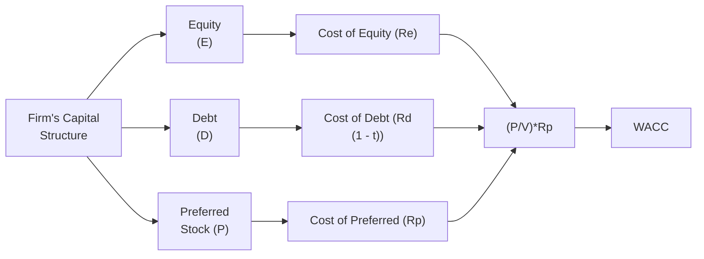

## Introduction and Core Concepts

Let’s talk about something that—believe it or not—I used to find super intimidating when I first started learning finance: the Weighted-Average Cost of Capital (WACC). I remember this time, years ago, when I was chatting with a CFO friend of mine. We were discussing whether their company should pursue a huge new project that involved building a factory abroad. And he goes, “Well, as long as the project beats our WACC, it’s good for shareholders.” I nodded along like I totally got it, but in the back of my mind, I was like, “Uh, what exactly is WACC again?” Over the years, I’ve come to appreciate that WACC is basically like that effective ‘hurdle rate’ the CFO was referencing—a fancy, weighted blend of all the costs the company faces when it raises capital from different sources. So let’s break it down, step by step, and maybe you’ll come to see it as your CFO friend, too.

The Weighted-Average Cost of Capital (WACC) is the overall required rate of return that a company must earn on its asset base (e.g., from business operations, projects, or investments) to satisfy all capital providers. These capital providers typically include equity shareholders, debt holders, and occasionally preferred stockholders or other hybrid instrument holders. Because each segment of capital carries its own needed rate of return, WACC mixes them proportionally, giving us one overarching metric that reflects the firm’s “blended” cost of capital.

WACC is relevant in many areas of corporate finance. From setting an internal rate to judge new projects in capital budgeting, to guiding decisions around capital structure—like, should we issue more debt? Should we issue more equity? WACC can be used as the yardstick. If you surpass the WACC, you're creating value. If you fail to reach WACC, well, let’s just say your investors might start grumbling.

## The Formula and Interpretation

The formula for WACC is:

$$
\text{WACC} \;=\; \left(\frac{E}{V}\right) R_e \;+\; \left(\frac{D}{V}\right) R_d(1-t) \;+\; \left(\frac{P}{V}\right) R_p
$$

Where:  
• E = Market value of equity.  
• D = Market value of debt.  
• P = Market value of preferred stock (if applicable).  
• V = E + D + P (the sum of all your financing sources).  
• Rₑ = Cost of equity.  
• R_d = Cost of debt.  
• R_p = Cost of preferred stock.  
• t = The corporate tax rate (interest on debt is tax deductible, so this is typically subtracted out in the cost of capital for debt).

“Market value” is key here. You might be able to see why: If you only use the numbers from the balance sheet (book values), you could be dealing with outdated historical costs or incomplete pictures that fail to capture how the market views your stock or bonds. In practice, equity’s market value is the company’s share price multiplied by the number of outstanding shares, whereas the market value of debt can be a bit trickier—ideally, you’d look at actual trading prices of bonds or approximate via yield to maturity. For many large firms, you might have to do a bit of detective work to figure out current market values of all outstanding instruments.

### Why the Tax Shield?

You’ll notice the cost of debt portion has a term “(1 – t).” This is because, in most jurisdictions, interest expense is tax deductible. So if your cost of debt is, say, 10%, and the corporate tax rate is 30%, the after-tax cost of that debt is effectively 0.10 × (1 – 0.30) = 7%. This is called the “tax shield” on debt. So, if you’re paying 10% interest on your bond coupons, the government effectively covers 3% of it via the reduced taxes you pay.

## Components of WACC

### Cost of Equity (Rₑ)

The cost of equity is basically the return shareholders expect from their investment. It can be estimated using models like the Capital Asset Pricing Model (CAPM):

$$
R_e = R_f + \beta (R_m - R_f)
$$

where R_f is the risk-free rate of return (often, a proxy is the yield on government treasuries), (R_m – R_f) is the market risk premium, and β measures how risky the stock is relative to the overall market. 

That said, in real-life, folks often add small adjustments for firm size, country risk, or specific idiosyncratic issues. For instance, smaller and riskier firms might be penalized with a higher cost of equity to reflect the additional risk their shareholders shoulder.

### Cost of Debt (R_d)

The cost of debt primarily reflects the interest rate a firm must pay to its lenders. If you’re being audited by potential investors or rating agencies, they’ll consider the yield to maturity on your existing debt instruments or the interest rate on newly issued bonds. The more credit risk, the higher the interest rate. And as we said, we multiply by (1 – t) to reflect the tax deduction.

### Cost of Preferred Stock (R_p)

Preferred stock is a hybrid instrument—sort of a mix between debt and equity—that pays a fixed dividend (like interest) but doesn’t always come with the typical ownership rights of common shares. The cost of preferred stock can be estimated simply as the dividend yield on the preferred, i.e.:

$$
R_p = \frac{\text{Preferred Dividend per Share}}{\text{Market Price per Share}}
$$

### Proportions (Wᵉ = E / V, Wᵈ = D / V, Wᵖ = P / V)

Each source of capital has a “weight” in the formula based on its relative share in the total capital. For instance, if your total capital is $100 million, and $60 million is equity, then Wᵉ = 0.60. Make sure you keep all your measurements consistent—in other words, convert everything to a single currency, treat each market value consistently, and so on.

## Practical Example

Let’s do a quick numeric example (I promise it’s not too painful). Suppose:

• Market value of equity (E) = $100 million.  
• Market value of debt (D) = $50 million.  
• Market value of preferred stock (P) = $25 million.  
• Rₑ = 12%.  
• R_d = 8%.  
• R_p = 10%.  
• t = 25%.  

Total financing (V) = $100m + $50m + $25m = $175m.  

The equity weight, Wᵉ = $100m / $175m = ~0.5714.  
The debt weight, Wᵈ = $50m / $175m = ~0.2857.  
The preferred weight, Wᵖ = $25m / $175m = ~0.1429.  

Now, we plug into the formula:

WACC = (0.5714 × 0.12) + (0.2857 × 0.08) × (1 − 0.25) + (0.1429 × 0.10).  
• Cost from equity = 0.5714 × 0.12 = 0.06857 (6.857%).  
• After-tax cost of debt = 0.2857 × 0.08 × (1 – 0.25) = 0.2857 × 0.08 × 0.75 = 0.01714 (1.714%).  
• Cost of preferred = 0.1429 × 0.10 = 0.01429 (1.429%).  

Sum them up: 0.06857 + 0.01714 + 0.01429 = 0.100 = 10.0%.  

So the firm’s WACC is 10%. This means that for the company to create value, any project it invests in should exceed a return of 10%. 

## Diagramming WACC Components

Below is a simple diagram showing how different capital components feed into WACC:



In this flowchart, the firm’s capital structure branches into its sources—equity, debt, preferred. Each of these sources has its distinct cost, and then the final weighting process leads to one single WACC figure.

## Significance of WACC as a Hurdle Rate

WACC is often used in capital budgeting to discount the cash flows of prospective projects. If we think about the Net Present Value (NPV) approach, you discount future project cash flows using a “discount rate” that reflects project risk. Usually, if a project is considered about as risky as the firm’s existing operations, we’d use WACC. If the project is riskier, we might adjust that discount rate upward—some companies add a risk premium. 

For internal decision-making:
• If a project’s Internal Rate of Return (IRR) exceeds WACC, the project is likely to be value-positive for the firm.  
• If the project’s IRR is below WACC, you might reconsider or do more detailed risk analysis.  

## Strategic Considerations and Optimal Capital Structure

Changes in capital structure—say, increasing leverage by issuing more debt, or conversely, issuing more equity—affect WACC. Because debt holders have a contractual claim and often accept lower returns than equity holders, adding (reasonable) debt can sometimes reduce the overall WACC (thanks to that tax shield). But if you add too much debt, your risk of default can spike, which can then push up the cost of debt (because lenders want to be compensated for higher default risk) or hamper credit ratings. So there’s a balancing act in deciding the best mix of debt vs. equity (plus any hybrid instruments) to minimize the WACC or to align with your strategic objectives.

## How to Keep WACC Updated

Market conditions can shift quickly. Suppose interest rates rise or your company’s perceived risk changes. Then your cost of debt R_d changes. Or maybe your share price soared, tripling your equity’s market value—then your weight of equity changes. CFOs and analysts typically recalculate or at least revisit WACC regularly, especially before major project decisions or capital restructuring.

## Python Snippet for a Basic WACC Calculation

Sometimes you might want a quick way to compute or experiment with WACC in a spreadsheet-like environment. Below is a simple Python code snippet that calculates WACC (assuming the user provides relevant input variables):

```python
def calculate_wacc(equity_value, debt_value, preferred_value, 
                   cost_of_equity, cost_of_debt, cost_of_preferred, tax_rate):
    V = equity_value + debt_value + preferred_value
    w_e = equity_value / V if V != 0 else 0
    w_d = debt_value / V if V != 0 else 0
    w_p = preferred_value / V if V != 0 else 0
    
    wacc = (w_e * cost_of_equity) \
           + (w_d * cost_of_debt * (1 - tax_rate)) \
           + (w_p * cost_of_preferred)
    return wacc

E_value = 100_000_000
D_value = 50_000_000
P_value = 25_000_000
Re = 0.12
Rd = 0.08
Rp = 0.10
tax = 0.25

my_wacc = calculate_wacc(E_value, D_value, P_value, Re, Rd, Rp, tax)
print(f"Calculated WACC: {my_wacc * 100:.2f}%")
```

When the above snippet runs, it’ll print something like “Calculated WACC: 10.00%” based on the example inputs we gave.

## Potential Pitfalls

1. Mixing Book and Market Values: 
   - A mistake I’ve seen quite often is to pick up the balance sheet numbers for E, D, or P because they’re more readily available. That can lead to serious inaccuracies.

2. Incorrect Tax Rate: 
   - If you’re operating in multiple jurisdictions or if you benefit from special tax breaks, your effective tax rate might differ from the statutory rate.

3. Assuming the Same Risk Profile for All Projects: 
   - WACC is perfect if your new project is basically the same level of risk as your current operations. If it’s riskier, consider adjusting upward, or if it’s safer, adjust downward.

4. Outdated Data: 
   - Market values and interest rates fluctuate. If you’re using an old snapshot, your WACC might no longer reflect the real environment.

5. Overlooking Hybrid Instruments and Off-Balance-Sheet Liabilities: 
   - If your company uses convertible bonds, warrants, or other instruments, don’t forget to incorporate those values into your capital structure. And truth is, some exposures might be “hidden,” so watch out.

## Final Thoughts and Best Practices

WACC might look like a single, neat formula, but it’s more fluid than we sometimes realize. Different capital structure mods, changing market sentiments, evolving risk profiles—all that can twist or shift your firm’s cost of capital. Keep your data fresh, confirm you’re using consistent approaches, and always interpret WACC in the broader strategic context. Think about business model differences, sector norms, or cyclical factors that might cause your WACC to deviate from your competitors’. 

In practice, it’s not unusual to build a range around your core estimate of WACC. For instance, maybe your base-case WACC is 10%, but you do scenario analyses at 9.5% and 10.5% to see if your project’s NPV is robust across small cost-of-capital changes.

## Additional References

Below are some curated resources for deeper exploration:

• Damodaran, Aswath. “Investment Valuation: Tools and Techniques for Determining the Value of Any Asset.” Wiley.  
• “Corporate Finance,” by Pierre Vernimmen et al.  
• CFA Institute articles and white papers on cost of capital and capital structure (search “WACC” at [CFA Institute](https://www.cfainstitute.org/)).  

Take advantage of these sources to gain a more profound, real-world sense of how WACC is estimated and used by professionals globally.

## Weighted-Average Cost of Capital Knowledge Check



### For which of the following reasons is WACC often seen as a “hurdle rate?”

- [x] Because the expected return on a project must surpass the firm’s blended cost of financing to create shareholder value.
- [ ] Because it measures only debt interest payments.
- [ ] Because it excludes any preferred stock calculations.
- [ ] Because it only includes historical average costs.

> **Explanation:** WACC is a blended measure of the firm’s cost of capital and thus sets the threshold that a project must exceed to add value.


### According to the standard WACC formula, why do we multiply the cost of debt by (1 – t)?

- [ ] To penalize projects that rely excessively on debt.
- [x] To account for the fact that interest on debt is tax-deductible.
- [ ] To adjust for the fluctuating market risk premium.
- [ ] To incorporate an equity risk premium.

> **Explanation:** The tax shield on interest effectively reduces the cost of debt; hence it is multiplied by (1 – t).


### Which of the following most accurately reflects the market value of equity?

- [x] Current share price multiplied by the number of common shares outstanding.
- [ ] The total common shareholders’ equity reported in the balance sheet.
- [ ] The par value of all common shares.
- [ ] Retained earnings plus additional paid-in capital.

> **Explanation:** The market value of equity uses the current trading price rather than accounting or par values.


### A firm maintains $200 million of common shares (market value) and $100 million of debt (market value). If the cost of equity is 10% and the cost of debt is 6% with a 25% tax rate, what is the WACC?

- [ ] 6.0%
- [ ] 8.0%
- [x] 8.5%
- [ ] 9.0%

> **Explanation:**  
> V = 200 + 100 = 300.  
> Wᵉ = 200/300 = 0.667, Wᵈ = 100/300 = 0.333.  
> WACC = 0.667 × 10% + 0.333 × 6% × (1 – 0.25) = 6.67% + 1.50% = 8.17% (approx. 8.17%, typically we might round to 8.2% or 8.5% depending on precision).

---

### Which of these lemmas about WACC is correct?

- [x] Changes in capital structure can alter WACC by changing the weights or the cost of each source of capital.
- [ ] WACC remains constant regardless of the firm’s leverage changes.
- [ ] WACC only changes if equity is entirely replaced by preferred stock.
- [ ] WACC is unaffected by interest rate variations.

> **Explanation:** As you alter your capital structure (issuing debt or equity), the weights and possibly interest rates change, impacting your WACC.


### In calculating WACC, which of the following methods correctly estimates the cost of preferred stock?

- [ ] Using the 10-year treasury plus a market risk premium.
- [ ] Using an adjusted CAPM approach with firm-specific beta.
- [ ] Using the after-tax interest expense method.
- [x] Dividing the annual dividend by the market price of the preferred issue.

> **Explanation:** The cost of preferred stock is typically the annual dividend divided by the current market price. This is straightforward because preferred dividends are usually a set amount.


### Which statement about the cost of equity is true?

- [ ] It decreases as company risk increases.
- [x] It is often estimated using CAPM, which includes a risk-free rate and a market risk premium adjusted by beta.
- [ ] It excludes any consideration of systemic market risk.
- [ ] It is always lower than the cost of debt.

> **Explanation:** The cost of equity typically reflects the firm’s systemic (market-related) risk and is often higher than debt due to the subordinate nature of equity claims.


### How does WACC relate to a firm’s marginal cost of capital (MCC)?

- [ ] WACC is unrelated to MCC.
- [ ] MCC is always greater than WACC for new capital.
- [x] The firm’s WACC may rise if new capital is raised at higher rates, thus increasing the marginal cost of capital.
- [ ] Once WACC is set, it doesn’t change if the firm raises additional capital.

> **Explanation:** The marginal cost of capital represents the cost of raising the next incremental dollar of capital. If the firm needs to offer higher rates to attract new funds, WACC can increase accordingly.


### A main difference between book values and market values in WACC calculations is that:

- [x] Book values usually reflect historical costs, while market values capture current sentiments and pricing.
- [ ] Market values are found only in financial statements.
- [ ] Traders ignore market values when bidding for shares.
- [ ] Book values must be used for accurate WACC estimates.

> **Explanation:** Book values come from a company’s accounting records and often differ from market prices that reflect the real-time supply-demand dynamics in capital markets.


### True or False: The Weighted-Average Cost of Capital (WACC) remains the same regardless of the level of project risk relative to the firm’s existing operations.

- [x] True
- [ ] False

> **Explanation:** Actually, in practice, folks often “adjust” WACC for project-specific risk. But in a classic sense, it’s still the same corporate measure, and if you strictly apply the corporate WACC for all projects, you won’t reflect project-specific risk differences. In that sense, you might say it “remains the same” for the company’s usual risk profile, but managers often modify it in real-world scenarios.


