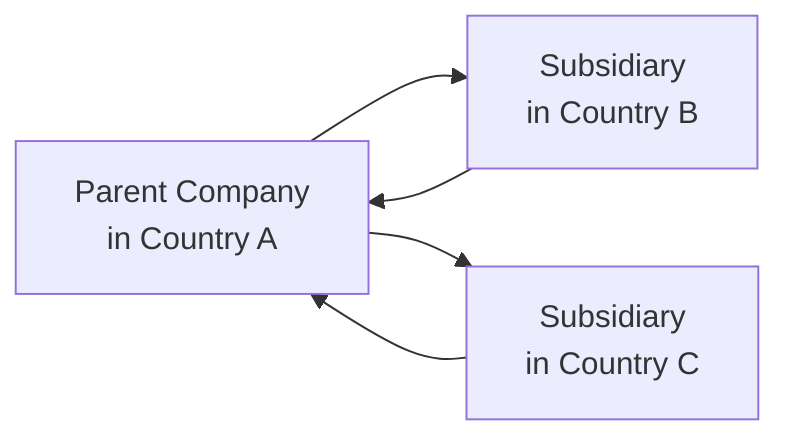

## Overview

Capital structure decisions do not exist in a vacuum; they’re molded by each jurisdiction’s legal frameworks, tax regulations, and market mechanisms. Plenty of folks—myself included—have witnessed how a company’s financing strategy can drastically change when crossing national borders. Maybe you’ve heard stories of firms relocating headquarters or raising money offshore just to take advantage of more favorable tax rules. Well, that’s exactly the scenario we’re going to pick apart in this reading.

In previous sections, we covered how leverage and equity interplay to impact a firm’s Weighted Average Cost of Capital (WACC) and overall financial stability (see “6.1 Weighted-Average Cost of Capital (WACC)”). Now, we want to dig deeper into how legal and tax specificities in one region might differ from another and how that might nudge firms to choose debt over equity or vice versa. 

We’ll see how interest deductibility, withholding taxes, cross-border complexities, and local regulations can turn capital structures into a patchwork quilt of possibilities. Given the broad scope, this reading is especially relevant for multinational enterprises (MNEs) and any entity that’s making capital structure decisions with cross-border implications.

Throughout, we’ll highlight how the CFA Institute Code and Standards encourages prudent consideration of local regulations and fair dealing with various stakeholders, including tax authorities. By the chapter’s end, you should have a robust framework to anticipate how a firm’s capital structure might evolve if it operates within or expands to different jurisdictions.

## Tax Regimes and Interest Deductibility

### The Debt Tax Shield

One of the most important considerations for corporate finance is the tax benefit associated with debt—or the so-called debt “tax shield.” Typically, a company’s interest expense is tax-deductible at the corporate tax rate, while dividends paid to shareholders are not. This difference often makes debt financing more attractive in markets where corporate tax rates are steep.

Just to illustrate, let’s say we have a firm that must decide between issuing debt at 6% interest or raising equity. If the corporate tax rate is 30%, the after-tax cost of debt becomes:


r_{d, \text{after-tax}} = r_{d} \times (1 - t) = 0.06 \times (1 - 0.30) = 4.2\%.


And that’s obviously lower than the pre-tax 6%. The difference can be huge if debt financing is used at scale, especially in countries with high income tax rates.

### Thin Capitalization Rules

However, governments often limit how much interest a corporation can deduct, especially when debt levels exceed a certain threshold relative to equity. This is where thin capitalization rules come into play. Under these regulations, if a company’s debt-to-equity ratio surpasses a specific ratio—say 3:1—some or all of the interest expense may be disallowed for tax purposes. 

Why do these rules exist? Because without them, MNEs could capitalize subsidiaries with almost all debt, shift profits from high-tax countries to low-tax ones, and enjoy an unfair advantage. Thin capitalization rules help ensure that companies don’t overuse debt just to save on taxes.

### Local vs. Foreign Ownership

Tax deductibility rules might differ depending on whether the lender is located in the same jurisdiction or abroad. Some countries require arm’s-length interest rates on cross-border intragroup loans to ensure that the local tax base is not eroded through artificially inflated interest charges. This leads us into another important topic: transfer pricing.

## Transfer Pricing and Cross-Border Financing

### The Transfer Pricing Framework

Transfer pricing is the practice of assigning prices to transactions between related entities within an MNE. In the context of capital structure, intragroup financing—where a parent or sister company provides loans to a subsidiary—must adhere to these transfer pricing rules to ensure that interest rates and terms reflect “market conditions.” If authorities decide a company’s structure is artificially shifting profits, they can impose adjustments, additional taxes, and penalties.

### Withholding Taxes on Interest and Dividends

Cross-border financing arrangements often involve withholding taxes, which are taxes levied at the source when interest or dividends are paid to foreign investors. The rates can be anywhere from 0% to well above 20%, depending on local rules and whether a double-taxation treaty (DTT) exists to reduce the rate.

For instance, a country might normally withhold 15% on dividends. But if there’s a DTT with the recipient’s country, the withholding could drop to 10% or even 5%. You can guess that this difference can significantly alter the cost of capital for cross-border investors or parent companies financing their subsidiaries. That’s why MNEs sometimes set up financing arms in jurisdictions offering favorable withholding tax treaties.

## Double-Taxation Treaties

Double-taxation treaties exist to ensure that cross-border income, like dividends or interest, is taxed only once (or at a reduced rate). If you’re an MNE, you might structure your financing so that the entity receiving interest payments is located in a country with an advantageous treaty network. Such planning must be done carefully, though, because tax authorities are increasingly looking for “substance” evidence—i.e., an actual operational presence rather than a mere shell for tax savings.

## Currency Exchange Regulations

Some jurisdictions impose capital controls or restrictions on currency outflows, particularly during times of economic stress. If you’re operating in one of these markets, you might face limitations or must secure special permissions to pay interest or principal in foreign currency. This can affect a firm’s willingness to issue foreign-currency-denominated debt or even how much equity it’s able to repatriate to shareholders abroad.

## Bankruptcy Laws and Creditor Rights

A nation’s bankruptcy code can significantly influence capital structure. In jurisdictions where secured creditors get quick and comprehensive remedies, lenders may be more willing to provide funds at lower interest rates, enhancing the company’s capacity to take on debt. Contrast that with countries that handle insolvencies more slowly and unpredictably—lenders charge higher risk premiums, which might push companies to limit their debt usage.

### Common-Law vs. Civil-Law Systems

Broadly, common-law countries like the US and UK often provide flexible reorganization pathways (e.g., Chapter 11 in the US). This makes it easier for financially distressed firms to restructure debt and avoid liquidation. Civil-law countries may have more rigid processes or require faster liquidation, making debt riskier. Consequently, the cost of debt financing might be higher in these jurisdictions, incentivizing a lower debt ratio.

## Legal Entity Forms and Regulations

If you operate in multiple countries, you may choose distinct legal vehicles: limited liability companies, local subsidiaries, branches, or partnerships. Each form has unique regulatory thresholds for capital structure:

• Some nations have laws requiring a minimum level of paid-in capital to incorporate.   
• Others stipulate particular debt-to-equity ratios for financial institutions or essential service providers (for instance, local insurance companies or banks).  

In certain industries, capital adequacy rules are tied to licensing or operating permits, effectively shaping the firm’s structuring choices. For example, banks must comply with Basel III or local equivalents, which define Tier 1 and Tier 2 capital requirements.

## Consequences for Capital Structure Decisions

### Balancing Global vs. Local Optima

Large MNEs often orchestrate an intricate web of financing between their various subsidiaries. High-tax jurisdictions might see heavier use of debt, while lower-tax jurisdictions might rely more on equity to preserve internal capital mobility. Then again, if a local regulator imposes stiff thin cap rules, the advantage of debt might vanish.

This interplay—sometimes called “global tax optimization”—requires ongoing reevaluation. Exchange rates, political climates, and cross-border tensions can shift quickly, forcing CFOs to adapt.

### Private Companies vs. Public Companies

As we discussed back in earlier chapters (see “1.2 Public versus Private Companies”), smaller private companies often have fewer financing alternatives: local banks, private equity, or retained earnings. Thin capitalization rules and interest deductibility constraints still apply, but private firms are more likely to rely heavily on a single market’s regulations. Also, the cost of cross-border compliance generally dissuades smaller players from global expansions.

### Example: Hypothetical Cross-Border Case

Let’s walk through a quick scenario. Suppose a US-based parent firm invests in a new European subsidiary:

• The group’s cross-border interest payments from the subsidiary to the parent are subject to a 10% withholding tax under a relevant DTT.  
• The parent’s local corporate tax rate is 25%, and interest proceeds are partially offset by foreign tax credits.  
• The subsidiary’s local corporate tax is 30%, and interest expense is fully deductible as long as the subsidiary’s debt-to-equity ratio is below 2.5:1.

Now consider a second subsidiary in the Asia-Pacific region, facing a 20% withholding tax because there’s no double-taxation treaty in place, and the local corporate tax rate is merely 15%. In such a case, placing additional debt in that subsidiary might deliver fewer tax benefits (the local tax is already relatively low), and the 20% withholding on interest might be a big drain. So, the MNE might favor funding the APAC subsidiary with equity.  

As you can see, the intricacy of cross-border taxes, local regulations, and strategic capital deployment can get super complicated. But it also opens up avenues for sophisticated planning—just be mindful of the ever-watchful eyes of tax authorities.

## Diagram: Cross-Border Financing Flow

Below is a simple Mermaid diagram illustrating parent-subsidiary capital flows in multiple jurisdictions:



Here you’d see capital going out from the parent to each subsidiary (equity or debt) and potential return flows (interest, dividends, or management fees). Each arrow has tax, regulatory, and foreign exchange implications.

## Practical Python Snippet

Below is a brief Python snippet demonstrating a hypothetical calculation of after-tax interest costs across three subsidiaries with different local tax rates and withholding rules:

```python
rates = {
    'Subsidiary_B': {'corp_tax': 0.30, 'withholding_tax': 0.10},
    'Subsidiary_C': {'corp_tax': 0.15, 'withholding_tax': 0.20}
}

def after_tax_interest_cost(interest_rate, principal, entity):
    corp_tax = rates[entity]['corp_tax']
    wht = rates[entity]['withholding_tax']
    # Calculate local interest deduction
    local_after_tax_interest = interest_rate * principal * (1 - corp_tax)
    # Calculate net amount remitted after withholding
    net_remittance = local_after_tax_interest * (1 - wht)
    return net_remittance

interest_rate = 0.06  # 6% annual interest
principal = 1000000   # $1 million

for entity in rates:
    cost = after_tax_interest_cost(interest_rate, principal, entity)
    print(f"{entity}: Net interest payment after taxes and withholdings = {cost:.2f}")
```

The function calculates how interest expense is treated under local corporate taxes and then subtracts withholding taxes to show the final net interest remittance cost. This is, of course, a simplified layout, ignoring cross-crediting of taxes at the parent level—but it gives a sense of how these computations can become quite intricate.

## Best Practices and Common Pitfalls

• Keep an eye on changing legislation: Countries frequently amend tax laws and interest deductibility thresholds.  
• Look for operational substance: Setting up shell entities just to dodge taxes is not only unethical (and a potential violation of the CFA Code of Ethics and Standards of Professional Conduct) but also invites regulatory crackdowns.  
• Avoid currency mismatch: If a subsidiary’s income is in EUR but its debt is denominated in USD, big swings in EUR/USD could jeopardize the local entity’s solvency.  
• Model different bankruptcy outcomes: If your firm expands into a new jurisdiction, model out how restructurings or liquidations would play out under local law. This can reveal hidden costs of high leverage.  

## Conclusion and Exam Tips

Remember, capital structure is not just about the ratio of debt to equity. It’s a tapestry of legal constraints, tax incentives, cross-border complexities, and the commercial realities of accessing each market. In the CFA Level III exam, you might encounter scenario-based questions where you must apply your knowledge of WACC (see “6.1 Weighted-Average Cost of Capital (WACC)”), thin capitalization, and cross-border taxes to figure out the best financing strategy. 

When you see a case vignette referencing multiple subsidiaries, watch for clues about:

• Local and global tax rates.  
• Withholding taxes on interest or dividends.  
• Transfer pricing and cross-border loan structures.  
• Potential restrictions on repatriation or foreign ownership.  
• Jurisdiction-specific bankruptcy frameworks that affect the cost of debt.

In essay or constructed-response questions, thoroughly outline your reasoning. Show how certain legal or tax constraints drive your recommended capital structure. Use WACC formulas if needed, demonstrating how interest deductibility influences the cost of debt. Then, articulate any potential intangible (like brand considerations or intangible asset protections) or reputational risks associated with overly aggressive tax planning.  

Finally, if the exam question involves ethics or professional conduct, remember that the CFA Institute Code and Standards calls for care, diligence, and a thorough understanding of local regulations. Always ensure compliance and proper disclosure.

## References and Further Reading

• Deloitte, “International Tax Highlights” and KPMG’s “Corporate Tax Rates Table” for up-to-date details on tax landscapes worldwide.  
• World Bank, “Doing Business” reports for insight into cross-border financing and regulatory environments.  
• International Fiscal Association (IFA) publications for advanced guidance on cross-border tax and finance.  

## Test Your Knowledge: Legal and Tax Factors in Capital Structure



### Which of the following best describes the primary reason interest on debt is often tax-deductible while dividends are not?

- [ ] Dividends are considered guaranteed returns to investors.
- [x] Many tax codes aim to incentivize lending by allowing interest as a deductible expense.
- [ ] Debt holders require higher returns than shareholders.
- [ ] Government agencies prefer corporations to use more leverage.

> **Explanation:** In most jurisdictions, interest payments are deductible because tax codes historically favored debt financing, whereas dividends are not usually deductible.  

### In thin capitalization rules, interest deductibility may be limited if:

- [ ] The company issues stock to foreign investors.  
- [x] The debt-to-equity ratio exceeds certain specified limits.  
- [ ] Equity investments exceed total debt.  
- [ ] Regulatory authorities do not recognize foreign currency transactions.

> **Explanation:** Thin capitalization rules restrict the tax deductibility of interest when a firm's leverage ratio surpasses certain statutory benchmarks.

### Double-taxation treaties are primarily intended to:

- [ ] Prevent subsidiaries from achieving any tax benefits in their country of residence.
- [x] Prevent the same income from being taxed twice by two different countries.
- [ ] Force companies to pay a standard global withholding tax rate on dividends.
- [ ] Encourage only short-term cross-border investments.

> **Explanation:** Double-taxation treaties help ensure that profits (including interest and dividends) are not subject to full taxation twice—once in the source country and again in the recipient’s residence country.

### In jurisdictions with strict currency exchange controls, an MNE might:

- [x] Face difficulties paying back foreign‑currency‑denominated debt or repatriating profits.  
- [ ] Benefit from an automatic 0% withholding tax on dividends paid to the parent company.  
- [ ] Be exempt from local corporate tax regulations.  
- [ ] Have unlimited access to foreign capital with no extra restrictions.

> **Explanation:** Some countries impose capital controls or require approvals for currency outflows, which can limit the ability to service foreign debt or distribute dividends internationally.

### One advantage of operating in a common-law bankruptcy framework (e.g., the US) is:

- [x] More flexible reorganization options under laws like Chapter 11.  
- [ ] Lenders are automatically converted into equity holders when a firm defaults.  
- [x] Courts rarely allow debt restructuring.  
- [ ] No possibility of liquidation.

> **Explanation:** Common-law jurisdictions often provide liberal reorganization procedures, enabling distressed companies to restructure and potentially continue operations.

### Which of the following might lead to interest payments being disallowed as a tax deduction?

- [x] The company’s debt-to-equity ratio violates thin capitalization rules.  
- [ ] Interest is paid on time to an unrelated party.  
- [ ] Dividends are concurrently declared to shareholders.  
- [ ] The corporate tax rate is below 25%.

> **Explanation:** Thin capitalization rules often prohibit interest expenditures above certain debt thresholds from being deducted, especially for related-party financing.

### Suppose a multinational enterprise sets up a “financing arm” in a low-tax jurisdiction but has no real operations there. A major risk is:

- [x] Tax authorities challenging the arrangement for lacking economic substance.  
- [x] The arrangement automatically becoming fully tax-exempt in its home country.  
- [ ] Being reclassified under IFRS as a nonprofit organization.  
- [ ] Automatically receiving zero withholding tax for cross-border interest payments.

> **Explanation:** Many tax authorities scrutinize whether entities have adequate substance (e.g., staff, offices, real operations) rather than acting as mere tax vehicles.

### Local capital requirement rules typically:

- [x] Mandate that certain institutions (e.g., banks) maintain specified minimum capital ratios.  
- [ ] Require all companies to become publicly listed.  
- [ ] Impose negative interest rates on corporate debt.  
- [ ] Disallow foreign investors from holding equity stakes.

> **Explanation:** Regulatory capital requirements, especially in the financial sector, often dictate certain leverage standards to safeguard solvency and protect depositors.

### When choosing between debt or equity financing in a high-tax jurisdiction that enforces strict thin capitalization rules, a firm should:

- [x] Assess the likelihood of losing interest deductibility if debt thresholds are exceeded.  
- [ ] Assume that dividends will also be deductible if interest is disallowed.  
- [ ] Always choose debt to maximize the tax shield.  
- [ ] Prefer equity only if local banks do not lend at all.

> **Explanation:** While a high-tax jurisdiction provides a strong incentive to use debt for the tax shield, the strict thin capitalization rules might remove some of those advantages if leverage is too high.

### Under the CFA Institute Code and Standards, using purely nominal offshore structures to shift taxable income is:

- [x] A potential ethics violation, as it may not meet standards for professionalism and integrity.  
- [ ] Encouraged by regulators to stimulate global commerce.  
- [ ] Automatically approved if it benefits shareholders.  
- [ ] Specifically designed to meet diversification guidelines.

> **Explanation:** The CFA Institute Code and Standards emphasize integrity, transparency, and acting within the bounds of applicable law. Creating nominal structures solely for avoiding taxes without real economic substance may violate ethical obligations.


