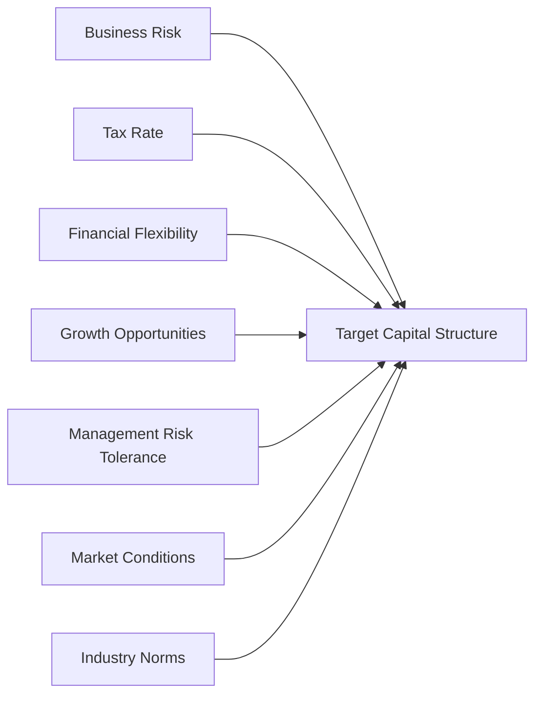

## Introduction

So, if there’s one topic that often keeps CFOs awake at night, it’s deciding how much debt versus equity should go into funding their firm’s activities. I remember chatting with a CFO who jokingly said, “Every Sunday night, I do the debt-versus-equity tango in my mind.” Trust me, you’re not alone if this balancing act sometimes feels like a dance—it is an art as well as a science.

A firm’s target capital structure typically strikes a balance between the benefits and risks of debt and equity. This mix (often expressed as a ratio of debt to equity or debt to total capital) aims to minimize the overall cost of capital. Firms rarely pick an exact number that never changes; they typically work within a range that accounts for industry norms, market dynamics, and management’s comfort level with financial risk. 

In this section, we explore how companies determine—and then maintain—their target capital structure over time, referencing many of the key ideas introduced in earlier sections, such as the cost of debt (see 6.5 Cost of Equity, Cost of Debt, and Preferred Stock) and how market conditions can influence debt or equity decisions (touching on 6.2 Capital Structure Theories). We’ll also talk about best practices and common pitfalls, all culminating in practical insights that guide real-world financial decisions.

## Definition of Target Capital Structure

Let’s start with the basics: a target capital structure is the desired proportion of debt, equity, and possibly hybrid instruments (like convertible bonds or preferred shares) that a firm aims to maintain in the long run. This “optimal” mix stems from the intent to minimize the weighted-average cost of capital (WACC) and enhance the overall value of the company.

A classic expression of WACC in KaTeX looks like this:


\text{WACC} = \left(\frac{E}{V}\right) R_e \;+\; \left(\frac{D}{V}\right) R_d \times (1 - t)


where:
• E is the market value of equity.  
• D is the market value of debt.  
• V = E + D is the total market value of the firm’s financing.  
• Rₑ is the cost of equity.  
• R_d is the cost of debt.  
• t is the marginal corporate tax rate.  

In theory, the firm studies different financial scenarios to find the capital mix that produces the optimal WACC. That outcome translates into a target ratio—say, 40% debt and 60% equity, or something similar. Naturally, if the firm’s strategic environment changes (for example, if interest rates shift dramatically), the “optimal” ratio might shift as well.

## Factors Influencing Target Capital Structure

If only it were as simple as plugging numbers into a formula. In reality, a firm’s choice is influenced by a complex web of business and personal judgments. Below are some of the essential considerations.

### Business Risk

Companies with stable, predictable earnings can typically shoulder more debt. Why? Because recurring cash flows make it easier to cover interest payments. Suppose you’re in a utility firm that provides essential services under regulated rate structures. You might be able to use more debt since your revenues are fairly predictable. On the flip side, if you’re in a high-stakes tech startup with wildly fluctuating cash flows, piling on debt can be risky. You might default on interest payments if a new product flops or a competitor emerges sooner than expected.

### Tax Rate

Let’s face it: taxes matter. One of the big reasons for using debt is the corporate tax shield—interest expense is tax-deductible in many jurisdictions, lowering effective taxes. The higher the tax rate, the more valuable that deduction. For example, if your tax rate is 30%, and you pay $1 of interest, it effectively costs you only $0.70 after tax. Over time, those savings can really add up. This encourages higher leverage in firms facing bigger tax bills.

### Financial Flexibility

Sometimes, firms keep “dry powder” in the sense that they avoid maxing out their debt capacity. They do this so that if a prime opportunity or emergency arises, they can tap debt markets quickly on reasonable terms. This is called preserving financial flexibility. You don’t want to ruin your credit reputation by being overleveraged. If you’re already stuffed with debt, lenders might balk at giving you more when you need it the most.

### Growth Opportunities

Well, earlier in my career, I saw a biotech firm pass on attractive debt financing because they needed to remain flexible for future expansions. High-growth enterprises often avoid heavy fixed-interest obligations. They also fear that too much leverage could hamper their ability to borrow more or force them into risky short-term decisions if revenues dip.

### Risk Tolerance of Management and Owners

It’s not only about the numbers—human psychology plays a part. Conservative management teams will shy away from large amounts of debt even if the quantitative models say it’s “optimal.” Management and primary shareholders often ensure they’re comfortable with the firm’s risk profile before loading up on leverage.

### Market Conditions

Market timing is real—whether we like it or not. If equity valuations are high, management might prefer to issue stock to get cheaper capital. If interest rates are exceptionally low, they might lock in long-term debt. Although in perfect capital markets (see 6.2 Capital Structure Theories) the idea of “market timing” may not hold forever, in practice, CFOs do pay attention to short-term windows of opportunity.

### Industry Norms and Peer Comparisons

We humans are social creatures, and so are firms (well, the humans running them). Management will often benchmark their leverage ratio against peers. This is partly for reputational reasons and partly because being too far from the herd might raise eyebrows among analysts and investors. If you’re a metals-and-mining firm, you’re likely to follow the broad debt usage typical in that sector. In contrast, software companies or professional services outfits often operate with lower leverage.

Below is a simple mermaid diagram illustrating how these factors feed into the final target structure:

## Target Ranges vs. Fixed Targets

In practice, firms often specify a range of acceptable leverage—say, a debt-to-total-capital ratio (D/C) between 40% and 50%—rather than a fixed 45%. Why a range? Because the macroeconomic environment isn’t static, business conditions change, and strict adherence to a single target might be expensive or impractical. Also, rating agencies and bond markets understand that short-term fluctuations can push a firm out of its desired zone.

This approach makes sense from an operational standpoint. For instance, if equity prices crash, a company might rely more on debt until its share price recovers. Alternatively, it might decide to issue equity if interest rates spike and debt becomes too costly, provided it stays within the general debt-to-equity range it deems comfortable.

## Adjusting Capital Structure

You might wonder how a firm actively reshapes its financing mix to maintain a target. Here are a few ways:

• Issue or Retire Debt: If a firm is underleveraged, it can raise fresh debt or roll over short-term loans into longer-term debt. If it’s overleveraged, it can repay debt or use retained earnings to gradually bring the ratio down.  
• Repurchase Shares: If the debt ratio is below the lower bound of the target range, a share buyback financed by debt can nudge the firm’s leverage higher.  
• Issue New Equity: If the firm’s debt load is too high, or if equity valuations seem favorable, the firm can issue fresh shares to shift the ratio toward equity.  
• Spin-offs or Asset Sales: If financial constraints become urgent, sometimes a company sells non-core assets or entire business segments to reduce debt.  

It’s never just about crunching numbers—management must factor in transaction costs, investor perceptions, bond covenant restrictions, and regulatory issues. (If you recall from 6.6 Debt Covenants and Covenant Analysis, certain covenants might limit how much you can shift debt around.)

## Practical Example

Let’s imagine a mid-sized manufacturing company named Oakridge Gadgets, Inc. Oakridge does about $500 million in annual revenues, with stable cash flows from a diverse customer base. On top of that, the company’s CFO is fairly conservative. After analyzing different scenarios, Oakridge decides on a long-term target of 40% debt, 60% equity. Currently, it stands at 35% debt, 65% equity. Management notices that interest rates are at historic lows, and they have a strategic acquisition in mind. To fund that acquisition—and move closer to its target—Oakridge might issue a new corporate bond. This bond allows them to lock in cheap rates and finance growth, while staying within their comfortable 35–45% debt range.

## Common Pitfalls and Best Practices

• Overreacting to Short-Term Market Fluctuations: Constantly shuffling financing can be costly in terms of issuance fees and might send confusing signals to investors.  
• Ignoring Industry Realities: Each sector has its own risk profile. Deviating from industry norms can raise skepticism.  
• Underestimating Off-Balance-Sheet Liabilities: Lease obligations and other hidden liabilities can increase a firm’s effective leverage.  
• Neglecting Covenant Terms: Debt arrangements often come with restrictions. Violating covenants can be expensive—or worse, lead to technical default.  
• Failing to Revisit the Target: As the company or macro environment changes, the original target might become outdated. Reassess regularly.  

## Glossary

• Debt Capacity: The maximum debt a firm can comfortably service under normal conditions.  
• Peer-Group Analysis: Comparing your capital structure to that of industry competitors.  
• Financial Flexibility: Maintaining the ability to raise funds quickly at reasonable costs, if unexpected needs arise.  
• Cash Flow Volatility: The ups and downs in operating cash flows across different periods.  
• Free Cash Flow: Cash flow from operations minus capital expenditures, available for debt service, dividends, or other uses.  
• Industry Leverage Norms: The usual or average levels of debt usage found in a firm’s sector.  
• Target Ratio: A specific capital structure goal set by a firm.

## References and Further Reading

• Brealey, R.A., Myers, S.C., and Allen, F. “Principles of Corporate Finance.” McGraw-Hill.  
• Baker, M., and Wurgler, J., “Market Timing and Capital Structure.” Journal of Finance (2002).  
• Corporate finance guides from the [Harvard Business Review](https://hbr.org/) (search “capital structure”).

## Final Thoughts

Deciding on a target capital structure is never a one-time event. It’s an ongoing process that involves monitoring market conditions, revisiting risk tolerance, and constantly balancing short-term opportunities against long-term stability—like that CFO who joked about her “debt vs. equity tango.” Yes, it may feel like dancing in a shifting spotlight, but with well-grounded principles, a firm can handle the inevitable dips and turns gracefully.

Good luck on your exam and in your journey to deeper corporate finance mastery!

## Test Your Knowledge on Target Capital Structure



### Which of the following best describes a firm's target capital structure?

- [ ] A daily assessment of the exact cost of equity and cost of debt.  
- [x] The desired long-term mix of debt and equity that minimizes the overall cost of capital.  
- [ ] The minimum amount of equity required to comply with regulatory standards.  
- [ ] The short-term approach to raising funds whenever needed.  

> **Explanation:** A target capital structure is usually a long-term goal for the firm's financing mix, balancing costs and risks to minimize WACC.

### A firm with highly volatile cash flows is more likely to:

- [ ] Choose more debt financing to benefit from the tax shield.  
- [x] Choose less debt financing to reduce the risk of default.  
- [ ] Base its financing solely on peer comparisons.  
- [ ] Focus entirely on convertible bonds.  

> **Explanation:** Firms with unpredictable earnings tend to avoid excessive debt, since volatile cash flows can significantly increase default risk.

### Why might a firm maintain a target leverage range rather than a single precise ratio?

- [ ] Precision is always unattainable in finance.  
- [ ] Bond covenants prohibit targeting a single ratio.  
- [x] Market conditions and business operations fluctuate, making strict adherence expensive or impractical.  
- [ ] Rating agencies don’t allow fixed ratios.  

> **Explanation:** Many factors, including changing interest rates, equity prices, and business risks, make a narrow, fixed target difficult to hold consistently.

### Which scenario best illustrates financial flexibility?

- [x] A firm keeps leverage low so it can raise debt quickly for unforeseen projects.  
- [ ] A firm invests only in short-term projects to avoid long-term debt.  
- [ ] A firm prefers convertible bonds to straight bonds.  
- [ ] A firm focuses on maximizing tax savings.  

> **Explanation:** By maintaining capacity to borrow, a firm remains flexible if sudden strategic needs or market opportunities arise.

### All else being equal, a higher corporate tax rate tends to:

- [x] Encourage greater use of debt because the interest expense tax shield is more valuable.  
- [ ] Reduce the likelihood of paying dividends.  
- [x] Enhance the benefits of equity financing.  
- [ ] Discourage share buybacks.  

> **Explanation:** Higher tax rates increase the tax shield from deducting interest, making debt cheaper after tax and often leading to more leverage.

### What is one potential pitfall of ignoring off-balance-sheet liabilities?

- [x] Underestimating the true financial risk and leverage of the firm.  
- [ ] Overestimating the amount of interest expense reported.  
- [ ] Violating IFRS standards.  
- [ ] Boosting short-term equity prices artificially.  

> **Explanation:** Off-balance-sheet liabilities like operating leases can significantly affect the firm’s leverage but might not be fully reflected in official debt figures.

### In deciding how much debt versus equity to use, managers are likely to consider:

- [x] Current interest-rate environment.  
- [ ] Only past stock prices.  
- [x] Industry norms and tax implications.  
- [ ] None of the above.  

> **Explanation:** Managers often weigh many factors—like interest rates, tax shields, and what their peers are doing—when choosing a financing mix.

### Which of the following is a valid method to rebalance capital structure?

- [ ] Ignoring all debt covenants.  
- [x] Issuing new equity if the firm's debt load is too high.  
- [ ] Buying back shares when the firm wants to reduce equity.  
- [ ] Reducing taxes through more depreciation expense.  

> **Explanation:** If debt levels become excessive, issuing more equity is a straightforward way to lower the debt ratio.

### Peer-group analysis in capital structure decisions entails:

- [ ] Blindly duplicating a competitor’s exact debt-to-equity ratio.  
- [x] Benchmarking leverage ratios against industry competitors to gauge norms.  
- [ ] Setting the exact same dividend policy as peers.  
- [ ] Ignoring the firm’s internal cash flow volatility.  

> **Explanation:** Comparing your firm’s finances to industry peers helps ensure your capital structure is aligned with sector expectations.

### True or False: Target capital structure decisions are static and rarely revised.

- [x] True  
- [ ] False  

> **Explanation:** Although the concept of having a target structure suggests a long-term view, in practice firms do revisit and adapt their targets or ranges over time due to changing business needs and market conditions.


