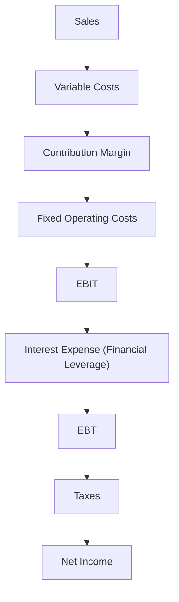

## Introduction and Conceptual Overview

Leverage can sometimes feel like a double-edged sword: on one hand, it can boost returns far beyond what a company could achieve with equity alone; on the other hand, it can magnify losses and even threaten corporate survival during tough times. I once chatted with a CFO who, in a moment of candor, admitted he felt “excited yet terrified” whenever the firm borrowed to expand operations. Excited because the potential upside was huge—terrified because the same loan could sink the business if sales didn’t go as planned.

Leverage simply means employing fixed-cost financing or fixed operating costs to amplify results. From a Corporate Issuer standpoint, understanding leverage helps shape decisions about how to fund projects, manage operational costs, and ensure that financial obligations remain properly balanced against potential returns. This section dives into the nuances of leverage—both operating and financial—and explains how they affect a firm’s risk and value.

## Leverage Defined

When we say “leverage,” we’re typically talking about:  
• Using borrowed funds (debt) or other fixed-cost financing like preferred shares.  
• Amplifying returns on invested equity capital.  
• Heightening the firm’s exposure to financial risk, since debt repayment is mandatory, regardless of performance.  

Firms that use debt in their capital structure are considered “levered,” whereas those financed solely by equity are “unlevered.” If you look back at prior sections in this book—particularly the introduction to capital structure (6.1 Weighted-Average Cost of Capital)—you’ll see how the cost of debt and equity fit together to form a firm’s WACC. Leverage influences that cost structure, so the more you rely on debt, the riskier the firm might become from a creditor’s perspective. As a result, the cost of both debt and equity can shift in ways that affect overall valuation.

## Operating Leverage vs. Financial Leverage

It’s super important to keep in mind that leverage isn’t just about piling on loans. There are two main types:

Operating Leverage  
• Relates to fixed operating costs—like rent, salaries of permanent staff, depreciation of equipment, and other overhead expenses.  
• A high degree of operating leverage means small changes in sales can produce proportionally larger swings in operating income (EBIT).  
• This can be a blessing in a booming economy (lots of revenue spread over fixed costs yields outsized profits) or a major pain in a downturn (those same fixed costs weigh on earnings when sales drop).  

Financial Leverage  
• Involves the use of fixed financing costs—primarily interest payments on debt.  
• Increases the sensitivity of the firm’s net income (and thus EPS) to changes in EBIT.  
• When EBIT increases, net income rises more quickly if there are interest payments fixed at a certain level. The reverse is also true: any decline in EBIT can make net income (and EPS) tumble faster.  

To visualize how operating and financial leverage stack up, check out the following diagram. It shows the flow of revenues through fixed and variable costs to net income.

From a strategic standpoint, watch out for industries with large, up-front fixed costs in manufacturing or technology research. Combining that high operating leverage with debt-laden financing is sometimes akin to balancing on a tightrope. The payoff could be huge, but the crash could be, well, pretty painful.

## Measuring Financial Leverage

The Degree of Financial Leverage (DFL) is a standard metric for seeing how changes in operating income (EBIT) translate into changes in net income or earnings per share (EPS). If you’ve read about the concept of elasticity in economics—“how responsive something is to changes in another factor”—this is the financial version.

Mathematically, one representation is:


\text{DFL} = \frac{\% \Delta \text{EPS}}{\% \Delta \text{EBIT}}


Alternatively, for a quick snapshot at a particular level of EBIT, you might see:


\text{DFL at base EBIT} = \frac{\text{EBIT}}{\text{EBIT} - \text{Interest Expense}}


Why is this second formula interesting? Because if EBIT is only slightly above interest expense, any changes in EBIT can cause major swings in EPS. The formula also shows that as interest goes up or EBIT goes down, the gap narrows—meaning the DFL can explode.

Picture a scenario: Suppose you run a small manufacturing firm with stable sales (so you’re comfortable with your operating leverage). You decide to take on new debt to fund an expansion. If your EBIT is, say, $1,000,000 and your annual interest expense is $250,000, your DFL at that point is $1,000,000 / ($1,000,000 – $250,000) = 1 / (1 – 0.25) = 1.33. That means, roughly, if your EBIT goes up by 10%, your EPS might rise by about 13.3%. But if you’ve borrowed so much that your interest expense become $400,000, then DFL jumps to $1,000,000 / ($1,000,000 – $400,000) = 1 / (1 – 0.4) = 1.67. Now a small change in EBIT yields a bigger shift in EPS.

The trick is that having a high DFL might look super impressive when things go well—but a few unexpected bumps can rock your profitability. If EBIT should drop from $1,000,000 to, say, $800,000, your net income drops more precipitously because that $400,000 interest is still due.

## Risks of High Leverage

Default Risk and Distress  
I once had a friend who launched a startup with a big chunk of borrowed capital. She was confident her product would go viral—until it didn’t. Soon enough, creditors were knocking. High leverage can mean you must make interest or principal payments regardless of whether your sales are rising or falling.

Financial Flexibility  
High leverage reduces your ability to borrow more. If your debt ratios are already high, raising additional funds may come with prohibitive interest rates or covenants. In uncertain business environments, that can be crippling—especially if you need extra capital for a new product launch or an emergency pivot.

Cash Flow Pressure  
Interest and principal payments can drain cash flow. Whether revenues are booming or tanking, fixed charges need to be paid on time. This can lead to tough decisions: do you cut R&D to pay interest? Do you lay off staff to avoid default? Under severe stress, some firms will pivot to asset sales or dramatic cost-cutting, potentially eroding their competitive advantage.

Market Perception and Credit Rating  
In Chapter 4 (Working Capital and Liquidity), we covered short-term funding strategies. The market’s perception of your creditworthiness can shift drastically if you’re considered “over-levered.” Credit rating agencies scrutinize coverage ratios—like EBIT/Interest—to assess how easily you can service your debt. The lower your coverage ratio, the more likely you’ll face a credit downgrade, which raises borrowing costs, further exacerbating your financial woes.

## Benefits of Leverage

Despite these risks, leverage remains a mainstay in corporate finance for compelling reasons:  

Higher Returns on Equity  
If a firm invests borrowed funds in projects that earn returns above the cost of debt, the equity holders enjoy amplified returns. Think about it: if the interest rate is 5% and you’re earning 8%, that 3% spread benefits shareholders.

Tax Deductibility of Interest  
In many jurisdictions, interest payments are tax deductible. By lowering taxable income, debt can reduce a firm’s total tax bill—effectively lowering the cost of borrowing relative to equity financing.

Discipline on Management  
A moderate level of debt sometimes imposes discipline in capital allocation. When managers must set aside cash for interest payments, they’re less tempted to sink money into projects with dubious returns (a phenomenon known as “agency costs of free cash flow”).

Signal to Markets  
Some argue that issuing debt signals optimism. You might be basically telling the market: “We believe in our earnings power enough to take on fixed obligations.” That presumes rational market participants who interpret the move as a sign managers are confident in stable cash flows.

## Practical Examples and Case Insights

Imagine a publicly traded firm, TechNova Inc., deciding between two capital structures:  

• 100% Equity (Unlevered): Issue new shares worth $2 million to finance a project.  
• 50% Equity / 50% Debt (Levered): Issue $1 million in new shares and $1 million in debt at 6% annual interest.  

Let’s assume the project is expected to earn 10% on the total $2 million investment in a stable market. Under the unlevered scenario, TechNova’s net returns (before taxes) on the project are $2 million × 10% = $200,000. All that accrues to equity holders, ignoring taxes for simplicity.

Under the levered scenario, the project yields the same $200,000 in operating income, but the company pays $60,000 in interest ($1 million × 6%). That leaves $140,000 for equity. Here’s the difference: equity holders contributed only $1 million, whereas in the unlevered scenario they invested $2 million. So the return on equity is $140,000 ÷ $1 million = 14%. That’s a bigger return than the 10% unlevered scenario. Of course, if the project yields only 4% next year, interest still costs 6%, so net equity returns become negative. That’s the risk side.

## Coverage Ratios and Other Financial Indicators

When you’re analyzing how leverage influences risk, keep an eye on coverage ratios. The most common one is:


\text{Interest Coverage Ratio} = \frac{\text{EBIT}}{\text{Interest Expense}}


A ratio of 3 means: EBIT is three times interest expense, offering some cushion. If the ratio is 1.2, that’s a red flag: the firm’s operating earnings barely cover interest expense, leaving minimal margin for error. Other variations (like debt service coverage) fold in principal repayments, providing a more holistic view of long-term solvency.

Coverage ratios also factor into credit risk modeling, which is relevant for both bond investors (covered in more detail in fixed-income sections of the CFA curriculum) and stock analysts assessing default risk. In extreme cases, if coverage ratios plummet, the probability of violating debt covenants or defaulting on payments skyrockets.

## Integrating Leverage into the Capital Structure Decision

Determining the “right” amount of leverage is challenging and context-specific. Firms consider their industry’s volatility, the predictability of cash flows, tax environments, and the trade-off between the costs and benefits of debt. As discussed in 6.2 (Capital Structure Theories), the Modigliani–Miller propositions suggest that in perfect markets, capital structure doesn’t matter for firm value—but real world frictions like taxes and distress costs influence how much debt is actually optimal.

Some established best practices to keep in mind:

• Maintain Enough Flexibility: Plan for contingencies—like potential downturns or sudden new investment opportunities—that may require additional funding.  
• Avoid Over-Reliance on Debt: If the operating environment is highly volatile or cyclical, a super-leveraged balance sheet can become problematic fast.  
• Monitor Covenants: Manage existing obligations carefully and keep an eye on metrics that might trigger default or higher interest rates.  
• Consider Global Tax Regimes: Sometimes, cross-border operations can help optimize the tax benefits of interest deductibility—but also add complexity.  

## Exam Application: Putting Knowledge into Practice

On the CFA exam—especially at advanced levels—you’ll be dealing with scenario-based questions. For instance, a prompt might describe “Company A” with certain capital structure metrics, coverage ratios, and operating volatility. They’ll then ask how an increase in interest expense could affect EPS, or how a change in forecasted EBIT might impact coverage ratios. The best approach is to:  

1. Calculate the relevant coverage and leverage ratios.  
2. Carefully interpret changes in EBIT and the resulting effect on EPS (showing your knowledge of DFL).  
3. Identify potential costs (financial distress, covenant breach) that accompany high leverage.  

Sometimes, you’ll see integrated questions bridging topics from earlier chapters—like combining working capital concerns (Chapter 4) with leverage decisions. Maybe a question about “Should the company factor its receivables at 8% or draw on a line of credit at 5%?” while factoring in the firm’s existing debt coverage metrics. Always link the cost of financing to its effect on the firm’s leverage position.

## Glossary

• EBIT (Earnings Before Interest and Taxes): A measure of the firm’s operating performance before accounting for financing costs.  
• EPS (Earnings Per Share): Net income divided by the number of shares outstanding.  
• DFL (Degree of Financial Leverage): A ratio that shows the sensitivity of EPS to changes in EBIT.  
• Coverage Ratios: E.g., interest coverage (EBIT/Interest), measuring how easily a firm can handle its debt service.  
• Default Risk Premium: The extra yield demanded by lenders as compensation for the possibility of default.  
• Levered Firm: A firm with debt in its capital structure.  
• Unlevered Firm: A firm financed solely by equity.

## References and Further Reading

• K.R. Subramanyam, “Financial Statement Analysis” – Offers deeper insights on leverage ratios and coverage metrics.  
• CFA Institute’s Fixed Income and Corporate Finance materials – Additional coverage on credit analysis and capital structures.  
• [SSRN Library](https://www.ssrn.com/en/) – Scholarly articles examining the influences and outcomes of leverage decisions.  
• CFA Institute Code and Standards – Guidance on ethical financing practices and thorough risk disclosures.

## Exam Tips and Closing Thoughts

• Show Calculations: On essay-style questions, partial credit often hinges on your step-by-step approach. Lay out formulas and articulate your input assumptions.  
• Don’t Forget Margins of Safety: It’s not just about boosting returns; consider downside scenarios where EBIT falls below interest.  
• Integrate Both Business and Financial Risk: Distinguish between high fixed operating costs and high fixed financing costs—they work differently and each amplifies the other.  
• Keep Perspective on Tax Implications: Check if the scenario allows interest deductibility. This can be a make-or-break factor in deciding to gear up with debt.

Leverage, in short, can rev your engine or blow your transmission. The key is to harness its amplifying power responsibly. Keep an eye on your coverage ratios. Stay realistic about your firm’s cash flow volatility. And yes, never forget—markets can be unforgiving if you misjudge your ability to meet those fixed obligations.

---

## Test Your Knowledge: Leverage and Financial Risk



### A company has high operating leverage. How is its EBIT likely to respond to a given change in sales?

- [x] EBIT will change by a greater percentage than the change in sales.
- [ ] EBIT moves in the same percentage as sales.
- [ ] EBIT moves in the opposite direction to changes in sales.
- [ ] Sales changes have no impact on EBIT when operating leverage is high.

> **Explanation:** High operating leverage means a larger proportion of fixed costs relative to variable costs, so EBIT is more sensitive to changes in sales.

### When a firm uses debt financing, which metric directly captures how a change in EBIT transforms into a potentially larger change in EPS?

- [ ] Degree of Operating Leverage (DOL)
- [ ] Degree of Combined Leverage (DCL)
- [x] Degree of Financial Leverage (DFL)
- [ ] Return on Equity (ROE)

> **Explanation:** DFL measures how a given percentage change in EBIT translates into an even larger percentage change in EPS.

### Which of the following best describes a key risk of high financial leverage?

- [ ] Higher interest income will reduce EPS.
- [x] Difficulty meeting interest payments if EBIT decreases significantly.
- [ ] Reduced market share.
- [ ] Improved likelihood of share buybacks.

> **Explanation:** High financial leverage means more interest obligations, so any drop in EBIT could threaten the ability to service debt.

### A firm with an interest coverage ratio of 1.0:

- [x] Generates EBIT exactly enough to cover its interest expense.
- [ ] Faces no chance of default.
- [ ] Must have no more than 50% debt in its capital structure.
- [ ] Has dividends guaranteed by the coverage ratio.

> **Explanation:** An interest coverage ratio of 1.0 means EBIT equals interest expense, leaving no margin for error.

### Which of the following is a benefit of using financial leverage?

- [x] Potentially higher returns on equity if the project’s ROIC exceeds the cost of debt. 
- [ ] Elimination of business risk.
- [x] Tax advantages in many jurisdictions.
- [ ] Guaranteed higher Earnings Before Interest and Taxes (EBIT).

> **Explanation:** Debt can magnify ROE if project returns exceed borrowing costs, and interest is often tax-deductible in many regions.

### Which ratio below directly indicates how easily a firm can cover its interest expense?

- [x] Interest Coverage Ratio (EBIT / Interest Expense)
- [ ] Return on Total Capital
- [ ] Inventory Turnover Ratio
- [ ] Current Ratio

> **Explanation:** Interest coverage measures EBIT relative to interest costs, which is a direct measure of the ability to pay interest.

### A firm doubles its interest expense while EBIT remains unchanged. All else being equal, we can expect:

- [x] A higher Degree of Financial Leverage (DFL).
- [ ] A reduction in operating leverage.
- [x] Greater sensitivity of EPS to changes in EBIT.
- [ ] Lower likelihood of financial distress.

> **Explanation:** Increasing interest expense boosts financial leverage and heightens EPS volatility relative to any change in EBIT.

### Compared to an unlevered firm, a levered firm with identical EBIT:

- [x] Has higher risk due to mandatory interest payments.
- [ ] Should never have any tax advantages.
- [ ] Will face lower costs of capital.
- [ ] Eliminates all business risk.

> **Explanation:** Debt introduces fixed interest costs that increase financial risk, though it may also offer tax advantages. However, it does not automatically guarantee a lower overall cost of capital.

### If a firm’s EBIT is $2 million, and the interest expense is $500,000, how much will EBIT need to increase to achieve an interest coverage ratio of 6x?

- [x] $1.0 million
- [ ] $3.0 million
- [ ] $2.0 million
- [ ] No increase is required

> **Explanation:** For a 6x interest coverage ratio, EBIT must be 6 × $500,000 = $3 million. That’s $1 million above the current $2 million.

### True or False: A high DFL always leads to higher net income.

- [x] True
- [ ] False

> **Explanation:** This is a tricky one. While a high DFL can lead to higher net income when EBIT increases, it can also lead to larger losses if EBIT declines. When EBIT rises above a certain threshold, the effect is magnified positively, so in strict scenarios where EBIT is growing, a higher DFL can yield higher net income. However, keep in mind in real-world contexts, “always” should be applied carefully because if EBIT falls, net income will drop more dramatically.


