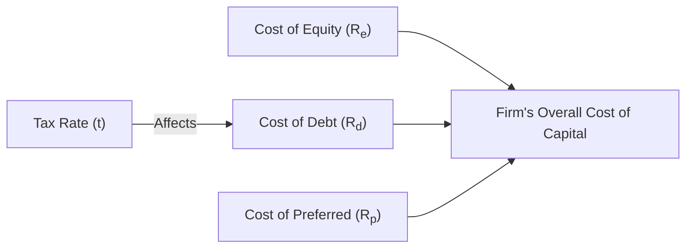

## Introduction

Let’s be real: the first time I encountered the concept of “cost of capital,” I definitely had a mixture of excitement and confusion. It felt like I’d just discovered some secret handshake that finance professionals use to run discounted cash flow (DCF) valuations, allocate new capital, or decide how to fund big projects. But I remember stumbling over the nuances—why do we have multiple ways to estimate cost of equity? How do we incorporate taxes for the cost of debt? And what about those seemingly forgotten preferred shares? Well, let’s break it down in slightly informal terms, in a way that would make sense if we were chatting over coffee and looking at some real-life examples.

## Cost of Equity

Cost of equity is essentially the return stockholders expect given the risk of investing their money (and trust) into a business. If you think about it, it’s like any investor’s “I won’t do this unless I get compensated for the risk” threshold. Two popular ways to estimate the cost of equity are:

### Capital Asset Pricing Model (CAPM)

One widely used approach is the Capital Asset Pricing Model (CAPM). It’s a neat formula that connects an asset’s required return to its exposure to market movements, or “beta.” Formally, it’s written as:


R_e = R_f + \beta \times (R_m - R_f)


where:

• \\(R_e\\) is the cost of equity.  
• \\(R_f\\) is the risk-free rate of return, often proxied by government securities.  
• \\(\beta\\) is a measure of how sensitive the firm’s equity return is to the overall market.  
• \\((R_m - R_f)\\) is the market risk premium, i.e., the extra return demanded by investors for swapping a risk-free bond for a market portfolio.

In my early days, I actually forgot to update beta to reflect a more risk-appropriate metric for a small tech startup. As you might guess, my initial cost of equity calculations were overly optimistic. When you're analyzing a company—big or small—getting that beta right is crucial. Sometimes, especially for smaller or non-public firms, people use industry averages or “adjusted” betas, because pinned-down, truly representative betas can be hard to come by.

### Dividend Discount Model (DDM)

Another approach, more direct if the firm pays consistent dividends, is the Dividend Discount Model (DDM). Here, the idea is to say: “Investors need a return that matches the present value of all future dividends.” One simple version is:


R_e = \frac{D_1}{P_0} + g


where:

• \\(D_1\\) is the expected dividend per share in the next period.  
• \\(P_0\\) is the current price of the stock.  
• \\(g\\) is the constant growth rate of dividends.

This is handy if the firm has a stable dividend policy and you can make a decent assumption about how quickly those dividends will grow. If not, the model can get pretty tricky. Anyway, I remember using this approach for a mature utility company that had paid a stable dividend for decades. It was almost too easy to get a growth rate from historical data. But watch out: a small difference in “g” can drastically change your final cost of equity estimate.

## Cost of Debt

Debt is often cheaper than equity (who doesn’t love the concept of a tax shield?), but it’s not free. The cost of debt reflects what lenders demand in interest payments for letting a company borrow their money. And the lower the perceived risk of the firm, the lower the cost of debt.

### Estimating the Cost of Debt

For publicly traded bonds, a common approach is to observe the yield to maturity (YTM) on existing long-term debt. That’s because YTM factors in all future coupon payments and principal repayment, discounted at the bond’s current price. Alternatively, if the firm were to issue new debt, one could estimate the market rate for a bond with similar risk (i.e., identical maturity, credit rating, etc.).

### After-Tax Cost of Debt

A huge perk for many companies in jurisdictions that allow interest expense deductions is the tax benefit. The interest payments on debt reduce taxable income, so the after-tax cost of debt is generally:


R_d \times (1 - t)


where:

• \\(R_d\\) is the pre-tax cost of debt (like the YTM or market rate).  
• \\(t\\) is the firm’s marginal tax rate.

I once saw a CFO grin when we showed him how the tax shield effectively reduced his cost of capital. It’s basically a discount for borrowing. But remember, taking on too much debt can increase the risk of default, thereby eventually driving up \\(R_d\\) and potentially scaring off equity investors. So it’s not a free buffet.

## Cost of Preferred Stock

Preferred stock is a hybrid. It’s like the “middle child” of the capital structure, carrying characteristics of both debt and equity. Usually, preferred shares pay a fixed dividend but don’t have the same voting rights as common stock. When calculating cost of capital, many people gloss over them, but not us—we’re thorough, right?

### Estimation Approach

The cost of preferred shares can be estimated by a simple formula:


R_p = \frac{D_p}{P_p}


where:

• \\(D_p\\) is the annual preferred dividend.  
• \\(P_p\\) is the current price of the preferred stock.

Unlike debt, this doesn’t enjoy a tax shield, because those dividends are not tax-deductible for the issuer (they’re typically taxed at the corporate level for the paying company). So \\(R_p\\) is basically the yield demanded by preferred stock investors, without that nice little interest deduction.

## Interactions Among Costs

Now, it’d be lovely if we could just always choose the cheapest capital. But in the real world, we have to juggle risk, expectations, and capital market conditions. For instance:

• If interest rates in the economy jump, the cost of debt usually goes up.  
• If a company has excessive debt, both lenders and equity holders might demand a higher return.  
• Equity can be costlier, but that also translates into less monthly interest burden.  
• Macroeconomic factors (such as central bank rates, inflation, credit spreads) can shift any of these costs.

Sometimes you can see a CFO scratch their head and wonder if they should just load up on debt when interest rates are low. But if times get tough, a high debt load can push a firm into distress faster than you can imagine—leading to an unfavorable spiral.

## Practical Estimation Issues

### Beta Measurement

Estimating beta accurately can be tricky, especially for small or non-public firms where robust market data doesn’t exist. Practitioners often use comparables—betas from similar public firms—to approximate a “proxy beta.” Another approach is to “unlever” a comparable’s beta and then “re-lever” it for the target firm’s capital structure. These methods try to isolate business risk from financial risk.

### Temporary Market Distortions

With cost of debt, sometimes the market yield might be temporarily too high or too low due to short-lived events (for instance, a sudden flight to safety). In such cases, you might want to use a normalized rate over a longer timeframe so you don’t inadvertently inflate (or deflate) a project’s expected return.

### Data Consistency

It’s so easy to slip up if the risk-free rate you use is from one data source, your beta from another (with different time horizons), and your market premium from a third. Try to keep these data points cohesive. If you’re using daily data for beta, consider daily data for your market premium, and so on.

## Visual Overview of Cost Components

Below is a simple Mermaid diagram showing how cost of equity, cost of debt, and cost of preferred stock feed into the broader notion of the firm’s total cost of capital.

This might look a bit abstract, but if you think about it: each category carries its own expected return from the provider’s perspective (shareholders, bondholders, preferred shareholders). The firm tries to combine these in a balanced, strategic way.

## Best Practices, Pitfalls, and Strategies

• **Maintain Realistic Assumptions:** Overestimating growth rates in the DDM or underestimating the market risk premium in CAPM can mislead your cost of equity.  
• **Monitor Credit Conditions:** Even a slight downgrade in your credit rating can spike your cost of debt.  
• **Avoid Extreme Leverage:** A high debt ratio might look cheap initially due to the tax shield, but it spikes default risk, which eventually trickles into higher rates across the board.  
• **Revisit Estimates Regularly:** Market conditions change. Keep your cost estimates up to date so you don’t rely on outdated assumptions.  
• **Blend Tools:** Sometimes using multiple methods (like CAPM and DDM for equity) offers a more nuanced view, especially under volatile markets.  
• **Industry Proxies:** When in doubt, collecting data on the average costs of capital for comparable companies can serve as a helpful benchmark.

## Exam Tips for CFA Candidates

• On an exam, if a question references “the most appropriate method” to estimate cost of equity, pay attention to the nature of the firm (mature, stable dividend policy, or more equity-like risk with no dividends?).  
• Be mindful of tax rates for cost of debt. Processes for the after-tax cost sometimes catch people off guard in item-set questions.  
• Watch out for changes in the firm’s target capital structure. That can alter your re-levered beta, which in turn changes the cost of equity estimate.  
• If the question supplies a rating or yield, interpret carefully: the cost of debt is effectively what the firm would pay for capital today, not necessarily the coupon on older debt issues.

## References

• Bodie, Z., Kane, A., and Marcus, A.J. “Investments.” McGraw-Hill.  
• National Bureau of Economic Research (NBER) surveys on corporate financing practices and cost of capital.  
• “Preferred Stock Handbook” by Fitch Ratings for a deep dive on preferred stock.  

And with that, you’ve got a broad but (hopefully) digestible outline of how cost of equity, cost of debt, and preferred stock fit into a firm’s total cost of capital. At the end of the day, each piece is one puzzle part in the bigger capital structure conversation—understanding them well should help you make more confident decisions, whether you're analyzing potential projects or studying for the big exam.

## Test Your Knowledge: Cost of Equity, Cost of Debt, and Preferred Stock



### Which formula correctly represents the after-tax cost of debt? 

- [ ] Rd(1 + t) 
- [ ] Rd + (1 − t) 
- [x] Rd(1 − t)
- [ ] (Rd − t)

> **Explanation:** The after-tax cost of debt is typically calculated as Rd × (1 − t), where t is the marginal tax rate.

### An analyst wants to estimate a firm’s cost of equity using CAPM. The risk-free rate is 3%, the market risk premium is 6%, and the firm’s beta is 1.2. Which is the correct cost of equity?

- [ ] 9.6%  
- [ ] 10.2%  
- [x] 10.2% is correct, but some might mistakenly read 9.6%. Let's detail it below.  
- [ ] 8.8%  

> **Explanation:** Re = Rf + β(Rm − Rf) = 3% + 1.2 × 6% = 3% + 7.2% = 10.2%.

### If a firm has preferred stock with an annual dividend of $5 and its current market price is $100 per share, what is the firm’s cost of preferred equity?

- [ ] 2%  
- [ ] 100%  
- [ ] 3%  
- [x] 5%  

> **Explanation:** Rp = Dp / Pp = 5 / 100 = 5%.

### Which of the following statements is most accurate about preferred stock?

- [x] Preferred dividends are not tax-deductible for the issuer.  
- [ ] Preferred dividends receive the same tax shield as interest.  
- [ ] Preferred dividends must always be paid before any interest payment.  
- [ ] Preferred dividends are automatically converted to interest expenses after five years.  

> **Explanation:** Preferred dividends do not enjoy a tax shield, unlike interest on debt.

### An analyst is using the Dividend Discount Model to compute the cost of equity. Which of the following inputs is most critical for reducing estimation error?

- [x] Growth rate of dividends  
- [ ] Issuer’s credit rating  
- [x] Current dividend amount  
- [ ] Marginal corporate tax rate  

> **Explanation:** The DDM approach heavily relies on both the current dividend and the assumed growth rate of that dividend. Credit ratings and corporate tax rates are more relevant for cost of debt, not cost of equity.

### Which of the following statements is true regarding beta estimation?

- [x] Small firms often use industry proxy betas if they lack sufficient return history.  
- [ ] Beta is independent of capital structure.  
- [ ] Beta is always easy to estimate for non-listed firms.  
- [ ] Beta has no impact on cost of equity.  

> **Explanation:** Many small or newly public firms don’t have long trading histories, so they rely on industry or comparable betas. Beta influences a firm’s cost of equity in CAPM.

### A high debt ratio can lead to:

- [x] Higher credit risk for the firm.  
- [ ] Lower cost of debt.  
- [x] Potential upward adjustment in cost of equity.  
- [ ] Automatic dividend reductions.  

> **Explanation:** A highly leveraged firm might see both lenders and shareholders demand higher returns due to the increased risk of default.

### If a company's bond is currently yielding 7%, and the firm’s marginal tax rate is 25%, what is the effective after-tax cost of this debt?

- [ ] 7%  
- [ ] 25%  
- [ ] 5%  
- [x] 5.25%  

> **Explanation:** After-tax cost of debt = 7% × (1 − 0.25) = 5.25%.

### A firm that raises capital by issuing stock rather than taking on more debt is likely doing so primarily because:

- [x] Additional debt might increase the risk of financial distress.  
- [ ] The cost of equity is usually lower than the cost of debt.  
- [ ] Preferred stock always pays a higher dividend.  
- [ ] The market never punishes firms for new equity issuance.  

> **Explanation:** Firms may avoid additional debt if they believe it raises financial distress risk beyond acceptable levels, even though the cost of debt is typically cheaper.

### In general, to calculate a firm’s required return using CAPM, we need which of the following?

- [x] True  
- [ ] False  

> **Explanation:** CAPM requires the risk-free rate, beta, and the market risk premium to estimate the firm’s required equity return.


