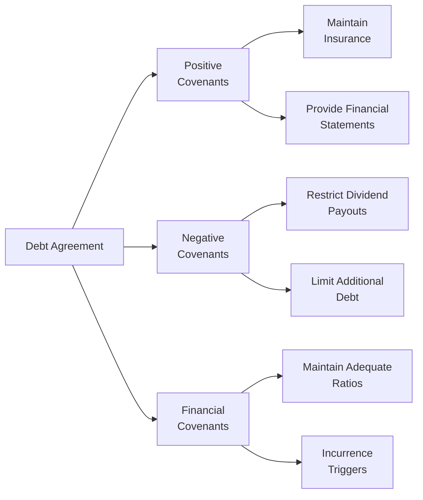

## Introduction

Debt covenants might sound a bit intimidating, right? I remember the first time I heard about them—I was an eager junior analyst wondering, “Why do creditors care about these extra rules if we’re making interest payments on time?” As it turns out, debt covenants are a really big deal in protecting lenders and keeping borrowers on solid financial ground. They pop up in nearly every loan or bond agreement, serving as contractual promises that a borrower makes to ensure they’ll keep their finances in check. In simpler words, covenants are the do’s and don’ts that come with debt.

The following sections lay out what covenants are, why they matter for capital structure, and how companies comply with or sometimes even breach them. We’ll dive into real-world examples, highlight typical pitfalls, and offer guidelines for putting covenant analysis into practice. If you decide to get fancy with advanced capital structure theories (like Modigliani–Miller or the trade-off theory), you’ll find it all circles back to these covenants eventually. They are essential for shaping the balance of debt and equity in a firm.

## Definition of Covenants

A covenant is a clause included in debt agreements that compels a borrower to either do something (positive or affirmative covenant) or refrain from something (negative or restrictive covenant). By establishing certain criteria, lenders protect themselves against excessive risk. Default risk is what lenders are trying to minimize. Even if the principal and interest payments are current, a breach of one of these conditions—commonly called a “technical default”—can have significant consequences.

Covenants:

• Provide lenders with transparency into the borrower’s financial stability.  
• Offer mechanisms that kick in if things start going off track.  
• Set ground rules on how a borrowing firm manages its finances.

Frequent references to these covenants will show up in related capital structure decisions (see also sections on Leverage and Financial Risk). For instance, if your creditors forbid you from taking on more debt, your strategic options are limited—no matter how appealing that next acquisition might look.

## Types of Covenants

Covenants appear in various flavors, each with a different goal and set of constraints. Let’s break them into three main categories: affirmative (positive) covenants, negative (restrictive) covenants, and financial covenants.

### Positive (Affirmative) Covenants

These covenants specify actions or conditions the borrower must maintain. Think of them as a friendly to-do list from your lender. Examples often include:

• Maintaining adequate insurance coverage.  
• Filing financial statements (audited or unaudited) on schedule.  
• Paying applicable taxes and fees on time.  
• Complying with environmental and safety regulations.  

While positive covenants might seem more relaxed, neglecting one can still trigger a default scenario. Imagine you’re required to maintain a certain insurance policy; any lapse in coverage might spook lenders and potentially lead to renegotiation under stressful conditions.

### Negative (Restrictive) Covenants

Negative or restrictive covenants are the prohibitions—things you absolutely should not do without lender consent. They aim to preserve the lender’s security by limiting the borrower’s risk-taking behavior. Classic examples include:

• Restrictions on issuing additional debt or entering new lines of business.  
• Limits on dividend distributions or share repurchases (which shift cash from creditors’ reach to shareholders).  
• Prohibitions on using certain assets as collateral for other obligations.  
• Limits on acquisitions or mergers unless the lender approves.  

At times, negative covenants are more contentious in negotiations, because they can crimp managerial flexibility when managing the firm’s strategic direction. Yet from a lender’s viewpoint, these covenants help keep the debt coverage stable and predictable.

### Financial Covenants

Financial covenants are all about the numbers—quantitative constraints ensuring that certain metrics remain within boundaries. Two broad subtypes exist:

• Maintenance Covenants: Require the borrower to continuously or periodically meet specific thresholds. For example, the borrower might have to keep the Debt/EBITDA ratio below 4.0 at each quarterly reporting date.  
• Incurrence Covenants: Only apply if a borrower takes a particular action. For instance, if the firm wants to issue new debt, it must maintain a certain ratio of EBITDA to interest expense immediately after the new issuance.

Common key ratios include:

• Debt-to-EBITDA (Leverage)  
• Interest Coverage (e.g., EBIT / Interest Expense)  
• Current Ratio or Quick Ratio (liquidity focus)  
• Minimum Net Worth (book value of equity)  

Any violation of these ratios can place a company in technical default, forcing them either to rectify the breach immediately (for example, by paying down debt or injecting equity) or negotiate waivers with lenders.

## Importance to Capital Structure

### Covenant Violations and Technical Defaults

A violation, even one that seems small, can trigger a technical default. “Technical” in this case means the borrower might still be making all scheduled principal and interest payments on time, yet the failure to comply with a covenant is viewed seriously. Lenders have the right to demand immediate repayment, enforce higher interest rates, or restructure the loan on more stringent terms.  

Early in my career, I saw a real-life example of a small manufacturing firm that tripped a covenant simply because an interest coverage ratio fell slightly below 2.0 in one quarter—by only 0.05 points. Even though the shortfall was minuscule, the lenders used it as leverage to renegotiate terms, imposing stricter covenants and an incremental 50 basis point rate increase.

### Stricter Covenants and Restrictions on Growth

While covenants safeguard lenders, they can place a stranglehold on the company’s growth potential or capital restructuring plans. If the debt agreement says “No new senior debt,” that effectively cuts off the usual path of raising funds for expansions, acquisitions, or new product lines. Management must then weigh the trade-offs: raising capital via equity dilution or deferring strategic projects altogether.

### Impact on Cost of Debt

Covenants can also influence the cost of debt. Generally, lenders may offer a lower interest rate if the borrower agrees to accept stronger protective covenants. Conversely, if a firm demands fewer or less-restrictive covenants, lenders may require more yield to offset the higher risk. This interplay is a key piece of the puzzle in capital structure decisions (consider reading Section 6.5 Cost of Equity, Cost of Debt, and Preferred Stock to see how these tie together).

## Monitoring and Compliance

### Internal Monitoring Processes

Most firms set up robust processes to monitor compliance. The treasury division and CFO often lead the charge, tracking metrics like leverage and coverage ratios monthly or quarterly. By preparing pro forma financial statements, they can look ahead to see if a covenant breach is likely. If dangerously close to violating a ratio, management may reduce discretionary spending, slow distributions to shareholders, or even bring fresh equity to avoid default scenarios.

### Consequences of a Breach

Should a breach occur, a borrower’s immediate reaction is typically to seek a waiver from the lenders. However, these waivers can come at a steep price—higher interest rates, additional fees, or more stringent covenants. In worst-case scenarios, if lenders are unwilling to grant a waiver, the borrower might have to repay the loan prematurely, which may require a scramble to find new financing sources. In short, a covenant breach can undermine capital structure flexibility and impose severe liquidity constraints at the worst possible time.

## Common Covenant Provisions

Below is a quick summary table with some typical covenant provisions and their potential implications:

| Covenant Type         | Example Provision                                   | Implication/Objective                                      |
|-----------------------|-----------------------------------------------------|------------------------------------------------------------|
| Affirmative Covenant  | Maintain adequate property insurance               | Preserves asset value, protecting lender’s collateral       |
| Negative Covenant     | Prohibit issuance of additional senior debt         | Protects existing lenders by preventing subordination       |
| Financial Covenant    | Maintain Interest Coverage Ratio ≥ 3.0             | Ensures cash flow can cover interest payments              |
| Incurrence Covenant   | Restricts leverage if new debt is added            | Limits excessive new borrowing post-financing              |
| Dividend Restriction  | No dividends if net income < 0 for two quarters     | Preserves cash, reduces credit risk                        |

## Visualizing Debt Covenants

Below is a simple Mermaid flowchart illustrating how debt covenants fit into the overall debt agreement structure:

## Covenant Analysis in Practice

### Financial Ratio Analysis

Lenders and investors often evaluate the borrowing firm’s current and projected ratio performance to see if the covenants are at risk of being breached. For example, a typical maintenance covenant might require that:


\text{Interest Coverage Ratio} = \frac{\mathrm{EBIT}}{\mathrm{Interest \; Expense}} \geq 2.5


If your forecast for next quarter suggests an interest coverage ratio of only 2.2, you already see a red flag. This might signal a need for immediate corrective measures—like redeeming part of the debt, seeking equity injections, or renegotiating with lenders before the financial statement date arrives.

### Stress Testing

Firms also perform stress testing to see if covenant compliance holds up under adverse conditions. Stress testing involves applying negative shocks, such as drops in revenue, jumps in interest rates, or major operational cost increases, to see how close the ratio might get to (or slip under) the required threshold. This approach is especially relevant in cyclical industries like retail or automotive, where sales can fluctuate significantly. If you are curious about how short-term liquidity and capital structure interplay, check out Chapter 4 (Working Capital and Liquidity) for a deeper dive into liquidity stress testing.

### Qualitative Factors

In advanced covenant analysis, it’s not just the numerical thresholds that matter—qualitative covenants can also influence capital structure decisions. For instance, some agreements include restrictions on major changes to senior management or the board of directors, especially in a leveraged buyout scenario. Lenders want confidence in leadership stability and corporate governance, so that the direction of the firm remains consistent.

## Real-World Case Studies

• Technology Startup with High Growth but Low Cash Flow – Affirmative covenants required the company to provide monthly financial statements and maintain compliance with data security standards. Since the startup was focusing on growth, it needed frequent equity raises to avoid crossing negative covenant bounds.  
• Mature Manufacturer with Stable Cash Flows – This firm faced strict negative covenants restricting dividend payouts once leverage exceeded a 3.0 Debt/EBITDA ratio. In a downturn, the ratio swelled to 3.2, forcing it to cut dividends drastically and maintain compliance.  
• Retail Chain Navigating Seasonality – High seasonal fluctuations threatened the store’s liquidity, risking a breach of its current ratio covenant. Proactive inventory management and the arrangement of a flexible credit facility helped the company meet obligations even in off-peak seasons.

## Glossary of Key Terms

• Technical Default: A default that occurs when a covenant is violated, even if interest and principal payments are current.  
• Maintenance Covenants: Financial ratio thresholds or other conditions that must be met on a periodic, continuous basis (e.g., quarterly).  
• Incurrence Covenants: Activated only if the firm takes a certain action, like issuing new debt or paying dividends.  
• Waiver: A formal agreement by lenders allowing a borrower to bypass a specific covenant breach for a certain period.  
• Credit Risk: The risk that a borrower will be unable to meet its obligations in full.  
• Collateral: Assets pledged by the borrower to secure debt. In many transactions, the presence of high-value collateral can lead to less stringent covenants or lower interest rates.

## Best Practices and Common Pitfalls

• Proactive Communication: If you see a potential covenant violation brewing, open the lines of communication with your lenders early. Surprising lenders at the last minute often results in harsher renegotiation terms.  
• Thorough Documentation: Keep accurate, timely financial disclosures. Sloppy record-keeping can lead to unintentional covenant breaches.  
• Avoid Overly Restrictive Covenants: While it might lower your interest rate, too many restrictions can limit your company’s ability to seize opportunities for growth.  
• Seek Flexibility: Negotiate “cure” provisions or higher allowable thresholds if your business is cyclical or uncertain.  
• Build Buffer Zones: Don’t structure your covenants at the absolute limit of your financial capacity. Maintain some headroom to cope with normal fluctuations.

## Concluding Thoughts

Debt covenants are a fundamental part of the corporate finance landscape, particularly as a firm navigates its capital structure decisions. Understanding the types of covenants, how they protect lenders, and how they can restrict the borrower is essential for financial managers who want to strategically raise capital without tying their own hands.

Staying on top of covenant compliance is also critical—failing to do so can lead to technical defaults and reputational damage, even if actual payment performance remains solid. By prudently negotiating your debt agreements, monitoring your metrics, and planning around these obligations, you can strike the right balance between safeguarding lenders and preserving the flexibility to pursue business opportunities.

## References

• Smith, Clifford, and Jerold Warner. “On Financial Contracting: An Analysis of Bond Covenants.” Journal of Financial Economics.  
• Fabozzi, Frank, ed. The Handbook of Fixed Income Securities.  
• Moody’s and S&P Rating Agency Publications on covenant trends and default risk.  
• See also Ch. 6.2 (Capital Structure Theories) and Ch. 6.4 (Leverage and Financial Risk) in this volume for a broader framework for how debt covenants fit into your overall capital structure.

---

## Test Your Knowledge: Debt Covenants and Covenant Analysis



### Which of the following best describes a debt covenant?

- [ ] A clause that permits the borrower to prepay the loan without penalty
- [x] A contractual clause compelling or restricting certain actions to protect lenders
- [ ] A guarantee that the borrower will never default on any of its payments
- [ ] An automatic conversion feature turning debt into equity when share price is low

> **Explanation:** A debt covenant is a clause in a loan or bond agreement that requires (positive covenant) or prohibits (negative covenant) certain actions, ensuring lenders’ interests are safeguarded.

### An example of a negative (restrictive) covenant is:

- [ ] Requiring the borrower to maintain sufficient insurance
- [ ] Requiring the borrower to submit financial reports quarterly
- [x] Prohibiting the borrower from issuing additional senior debt
- [ ] Requiring the borrower to maintain a certain level of net worth

> **Explanation:** By restricting additional debt issuance, the lender retains the senior status and mitigates risk. The other items listed are examples of affirmative covenants or financial maintenance clauses.

### Which outcome is a likely consequence of breaching a financial covenant?

- [ ] Automatic forgiveness of debt
- [x] Technical default and potential acceleration of debt repayment
- [ ] Immediate issuance of more debt at lower interest
- [ ] Removal of all covenants from the debt agreement

> **Explanation:** Violating a covenant constitutes a technical default. It can result in measures that force the borrower to cure the breach or face acceleration and other penalties.

### What is a maintenance covenant?

- [x] A requirement to satisfy certain financial metrics periodically
- [ ] A provision limiting the issuance of debt items only at inception
- [ ] A one-time requirement triggered by specific borrower actions
- [ ] A form of subordinate financing arrangement

> **Explanation:** Maintenance covenants require borrowers to meet certain thresholds or ratios constantly or at regular intervals (e.g., quarterly), rather than only when a new action is taken.

### Suppose a company agrees to a covenant setting its maximum Debt/EBITDA ratio at 4.0. If the firm’s current Debt/EBITDA is 3.9 and is forecast to rise to 4.1 next quarter, what’s the best approach?

- [ ] Wait until the covenant is actually breached and then negotiate
- [x] Proactively discuss the situation with lenders to arrange a possible waiver or remedy
- [ ] Immediately issue more debt to ease the strained ratio
- [ ] Stop monitoring the ratio because it is only a slight difference

> **Explanation:** If the firm sees an imminent breach, proactively addressing it with lenders can lead to less punitive outcomes (e.g., a waiver, adjusting the capital structure, or renegotiating terms).

### Which of the following might limit a company’s ability to pay dividends?

- [ ] A requirement that the company’s CFO maintain a CPA license
- [ ] A restriction on board membership changes
- [x] A covenant preventing dividend payouts above a certain leverage ratio
- [ ] A rule mandating monthly internal audits

> **Explanation:** Negative covenants related to dividends often tie dividend limits to financial metrics such as leverage. If the company’s ratio is too high, dividends may be restricted.

### Affirmative covenants typically include which of the following actions by the borrower?

- [ ] Submitting annual financial statements to the lenders
- [ ] Restricting issuance of subordinate debt
- [x] Both of the above
- [ ] None of the above

> **Explanation:** Submitting annual (or quarterly) financial statements is indeed an example of an affirmative covenant, as is ensuring compliance with other operational or reporting requirements. Negative covenants are restrictions, while affirmative covenants require positive actions.

### If a lender grants a waiver for a covenant breach, it typically means:

- [ ] The covenant is permanently removed from the agreement
- [ ] The borrower only has to repay half the original loan
- [ ] The interest rate automatically drops
- [x] The lender overlooks or relaxes the breach conditions for a specified period

> **Explanation:** A waiver is a temporary measure that allows the borrower to remain in good standing despite the breach. It often comes with additional fees or adjustments.

### Why might a firm negotiate fewer, less restrictive covenants?

- [ ] To receive an interest rate discount
- [x] To maintain flexibility for growth, future borrowing, and managerial decisions
- [ ] To automatically lengthen the loan maturity date
- [ ] To increase the total principal amount

> **Explanation:** Fewer or less restrictive covenants enable the company to pursue expansions, acquisitions, or operational changes without seeking lender consent. However, this often means a higher interest rate for the added risk.

### A “technical default” can occur even when scheduled payments to lenders are current.

- [x] True
- [ ] False

> **Explanation:** In a technical default, the firm has violated a debt covenant, prompting lenders to demand compensation, renegotiation, or acceleration, even if all principal and interest payments are up to date.


