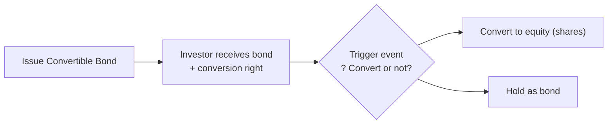

## Introduction
If you’ve ever heard someone say, “Why stick with plain old debt when you can get a dash of equity flavor too?”—they were probably talking about hybrid instruments. Maybe that sounds like a joke, but it’s not too far off, right? In corporate finance, companies sometimes can’t (or don’t want) to rely solely on common stock or plain vanilla debt. Instead, they issue securities that mix the characteristics of both. Let’s explore how and why they do it, with a focus on convertible bonds, warrants, and a few other interesting hybrids like CoCos (contingent convertibles).

## Overview of Hybrid Instruments
Hybrid securities are those that blend features of debt and equity into a single package. They help issuers access capital at reduced cost (compared to ordinary debt), while giving investors an equity kicker. It’s a bit like shaking up a new recipe in the kitchen—perhaps chocolate syrup in your coffee—you end up with something that’s partly sweet like equity returns, but still anchored by the stability of debt.

Key points:
• They often pay regular interest or dividends like debt.  
• They offer conversion or purchase rights for equity exposure.  
• They can include triggers that change the security’s behavior under certain conditions (e.g., contingent convertibles if Tier 1 capital falls below a threshold).  

## Convertible Bonds
Let’s dive right in: convertible bonds are a classic hybrid security. 

### Defining Convertible Bonds
A convertible bond is basically a corporate bond with a built-in option to convert it into shares of common stock. The conversion ratio (sometimes expressed as the conversion price) tells you how many shares or at what price you can convert each bond. 

• If the underlying share price rises significantly, investors may convert and benefit from that upside.  
• If the shares don’t perform so well, investors can simply keep holding the bond and still (hopefully) get interest plus principal repayment at maturity.  

In other words, convertible bondholders have a much stronger safety net compared to shareholders, yet they still have a shot at equity upside. That’s pretty cool, right?

### Interest Rates and the Bond Floor
Because of this conversion perk, investors are usually willing to accept lower coupon rates. From the issuer’s perspective, this can be an attractive way to reduce immediate financing costs. However, the convertible bond’s “bond floor” (the value if it traded purely as debt without the conversion feature) often sets a baseline.  

In a simple formula, you might see the bond floor as:


\text{Bond Floor} = \sum_{t=1}^{T} \frac{\text{Coupon}}{(1 + r)^t} + \frac{\text{Par Value}}{(1 + r)^T}


Here, r is something like the yield required for a straight bond of comparable risk. The conversion feature adds an extra piece of value, effectively giving the investor a bond floor plus an embedded call option on the stock.

### Conversion Ratio and Other Key Metrics
Two important convertible bond metrics are the conversion ratio and conversion price.  
• Conversion Ratio: The number of common shares each bond can convert into.  
• Conversion Price: Price per share at which the bond is convertible, typically set above the current market of the stock.  

It’s good to keep an eye on conversion premium too, which measures how far above the straight equity value the convertible bond might be trading.

### Potential Dilution and Capital Structure Impact
Convertible bonds can cause dilution to existing shareholders if the bondholders convert to equity. Before issuing such bonds, companies must evaluate how that possible conversion will affect key metrics such as earnings per share (EPS) and ownership structure.  

## Warrants
So, what if you just want to buy shares directly from the company at a future date, at a fixed price, but you want a long time to decide—like several years? That’s what warrants are for.

### Defining Warrants and Their Function
A warrant is basically a long-term call option that allows you to buy shares from the issuing company itself at a set exercise price. Sometimes the price is fixed from the start; sometimes it can adjust based on corporate actions (like stock splits or dividends).

### “Sweeteners” and Lower Coupon Rates
Companies often attach warrants to bonds or preferred stock as “sweeteners.” Here’s how it might look in practice:  
• A company issues a bond at a relatively low coupon rate.  
• The bond comes with warrants attached, allowing investors to buy shares at a certain price.  
• Investors see the upside potential from the warrants and are willing to accept the lower coupon.  

It’s a win-win, in theory. The company lowers financing costs, and investors might lock in a chance to profit from stock price appreciation.

### Dilution Implications
But, just like with convertible bonds, if holders exercise their warrants, more shares are issued. That means existing shareholders will face dilution. From an exam standpoint, anticipate analyzing how warrants factor into fully diluted EPS calculations.

## Preferred Stock with Convertibility Features
Sometimes you see preferred stock that can be converted to common stock. These convertible preferreds pay a dividend first (ahead of common stock), but also give you the option to jump into the common equity side if the stock price rises. 

• It’s a middle ground for investors: you get a steady dividend along with that equity upside potential.  
• If the stock price stalls, you can simply remain at the preferred level and hopefully keep collecting that dividend.  

You might have noticed a pattern: convertibles—whether they’re bonds or preferreds—give you a bond- or preferred-based floor plus the possibility of equity gains.

## Other Hybrids: Contingent Convertibles (CoCos)
Now let’s talk about CoCos (Contingent Convertibles). The name might sound kinda cute, but they serve a serious purpose—particularly for banks. 

### How CoCos Work
CoCos automatically convert into equity under specific conditions, usually if a bank’s capital ratio dips below a prescribed level. For instance:  
• A bank might issue a CoCo that automatically converts to common equity if its Tier 1 capital ratio falls below 7%.  
• This instant conversion provides an immediate capital boost for the bank at times of financial distress.  

Of course, the flip side is that CoCo holders could suddenly find themselves holding equity in a struggling bank instead of a bond. There’s risk!

### Benefits and Risks
• For issuers: Helps shore up capital. Regulators like it because it can prevent a total meltdown in a crisis.  
• For investors: Higher coupons than standard debt, but with that conversion risk.  

## Influence on Capital Structure
Hybrid instruments can have a meaningful impact on a company’s capital structure. Let’s break it down:

• Lower Current Financing Costs: Because of the embedded equity option, the issuer can often pay lower interest or dividend rates compared to straight debt or non-convertible preferreds.  
• Potential Future Dilution: When (or if) conversions or warrant exercises happen, existing shareholders’ percentage ownership will go down. This is sometimes offset by the capital infusion from higher stock prices.  
• Aligning Incentives: Convertible features align bondholder and shareholder interests a bit, because bondholders gain from share price appreciation. However, the shift from debt to equity can also alter leverage ratios.  

Ultimately, a firm has to decide if it’s worth trading off cheaper financing today for more shares outstanding down the road.  

## Diagram of a Convertible Bond’s Lifecycle
Below is a simple Mermaid diagram to help visualize how a convertible bond might evolve from issuance to potential conversion:

In the above illustration, once triggered or once the conversion window opens, the investors decide if it makes sense to convert. If the stock has soared, they convert. If not, they might stay in the bond.

## Practical Example
Imagine Company XYZ issues a 5-year convertible bond with the following characteristics:

• $1,000 par value  
• 2.5% annual coupon (much lower than the 5.0% coupon it would pay on straight debt)  
• Conversion ratio: 25 shares per bond (implies a conversion price: $40 per share)  

If the market price of XYZ’s shares stays well below $40, bondholders may hold off on converting. But let’s say the share price jumps to $50 by the end of year 3. The bondholders are like, “Hey, we can convert each bond into 25 shares, that’s a $1,250 value for something we bought at $1,000!” So they convert. Poof—now they’re shareholders, and the company’s total shares outstanding just went up.  

## Best Practices, Common Pitfalls, and Strategies
• Timing the Issuance: Firms should issue hybrid instruments when markets are receptive and the share price is in a position that conversion is feasible for investors yet beneficial for the firm.  
• Managing Dilution: Companies must communicate clearly the potential effect of conversions on existing shareholders. Confusion about future dilution can spook the market.  
• Handling Accounting Complexities: Under IFRS or US GAAP, separate components often must be recognized for the liability and equity elements. Make sure to keep up with evolving standards.  
• Considering Regulatory Constraints: For financial institutions, CoCos may satisfy regulatory capital requirements, but they come with complex triggers and potential investor concerns.  

## References and Further Reading
• “Convertible Securities: A Complete Guide to Investment and Corporate Financing Strategies” by Tracy V. Maitland.  
• Research articles from the Journal of Corporate Finance for in-depth analysis on convertible debt and ownership implications.  
• “Handbook of Hybrid Securities” by Jan De Spiegeleer and Wim Schoutens for advanced treatment of CoCos, convertible bonds, and more.

## Exam Tips
1. Understand the distinction between convertible bonds, warrants, and convertible preferreds.  
2. Pay attention to how the conversion ratio and bond floor tie into valuation.  
3. Practice calculating potential dilution for both convertible bonds and warrants.  
4. Know the scenario in which contingent convertibles (CoCos) might convert automatically.  
5. On the exam, you might be asked to evaluate the capital structure impact of a new convertible bond issue or show how the EPS changes under full conversion.  

## Test Your Knowledge: Convertible Securities, Warrants, & Hybrid Instruments



### Which of the following best describes a convertible bond?
- [ ] A bond with no equity features.  
- [x] A bond that can be converted into common equity at the option of the holder.  
- [ ] A bond offering fixed exchange for preferred shares.  
- [ ] A zero-coupon bond that pays only at maturity.  

> **Explanation:** A convertible bond is a debt instrument that allows the holder to convert it into a predetermined number of common shares.

### Why might investors accept lower coupon rates on convertible bonds?
- [x] Because they receive the added benefit of converting the bond to equity.  
- [ ] Because convertible bonds are risk-free.  
- [ ] Because convertible bonds have no call or put features.  
- [ ] Because convertible bonds don’t pay regular interest.  

> **Explanation:** The embedded option to convert into common stock provides upside potential, making investors willing to accept a lower coupon.

### A firm attaches warrants to bonds primarily:
- [ ] To increase the immediate yield for bondholders.  
- [x] To act as a “sweetener” that reduces the borrowing cost.  
- [ ] To eliminate equity dilution.  
- [ ] Because regulators require it.  

> **Explanation:** Warrants give investors a chance to profit from future equity appreciation, thus enabling the firm to issue the bonds at a lower coupon rate.

### Which statement about dilution from convertible bonds is true?
- [ ] Convertible bonds never cause dilution.  
- [x] When the bond is converted, new shares are issued, reducing existing shareholders’ ownership percentage.  
- [ ] Conversion triggers a mandatory share buyback at the same time.  
- [ ] Dilution occurs only at bond issuance.  

> **Explanation:** Upon conversion, new shares enter the market. This lowers existing shareholders’ relative claim on the firm’s equity.

### In preferred stock with a convertibility feature:
- [x] Investors receive fixed dividends plus an option to switch to common shares.  
- [ ] Investors lose dividend rights when switching to common shares.  
- [ ] There is always a mandatory conversion after one year.  
- [ ] The dividend rate floats with market conditions.  

> **Explanation:** Convertible preferred shares function as a hybrid: first-protected dividends with the upside of switching to equity.

### Which of the following best describes contingent convertibles (CoCos)?
- [ ] Preferred shares that must be redeemed at maturity.  
- [ ] Common shares that contain an embedded bond.  
- [ ] Ordinary bonds that never convert.  
- [x] Securities converting to equity automatically upon a defined trigger.  

> **Explanation:** CoCos require no holder action; instead, conversion occurs automatically if a firm’s capital or financial metrics hit certain triggers.

### Why might banks favor issuing CoCos?
- [x] They can boost capital ratios automatically and buffer against financial stress.  
- [ ] They are risk-free investments.  
- [ ] They guarantee zero likelihood of equity dilution.  
- [ ] Regulators ban the issuance of CoCos.  

> **Explanation:** CoCos provide a quick way to recapitalize a bank during a crisis, pleasing regulators who want to ensure solvency.

### In IFRS or US GAAP reporting, a convertible bond:
- [ ] Is typically accounted for solely as equity.  
- [ ] Is reported as intangible capital.  
- [x] May need separate accounting for its debt and equity components.  
- [ ] Must be converted to equity on the balance sheet immediately.  

> **Explanation:** Accounting rules often require splitting the convertible bond into its debt part (liability) and the embedded derivative (equity).

### Which of the following is a potential advantage for the issuing firm of using convertible bonds instead of straight debt?
- [x] Reduced interest expense upfront.  
- [ ] Elimination of dilution risk.  
- [ ] Guaranteed share price appreciation.  
- [ ] Immediate conversion to equity upon issuance.  

> **Explanation:** The issuer can secure financing at a lower coupon because of the conversion feature.

### True or False: Warrants always have a shorter maturity than typical stock options.
- [ ] True  
- [x] False  

> **Explanation:** Warrants can be long term—sometimes several years—while exchange-listed stock options more commonly have shorter maturities (e.g., up to two years).


