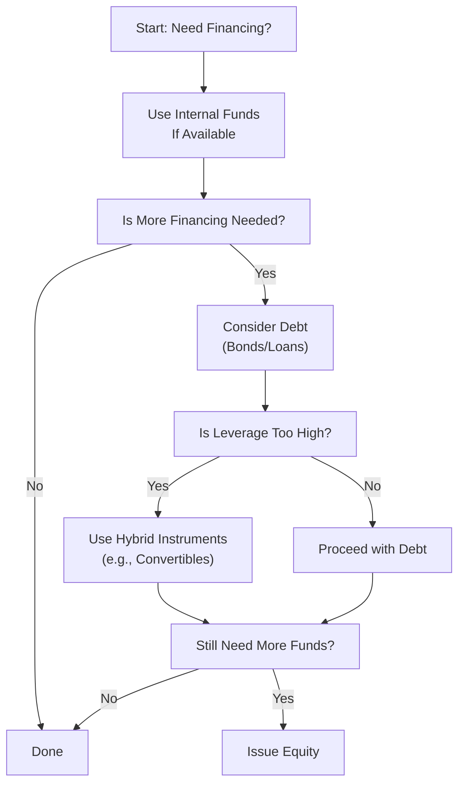

## Overview

Have you ever had one of those moments, maybe while running your own side business, where you pause and think, “Hmm, how should I actually finance this growth spurt?” You know, where you’re kind of stuck wondering whether to pour in your own savings or request a loan or even consider bringing in new investors? Well, in the context of big companies with thousands of employees and complex capital structures, the same question emerges on a grander scale: “What kind of financing do we tap next?” That’s precisely where Pecking Order Theory comes in.

Pecking Order Theory paints a picture of how corporate managers prioritize funding sources. Instead of simply matching a predetermined target debt-to-equity ratio (as traditional static trade-off theories might suggest), firms often prefer using the cheapest and least disruptive capital first. And only when that source runs dry do they move on to the next. This preference ordering significantly influences how companies issue securities—be it debt, hybrid instruments like convertible bonds, or fresh equity.

In this section of our exploration of capital structure, we’ll dive into how Pecking Order Theory informs security issuance decisions, the reasons behind these financing preferences, and the practical implications that aspiring finance professionals (like you and me) should grasp for real-world corporate decision-making. We’ll also discuss some best practices, potential pitfalls, and how these ideas appear under different regulatory regimes (IFRS vs. US GAAP). By the end, you’ll better understand why a well-performing company might still lean heavily on debt financing—and how the mere announcement of new equity can create waves in the market.

## Key Principles of Pecking Order Theory

### Background and Hierarchy

At the core of Pecking Order Theory is the idea that there’s a hierarchy of preferred financing sources. If a firm has enough internal cash or retained earnings, that’s almost always the go-to choice. After all, there’s usually no issuance cost to use your own money. Plus, you’re not sharing inside info with potential investors or paying interest to the bank.

But when there isn’t enough internal funding, managers tend to consider new debt issuing next—especially if their company’s leverage ratio still looks safe. Debt financing is typically less invasive from a governance perspective, and it doesn’t dilute the ownership of existing shareholders. If debt capacity runs out or becomes too expensive, managers may turn to hybrids like convertible bonds. Finally—and somewhat reluctantly—external equity is often the last resort, because it can be the most expensive and can send a tricky signal to the market.

### Information Asymmetry and Signaling

Why all this fuss over funding preference? A big reason is that managers usually have more info than outside investors about a company’s true prospects. (We call that “information asymmetry.”) If a firm issues equity, markets might wonder if something’s off: “Wait, do managers think the stock is overvalued?” If so, that could drive the share price down. So managers jump through hoops to avoid the negative market reaction associated with equity issuance—preferring debt for as long as it’s prudent.

This phenomenon is sometimes called the “signaling effect.” It’s essentially about the signal management unintentionally sends to the public by choosing one form of financing over another. By picking internal cash or debt first, managers hope to keep that negative-signal lamp turned off.

### Example of the Hierarchy in Practice

A quick hypothetical (albeit simplified) example: Let’s say Company ABC has a major opportunity to invest in a new industrial 3D-printing technology. The total cost of the project is $10 million. ABC’s CFO first checks the company’s retained earnings and sees $5 million available—great, they start with those. Now they still need $5 million more. Because the CFO would rather avoid equity issuance—due to potential stock price pressure—she issues a 5-year bond for $5 million. By proceeding in this manner, the CFO effectively stuck to the intuitive hierarchy of Pecking Order Theory.

## Why the Market Reacts

### Equity Issuance as a Potential Red Flag

Whenever a firm issues new equity—particularly a Seasoned Equity Offering (SEO)—the market can react with suspicion, thinking, “If management is willing to dilute existing shareholders, maybe the stock price is riding too high.” Analysts then attempt to figure out if the company’s fundamentals truly justify a higher capital injection or if the managers are merely trying to capitalize on an overvalued situation.

### Debt as a Commitment Mechanism

By contrast, debt signals management’s confidence in the firm’s future cash flows. After all, if you’re borrowing money, you’re on the hook for interest payments. Failing to meet those obligations can trigger all sorts of complications (e.g., covenant violations). Using debt can be interpreted by the market as a show of faith that the firm’s project pipeline or new ventures will generate enough cash flow to comfortably handle interest and principal repayment.

### The Role of Convertible Debt and Hybrids

Some firms are extra cautious about adopting even more pure debt if they’re already pushing their leverage to a precarious point. That’s where convertible debt or other hybrid instruments can come in, providing a “semi-debt, semi-equity” solution. This practice can still hint, though, that management is uncertain about near-future valuations; if the valuation soars, the convertible holders may convert to equity. However, at least in the short term, convertible issuance is often seen as less dilutive than direct equity.

## Real-World Illustrations and Anecdotes

When I was interning at a mid-sized manufacturing company—this was years ago, so definitely pre-social media mania—I remember that the CFO was quite hesitant to issue fresh equity. They had decent profits, but not enough to fund a big overseas expansion project. The CFO told me, “If we go to the equity market, I fear we’ll spook everyone. They might think we’re short on cash or that something’s lurking behind the scenes.” Ultimately, they decided on a mixture of internal funds and a rather conservative debt deal with a local bank. And that, in a nutshell, is Pecking Order Theory at work in a typical day-to-day environment.

On a bigger stage, look at large tech companies that generate stable free cash flows. These firms sometimes appear “under-leveraged” because they keep hoarding cash and rarely issue equity or debt. Their choice to rarely tap external funding (even though they could get low financing rates) is quite consistent with the theory’s preference to spend internal resources first—and remain free from new obligations or shareholder dilution if not absolutely necessary.

## Practical Implications and Best Practices

### Role of Corporate Governance

While Pecking Order Theory revolves around funding preferences, you shouldn’t forget that robust corporate governance can shape which resources are tapped first. Effective boards keep a watchful eye on how much debt is piling up. Sometimes, management is so concerned about avoiding a share price drop that they allow leverage to become uncomfortably high. A strong board can step in and say, “That’s enough—issuing debt beyond a certain threshold might jeopardize our credit rating and raise our cost of capital.”

### Balancing Trade-Offs with Financial Distress Costs

Another major consideration is the risk of financial distress. Even if managers strongly dislike issuing equity, they must also factor in the risk that too much debt can sink a firm in a downturn. The idea that there’s an “optimal capital structure” balancing tax shields from debt with the risk of bankruptcy is covered by other theories (like the Trade-Off Theory). In practice, managers must weigh these competing perspectives.

### Timing and Market Conditions

Market windows can also influence issuance decisions. If equity valuations are extremely high, a firm might break the usual preference for debt and decide to seize the moment with an SEO. On the flip side, if interest rates are historically low, that might strengthen the desire to issue debt. Even so, the intuitive order from Pecking Order Theory tends to prevail unless a strategic or market-based reason justifies breaking rank.

### IFRS vs. US GAAP Treatment

Under both IFRS and US GAAP, an issuance of equity or debt triggers certain disclosures. Firms must account for the transaction costs, changes in common equity, and possibly provide supplementary notes that detail the rationale behind the funding choice. While the fundamental financial statement treatment doesn’t single-handedly drive a firm’s preference, the nuanced differences in how issuance costs are expensed or capitalized can factor into decision-making. For instance, some companies might prefer certain debt issuance structures if the accounting treatment under IFRS or US GAAP is more favorable (e.g., certain bond issuance costs can be amortized over the life of the instrument, thus spreading out the expense).

## Limitations and Critiques

### Lack of a Target Debt Ratio

One of the biggest critiques is that Pecking Order Theory doesn’t inherently define an “optimal” capital structure. It just says that when management needs money, they’ll look at internal funds first, debt second, equity last. It doesn’t necessarily stop a firm from ending up with a bizarre or overly risky capital mix if they rely too heavily on one type of financing.

### Strategic Deviations

Managers might choose to raise equity even if internal funds are available—imagine a scenario where the stock is trading at historically high multiples, and management believes it’s advantageous to lock in that value for financing. This decision defies the classic hierarchy, but it’s arguably rational. Also, certain industries (like biotech) or extremely high-growth, capital-intensive startups rely heavily on equity because they lack stable cash flows to service debt.

### Possible Overemphasis on Signaling

Critics also point out that the signaling effects might be overdone. Yes, equity issuances can spook markets, but frequent communication with analysts and a proven track record of transparent disclosures can soften the blow whenever the firm raises new equity.

## Diagram: The Pecking Order Hierarchy

Below is a simplified mermaid diagram illustrating the core concept of Pecking Order Theory:



## A Quick Numeric Illustration

Let’s suppose a firm has the following internal funds and project cost:

• Retained earnings (available for reinvestment): $2 million  
• Project investment required: $5 million  

Applying Pecking Order:

1. Use the $2 million from retained earnings first.  
2. Remaining funding gap is $3 million.  
3. If the firm’s leverage ratio is still moderate, they issue $3 million in debt (say through a bond at a coupon rate deemed acceptable).  
4. Equity is used only if the firm is maxed out on debt capacity or cannot service additional debt.  

The direct effect on the firm’s cost of capital can be gauged by recalculating WACC after the new issuance. If the Weighted Average Cost of Capital rises substantially because of the bond’s interest rate or risk profile, the firm might re-evaluate whether or not an equity issuance (despite the negative signal) could be cheaper overall. But under the strict pecking order logic, they’d only jump to equity if debt was somehow too risky or unavailable.

## Practical Python Snippet

Below is a tiny illustration of how you might simulate different cost scenarios if a firm issues debt versus equity. Of course, in the real world, you’d refine these assumptions and incorporate complexities like tax shields and credit spreads:

```python
import numpy as np

cost_of_equity = 0.10  # 10%
cost_of_debt = 0.06    # 6%
tax_rate = 0.25        # 25%
weights_of_debt = [0.0, 0.2, 0.4, 0.6]  # hypothetical capital structures

def wacc(cost_eq, cost_debt, w_debt, t_rate):
    w_eq = 1 - w_debt
    after_tax_debt = cost_debt * (1 - t_rate)
    return w_eq * cost_eq + w_debt * after_tax_debt

for w_d in weights_of_debt:
    calc_wacc = wacc(cost_of_equity, cost_of_debt, w_d, tax_rate)
    print(f"Debt Weight: {w_d:.0%}, WACC: {calc_wacc:.2%}")
```

When run, this code would print out different WACC figures for each assumed debt weight. In a real corporate treasury or investment banking setting, you’d expand upon such a model to compare scenarios when, say, the firm raises a certain portion as equity or uses convertible debt instead. The pecking order perspective would typically push you to test a debt-first scenario unless you breach some internal limit or approach dangerously high financial leverage.

## Exam Application

On the CFA® Level I exam, the Pecking Order Theory typically appears as a conceptual question, often contrasting with other capital structure theories (e.g., Modigliani–Miller, Trade-Off Theory). You might see a question describing a scenario in which a CFO deliberately finances a project through internal funds, or it might hint at management’s reluctance to tap equity markets. Recognizing the drivers (i.e., information asymmetry and signaling) is key when answering these questions.

In item-set or mini-case questions, watch for clues such as “management is concerned about diluting ownership” or “the firm’s CEO believes the stock is undervalued.” That might suggest they prefer debt. If you see a statement like “the firm expects significant negative market reaction to equity issuance,” that’s another strong pointer toward the pecking order rationale.

## Conclusion

Pecking Order Theory underscores how real-world managers often reach for their wallets (internal funds) first and only bring new shareholders on board if they have no other choice—or if market conditions are just too irresistible for an equity offering. While simple in concept, this approach has far-reaching implications for how investors interpret corporate financing decisions. It also helps explain why you’ll find so many profitable companies that still carry debt and refuse to issue new shares—even if their equity valuations seem healthy.

At the end of the day, this is all about balancing risk, cost, and the subtle signals you send to the market. So, next time you see a headline about a new equity offering, you might pause and think: is management out of internal and debt funding capacity, or do they see the current share price as a golden ticket?

## References

• Myers, S.C. “The Capital Structure Puzzle.” Journal of Finance (1984).  
• Damodaran, A. Investment Valuation (Wiley).  
• Various articles in the Journal of Financial Economics on capital issuance, signaling, and capital structure empirics.  

---------------------------------

## Test Your Knowledge: Pecking Order Theory & Security Issuance Decisions



### Which statement best describes the main premise of Pecking Order Theory?

- [x] Firms prefer using internal funds first, debt second, and equity last.
- [ ] Firms develop a static optimal capital structure before making financing decisions.
- [ ] Firms always issue equity first because it minimizes financial risk.
- [ ] Firms rely on convertible bonds as their primary financing source.

> **Explanation:** Pecking Order Theory emphasizes that companies use internal funds first, then debt, and finally equity to minimize information asymmetry costs and negative signaling.

### According to Pecking Order Theory, issuing equity generally signals:

- [ ] The firm expects a rise in its future stock price.
- [x] Management may believe the current stock price is overvalued.
- [ ] The firm is in its maturation phase and no longer needs debt.
- [ ] The firm’s credit rating automatically improves.

> **Explanation:** New equity issuance under Pecking Order Theory can be interpreted by the market as a negative signal, hinting that management might perceive the current stock as inflated.

### A major reason managers favor retained earnings over other forms of financing is:

- [ ] Retained earnings offer a higher return to bondholders.
- [ ] Retained earnings are always tax-exempt.
- [x] There are no issuance costs or dilution when using internal funds.
- [ ] Retained earnings cannot be reinvested in riskier projects.

> **Explanation:** Using internal funds incurs no flotation costs or dilution of existing shareholders, aligning well with Pecking Order Theory’s preference for minimal market disruption.

### What is a common critique of Pecking Order Theory?

- [x] It does not explain how a firm determines its optimal debt-to-equity ratio.
- [ ] It always leads to an increase in a company’s share price.
- [ ] It is only relevant for government-owned entities.
- [ ] It assumes companies always use convertible securities as a start.

> **Explanation:** One key limitation is that Pecking Order Theory doesn’t explicitly define a target or optimal capital structure—it only explains the sequence of financing choices.

### Under IFRS and US GAAP, which of the following often influences a firm’s financing choice?

- [x] The accounting treatment of issuance costs and disclosures.
- [ ] Explicit pro forma statements are prohibited.
- [ ] Equity issuances are illegal if debt capacity is still available.
- [ ] Firms have no flexibility in classifying hybrid securities.

> **Explanation:** While gravitationally the same in many respects, IFRS and US GAAP differ in how issuance costs are presented (capitalized vs. expensed), which can affect financing decisions.

### Which factor typically pushes managers to use convertible bonds instead of straight debt?

- [ ] Desire to keep the door open for immediate equity issuance.
- [x] Concern about excessive leverage but unwillingness to issue equity outright.
- [ ] Requirement from accountants to avoid consolidated statements.
- [ ] Requirement to maintain a strict capital structure at all times.

> **Explanation:** Convertibles can be viewed as a middle point on the continuum between debt and equity, especially useful when a company is already at higher leverage levels but reluctant to issue common shares.

### In Pecking Order Theory, a firm may deviate from using debt first if:

- [ ] Management wants to threaten a hostile takeover.
- [ ] Information asymmetry is extremely high and the firm has no profitable projects.
- [x] The company’s equity price is extremely high, providing a window for a favorable SEO.
- [ ] There is a mandatory requirement to issue equity if the share price is low.

> **Explanation:** Firms sometimes jump directly to equity if market conditions are unusually favorable and they can raise capital on attractive terms, despite the general preference for debt.

### Which of the following is a signal of managerial confidence when issuing debt?

- [x] Confidence in the firm’s cash flows to cover interest and principal payments.
- [ ] Desire to dilute existing shareholders quickly.
- [ ] Assumption that the stock is undervalued.
- [ ] Guarantee that there will be no financial distress.

> **Explanation:** When firms issue debt, they effectively signal faith in steady or growing cash flows to service that debt obligation, reflecting managerial optimism.

### According to Pecking Order Theory, which action is a “last resort” if both internal funding and debt are not feasible?

- [ ] Issuing shorter-term commercial paper.
- [x] Issuing new common equity.
- [ ] Issuing asset-backed securities.
- [ ] Lowering credit lines further.

> **Explanation:** Common equity issuance is generally the final alternative because of potential negative market signaling and dilution effects.

### When a company issues equity instead of debt, Pecking Order Theory would usually interpret this as:

- [x] A sign of limited internal resources and concerns about high leverage.
- [ ] A clear indication that the stock is undervalued.
- [ ] An effort to maintain the current share ownership structure.
- [ ] An automatic improvement in the company’s bond covenants.

> **Explanation:** Turning to equity typically implies that the firm either lacks enough internal funds or is wary of adding more debt given existing leverage, consistent with the standard hierarchy of funding decisions.


