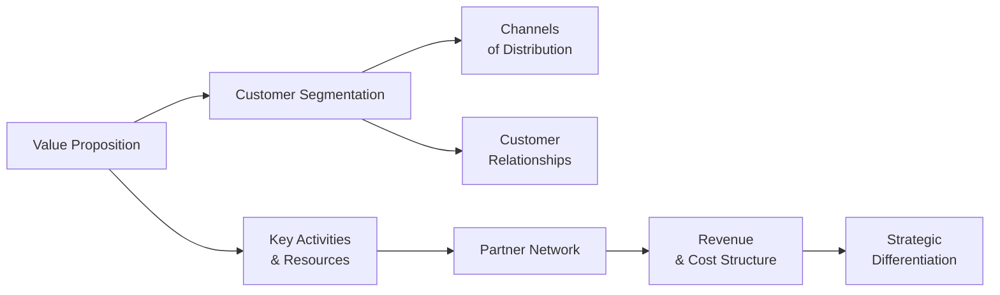

## Introduction

Have you ever paused (maybe over a steaming cup of coffee) and asked yourself: “What really makes a business succeed?” You know, I’ve certainly had nights staring at spreadsheets, asking the same question. The answer often comes down to a well-crafted business model. Think of it as the structural framework that keeps every part of a firm—from strategy to day-to-day operations—connected and focused on creating, delivering, and capturing value. 

In the context of financial analysis and CFA studies, understanding a company’s business model isn’t just theoretical. It’s practical for forecasting cash flows, managing risk, and evaluating long-term viability under IFRS or US GAAP reporting standards. So let’s explore the key elements of a business model—starting from a firm’s value proposition all the way to strategic differentiation. Along the way, we’ll discuss advanced considerations relevant to Level III exam questions, such as how intangible assets or partner networks can shape risk factors and revenue streams.

## Value Proposition

The value proposition is the beating heart of any business model. It addresses the precise need you aim to fulfill for your customers and articulates why they should choose your product or service over alternatives. 

• It can be helpful to think of the value proposition in financial terms: “Which problem are we solving, and how do we monetize the solution?”  
• For instance, if a tech firm promotes robust data analytics software that cuts operational costs by 20% for small businesses, that cost-saving angle is central to its value proposition.  
• The strategic design of a value proposition also involves analyzing intangible benefits such as brand reputation, trust, and ease of use—factors that can influence pricing power and margin stability.

A well-defined value proposition underpins every revenue forecast. It often becomes the anchor when performing scenario analyses for capital budgeting or evaluating intangible assets under IFRS. In advanced portfolio management, understanding how a firm’s primary value proposition stacks up against industry peers can be crucial for top-down security selection decisions.

## Customer Segmentation

Identifying the right customers is about more than just broad demographics—especially at the Level III stage, where you often need to incorporate advanced behavioral elements or revenue synergy across markets. Segmenting customers based on age, income, or geography is a start, but you could also segment by psychographics or purchasing behaviors.

• Companies may target different segments simultaneously, each requiring a unique marketing, pricing, or distribution strategy.  
• The cost structure and risk profile of the business will hinge on whether it pursues mass-market strategies (potentially lower margins but higher volumes) or niche markets (higher margins but specialized marketing costs).

Analyzing segmentation helps portfolio managers forecast the variability of revenue. Certain segments may be more recession-resistant. Also, from a credit analysis standpoint, consistent demand across multiple segments can lower revenue volatility and enhance the firm’s ability to service debt.

## Channels of Distribution and Communication

Channels link a firm’s value proposition to its customers. Think of them as the highways that deliver products or services—and messages—straight to customers. Channels can include:

• Online platforms (e-commerce websites, mobile apps)  
• Physical retail stores or dealership networks  
• Wholesalers or distributors  
• Direct sales teams (especially for B2B offerings)  

A good channel strategy balances reach, cost, and overall brand alignment. For instance, a luxury brand might be selective about which department stores carry its products to preserve a sense of exclusivity. Conversely, a fintech app might rely heavily on online marketing and app marketplaces. 

In advanced financial analysis, channel mix can influence a firm’s margin profile and working capital needs. A direct-to-consumer (DTC) channel might yield higher margins but also require more marketing spend. A distributed model might reduce overhead but also lower margin. Under US GAAP or IFRS, channel specifics can alter how and when revenue is recognized—especially for multi-step distribution processes.

## Customer Relationships

Customer relationships address the nature of interactions between a firm and its audience. They can be highly automated self-service, or they can involve dedicated account managers for high-value clients. This element can shape:

• Lifetime value of each customer account  
• Churn rates and renewal forecasts (particularly relevant in subscription-based models)  
• Customer acquisition cost, which ties deeply into marketing budgets  

For instance, many SaaS (Software-as-a-Service) companies rely on chatbots or peer communities for support, thereby reducing personnel costs. On the other hand, private wealth management firms often support customers with personal advisors, which can raise fixed costs but justify premium pricing. 

A strong understanding of customer relationships is pivotal for advanced ratio analysis—like implementing customer lifetime value (CLV) metrics in equity valuation or factoring retention rates into top-down forecasting.

## Key Activities and Key Resources

Key activities are the operations a business must excel at to deliver its value proposition. These might include product design, manufacturing, marketing campaigns, or technology development. Key resources are the assets—tangible or intangible—that enable a firm to carry out those activities profitably.

• Tangible resources: Real estate, factories, or distribution centers  
• Intangible resources: Patents, unique know-how, brand equity, or data analytics capabilities  

Managing these resources efficiently can lower both cost of capital and operational risk. When you assess a company’s capital budgeting or attempt to forecast free cash flow, it’s critical to understand whether it can sustain its key activities with its existing resources—or whether further capital expenditures or external financing are needed. 

In IFRS or US GAAP contexts, intangible resource valuation can present complexities. For instance, intangible assets like patents may need impairment checks, or R&D expenses might be capitalized or expensed depending on strict criteria. This can meaningfully affect earnings forecasts and accountability under the CFA Institute’s standards.

## Partner Network

Rarely does a business exist in isolation. A strong partner network can bolster the firm’s capacity for innovation, distribution reach, specialized expertise, or even regulatory compliance. Examples include:

• Supplier alliances to secure materials at a stable price  
• Joint ventures to expand into new markets  
• Technology partnerships to integrate complementary solutions  
• Outsourcing relationships that reduce fixed overhead  

Now, from a portfolio manager’s perspective, a robust partner network can reduce operational risk but also introduce unique vulnerabilities. Suppose a company heavily depends on a single supplier that’s halfway around the globe. Currency risk, geopolitical tensions, or logistic bottlenecks can disrupt the entire supply chain, potentially impacting revenue forecasts and credit ratings. 

Spotting these risks often involves reviewing legal disclosures in corporate filings or analyzing notes about key partnerships under IFRS or US GAAP. For instance, if a major revenue stream depends on a single contract, that concentration risk is something you’d factor into a firm’s cost of capital.

## Revenue and Cost Structure Alignment

Ultimately, a business model stands or falls on whether it can generate enough revenue to cover costs and produce sustainable profits.

• Revenue streams can be transaction-based (one-time sales), subscription-based, licensing and royalty fees, asset sales, or usage fees.  
• Cost structures generally involve fixed costs (rent, salaries, equipment depreciation) and variable costs (raw materials, sales commissions).  

Keeping these aligned is essential. For instance, if your cost structure is heavily fixed, you gain cost efficiency from scaling up, but you may also face aggressivedownside risk if revenues dip. On the other hand, a more variable cost structure can mitigate risk but might compress margins. 

A quick formula to watch might be:


\text{Operating Profit} = \sum_i (\text{Price}_i \times \text{Quantity}_i) - \text{Fixed Costs} - \text{Variable Costs}


Exam questions at Level III sometimes require scenario analyses or stress tests of how shifts in demand or pricing could change operating profits. This is especially relevant when evaluating a firm’s capital structure or potential default risk. 

## Strategic Differentiation

Strategic differentiation is what sets a firm apart in the marketplace. Maybe it’s cost leadership (think discount retail chains) or maybe it’s unique brand prestige (think luxury fashion). Differentiation can also come from intangible know-how or specialized distribution networks. 

Maintaining a strong niche can create something akin to an economic moat—an advantage that helps companies retain market share and sustains long-term growth. But moats can be eroded quickly by technological disruption, shifting consumer preferences, or new regulatory frameworks. An advanced CFA candidate might consider whether a firm’s differentiation is robust enough to withstand macroeconomic shocks or competitor pressures.

## Visual Overview

To make these elements clearer, let’s illustrate a high-level flow. Notice how the value proposition connects to all other parts, eventually influencing revenue and costs:

Each element interacts in a dynamic way. For instance, a pivot in your partner network might dramatically reduce variable costs, which changes the cost structure and potentially your overall differentiation strategy.

## Best Practices and Pitfalls

Best Practices:  
• Perform ongoing market research to keep the value proposition aligned with shifting consumer demands.  
• Monitor forecasted cost structures for changes in fixed/variable mix.  
• Regularly assess partner networks for potential concentration or supply chain disruptions.  
• Integrate intangible assets (like brand equity or patents) into valuations with robust, standards-compliant methods.

Pitfalls:  
• Over-diversification in customer segmentation that dilutes brand identity.  
• Ignoring higher churn rates from minimal customer support within your relationships strategy.  
• Failing to protect or update intangible resources that anchor competitive advantage—like an outdated patent portfolio.  
• Underestimating the impact of IFRS or US GAAP guidelines on revenue recognition or intangible asset capitalization, which can distort the perceived performance.

## Real-World Example

Consider a global e-commerce platform that initially launched selling books (ring a bell?). Its core value proposition revolved around vast product variety and competitive pricing. Over time, it expanded to multiple product categories, introduced a subscription service for expedited shipping, built advanced logistics networks, and developed strategic partnerships with third-party merchants. The firm also invested heavily in intangible resources such as proprietary algorithms and an industry-leading brand. Today, the balance between fixed and variable costs has morphed significantly, given the scale of its operations. Yet the core principle remains: capturing more of the retail value chain, demonstrating how meticulously refining the business model can pay dividends—literally and figuratively.

## Exam Relevance

On the CFA Level III exam, analyzing a business model might appear in scenario-based item sets requiring you to:

• Evaluate the sustainability of a firm’s competitive advantage under different market conditions.  
• Assess intangible assets and their potential or actual impairment, tying it back to cost structure and revenue generation.  
• Consider how channel strategies or partner relationships may affect corporate governance, especially if major supply contracts or distribution agreements create conflicts of interest or put the firm at risk.  
• Recommend portfolio allocations based on the underlying business models of potential equity or fixed income securities.  

A strong command of business model dynamics can help you anticipate where a firm’s earnings or cash flow might head, and how that aligns with risk-return objectives in advanced portfolio management.

## References & Additional Reading

• Osterwalder, A., & Pigneur, Y. (2010). “Business Model Generation.” (Wiley).  
• Magretta, J. (2002). “Why Business Models Matter.” Harvard Business Review.  
• Harvard Business School Working Knowledge: https://hbswk.hbs.edu/  

Feel free to check your local library, or digital resources, for these references. They provide a deeper look into frameworks that further distinguish between the strategic and financial impact of every building block.

## Final Exam Tips

• Look for synergy: In a question that spans corporate governance, valuations, and risk, the business model inherently connects them all.  
• Practice scenario analysis: See how changes in cost drivers or distribution partnerships might reshape operating margins.  
• Remember intangible assets: Understand how IFRS or US GAAP treat intangible resources, since many new-age business models rely heavily on brand or technology.  
• Distinguish revenue drivers: Breaking down each revenue stream clarifies how stable or volatile it may be under different market conditions.

---

## Test Your Knowledge: Key Elements of a Business Model



### Which of the following best describes a value proposition?

- [ ] A statement of the overall cost structure of the firm.
- [ ] A list of every customer segmented by geography.
- [x] The unique benefits offered to customers and why they should choose the firm’s product.
- [ ] The set of intangible resources the firm owns.

> **Explanation:** The value proposition conveys why a customer should select the firm’s product or service over another, emphasizing the unique benefits or solutions offered.

### A company that targets small niche markets but charges higher prices per unit is focusing on:

- [x] Differentiation for specific customer segments.
- [ ] Pure cost leadership across all segments.
- [ ] Drastically reducing all marketing costs.
- [ ] Eliminating all fixed costs from its structure.

> **Explanation:** Serving niche markets usually entails a more focused differentiation strategy, potentially yielding higher per-unit margins.

### In a subscription-based service firm, the “customer relationships” element of the business model is most likely to focus on:

- [ ] Minimizing all interactions to reduce costs.
- [x] Strategies to increase retention and reduce churn.
- [ ] Eliminating inbound customer complaints.
- [ ] Standardizing product design only.

> **Explanation:** Subscription-based models prioritize retaining existing clients, which lowers churn and maximizes recurring revenue.

### Which statement is true regarding partner networks?

- [x] They can provide specialized capabilities or resources the firm does not have internally.
- [ ] They must always be avoided because they add cost without benefit.
- [ ] They are only relevant for large multinational corporations.
- [ ] They do not affect the firm’s cost structure or revenue streams.

> **Explanation:** Partner networks often help reduce operational risks, expand distribution, and bolster resources that might otherwise be expensive or impractical to develop in-house.

### When analyzing cost structure, which combination below highlights a key distinction?

- [x] Fixed costs vs. variable costs.
- [ ] Tangible assets vs. intangible assets.
- [x] Direct costs vs. indirect costs.
- [ ] Revenues vs. profits only.

> **Explanation:** An appropriately structured cost model considers both fixed vs. variable and direct vs. indirect costs for comprehensive understanding.

### A firm’s strategic differentiation is best exemplified by:

- [x] Unique brand reputation that allows premium pricing.
- [ ] Selling the exact same commodity products as competitors.
- [ ] Eliminating all intangible assets from the balance sheet.
- [ ] Outsourcing its marketing function to a random vendor.

> **Explanation:** Strategic differentiation arises from a unique and often hard-to-replicate advantage—like strong brands, patented technology, or specialized distributions.

### In advanced financial analysis, segmenting customers by purchasing behaviors may help:

- [x] Forecast variations in revenue streams more accurately.
- [ ] Completely eliminate the need for market research.
- [x] Tailor marketing costs to different segments.
- [ ] Remove the pricing function from strategic planning.

> **Explanation:** Detailed segmentation informs more accurate demand forecasting and targeted marketing efforts, both crucial for robust financial modeling.

### Which of the following statements is correct regarding intangible resources?

- [x] They can include patents, brand equity, and proprietary technology.
- [ ] They never require impairment testing under IFRS.
- [ ] They are easily and uniformly measured across all industries.
- [ ] They exist only in heavily regulated sectors.

> **Explanation:** Intangible resources can comprise patents, processes, proprietary software, brand equity, etc., and often require careful valuation and impairment reviews under IFRS or US GAAP.

### According to many business model frameworks, channels are:

- [x] The routes through which a firm communicates and delivers its value to customers.
- [ ] Solely the part of the partner network used for storage facilities.
- [ ] Always the single most expensive area of the cost structure.
- [ ] Essentially intangible patents for controlling distribution.

> **Explanation:** Channels represent how products or services reach end-users, whether physical or digital, and how communication with those users occurs.

### True or False: A well-crafted business model can rescue a firm from having a fundamentally flawed value proposition.

- [x] True
- [ ] False

> **Explanation:** A strong, coherent business model can refine or repackage a value proposition, potentially revitalizing otherwise limited offerings—though a severely flawed offering might still face uphill challenges.


