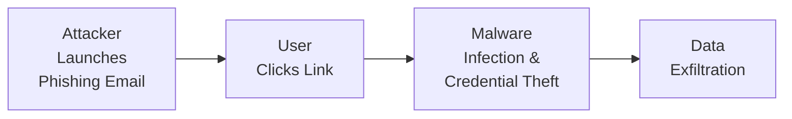

## Understanding the Evolving Cyber Threat Landscape

Let’s be honest: the phrase “cyber threat” used to sound like something straight out of a sci-fi movie. But nowadays, it’s become a daily reality for corporations, big and small. I once chatted with a friend who worked at a mid-sized financial firm. He mentioned how they initially overlooked their vulnerability—until a series of phishing attacks revealed that even a modest-sized business has a target on its back. This isn’t just a technical concern anymore; it’s a strategic business issue that can derail operations, harm reputations, and affect valuations.

For corporate issuers, the cybersecurity threat landscape extends well beyond the occasional virus. We’re talking about organized cybercriminals, state-sponsored hackers, ransomware syndicates demanding millions in cryptocurrency, and even disgruntled insiders. It’s not just the frequency of threats that’s concerning but the sophistication. Phishing attacks routinely mimic internal communications; stealth malware can sit on networks for months before detection; and in some jurisdictions, failing to disclose a breach in a timely manner can lead to fines or get you in legal hot water.

Below is a small flowchart illustrating a simplified attack pathway that many organizations face. Don’t worry, it might look straightforward here, but the actual execution often includes advanced evasion and infiltration techniques that can be tough to detect.

Beyond potential operational disruptions, a breach can also lead to intangible damage—think about losing trust with customers or the embarrassment of headlines proclaiming your data fiasco. And from the perspective of a CFA Level III candidate focusing on corporate issuers, it’s key to link these issues to the broader governance and risk framework. A single cybersecurity incident can impact share price volatility, credit risk, and a firm’s overall cost of capital—topics well within the realm of corporate finance and risk management.

## Data Protection and Encryption as Core Defenses

A major part of effective cybersecurity lies in robust data protection. Encryption is fundamental, ensuring that even if an attacker gains access to raw data, they can’t decipher its contents without the appropriate decryption key. In the same way we carefully handle portfolio data and client information in investment management, corporations must maintain strict protocols around encryption both at rest (stored data) and in transit (data moving across networks).

• Encryption in Transit: This involves securing data that is traveling from a user’s computer to a destination server, often with TLS/SSL certificates. You know that little padlock icon on your browser? That’s an indicator of transport layer encryption in action.  
• Encryption at Rest: Data in databases, backups, or cloud storage should be encrypted so that if attackers break in, they can’t just “read” the data.

It’s also useful to keep in mind that certain jurisdictions mandate strong encryption standards for personal and financial data. For example, the EU’s GDPR (General Data Protection Regulation) encourages pseudonymization and encryption to safeguard individuals’ data. Noncompliance with these requirements can result in substantial fines or even criminal penalties in severe cases.

## Operational Resilience: Ensuring Business Continuity

Operational resilience extends beyond standard risk management; it’s about maintaining critical functions and quickly recovering when disruptions happen. Think of a scenario where a large financial services firm is hit by a ransomware attack early on a Monday morning—trading operations freeze, settlement workflows halt, and call centers get inundated with confused clients. Without a robust resilience strategy, the financial and reputational damage can be truly catastrophic.

Key elements of operational resilience include:  
• Redundant Systems: If your primary data center goes offline, your backup site should ramp up operations seamlessly.  
• Regular Backups: Maintain multiple backup copies, ideally using offline or air-gapped methods, so that even if a malicious actor encrypts or corrupts your active systems, you can recover core data.  
• Swift Recovery Plans: Document and rehearse your incident response, so when the unexpected happens, you aren’t scrambling to figure out who’s doing what.

In the context of corporate valuations, consider how an operational disruption might reduce revenues, trigger contract penalties, or lead to client attrition. From a portfolio management viewpoint, that’s exactly the sort of risk that can shock the fundamentals and therefore the stock price.

## Risk Assessment and Policies

An essential component of cybersecurity is systematic risk assessment. The approach is similar to what advanced candidates do when analyzing a portfolio’s factor exposures or running scenario analyses. You identify the big threats, assess your vulnerabilities, measure the likelihood of occurrence, and then consider the impact on your organization.

• Vulnerability Assessments: These are broad scans and reviews of systems and processes—like checking if your corporate website is running outdated software, or if your employees are using weak passwords.  
• Penetration Testing: Often called “Pen Testing,” it’s essentially authorizing security experts to act as bad guys and try to break into your systems. They’ll highlight precisely where you’re exposed, giving you a chance to fix issues before real attackers exploit them.  
• Policies and Training: Documents that exist on a shelf are worthless if employees aren’t trained. Cyber basics—like not clicking suspicious links or not using the same password across sites—should be a part of ongoing training.

A robust approach to risk assessment should integrate with enterprise risk management. You might see the Board of Directors or a dedicated Risk Committee overseeing a wide range of organizational hazards, including cybersecurity, market risk, and reputational risk. In the lens of the CFA program, this aligns closely with good governance practices: bridging the gap between day-to-day operations and strategic oversight.

## Regulatory Compliance Considerations

Cybersecurity and data protection regulations vary by region, but the broad themes are consistent: protect consumer data, ensure timely breach notifications, and penalize organizations that fail to comply. Notable regulations include:  
• GDPR (Europe): With broad territorial scope, it imposes stringent data handling requirements and can issue fines up to 4% of global annual turnover for serious violations.  
• CCPA (California): Focuses on consumer privacy rights, giving California residents greater control over their personal data. Noncompliance can lead to significant financial penalties.  
• Industry-Specific Guidelines: For instance, FINRA in the US has its rules for broker-dealers, while banks need to satisfy requirements from the FCA in the UK or the Federal Reserve in the US.

Companies that operate across multiple jurisdictions must reconcile these overlapping regulations. I recall chatting with a colleague who joked that checking compliance with global data privacy laws is almost like tackling a never-ending jigsaw puzzle—the moment you place a piece in one region, another new piece in a different region needs to be handled, too.

From a corporate valuation angle, regulatory compliance can be a positive signal to investors and rating agencies, indicating that the company is vigilant about operational and reputational risks. Conversely, ignoring compliance can bring huge fines, potential litigation, and a battered share price.

## Third-Party and Supply Chain Risk

It’s easy to think you can lock down your own systems, but what about third parties—vendors, service providers, or strategic partners—who also have access to sensitive data? Supply chain attacks can be particularly nasty because a breach in one vendor can cascade into multiple client organizations.

Minimum security standards in contractual agreements, regular audits of vendor security controls, and restricted privileges to only essential systems are some of the ways to reduce this risk. For example, in an M&A transaction (a frequent scenario in advanced finance practice), part of the due diligence might involve verifying that the target firm’s cybersecurity posture won’t compromise your own infrastructure.

And from a portfolio perspective, it’s worth factoring in these interdependencies when analyzing a company’s risk exposures. If a critical vendor is compromised, the damage can extend to the entire supply chain—potentially halting production, delaying shipments, or tarnishing the brand.

## Incident Response Planning

Picture this: you’re the CFO of a large manufacturing firm, and suddenly all your order processing systems freeze. A note on the screen demands a ransom in Bitcoin. Do you pay? What’s your insider policy on that? And who do you call first—the CEO, legal counsel, or law enforcement?

Having a well-defined, rehearsed incident response plan (IRP) can drastically reduce confusion and help protect essential business interests faster. Key IRP components:  
• Escalation Paths: Every minute counts, so it’s vital to know exactly whom to inform about a breach and in what order.  
• Forensics and Containment: Identify the nature of the security compromise and isolate affected systems to prevent further spread.  
• Communication Protocols: Internal staff, external stakeholders, regulators, and customers all need timely and accurate information. So yes, folks in Investor Relations, Corporate Communications, and the legal team should already have a plan.  
• Post-Incident Review: Evaluate what went wrong and implement recommended changes to policies, systems, or training.

Incident response is part of the broader enterprise risk management approach. Correctly executed, it can minimize direct financial losses, reduce the potential for shareholder lawsuits, and help maintain your firm’s standing in the marketplace.

## Integrating Cybersecurity into Business Models

Cybersecurity is not only about locking the digital doors; it’s fundamentally connected to how corporate issuers generate value. When formulating or revising a business model, senior management teams must weigh the potential upside from technology adoption—like improved operational efficiency or new customer channels—against the potential downside of increased cyber risk. For instance, a transition to a platform-based model with real-time data analytics might boost revenues but also significantly enlarge the attack surface.

This is especially relevant in a subscription or SaaS model, where the company’s brand and success hinge on the trust that it can consistently protect customers’ data. That’s where intangible assets, such as a good reputation for security, become a competitive advantage. And from a capital structure point of view, a company’s robust cybersecurity posture can positively influence credit ratings or reduce the risk premium demanded by debt and equity holders.

## Common Cybersecurity Pitfalls

• Complacency: Companies assume they’re too small to be targeted or that existing measures are “good enough.”  
• Weak Passwords and Access Control: Despite repeated warnings, some employees inevitably reuse simple passwords across both personal and professional accounts.  
• Lack of Executive Buy-In: If management doesn’t drive a culture of security, even the best policies will remain on paper.  
• Siloed Technologies: Security must be integrated across all departments, not just the IT team.  
• Neglecting Employee Training: The best firewalls won’t stop an employee from casually clicking a malicious link.

## Case Study: Ransomware Impact on Operations

In a hypothetical scenario, imagine a global retailer that suffers a ransomware attack right before the holiday shopping season. The attackers lock down the retailer’s e-commerce platform, demanding a significant amount in cryptocurrency. With no immediate backups, the retailer’s website remains offline, resulting in lost sales of several million dollars per day. On top of that, social media chatter explodes with complaints, further damaging the company’s reputation. Eventually, the retailer decides to pay the ransom (a questionable move), only to discover the decryption key is faulty. The lawsuit from shareholders soon follows, claiming the board failed to ensure an adequate cybersecurity protocol.

Moral of the story? A robust incident plan and validated backups save you big time.

## Glossary

• Ransomware: Malicious software that encrypts a victim’s files until a ransom is paid.  
• Phishing: A fraudulent attempt to obtain sensitive information by impersonating a trustworthy entity.  
• Encryption: The process of encoding information so only authorized parties can decode it.  
• Penetration Testing (Pen Testing): Authorized, simulated cyberattacks to evaluate a system’s security posture.  
• GDPR (General Data Protection Regulation): European legislation governing data protection and privacy across the EU.  
• Operational Resilience: The ability of an organization to detect, prevent, adapt to, and recover from disruptions.

## Exam Relevance and Final Tips

• Integration into Corporate Valuation: Understand how cyber incidents affect cost of equity, cost of debt, and firm valuation—topics frequently tested in essay-form questions.  
• Identifying Governance Red Flags: Weak cyber policies often correlate with overall poor governance and risk oversight—a recurring theme in the CFA curriculum.  
• Scenario Analysis: Expect item-set or constructed response questions where you evaluate a firm’s resilience posture or estimate the financial impact of a breach.  
• Time Management on the Exam: Be prepared to handle multi-part questions linking operational risk, regulatory compliance, and valuation effects.

1. Don’t let anecdotal irrelevance consume your time. Focus on how cybersecurity ties directly to risk management and corporate finance.  
2. Practice frameworks for analyzing enterprise risk. When faced with a scenario, map out the threat, the potential financial repercussions, and the strategic or operational responses.  
3. Pay attention to compliance details. You may encounter prompts involving cross-border regulations or sector-specific guidelines.

## References & Further Reading

• NIST Cybersecurity Framework: https://www.nist.gov/cyberframework  
• ENISA (European Union Agency for Cybersecurity): https://www.enisa.europa.eu/  
• CFA Institute Standards of Practice Handbook  
• ISO/IEC 27001 Information Security Management Standard  

## Test Your Knowledge on Cybersecurity and Technology Risk



### A corporate issuer is conducting a vulnerability assessment. Which of the following methods refers to an authorized simulated cyberattack to evaluate security?

- [ ] Blacklisting
- [x] Penetration Testing
- [ ] Data Masking
- [ ] Virtual Private Network

> **Explanation:** Penetration testing involves ethical hackers attempting to exploit vulnerabilities, thereby providing insights into real-world threats.

### When discussing data protection, encryption "at rest" primarily refers to:

- [ ] Using a secure wireless connection.
- [ ] Implementing distributed denial-of-service protection.
- [x] Storing information in an encrypted format on servers or data storage media.
- [ ] Encrypting only data in transit.

> **Explanation:** Data “at rest” is data stored in databases, file systems, or any digital format. Encrypting it ensures that unauthorized users cannot read it even if they gain access.

### Which of the following best describes one key principle of operational resilience?

- [ ] Ignoring third-party risk if the vendor is reputable.
- [x] Ensuring critical functions can continue during and after a disruptive event.
- [ ] Eliminating all cyber threats through a single firewall solution.
- [ ] Shutting down operations pre-emptively at the first sign of a threat.

> **Explanation:** Operational resilience focuses on continuity of critical operations, regardless of disruptions.

### GDPR primarily affects companies by mandating:

- [ ] Mandatory security token usage for employees.
- [ ] Implementation of on-site servers only.
- [x] Data protection and privacy controls for EU residents.
- [ ] Exclusive use of manual paper records.

> **Explanation:** The GDPR is an EU regulation that governs data protection and privacy for individuals within the European Union.

### Which best characterizes the near-term financial impact of a severe ransomware attack?

- [ ] Strengthening of the firm’s competitive advantage.
- [x] Potential immediate loss of revenue streams and increased response costs.
- [ ] No effect unless the ransom is paid.
- [x] Heightened risk of investor lawsuits if management is seen as negligent.

> **Explanation:** Ransomware often pauses critical revenue-generating operations, may require paying ransom or incurring legal costs, and can trigger lawsuits from disgruntled stakeholders.

### One of the most common pitfalls related to employee cybersecurity awareness is:

- [ ] Overusing multi-factor authentication.
- [x] Clicking on phishing links due to lack of training or caution.
- [ ] Requiring complex, frequently changed passwords.
- [ ] Over-reliance on daily server backups.

> **Explanation:** In many firms, phishing attacks are successful because employees click malicious links, underscoring the importance of training and awareness.

### A board that ignores cybersecurity considerations in its governance framework risks potential:

- [x] Legal liabilities and heightened reputational damage.
- [ ] Immediate improvement in share price performance.
- [x] Noncompliance with enterprise risk management best practices.
- [ ] Enhancements to employee satisfaction and retention.

> **Explanation:** Neglecting cybersecurity can open the door to legal, regulatory, and reputational risks. It also shows a weakness in overall enterprise risk management.

### In an incident response plan, the term “escalation path” refers to:

- [ ] Methods for automatically deleting all affected data.
- [ ] The path hackers take when escalating user privileges.
- [ ] A regulatory requirement for senior management sign-off.
- [x] A predefined chain of communication and decision-making authority.

> **Explanation:** Escalation paths ensure that breaches are communicated quickly and effectively up the chain of command.

### Third-party risk arises when:

- [x] Vendors or service providers access critical systems or data.
- [ ] Employees handle personal email on corporate devices.
- [ ] An organization has end-of-life software products in use.
- [ ] Regulators introduce new compliance standards.

> **Explanation:** Even secure organizations can be compromised if third-party vendors with system access have weak security postures.

### A company chooses to pay a ransom to restore encrypted files, but the decryption key provided by the attackers fails. This scenario exemplifies:

- [x] True
- [ ] False

> **Explanation:** Paying a ransom does not guarantee a reliable decryption key. Attackers may not provide a functional key or may demand additional payments.


