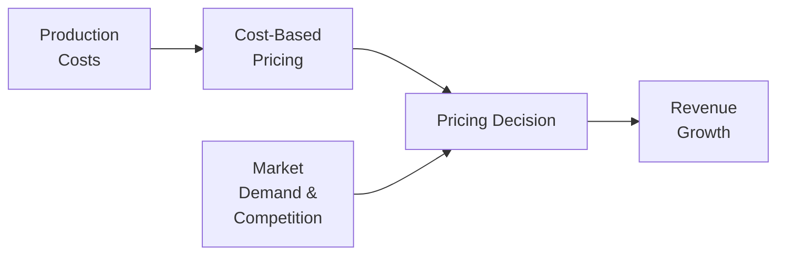

## Understanding Revenue Drivers and Pricing Strategies

Have you ever sat down at a café, glanced at the menu, and asked yourself how on earth they settled on the price for that fancy cappuccino? I used to think about this all the time—especially after helping a small coffee chain figure out their own pricing approach. It was fascinating (and a bit stressful) because so many factors were in play: the cost of beans, customer perception of quality, competitor prices down the street, and, of course, brand positioning. This experience reminded me that pricing is never an isolated decision. It’s a puzzle of strategy, psychology, and (sometimes) a leap of faith.

In corporate finance, revenue generation is the lifeblood of an organization’s sustainability. Making sense of how a company earns money and how it can optimize pricing for profit is essential. Even for those new to finance, wrapping your head around revenue drivers and pricing strategies can unlock real insights into how a firm operates, whether it's a family-run pastry shop or a multinational technology giant with subscriptions galore.

Below, we’ll dive into some of the major aspects of revenue generation—core revenue drivers, critical pricing approaches, and the intangible factors such as perceived value and brand positioning. We’ll also look at examples, a few cautionary tales, and some frameworks you can apply in your own analysis or career.

### Core Revenue Drivers

Revenue drivers are simply the avenues or sources from which the firm earns money. Think of them as the core gears that turn the revenue engine. Identifying the primary drivers is so important because it allows you to see where a company should focus its resources and where it might be at risk.

• Product Sales and Subscriptions  
  Many companies generate revenue by selling products—like smartphones or software—or by running subscription services (music streaming, software-as-a-service, gym memberships). Subscriptions offer recurring revenue, which can smooth out cash flow. On the other hand, direct product sales can be more volatile but can also provide higher per-unit margins if the product meets a strong customer desire.

• Service Income  
  Service-based companies—consulting firms, financial advisers, legal practices, etc.—often earn fees for expertise or time. Many businesses blend product and service revenue. For example, an enterprise software company might sell licenses to its platform (product revenue) and also charge implementation or training fees (service revenue).

• Royalties and Licensing  
  Firms with intellectual property—maybe a patented technology or a popular brand logo—may license that IP for use by others, earning royalties. This can be a sweet deal if you own valuable intangible assets.

• Advertising or Data Monetization  
  In the digital age, some companies rely on advertising sales (online ads, sponsored content) or data monetization (selling anonymized user data for marketing insights). These models can be highly lucrative if managed ethically and scaled effectively, but they also can be subject to rapid changes in consumer privacy norms and regulations.

• Hybrid or Mixed Models  
  Many corporations employ multiple revenue streams. A tech hardware manufacturer might have a steady business selling devices while generating subscription revenue from extended warranties or cloud services. This diversification can reduce risk but also demands more sophisticated pricing decisions and internal cost allocations.

By identifying which revenue streams matter most and how sensitive each is to customer demand or competition, management can prioritize investments and strategies accordingly.

### Pricing Approaches

Choosing the right pricing approach is pivotal for revenue optimization and market positioning. The approach can range from purely cost-based to purely value-based. In reality, most firms use a combination—and often adjust over time.

• Cost-Based Pricing  
  This method sets prices by adding a markup to your unit cost. It seems straightforward, but it can be risky if customers don’t perceive your product’s value to be high enough to justify that price. I once saw a small clothing startup that calculated the cost of fabric and labor, tossed on a 60% markup, and—ta-da—called it a day. Meanwhile, their competitors leveraged brand prestige and got away with an even higher markup. Cost-based pricing may ignore the intangible brand elements that drive perceived value.

  A simple formula using KaTeX might look like:

  $$
  P = \text{Unit Cost} \times (1 + \text{Mark-up Rate})
  $$

  where  
  • \\(P\\) = Price per unit,  
  • \\(\text{Unit Cost}\\) = Production cost per unit,  
  • \\(\text{Mark-up Rate}\\) = Desired profit rate (e.g., 0.30 for 30%).

• Value-Based Pricing  
  With value-based pricing, you start by asking, “How much value does this bring to the customer?” Then you set a price that reflects that perceived value—rather than your total costs. Luxury brands often use a value-based approach, banking on prestige and exclusivity to justify higher margins. Value-based pricing can bring in substantial profit if your brand resonates strongly with the target market. But miscalculations here can be brutal, especially if your idea of the product’s worth doesn’t match the consumer’s willingness to pay.

• Competition-Based Pricing  
  This approach involves pegging your prices (roughly) to those of your direct competitors. If a competitor in the same neighborhood sells cappuccinos at $4, your base might be $3.90 to $4.10. This method can be a quick benchmark, but it may lead to a race-to-the-bottom if competitors keep dropping prices to gain market share. It also doesn’t differentiate your product unless you pair it with strong branding.

• Dynamic Pricing  
  You’ve probably seen airline tickets or hotel rooms change in price depending on the season or even time of day. Dynamic pricing uses real-time data about supply, demand, or even buyer behavior to tweak prices. E-commerce sites might change their prices daily—sometimes hourly—based on an algorithm that weighs inventory, competitor pricing, or current demand trends.

  Here’s a tiny snippet of Python to illustrate a super-simplified dynamic pricing approach:

  ```python
  import random

  current_demand = random.randint(70, 130)  # Artificial demand measure
  base_price = 100.0
  alpha = 0.5  # Sensitivity parameter

  # Increase price if demand is above 100, decrease if below
  new_price = base_price + alpha * (current_demand - 100)

  print(f"Demand: {current_demand}, New price: ${new_price:.2f}")
  ```

  This kind of process might be refined with machine learning models in real-world settings. Of course, dynamic pricing can be risky—some customers might perceive it as unfair or manipulative if they find out the person next to them paid less.

### Market Positioning

Market positioning is about understanding how you want customers to perceive your brand. Are you a high-end retailer with premium products, a discount brand that focuses on affordability, or something in-between? Your choice significantly influences how you price.

High-End or Luxury Positioning often calls for premium pricing, smaller volumes, and an emphasis on brand storytelling—like showcasing product origin or artisanal craftsmanship. If you’re going to charge a lot, you’d better have compelling marketing and a consistently top-notch customer experience.

Mid-Range or Mass-Market Players might price for larger customer volumes and moderate margins. Watch out for margin pressure if you occupy a crowded part of the market—lots of brands are battling for the same consumer.

Budget Players might offer lower prices with thinner margins, seeking revenue through volume. However, brand loyalty can be tough in the budget sector unless you have functional or emotional differentiators.

### Bundling and Upselling

Bundling involves offering two or more complementary products or services for a combined, often reduced, price. Internet service providers, for instance, often bundle TV, streaming, and phone services to present a “better deal” to the consumer and increase their overall revenue. Upselling is about nudging customers toward a more premium version of your product or service. 

In practice, bundling and upselling leverage psychology: customers think they’re getting “more value,” while the firm can spread costs and increase the average ticket size without a proportional jump in cost. Apple, for instance, engages in subtle upselling—once you’re in their ecosystem, you might be tempted to upgrade to a higher-specification device or add AppleCare. While you might roll your eyes at the extra cost, part of you might think: “It’s probably worth it.”

### Promotions and Discounts

Promotions and discounts can help you clear excess inventory, attract new customers, or boost market share quickly—but it’s easy to go overboard. If you’re always on sale, people might think your regular prices are inflated or that your product lacks genuine value. In branding terms, heavy discounting can weaken your perceived prestige, so deploy it thoughtfully.  

Short promotions can spark interest—like a holiday promotion or a “loyalty discount” for repeat customers. From a financial perspective, it’s wise to measure the revenue lift from discounted promotions. How many extra units did you actually sell? Did it offset the margin sacrifice? If you’re not careful, you can create a discount-addicted customer base that only purchases when there’s a sale.

### Channel-Based Pricing

Different channels might include direct online stores, third-party e-commerce marketplaces, physical retail, distributors, or international outlets. Price points may vary by channel for several reasons—differences in overhead costs, shipping, taxes, or brand strategy.

• Online vs. Offline  
  A brand might charge slightly less online because they can operate without the expense of physical storefronts. But they also risk channel conflict if their physical retail partners demand consistent pricing to remain competitive.

• Geographic Differences  
  Companies often adjust prices based on local purchasing power. For example, global software companies might have different subscription rates in emerging markets than in developed markets.

• Negotiated Pricing  
  In B2B settings, volume discounts or custom quotes for large clients are common. This fosters loyalty and can lock in big revenue streams.

### Psychological Pricing

Sometimes it’s the smallest tweaks that matter. You might have seen $9.99 instead of $10.00. That single cent difference can push some folks toward the purchase. It sounds ridiculous, but it’s a real phenomenon known as charm pricing.

Other psychological strategies include:

• Anchor and Contrast  
  By placing a more expensive item near your target product, the target’s price feels like a deal in comparison.

• Bundle Value  
  By listing the individual prices of items in a bundle, you emphasize how expensive it would be to purchase them separately—making the bundle look like a bargain.

• Limited Time or Scarcity  
  Phrasing like “Only 3 left in stock” or “Sale ends tomorrow!” can induce a sense of urgency, prompting immediate purchase.

### Monitoring Competition

Keeping an eye on your competition is essential but do it consistently and methodically. You don’t want to get drawn into a price war that chips away at everyone’s profitability. Also watch out for new market entrants that might disrupt an industry with discount strategies or new service models.

Competitor monitoring also involves understanding their promotional cycles, distribution channels, product variations, and technology developments. In tech-driven industries, a competitor might change their pricing algorithm multiple times a day. If you fail to respond swiftly, you might lose market share or cut into profits.

Below is a small Mermaid diagram visualizing how cost factors, competitor influence, and market demand funnel into pricing decisions:



### Common Pitfalls and Challenges

• Focusing Solely on Costs  
  Overemphasizing cost-based pricing might ignore brand potential or consumer responsiveness to value, leading to suboptimal revenues.

• Price Wars  
  Reacting too aggressively to competitors’ price cuts can set off a spiral of discounts that reduces margins across the board.  

• Discount Addiction  
  Frequent promotions or discounts can lead customers to anticipate sales, hurting full-price sales and brand credibility.  

• Underestimating Emotional Value  
  In many markets—think luxury goods or high-end tech—customer perception is primarily emotional. Setting a price without factoring in that intangible brand appeal can be a serious oversight.

### Applying Concepts to the CFA® Exam

Historically, Level I introduces foundational corporate finance concepts and the relationship between operational decisions and financial performance. Understanding revenue drivers and pricing strategies can help you:

• Analyze a company’s strategy and competitive advantages in equity valuation or financial statement analysis.  
• Evaluate how changes in price or promotional activity affect short-term cash flows, liquidity, or coverage ratios in a corporate issuer context.  
• Connect marketing and operational strategies (like bundling, dynamic pricing) with cost structures, break-even points, or operating leverage.

Exam questions might show you a scenario—e.g., a company implementing a new pricing strategy—and ask you to forecast the impact on margins, valuation multiples, or capital structure. Practicing scenario analysis and identifying the relevant revenue drivers can sharpen your ability to answer these questions concisely and accurately.

### Glossary

• Value-Based Pricing  
  Setting a price based on perceived or assessed customer value rather than the cost of production.

• Dynamic Pricing  
  Continuously adjusting prices in response to real-time market demand, competition, and inventory levels.

• Bundling  
  Combining multiple products or services into a single package at an overall discount.

• Upselling  
  Encouraging customers to purchase a more expensive, higher-margin version of a product or service.

• Promotional Pricing  
  Offering temporary discounts or special deals to stimulate demand or introduce new products.

• Cost-Based Pricing  
  Setting prices by adding a markup to the production (or acquisition) cost.

• Competition-Based Pricing  
  Setting prices primarily according to competitor pricing strategies.

• Channel Management  
  Coordinating prices, promotions, and product offerings across distribution outlets.

### References & Further Reading

• Kotler, P. & Keller, K. L. (2016). “Marketing Management.” Pearson.  
  A comprehensive resource on pricing strategies, market segmentation, and tactical execution.

• Nagle, T. T. & Müller, G. (2017). “The Strategy and Tactics of Pricing.” Routledge.  
  Detailed frameworks for value-based and other advanced pricing models—essential reading for deeper analysis.

• CFA Institute Level I Curriculum (2025).  
  Official readings on corporate finance fundamentals, especially the segment on capital budgeting and corporate governance impact on policy decisions.

### Practical Exam Tips

• Focus on Qualitative and Quantitative Dimensions: Demonstrate how you combine numeric (cost, margin) and strategic (brand, competition) insights.  
• Practice Scenario Forecasting: Outline the impact of different pricing moves—a discount, a premium strategy, or a new subscription fee—and the ripple effects on revenues, costs, liquidity, and even bond covenants.  
• Use Time Wisely: Pricing questions in the CFA® exam could appear in item sets with multiple angles. Distill the key data and apply relevant formulas quickly.  
• Show Your Process: If confronted with a constructed-response question about pricing’s impact on a firm’s net income or strategy, detail the steps—assumptions about elasticity, cost structure, and competitor dynamics.

------

## Test Your Knowledge: Revenue Drivers and Pricing Strategies



### Which of the following best describes a “core revenue driver” for a firm?

- [ ] A metric by which the production team measures efficiency.  
- [x] A primary source of income that significantly impacts the firm’s top-line.  
- [ ] A short-term marketing campaign targeted at one customer segment.  
- [ ] A measure of corporate debt capacity.  

> **Explanation:** Core revenue drivers are the main avenues a company uses to generate income, such as product sales, subscriptions, or services.

### In a cost-based pricing model, prices are established primarily by:

- [ ] Matching competitor prices in the marketplace.  
- [ ] Conducting willingness-to-pay surveys among target customers.  
- [ ] Estimating product demand sensitivity.  
- [x] Adding a markup to the cost of production or acquisition.  

> **Explanation:** Cost-based pricing begins with the production cost, then adds a markup to determine the final price.

### What is a potential disadvantage of adopting a strictly competition-based pricing approach?

- [x] It can externally limit pricing power and result in lower margins if competitors engage in price wars.  
- [ ] It always sets prices above the customer’s willingness to pay.  
- [ ] It guarantees the highest total revenue in the market.  
- [ ] It is illegal in all major jurisdictions.  

> **Explanation:** Competition-based pricing focuses on competitor prices, which can lead to margin compression if companies keep undercutting each other.

### A company offering a high-end product with luxurious brand positioning is most likely to emphasize:

- [ ] Substantial discounts on a frequent basis.  
- [x] Premium pricing and value-based rationale.  
- [ ] Flash sales and low-cost promotions.  
- [ ] Strictly cost-plus calculation with minimal markups.  

> **Explanation:** Luxury brands generally hinge on exclusivity and customer perception, leading to premium or value-based pricing.

### Dynamic pricing is typically characterized by:

- [ ] Never changing prices once set for the fiscal year.  
- [x] Adjusting prices in real time based on data such as demand, competition, and inventory levels.  
- [ ] Relying exclusively on competitor’s historical data to formulate prices.  
- [ ] Using a universal price across all channels regardless of demand fluctuations.  

> **Explanation:** Dynamic pricing involves actively modifying prices in response to various real-time factors, such as supply and demand.

### When employing promotional discounts, which of the following is most important to consider?

- [x] The potential harm to brand perception and long-term profitability if discounts are overused.  
- [ ] Strict alignment with government-imposed discount limits.  
- [ ] The firm’s total asset turnover ratio.  
- [ ] The elimination of bundling options.  

> **Explanation:** Overusing discounts can train consumers to wait for sales, harming brand equity and profitability.

### Bundling involves:

- [ ] Replacing all existing product lines with a single offering.  
- [ ] Eliminating any potential for upselling.  
- [x] Packaging multiple products or services together, often at a combined discount.  
- [ ] Incorporating competitor products to expand revenue channels.  

> **Explanation:** Bundling aggregates multiple items into a single package, typically at a discount relative to purchasing them separately.

### A key advantage of upselling is that it:

- [x] Can increase average revenue per transaction with minimal additional costs.  
- [ ] Forces all customers to pay for premium services they do not need.  
- [ ] Replaces cost-based pricing entirely.  
- [ ] Always reduces the brand’s perceived value.  

> **Explanation:** Upselling encourages customers to select higher-value or premium offerings, boosting average revenue.

### Which approach best explains a $9.99 price tag instead of $10.00?

- [ ] Cost-based pricing.  
- [ ] Competition-based pricing.  
- [ ] Channel-based pricing.  
- [x] Psychological pricing.  

> **Explanation:** Charm prices like $9.99 exploit subtle psychological triggers and can boost sales compared to round figures like $10.00.

### True or False: Monitoring competition is an unnecessary step for firms that rely on value-based pricing.

- [ ] True  
- [x] False  

> **Explanation:** Even when using value-based pricing, tracking competitors is essential to avoid being undercut or blindsided by new market entrants.




