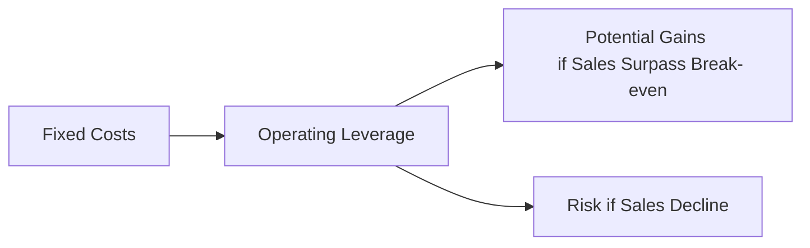

## Introduction
Cost structures and scalability represent key building blocks of any corporate issuer’s strategy. They shape how a firm allocates resources, manages growth, and maintains competitiveness. When you think about it, a company’s ability to scale—i.e., to handle increased demand with minimal proportional increases in costs—can make or break its long-term success. In this section, we will explore fundamental concepts such as fixed vs. variable costs, operating leverage, economies of scale, and break-even analysis. We will also examine how these elements collectively influence business models and help managers make sound strategic decisions.

Perhaps you’ve heard a friend say, “You need to spend money to make money.” That phrase is partly true, but the deeper question is how and where you spend that money, and how that spending pattern evolves when your firm grows. Let’s look at the dynamics of all these costs and how financial professionals, particularly CFA® candidates and charterholders, apply them.

## Fixed vs. Variable Costs
A foundational step in analyzing a firm’s cost structure is distinguishing between fixed and variable costs. 

• Fixed Costs: These remain relatively constant regardless of production or sales volume—think rent, insurance, property taxes, certain salaries, or depreciation. Under IFRS and US GAAP, such costs are not typically capitalized into inventory but are recognized as period expenses unless they directly meet capitalization criteria (e.g., certain manufacturing overheads are allocated to product cost).

• Variable Costs: These move in proportion to changes in production or sales volume. Examples include direct materials, direct labor (in many industries), and shipping costs. Under most accounting standards, variable manufacturing costs are usually allocated to inventory and recognized as cost of goods sold when the product is sold.

From a corporate finance standpoint, the ratio of fixed to variable costs can significantly affect profitability and risk. Companies that exhibit high fixed costs must generate enough revenue to cover these expenses before turning a profit, which creates both higher break-even points and greater profit potential once that break-even threshold is crossed.

## Economies of Scale
Economies of scale describe the phenomenon whereby the average cost per unit drops as output volume increases. This decline can stem from:

• Bulk Purchasing: Discounts for materials or distribution.  
• Specialized Machinery: Spreading machinery and setup costs over a larger output.  
• Efficiency Gains: Learning curves, process improvements, or R&D breakthroughs.  

When a business benefits from economies of scale, scaling up production—assuming demand is sufficient—can increase profitability. However, at some point, diseconomies of scale can emerge if a firm becomes too large and faces inefficiencies (e.g., communication bottlenecks, bureaucratic overhead). 

What’s interesting is that in my first year at a small tech startup, we learned that scaling too quickly can compromise quality controls. Sure, we wanted to produce more, but we realized we had to invest substantially in training and standardized processes first. Despite the added fixed cost, it eventually improved our bottom line because every new unit of product cost us significantly less to produce after these initial investments.

## Operating Leverage
Operating leverage refers to the extent a firm uses fixed costs in its operations. A higher fixed-cost base amplifies profit changes relative to sales fluctuations. Mathematically, the degree of operating leverage (DOL) at a particular sales level (Q) can be represented as:


\text{DOL} = \frac{\%\ \text{change in Operating Income}}{\%\ \text{change in Sales}}


To get more precise, one version often used in break-even and sensitivity analyses is:


\text{DOL at Quantity } Q = \frac{Q (P - V)}{Q (P - V) - F}


Where:  
• Q is the quantity sold.  
• P is the price per unit.  
• V is the variable cost per unit.  
• F is total fixed costs.

If sales volume rises, a high DOL means operating income will increase sharply. However, if sales volume falls, losses or declines in profit can be more dramatic. For a business with volatile demand or cyclical revenue patterns, high operating leverage can heighten the risk of financial distress.

Below is a simple Mermaid diagram illustrating how fixed costs and operating leverage interplay to affect a firm’s results:



## Scalability Considerations
Scalability describes the capacity of a system or business model to grow efficiently as volume grows. In highly scalable models:

• Revenue growth outpaces incremental operating costs.  
• Technology and processes can be replicated or expanded quickly at relatively low additional cost.  

Software and digital businesses often demonstrate high scalability because they incur substantial fixed costs (developing the product) but minimal variable costs (distribution). Conversely, hardware or manufacturing-based models tend to be more capital-intensive and require higher ongoing costs to expand capacity.

One personal anecdote: I consulted for a small software-as-a-service (SaaS) company. Explaining “scalability” to their team was eye-opening—once they built their platform, each additional customer only required incremental server and support costs. The lion’s share of their budget was spent on platform development. As their customer base grew, each client contributed significantly to covering those fixed costs and creating profit.

## Cost Efficiency Initiatives
Firms often adopt cost efficiency initiatives to optimize their cost structures and enhance margins:

• Automation: Using robots or software to handle tasks previously done by humans.  
• Process Re-engineering: Redesigning workflows for fewer steps and less waste.  
• Outsourcing: Transferring non-core functions to specialized external providers.

When making these decisions, companies need to balance cost savings with potential risks:

• Quality: Will automation reduce consistency or hamper customization?  
• Customer Service: Are clients impacted by outsourced call centers or fulfillment?  
• Reputation: Could negative press emerge if labor is offshored to a region with less stringent labor or environmental protections?

Under IFRS or US GAAP, automation might also affect the firm’s asset base and capital expenditure structure, influencing depreciation expense over time. Managers should consider both the accounting and the strategic perspectives to ensure these initiatives support sustainable growth.

## Break-Even Analysis
An essential aspect of planning involves calculating the break-even point, where total revenues match total costs. The break-even volume (Q_BE) can be computed as:


Q_{\text{BE}} = \frac{F}{P - V}


Where:  
• F is total fixed costs.  
• P is price per unit.  
• V is variable cost per unit.

Once the break-even threshold is surpassed, each additional sale (assuming price remains above variable cost) contributes to profit. However, below break-even, the firm is operating at a loss. Managers and analysts rely on these calculations to set performance targets, allocate budgets, and gauge the viability of new projects.

Let’s do a tiny Python snippet to illustrate break-even calculations for an illustrative startup:

```python
fixed_costs = 50000
price_per_unit = 50
variable_cost_per_unit = 10

break_even_units = fixed_costs / (price_per_unit - variable_cost_per_unit)
print(f"Break-even units: {break_even_units}")
```

In a practical example, a manager may use this output to forecast the sales volume needed to justify a proposed expansion. It’s a straightforward yet powerful tool.

## Resource Allocation
Strategic resource allocation ensures that as a firm grows, it deploys capital, technology, and personnel in a way that maximizes return on investment. Consider the following:

• Personnel: Hiring specialized employees (e.g., engineers, data scientists) can add to fixed costs but may accelerate scalability and innovation.  
• Capital Expenditures: Investing in new facilities, equipment, or intellectual property. The recognition of these costs under IFRS vs. US GAAP can vary slightly but typically both standards allow for capitalizing certain expenditures that provide future economic benefits.  
• Technology: Cloud services or software can reduce the need for large infrastructure (and fixed costs), effectively shifting part of the cost structure from fixed to variable.

Sometimes, companies deliberately keep certain areas in-house (e.g., key product design) and outsource non-core areas (e.g., payroll, customer support). Each approach can shift the overall cost structure to better match the firm’s strategic goals.

## Continuous Improvement
Continuous improvement methodologies like Lean and Six Sigma help organizations refine and streamline their processes:

• Lean: Focuses on eliminating waste in every step of production—reducing wait times, avoiding overproduction, and minimizing excessive inventory.  
• Six Sigma: Emphasizes reducing process variation and defects using data-driven techniques (e.g., DMAIC: Define, Measure, Analyze, Improve, Control).

In financial terms, a continuous improvement mindset can significantly lower variable costs and even some fixed costs. For instance, reorganizing warehouse layouts might reduce picking time (labor cost), while improved quality control could cut warranty claims or returns. The effect on profit margin can be substantial, especially if combined with stable or growing sales.

## Common Pitfalls and Best Practices
• Pitfall—Over-reliance on Fixed Costs: While high operating leverage can turbocharge profits, it also multiplies losses. Managers should weigh cyclical risks carefully.  
• Pitfall—Misclassifying Costs: Some firms incorrectly classify costs between fixed vs. variable, leading to errors in forecasting and break-even analysis.  
• Best Practice—Scenario Analysis: Model different sales volumes to see how net income changes under best and worst cases.  
• Best Practice—Regular Cost Audits: Reevaluate cost structures periodically to align with market realities and strategic goals.  

## Exam Relevance and Final Tips
At the CFA Level III exam, questions on cost structure and scalability often appear in the context of portfolio companies, private equity analysis, or corporate financial forecasting. You may see item sets that require you to examine a firm’s degree of operating leverage or break-even point, propose strategic improvements, and debate whether relocating production or adopting new technology is beneficial.

For constructed-response (essay) questions, you might be asked to discuss how changes in the cost structure influence the firm’s risk-return profile, or to identify how IFRS vs. US GAAP might differentially handle certain cost allocations. Time management is crucial, and bullet points or short paragraphs with direct references to the formulas can help you structure these answers effectively.

Above all, practice applying these concepts to real or hypothetical business scenarios. Understand how small changes in assumptions—like a 5% drop in sales—may translate into large changes in operating income if the firm’s fixed-cost base is significant.

## References
- Porter, M. E. (1998). Competitive Advantage: Creating and Sustaining Superior Performance. Free Press.  
- Kaplan, R. S., & Cooper, R. (1998). Cost & Effect: Using Integrated Cost Systems to Drive Profitability and Performance. Harvard Business School Press.  
- CFA Institute. (2025). CFA® Program Curriculum Level III, Corporate Finance and Portfolio Management Readings.  
- IFRS Foundation (2025). IFRS Standards.  
- U.S. Financial Accounting Standards Board (FASB). (2025). Accounting Standards Codification.

---

## Test Your Knowledge: Cost Structures and Scalability Quiz



### Which of the following best describes operating leverage?

- [ ] The extent to which a firm’s debt level magnifies returns.
- [x] The degree to which a firm’s fixed costs magnify changes in operating income.
- [ ] A measure of how quickly a firm can convert inventory into cash.
- [ ] The difference between a firm’s forecasted and budgeted costs.

> **Explanation:** Operating leverage relates to the proportion of fixed costs in a firm’s cost structure, magnifying profit changes with sales fluctuations.

### A company with high fixed costs and low variable costs would typically expect:

- [x] Profit to increase sharply once break-even is surpassed.
- [ ] Costs to remain proportional to sales over time.
- [ ] Profit to remain unaffected by changes in volume.
- [ ] Minimal risk if sales decline significantly.

> **Explanation:** High fixed costs create a higher breakeven point but lead to sharper profit increases once that threshold is exceeded. However, downside risk is also greater if sales drop.

### Economies of scale occur primarily because:

- [ ] Variable costs remain low, even if sales volumes go down.
- [ ] Companies can raise prices significantly without impacting sales volume.
- [x] Average costs per unit decrease as output levels rise.
- [ ] Fixed costs increase with each new unit produced.

> **Explanation:** Economies of scale refer to lower average costs as production volume grows, often due to bulk purchasing, specialization, or process improvements.

### Under break-even analysis, the break-even volume is calculated by:

- [ ] Multiplying fixed costs by variable costs per unit.
- [ ] Subtracting total revenue from variable costs.
- [x] Dividing total fixed costs by (price per unit − variable cost per unit).
- [ ] Summing price per unit, fixed costs, and variable costs.

> **Explanation:** Break-even units = F / (P − V), where F is fixed costs, P is sales price per unit, and V is variable cost per unit.

### Which cost efficiency initiative most directly reduces labor-related expenses?

- [x] Automation
- [ ] Outsourcing specialized tasks
- [x] Process re-engineering
- [ ] Building brand reputation

> **Explanation:** Automation and process re-engineering primarily aim to reduce labor costs, though outsourcing can also be relevant. Building brand reputation is generally a marketing strategy that may or may not affect labor costs.

### What risk is a firm likely to encounter when it increases automation?

- [x] Potential decreases in product customization capability
- [ ] No change in fixed cost structure
- [ ] Lower operating leverage
- [ ] Zero reputational risks

> **Explanation:** Automation usually increases fixed costs (due to capital expenditures in machinery or robotics) and can limit customization options. It may also pose reputational or customer-service risks if done poorly.

### Which of the following best illustrates scalability?

- [x] A cloud-based software company whose revenue grows rapidly with minimal additional infrastructure cost
- [ ] A boutique manufacturing firm that invests heavily in new production lines for modest sales increases
- [x] An e-commerce platform that adds thousands of new users without needing more warehouses
- [ ] A mining firm incurring substantial exploration costs each time it expands capacity

> **Explanation:** Scalability is characterized by the ability to add new customers or expand output without a proportional increase in operating costs—typical of software or digital platforms.

### In a high operating leverage scenario, a 10% decrease in sales might:

- [x] Result in a disproportionately large decline in operating income
- [ ] Have minimal impact on net income
- [ ] Decrease fixed costs significantly
- [ ] Improve the contribution margin ratio

> **Explanation:** With high operating leverage, small changes in sales volume lead to large swings in operating income. Fixed costs remain the same, so declining sales cut more deeply into profits.

### Which best represents a continuous improvement practice?

- [x] Lean manufacturing to reduce waste in production
- [ ] Accepting product defects as inevitable
- [ ] Skipping process reviews to lower costs
- [ ] Strictly focusing on marketing rather than operations

> **Explanation:** Lean manufacturing is a cornerstone of continuous improvement. It reduces waste and optimizes each step in the production process.

### True or False: Under IFRS and US GAAP, all costs linked to new technology investments must be expensed immediately.

- [x] True
- [ ] False

> **Explanation:** Generally, IFRS and US GAAP allow certain development costs to be capitalized if they meet specified criteria (e.g., intangible asset recognition). However, many research-related costs must be expensed, so it is context-specific. The statement is overly broad, so under typical guidance, many technology expenditures remain or become expenses, not capitalized. This is a nuanced question, and the correct exam perspective is that significant intangible asset recognition requires strict criteria; often the immediate reaction is to expense R&D. In many cases, that’s what happens, aligning with the statement as a broad generalization.


