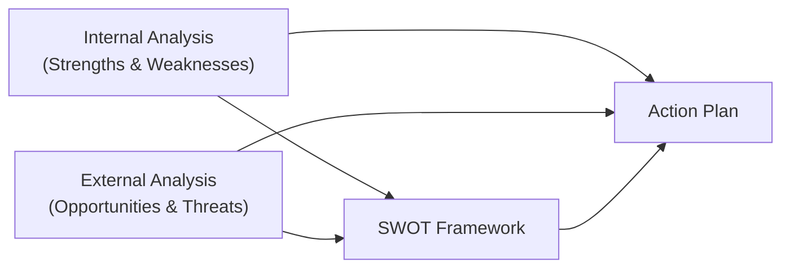

## Introduction

Have you ever noticed how some companies just seem to outcompete everyone else in their space—almost effortlessly? I remember the first time I toured a major electronics manufacturing plant in Asia. Walking through the gleaming factory floor, I couldn't help but wonder: “Why can they produce these complex gadgets so cheaply and consistently?” It’s not just about cheap labor or fancy machines. Usually, it boils down to the firm’s unique resources, strategic positioning, and how they leverage these resources more effectively than their rivals. In other words, they’ve identified and nurtured some sort of competitive advantage.

In this section, we explore the fundamentals of what constitutes a strong, sustainable market edge. We’ll walk through concepts like cost leadership versus differentiation, dig into the resource-based view of the firm, and unravel practical tools (like SWOT analysis) to help pinpoint your own unique advantage (or that of a company you’re analyzing). And yeah, maybe we’ll even throw in a story or two about some scrappy startups. Let’s dive in.

## Differentiation and Cost Leadership

A cornerstone of modern strategy analysis often points to two broad ways companies can set themselves apart: differentiation and cost leadership.

• Differentiation: This is all about delivering something uniquely appealing that goes beyond just price. Think about your favorite luxury car brand. It’s popular because it might be super sleek, offer amazing performance, or come with that glitzy brand aura. Customers happily pay a premium because of perceived uniqueness, prestige, or top-tier quality. Firms succeed here by emphasizing product design, superior customer service, brand image, or technology leadership. Apple is a classic example. People line up for new iPhones not solely because they’re cheaper or even more powerful. It’s the brand and the ecosystem—a synergy that customers feel is worth the price tag.

• Cost leadership: Imagine being able to make the same or comparable product for less cost than your competition. That advantage means you can charge a price below rivals’ costs. Or you might maintain an industry-comparable price and pocket higher margins. Firms that excel at cost leadership usually have streamlined processes, robust supply chain relationships, and/or efficient production technologies. Famous case? Walmart with its relentless focus on operational efficiency and bulk purchasing to drive down costs. They pass some of these savings on to customers, further bolstering the brand—and fending off competitors who can’t match those low prices.

### Balancing Both Approaches
Some companies try to blend these approaches, offering relatively low prices while standing out in a unique way. This hybrid strategy (often called “integrated cost leadership/differentiation”) can be tough to execute—if they don’t keep careful control of cost structures, they risk eroding margins. But done right, it capitalizes on multiple forms of advantage simultaneously.

## Sustainable Advantage

Having a competitive advantage is one thing; keeping it is another story. Put simply, a sustainable advantage is something your rivals can’t easily replicate or surpass in the near future—whether that’s due to a patent, brand strength, or intangible factors like a unique corporate culture. Sustainability ensures that once an organization establishes an edge, it will keep paying off over the longer term.

• Patented Technology: If you’re the sole owner of a must-have technology, you can license it or produce goods using it at favorable costs. Competitors can’t legally copy it, so that advantage tends to stick until patents expire or alternative technologies emerge.  
• Strong Brand Loyalty: People who love your brand are a bit like faithful fans. They’re more likely to remain customers (even when a cheaper alternative comes along), recommend you to their friends, and be patient if you slip up. Building this loyalty can involve years of strategic marketing, consistent product quality, and memorable customer service.

### Staying Vigilant
A quick warning: no advantage is set in stone. Patents expire, new brands crop up, and innovative startups can topple established giants. Think about how ride-sharing apps disrupted the taxi industry or how streaming services upended traditional cable. Continuous renewal of capabilities and an eye on market trends can help an advantage remain sustainable.

## Unique Value Proposition

A unique value proposition (sometimes called UVP) explains why customers choose you over everyone else. It’s like that distinct promise you make—whether it’s exceptionally fast delivery, best-in-class quality, or a delightful user experience.

To form a strong UVP, you’ll want to:

• Align the organization’s capabilities: If you promise a next-day doorstep delivery, do you have the logistics network, trained personnel, and technology to fulfill that promise consistently?  
• Reflect your culture: Culture might sound fluffy, but it can make or break your advantage. A culture that embraces accountability and customer focus is more likely to deliver on bold promises.  
• Communicate effectively: Even the best proposition can flop if it’s not clearly communicated. Customers need to instantly grasp why you rock.

The trick is ensuring your UVP resonates with a profitable segment of the market. Even the coolest idea won’t matter if nobody’s willing to pay for it.

## The Resource-Based View (RBV)

The resource-based view of competitive advantage says that your “special sauce” is found in the resources and capabilities your firm controls, especially those that are:

• Valuable: They help you exploit an opportunity or fend off a threat.  
• Rare: If every competitor has it, it’s just table stakes, not an advantage.  
• Imperfectly imitable: Competitors either can’t copy it or find it too expensive to replicate (due to legal protections, unique culture, or intangible know-how).  
• Non-substitutable: There’s no alternative resource or set of resources that deliver the same effect.

These are often referred to as the VRIN attributes. A resource that meets all four criteria is a potent basis for outpacing rivals. For instance, a global brand such as Coca-Cola, with its proprietary formula and distribution network, often ticks these boxes. It’s more than just sugar water; it’s an entire suite of intangible assets that’s hard to replicate.

### Quick Python Check?

Sometimes it can be helpful to do a rough analysis by scoring resources on a scale of 1–5 along each VRIN dimension. For instance:

```python
resources = {
    "BrandReputation": {"Valuable": 5, "Rare": 5, "Imitable": 2, "Substitutable": 3},
    "AdvancedTech": {"Valuable": 4, "Rare": 3, "Imitable": 4, "Substitutable": 2},
    "ExtensiveDistributionChannels": {"Valuable": 5, "Rare": 4, "Imitable": 3, "Substitutable": 3}
}

for r_name, scores in resources.items():
    total_score = sum(scores.values())
    print(r_name, "Score:", total_score)
```

Such a quick score-based approach won’t be a perfect measure, but it can encourage you to think systematically about each resource’s strengths and weaknesses.

## SWOT Analysis

Identifying competitiveness also involves looking inside and outside the firm. A SWOT analysis—Strengths, Weaknesses, Opportunities, and Threats—helps parse out where you stand and how you can take action.

• Strengths (internal): Do you have robust manufacturing capabilities, strong finances, or high brand equity?  
• Weaknesses (internal): Are you short on R&D resources or lacking brand recognition?  
• Opportunities (external): Could emerging markets or new technologies open fresh revenue streams?  
• Threats (external): What about competitor moves or regulatory changes that might hurt your business?

Use SWOT to guide strategy decisions. For instance, if your main differentiator is a high-tech production method (strength), but you’re limited by uncertain raw material supply (weakness), you might focus on forging more stable supplier alliances—before rivals do.

### Visualizing SWOT

Below is a simple Mermaid diagram illustrating how SWOT factors interconnect to shape strategy decisions:



## First-Mover vs. Fast-Follower

Another angle for securing an edge is timing your entry into a market:

• First-Mover Advantage: Being the pioneer can help you define industry standards, capture brand loyalty, and achieve significant scale quickly. Early adopters who love your product may organically create a buzz, giving you that “household name” status early on. A classic example is Netflix in the streaming space.  
• Fast-Follower Approach: Sometimes it’s cheaper and less risky to let someone else figure out the new product or market. Then you swoop in, refine their idea, and perhaps roll it out more effectively. Take Samsung in the smartphone world. They learned from the smartphone wave and launched compelling alternatives quickly, capturing a significant market share—often close on Apple’s heels.

## Continuous Innovation

A buddy of mine once worked at a tech company that was known for rolling out one groundbreaking product after another. They had this almost obsessive culture of weekly R&D sprints and frequent “hackathon” events. The next thing you knew, they left bigger, more established players scrambling. That’s continuous innovation: always challenging assumptions, iterating designs, and launching new stuff. It’s not just about big eureka moments—small, incremental improvements over time can also keep you ahead of the curve.

### Key Approaches to Drive Innovation
- Encourage experimentation: Let employees test new ideas without fear.  
- Invest in R&D: This might sound obvious, but it’s often the first budget item to get squeezed.  
- Stay engaged with market trends: Keep your eyes open for changes in technology, customer preferences, and competitor behavior.  

Remaining innovative helps in two ways: it extends the life of existing advantages and may open entirely new avenues for differentiation or cost efficiencies.

## Putting It All Together

Identifying and sustaining competitive advantage isn’t about a single secret trick. It’s more like a blend of aligning resources, choosing a strategic position (cost leadership vs. differentiation), leveraging a strong value proposition, and renewing those advantages through innovation. Tools like SWOT and frameworks like the Resource-Based View can help you systematically assess where you stand and what needs shoring up.

Of course, markets and industries vary widely. One company might leverage a single patent to hold market leadership for years; another might rely on day-to-day improvements in manufacturing processes. The magic is pinpointing what your organization—given its culture, resources, and external environment—can do uniquely well, then doubling down.

## Best Practices and Common Pitfalls

• Best Practices  
  - Keep scanning the horizon: Even if you enjoy an advantage today, a new competitor can upend you tomorrow.  
  - Align strategy with resources: Make sure you’re not trying to fight a bigger competitor on their turf with less capital or fewer capabilities.  
  - Nurture intangible assets: Brand, culture, and know-how don’t show up on the balance sheet easily, but they can be your biggest defense.

• Common Pitfalls  
  - Complacency: Assuming your advantage is permanent is one of the fastest ways to lose it.  
  - Over-diversification: Trying to do everything can dilute your advantage and hamper performance.  
  - Ignoring feedback: Companies that don’t listen to customers can slowly drift away from their unique value proposition.

## Exam Tips

• Relate Concepts to Real Firms: Exam questions might ask you to analyze a case vignette. Draw on your knowledge of cost leadership vs. differentiation, the resource-based view, and first-mover strategies to identify sources of advantage.  
• SWOT Synthesis: You could see a question that includes a mini-SWOT table. You might have to suggest how a company can leverage a strength and an opportunity or neutralize a weakness and a threat.  
• Keep VRIN in Mind: If an item set question asks you to evaluate multiple resources, think carefully which ones might be valuable, rare, imperfectly imitable, and non-substitutable.  
• Strategy Implementation: Remember that identifying an advantage is just the first step. Pay attention to how a firm might sustain that advantage. Look for details around R&D spend, brand-management tactics, or supply-chain initiatives.

## Glossary

• Differentiation Strategy: Competing on unique product attributes or brand image, instead of just price.  
• Cost Leadership Strategy: Gaining advantage by offering lower prices, made possible by lower operating costs.  
• Resource-Based View: A theory suggesting that ownership of unique, valuable resources underpins superior performance.  
• First-Mover Advantage: Benefits gained by being the initial entrant into a market or industry.  
• Fast-Follower Approach: Quickly replicating or adapting a pioneer’s product with minor improvements.  
• SWOT: A strategic planning tool for assessing a company’s Strengths, Weaknesses, Opportunities, and Threats.  
• Sustainability: The ability to maintain an advantage over the long term, resisting competitive pressures.

## References & Further Reading

• Barney, J. (1991). “Firm Resources and Sustained Competitive Advantage.” Journal of Management.  
• Porter, M. E. (1985). “Competitive Advantage: Creating and Sustaining Superior Performance.” Free Press.  

## Practice Questions: Identifying Competitive Advantages



### Which of the following best describes a differentiation strategy?  
- [ ] Offering the lowest prices in the industry through cost efficiency.  
- [x] Emphasizing unique product attributes or a strong brand image to stand out.  
- [ ] Relying solely on imitating market leaders quickly.  
- [ ] Focusing primarily on corporate social responsibility practices.  

> **Explanation:** A differentiation strategy is about providing unique features or a strong brand that persuades customers to choose you over lower-priced rivals.

### Which of the following resources is most likely to be considered “invaluable but easily imitable”?  
- [x] A standardized production technique known industry-wide.  
- [ ] A well-protected patent for a specialized process.  
- [ ] A deeply ingrained corporate culture that fosters innovation.  
- [ ] A unique distribution network unavailable to competitors.  

> **Explanation:** If a resource is commonly known and replicated, it does not fulfill the “imperfectly imitable” criterion, making it less of a lasting advantage.

### Which VRIN attribute ensures that a resource cannot be easily substituted with another?  
- [ ] Rare  
- [ ] Valuable  
- [ ] Imperfectly imitable  
- [x] Non-substitutable  

> **Explanation:** If a resource is non-substitutable, it means competitors cannot replace it with something similar to achieve the same advantage.

### What is a key risk of trying to combine cost leadership and differentiation strategies?  
- [x] The company may end up “stuck in the middle,” offering neither the best prices nor truly unique features.  
- [ ] It automatically creates a strong brand identity that is easy to maintain.  
- [ ] Investors often see this as a more stable approach, reducing agency problems.  
- [ ] The government may impose fines for mixing strategies.  

> **Explanation:** A business that tries to straddle both strategies without fully committing can lose clarity in the marketplace, ending up somewhere in between cost leadership and differentiation without excelling at either.

### Which element of a SW‍OT analysis refers to internal factors that hinder the firm’s progress?  
- [x] Weaknesses  
- [ ] Opportunities  
- [x] Strengths  
- [ ] Threats  

> **Explanation:** Weaknesses are internal limitations that the firm can work to reduce or eliminate.

### Which of the following companies is most likely to enjoy a first-mover advantage?  
- [x] A pioneering streaming-service provider that established a massive user base early.  
- [ ] A fast-follower electronics maker that quickly replicates others’ designs.  
- [ ] A traditional energy utility relying on decades-old systems.  
- [ ] A restaurant chain with no unique offerings.  

> **Explanation:** By entering early, the pioneering streaming service can lock in subscribers, shape consumer habits, and define industry norms.

### In the resource-based view, which factor primarily determines whether a resource can be copied by competitors?  
- [x] Imperfect imitability  
- [ ] Rarity  
- [x] Value  
- [ ] Non-substitutability  

> **Explanation:** Imperfect imitability captures how tough or costly it is to replicate a resource or capability.

### If a firm’s patent is about to expire, which strategy can help maintain a competitive edge?  
- [x] Continuous innovation and development of improved products.  
- [ ] Ignoring the upcoming expiry date.  
- [ ] Selling off the technology to a rival.  
- [ ] Relying on the brand name alone without further R&D.  

> **Explanation:** As patents expire, long-term advantage requires ongoing innovation and creation of new differentiating features.

### One typical pitfall for companies with an established advantage is:  
- [x] Becoming complacent and ignoring shifts in market dynamics.  
- [ ] Strict adherence to best practices in R&D.  
- [ ] Dynamically adjusting strategy in response to new entrants.  
- [ ] Expanding into related industries with synergy potential.  

> **Explanation:** When a firm takes its position for granted, it risks overlooking disruptive technologies or emerging competitors.

### True or False: In a cost-leadership strategy, a firm always sacrifices quality for price.  
- [x] False  
- [ ] True  

> **Explanation:** Cost leadership focuses on operating at lower costs. However, it does not necessarily mean the product quality must be inferior. Many cost leaders still produce goods of acceptable or even high quality while keeping prices low through operational efficiencies.


