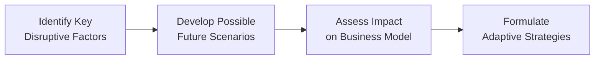

## Introduction

Let’s face it—innovation is sometimes scary. I remember a time when I thought smartphones were just expensive gimmicks. Then, in what felt like a blink, they completely changed how we communicate, work, and even shop. It’s kind of wild, but that same sense of upheaval resonates in business. Companies that don’t adapt to disruptive trends often find themselves scrambling to stay relevant or, worse, closing their doors. In this section, we’ll uncover how innovations—particularly disruptive ones—can revolutionize entire industries through fresh ways of creating and delivering value. We’ll also check out how these transformations factor into corporate financing decisions, strategic planning, and even everyday portfolio management, especially from a Level III CFA exam–style vantage point.

Disruption might begin as an underdog phenomenon: a small startup, an overlooked technology, a brand-new subscription model. But eventually, it can totally transform mainstream expectations. Let’s dig into the types of innovation, the challenges innovators face, and the organizational cultures that help these new ideas thrive.

## Disruptive Innovation

Disruptive innovation refers to breakthrough discoveries or new developments that initially target overlooked market segments or less demanding customers, offering simpler, cheaper, or more convenient solutions. Over time, they advance upmarket to challenge established players. Think about how online streaming services practically upended the DVD rental market, or how certain financial technology (fintech) firms are shaking the foundations of traditional banking.

• From a corporate finance perspective, disruptive innovation can drastically alter competitive landscapes and force changes in capital allocation. Firms might redirect R&D, weigh heavier intangible investments, or even pivot entire lines of business.  
• For a portfolio manager, identifying signs of disruption early may inform both long and short equity strategies—potentially capturing outsized returns or helping avoid large drawdowns.

## Incremental vs. Radical Innovation

Innovation isn’t always about cleaning the slate. Sometimes, a steady stream of improvements can keep a business ahead. The difference boils down to incremental innovations versus radical (or breakthrough) innovations:

• Incremental Innovation:  
  – Enhances existing systems, products, or processes with gradual updates.  
  – Focuses on continuous improvement, cost reduction, or modest performance gains.  
  – Examples: Annual smartphone upgrades, software patches, or an automobile manufacturer’s incremental fuel efficiency improvements.

• Radical Innovation:  
  – Introduces dramatic changes that might redefine consumer behavior or alter entire industries.  
  – Typically involves a big leap in technology or business approach.  
  – Examples: The jump from horse-drawn carriages to automobiles, or from physical music stores to digital streaming platforms.

In capital budgeting terms, incremental innovation is often addressed through standard project evaluation (e.g., net present value, payback period). Radical innovation, meanwhile, may require scenario analysis and real option valuation to handle higher uncertainty.

## Technological Leaps

Technology keeps shifting at breakneck speed—especially in areas like artificial intelligence (AI), machine learning, automation, and big data analytics. These leaps can transform entire business models overnight. Picture how AI-based robo-advisors are stepping on the toes of traditional wealth managers by automating asset allocation, rebalancing, and tax-loss harvesting.

From the corporate issuer’s standpoint:  
• Rapid technology changes introduce new forms of risk—like obsolescence risk—impacting everything from capital structure choices to due diligence for mergers and acquisitions.  
• If you’re analyzing a firm’s credit quality, it might be crucial to see whether that firm invests sufficiently in new technologies to mitigate the risk of being outpaced by more forward-thinking rivals.

## Business Model Innovation

Innovation isn’t restricted to flashy tech or new gadgets. Sometimes the biggest disruption happens when companies reinvent the way they deliver value. This can include:

• Moving from Ownership to Access: Think about how subscription platforms replaced one-off product purchases with recurring monthly or annual fees.  
• Local to Global Reach: Traditional retailers might pivot to e-commerce, expanding worldwide while slashing overhead costs from physical stores.  
• Direct-to-Consumer (DTC) Models: Companies bypass retail distributors and sell straight to end customers, boosting margins and forging closer client relationships.

An example? Netflix pivoting from DVD mail-order rentals to online streaming. That’s business model innovation at its finest—completely reshaping how customers consume entertainment. 

For analysts and investors, business model innovation can dramatically affect revenue forecasting, working capital needs, and operating risks. Understanding the new model’s cost structure and growth potential is key to accurate valuation.

## Organizational Culture and Governance

Now, you might be wondering: “So why do some companies embrace disruption while others shy away from it?” Very often, it boils down to organizational culture and governance structures.  
• A pro-innovation culture allows for controlled risk-taking and acceptance of occasional failure (within reason). Employees who feel safe proposing new ideas can act as intrapreneurs, championing fresh solutions.  
• Proper board oversight, strong alignment of executive compensation with long-term strategy, and robust internal controls can further support thoughtful innovation. (This cross-links interestingly with Chapter 3’s coverage of governance and board roles.)

In the real world, entrenched bureaucracy—or compensation structures that reward only short-term performance—may stifle new ideas or shift focus away from the bigger strategic moves needed to stay competitive. For a CFA candidate analyzing corporate issuers, it’s helpful to assess how boards, management incentives, and governance policies might encourage or block valuable disruption.

## Challenges to Innovators

Early-stage disruptors aren’t always in a comfortable spot. They face huge barriers such as:

• Regulatory Hurdles: New markets and products often lack clear regulatory frameworks, leading to compliance uncertainties.  
• Funding Constraints: Developing radical technologies can be capital-intensive, and potential investors expect proof of concept before extending financing.  
• Customer Adoption Lags: Even the best ideas can falter if customers don’t see the immediate advantage or fear switching costs.  
• Entrenched Competitors: Incumbents may retaliate by cutting prices, forming strategic alliances, or leveraging economies of scale to restrict the newcomer’s growth.

For instance, electric vehicle makers historically wrestled with consumer skepticism, high production costs, and limited battery range. Over time, the technology improved, the cost curve dropped, and consumer attitudes shifted, spurring broader adoption. Portfolio managers who recognized these trends early could have built significant alpha.

## Scenario Planning

Innovation thrives when organizations think ahead. Scenario planning is a big part of that:

• Firms imagine multiple versions of the future—maybe a scenario where new technologies spread like wildfire, or another where regulators clamp down on data usage.  
• Management then crafts flexible strategies to handle each scenario, setting aside capital or forging partnerships to pivot rapidly.

As covered in Chapter 5’s Capital Investments section, scenario analysis can also factor into capital budgeting. It helps businesses weigh the risk-return trade-offs of an ambitious R&D project or a fresh digital transformation strategy.

Below is a simple visualization of how scenario planning might factor into innovation decisions:

## Putting It All Together for CFA-Level Analysis

• Corporate Finance Perspective: Disruptive innovation can upend valuations, shift investor sentiment, and spark changes in capital allocation priorities. Evaluating how an issuer reacts to new market threats or evolving technologies is central to fundamental analysis.  
• Portfolio Management Angle: At the CFA Level III vantage point—where we often consider multi-asset portfolios—disruptive innovation might influence sector rotation strategies, scenario-based risk analysis, and even derivatives-based hedges.  
• Ethical and Governance Considerations: The speed of innovation can outpace regulatory guidelines, leading to potential gray areas in data privacy, ESG reporting, or fair dealing. Mindful compliance with the CFA Institute Code and Standards is crucial when exploring speculative new ventures or emergent business practices.

## Glossary

• Disruptive Innovation: Innovations that enable new value networks and markets, ultimately displacing established market-leading firms and products.  
• Incremental Innovation: Small-scale improvements to existing products, services, or processes.  
• Radical Innovation: Transformative changes that significantly alter consumer behavior, markets, or technology.  
• Digital Transformation: Adoption of digital technology to overhaul existing operations, delivering improved or entirely new value.  
• Adoption Curve: The rate at which different segments of a market embrace a new product or idea. Early adopters pave the way, eventually influencing the mass market.  
• Scenario Planning: A strategic tool used to model various potential future states, assessing how each might impact the firm’s success.  

## Practical Examples and Case Studies

• Ride-Sharing Disrupts Taxis: It started with lower pricing and app-based convenience. Traditional taxi companies were initially slow to respond, losing market share.  
• Streaming Disrupts Cable TV: Large cable networks once held monopolistic positions. Then streaming services entered with lower monthly fees, no ad-based content, and on-demand access.  
• Fintech Disrupts Banking: Online payment processors, P2P lending marketplaces, and digital banking apps replaced or supplemented services once offered only by large banks.  

## Best Practices for Managing Innovation

1. Foster an Open Culture: Empower employees to propose and test new ideas without fear of penalty for well-intentioned failure.  
2. Align Compensation with Long-Term Goals: Encourage managers to take prudent risks that may pay off over extended horizons, not just the next quarter.  
3. Keep an Eye on Regulations: Engage with policymakers and industry groups to influence or adapt to developing regulatory frameworks.  
4. Evaluate Financing Structures: High-growth innovators might prefer equity funding to maintain flexibility, though debt can be tempting given lower interest rates.  
5. Monitor Competitors: Complacency is lethal. Watching for signals of emerging disruptive players helps inform strategic acquisitions, partnerships, or shifts in resource allocation.

## Common Pitfalls and Challenges

• Overestimating Market Size: Many “big ideas” look exciting on paper but fizzle out because the market isn’t as large or adoptive as initially perceived.  
• Underinvestment in R&D: Firms that scrimp on innovation risk being left behind by faster-moving rivals.  
• Lack of Strategic Focus: Chasing too many ideas at once can scatter an organization’s resources, making it less likely that any single innovation will succeed.  
• Timing Risks: Getting to market too early may burn cash before customers are ready, while waiting too long can let a competitor steal the limelight.

## Concluding Exam Tips

For the CFA Level III or advanced corporate finance problems:  
• Be prepared to incorporate scenario analysis when valuing companies with high disruption risk.  
• Practice recognizing the strategic maneuvers that innovative companies employ—e.g., pivoting to new revenue streams or adopting subscription models.  
• When drafting essay responses, tie your discussion to a company’s governance, capital structure, or strategic planning approach. Show a holistic viewpoint.  
• Keep an eye out for ethical concerns, particularly in areas with minimal regulation or guidance. The exam might test your understanding of how to navigate uncertain compliance territories.

## References

- Christensen, C. M. (1997). The Innovator’s Dilemma. Harvard Business Review Press.  
- McKinsey Global Institute:  
  https://www.mckinsey.com/mgi → Reports on digital disruption and industry transformations.  

- Kaplan, R. S., & Norton, D. P. (2004). Strategy Maps: Converting Intangible Assets into Tangible Outcomes. Harvard Business School Press.  
- CFA Institute. (Current Edition). CFA Program Curriculum, particularly for Corporate Issuers and Portfolio Management.  

---

## Test Your Knowledge: Innovations and Disruption in Business Models



### Which of the following best describes disruptive innovation?

- [ ] Incremental improvements to existing products.
- [x] Transformative breakthroughs that can displace established market players.
- [ ] Strategies aimed solely at cost-cutting in mature industries.
- [ ] High-quality brand repositioning in luxury segments.

> **Explanation:** Disruptive innovation typically starts in overlooked or underserved markets and eventually redefines entire industries, challenging incumbents from below.

### What is a key difference between incremental and radical innovation?

- [x] Incremental innovation refines existing offerings, while radical innovation introduces entirely new paradigms.
- [ ] Radical innovation always costs less to develop.
- [ ] Incremental innovation requires radical reorganization.
- [ ] Only radical innovation can be applied to financial services.

> **Explanation:** Incremental innovation fine-tunes what already exists; radical (or breakthrough) innovation significantly alters or creates new markets and products.

### Which of the following is most likely a challenge to a disruptor entering a market?

- [ ] Easily obtaining regulatory clearance with no restrictions.
- [x] Facing entrenched competitors with substantial resources.
- [ ] Having a mature and fully educated consumer base from day one.
- [ ] Low capital intensity in highly advanced sectors.

> **Explanation:** Disruptors often compete against firms with deep resources and established customer bases. Securing investment, regulatory approval, and customers can be daunting.

### Why might organizational culture be crucial for fostering disruptive innovation?

- [ ] Because it eliminates the need for a formal R&D budget.
- [x] Because a pro-innovation culture encourages risk-taking and tolerates failures.
- [ ] Because it helps firms avoid any regulatory requirements.
- [ ] Because it allows higher leverage ratios.

> **Explanation:** An open, supportive culture is more likely to promote new ideas and sustain iterative testing, both of which are essential for disruptive breakthroughs.

### What does scenario planning entail for organizations aiming to innovate?

- [x] Preparing multiple future-based strategies to adapt to potential market or technology shifts.
- [ ] Adopting a single strategy that remains constant under all conditions.
- [x] Considering both best-case and worst-case possibilities to guide capital allocation decisions.
- [ ] Dismissing the possibility of disruptive technologies entirely.

> **Explanation:** Scenario planning helps organizations imagine a range of possible outcomes, adjusting strategies accordingly. It’s often used to test the viability of new business models.

### From an ethical standpoint, why are disruptive innovators at risk?

- [x] Because new technologies can outpace existing regulations, creating compliance uncertainties.
- [ ] Because only large legacy firms are subject to scrutiny.
- [ ] Because customers tend to be more forgiving of novel technologies.
- [ ] Because innovators typically operate in heavily regulated industries only.

> **Explanation:** Innovators may enter markets where guidelines are unclear or lagging. This can pose serious compliance and ethical challenges if they don’t carefully manage stakeholder interests.

### How can radical innovation impact capital budgeting decisions?

- [x] It increases project uncertainty, making scenario analysis or real options more relevant.
- [ ] It usually has no effect on the investment decision process.
- [x] It can lead to the need for flexible, staged funding to accommodate R&D breakthroughs.
- [ ] It guarantees a higher net present value (NPV) than incremental projects.

> **Explanation:** Radical innovation entails significant uncertainty and risk, making advanced valuation tools like multi-scenario analysis or real options key for prudent investment decisions.

### What is a major advantage of a direct-to-consumer (DTC) model?

- [x] Greater control over branding and consumer data.
- [ ] Minimal costs associated with logistics and inventory.
- [ ] Full immunity to industry disruptions.
- [ ] Guaranteed regulatory approval in international markets.

> **Explanation:** By bypassing intermediaries, companies gain direct insight into consumer behavior and can adapt offerings more quickly.

### Which of the following best defines the “adoption curve”?

- [x] The rate at which different customer segments embrace a new product or innovation.
- [ ] The number of new patents filed by a company in a fiscal year.
- [ ] The measure of synergy in a merger or acquisition.
- [ ] The relationship between interest rates and capital structure decisions.

> **Explanation:** The adoption curve highlights how “innovators” and “early adopters” lead the way, eventually influencing the mainstream to accept new products.

### True or False: A strong pro-innovation culture can enable organizations to pivot quickly when implementing a new business model.

- [x] True
- [ ] False

> **Explanation:** Pro-innovation cultures foster agility and creativity, giving firms the confidence and internal support to pivot when market dynamics shift.


