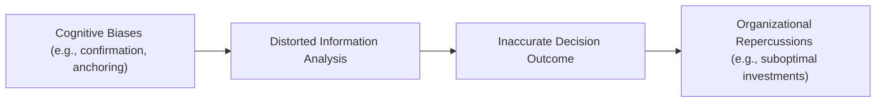

Whether you’re part of the executive team at a global corporation or running a small startup, have you ever paused to wonder why management decisions can sometimes feel like they’re veering off-course—despite the best intentions? It might turn out that cognitive biases, cultural mindsets, and misaligned incentives play a bigger role than we realize. Let’s take a friendly walk through the world of behavioral aspects of management decisions, and see how these not-so-obvious forces can influence everything from day-to-day operational choices to long-term strategic direction.

## Introduction and Motivation

In prior chapters, you learned how corporate governance structures and stakeholder interests help shape management’s decision-making (see Chapter 3: Corporate Governance). You also looked at how different sources of capital or variations in business models can determine the objectives and constraints that managers face (see Chapter 6: Capital Structure and earlier sections of Chapter 7: Business Models). Building on that, we now zoom in on the cognitive and cultural side of management decisions.

It’s tempting to think of corporate decisions as purely rational and data-driven—especially if we hold advanced degrees or belong to an industry that uses a lot of quantitative modeling. But in reality, managers at all levels are just as human as the rest of us. They bring biases, heuristics, emotional influences, and unique cultural backgrounds to the table. Understanding these elements can help you anticipate potential pitfalls and design processes that promote better decisions.

## Cognitive Biases in Managerial Decision-Making

If you’ve ever been in a meeting where it felt like people were ignoring data that contradicts their views or clinging to an outdated forecast, you’ve already glimpsed the power of cognitive biases. While these biases are part of normal human cognition, they can distort reality for corporate leaders in critical ways.

Confirmation bias. One of the most common biases is the tendency to seek, interpret, and overweight information that confirms our pre-existing beliefs. Picture a situation: You’re the CFO who strongly believes a new market opportunity in a distant country is “the next big thing.” You selectively pay attention to market reports highlighting how your competitor’s revenue soared there, overlooking an industry analysis that points out local consumer skepticism about foreign brands. Later, when the investment underperforms, everyone wonders how the initial assumptions slipped through unchallenged.

Overconfidence bias. Overconfidence might manifest when CEOs overestimate their ability to integrate an acquisition quickly or turn around a struggling division. Perhaps they believe they have a “golden touch,” so they take on riskier expansions without fully preparing contingency plans. In real life, managers with too much faith in their personal skill might disregard external forces (economic downturns, changing consumer tastes) that can derail even the best strategy.

Anchoring. Anchoring bias happens when the first piece of information (the “anchor”) weighs too heavily on future judgments. Maybe a CEO sees a consultant’s initial revenue projection of $500 million and then keeps adjusting around that anchor—even though subsequent market data suggests the potential is only around $300 million. Because that initial figure served as a benchmark, it becomes surprisingly sticky in discussions and budgets.

These biases exist in all corners of corporate life, from capital budgeting to recruitment decisions. Here’s a simple visualization of how they can distort outcomes:

When biases creep into strategic planning or product launches, the result can be suboptimal resource allocation, missed opportunities, or damaging brand moves.

## Groupthink vs. Diverse Teams

Have you ever been in a room where everyone nods in agreement with the boss, even though half the folks look slightly uneasy? That’s the classic hallmark of groupthink. The desire to maintain harmony in the team overrides people’s willingness to question assumptions, voice dissent, or propose alternative strategies. Groupthink might make for less friction in meetings, but it can lead to big blind spots and flawed decisions.

On the other hand, diverse teams—where backgrounds, expertise, and perspectives vary—tend to push one another to think more critically and consider multiple angles. Of course, more diversity sometimes leads to healthy debate, which can feel uncomfortable. But this tension is often precisely what organizations need to steer clear of groupthink and fine-tune decision quality. As you learned in Chapter 3 on board composition, a more heterogeneous board is typically better at monitoring and challenging executive decisions, helping curb excessive risk-taking or strategic drift.

## Risk Appetite

Every business decision carries some element of risk, whether it’s the choice to introduce a new product line, enter a new market, or restructure the supply chain. Managers’ personal attitudes toward uncertainty and failure often shape their appetite for risk—and that, in turn, shapes corporate strategy.

If executives are extremely risk-averse, the company might miss out on valuable growth opportunities or fail to innovate in time. On the flip side, if the C-suite has a high tolerance for risk, they might chase too many bold projects without building a safety net for downturns or unexpected obstacles. Achieving the right balance—where risk-taking is aligned with the firm’s strategic objectives and available resources—is critical. This concept ties in with earlier discussions on capital allocation in Chapter 5: Capital Investments and Capital Allocation, where the cost of capital and hurdle rates reflect both market realities and management’s stance on risk.

## Incentive Alignment

Compensation structures can nudge (or shove) managers into particular types of decisions. For instance, short-term bonuses linked exclusively to quarterly earnings might prompt managers to cut corners, slash essential R&D spending, or postpone necessary investments to paint a prettier near-term picture. As we saw in Chapter 3, properly structured executive compensation can align interests between shareholders and management. But poorly designed packages might encourage behavior that prioritizes immediate stock price bumps over long-term sustainability.

Organizations that embed more balanced performance metrics—like progress on strategic initiatives, environmental considerations, and stakeholder satisfaction—often see better alignment between management decisions and the firm’s long-term interests. It’s not about removing short-term goals entirely; it’s more about blending short-term incentives with longer-term performance measures, ensuring managers keep an eye on both immediate milestones and sustainable growth.

## Emotional and Intuitive Decision-Making

Sometimes you just have a gut feeling about a new market, or you sense that an acquisition is off—even if the spreadsheets say something different. Emotional or intuitive decision-making in corporate contexts is tricky. On one hand, business school teachings often emphasize rational analysis, net present value (NPV) calculations, or scenario modeling. On the other hand, real-world leaders often rely on intuition, particularly when dealing with uncertainty or incomplete data.

The best outcomes tend to emerge when managers integrate data-driven analytics with their experience and instincts. It’s a delicate balance: ignoring your intuition might cost you warnings about intangible risks (cultural mismatches, brand identity issues) that pure data doesn’t capture. Swinging too far the other way, though—relying solely on gut instincts—can blind you to factual evidence that contradicts a beloved belief or cherished plan.

## Ethical Frameworks

Successful organizations regularly reflect on who their decisions ultimately serve. Managers with strong ethical frameworks consider not only shareholder returns but also the impact on customers, employees, suppliers, communities, and the environment. We encountered the concept of stakeholder theory in Chapter 2. Embedding ethical considerations and stakeholder feedback loops into managerial processes helps build trust, brand loyalty, and sustainable competitive advantages.

On the flip side, ignoring ethical considerations or attempting to cut corners might result in legal troubles or reputational damage—stains on the corporate image that take years to repair. We’ve all run across high-profile scandals where short-term gains overshadowed fundamental integrity. By establishing a consistent ethical framework, leaders can reduce the risk of moral lapses. They can also cultivate a culture of transparency that flags questionable decisions early in the process.

## Organizational Culture

Let’s pause for a little anecdote. A while back, I visited a mid-sized tech company that prided itself on being “progressive” and “transparent.” Yet, the employees whispered that no one dared mention “Plan B” to the CEO because he only liked hearing confirmation that Plan A was perfect. It turned out that the company was going through a culture mismatch between stated values and actual practice. Unsurprisingly, a few months later, they experienced a product launch failure that nearly took them out of the market. When managers fear speaking up or offering a contrarian view, the culture can inadvertently trap the organization in an echo chamber.

A positive, open culture encourages people to question assumptions, surface alternative viewpoints, and point out when they spot potential pitfalls. This environment can be fostered by:
• Transparent communication channels.  
• Recognition systems that reward constructive feedback.  
• A leadership tone that values learning from mistakes.  
• Allocating resources toward robust decision processes.  

When boards and senior leaders intentionally shape such a culture, they mitigate the risk of groupthink, curb the worst of cognitive biases, and create a space where beneficial innovation can thrive.

## Practical Examples and Case Studies

Imagine a large multinational consumer goods firm deciding to expand into a new region with untested consumer preferences. Senior executives might run quantitative demand analyses, consult external experts, and run multiple brand tests. However, if the team is heavily influenced by overconfidence bias or anchored on early market-size estimates, they may invest more capital and commit more resources than local insights justify.

Alternatively, consider a smaller manufacturing company that tries to pivot toward more eco-friendly packaging. The data might suggest high upfront costs; short-term incentives could push managers to balk at these expenses. But a leadership team grounded in ethical frameworks and aware of long-term reputational benefits might override the inclination toward short-term cost avoidance. In this scenario, the presence of an open and supportive culture—where different viewpoints are heard—can facilitate a better decision, forging a competitive edge in sustainability.

## Common Biases and Their Impacts

Below is a simple reference table you can use to quickly see how each bias can shape decisions:

| Bias                  | Example Scenario                                     | Potential Impact                                  |
|-----------------------|------------------------------------------------------|---------------------------------------------------|
| Confirmation Bias     | Ignoring contradictory market research               | Overcommitment to flawed strategies               |
| Overconfidence Bias   | Underestimating competitor response in new markets   | Raising risk of large-scale strategic failures    |
| Anchoring             | Setting budget targets based on outdated benchmarks  | Misallocation of resources                        |
| Groupthink            | Suppressing dissent in new product development       | Missing vital improvements or risk signals        |

## Countering Behavioral Pitfalls

Recognizing biases and cultural hurdles is half the battle. The next step is designing processes to counteract them:

• Promote diverse perspectives: Invite people with varied cultural backgrounds, professional specialties, or personality types into brainstorming and decision-making sessions.  
• Encourage “devil’s advocacy”: Rotate the role of “critic” so that it’s safe for someone to poke holes in any plan.  
• Use structured decision processes: Employ checklists, scenario analyses, and pre-mortems (imagining a project has failed and determining why) to reduce anchoring and confirmation bias.  
• Align incentives properly: Blend short-term metrics (revenue, profit) with long-term indicators, such as brand value, employee engagement, or environmental KPIs.  
• Provide ethics training: Integrate stakeholder considerations into daily operations and strategic planning.  
• Foster open communication: Nurture a culture where employees and managers can voice concerns without fear of reprisal or ridicule.  

## Conclusion and Key Takeaways

Behavioral aspects of management decisions operate in the background of every strategic plan, product launch, or M&A transaction. Biases like confirmation, overconfidence, or anchoring are baked into the human condition. So, it’s not about eradicating them entirely—that’s unrealistic. Instead, the most successful organizations acknowledge these tendencies and craft systems to minimize negative effects. They build diverse teams, embrace open cultures, align incentives with long-term value, and weave ethics into the core of decision-making processes. When those elements come together, managers can make more thoughtful, balanced, and ultimately value-generating decisions that stand the test of time.

## References and Further Reading

• Kahneman, D. (2011). “Thinking, Fast and Slow.” (Farrar, Straus and Giroux).  
• Thaler, R. H., & Sunstein, C. R. (2008). “Nudge: Improving Decisions About Health, Wealth, and Happiness.” (Yale University Press).  
• CFA Institute. (2025). Level I Curriculum, Corporate Issuers.  
• Chapter references within this volume:  
  – Chapter 2: Investors and Other Stakeholders  
  – Chapter 3: Corporate Governance: Conflicts, Mechanisms, and Risks  
  – Chapter 5: Capital Investments and Capital Allocation  
  – Chapter 6: Capital Structure  

## Test Your Knowledge: Behavioral Aspects of Management Decisions



### Which bias involves favoring information that reinforces pre-existing beliefs, potentially leading to poor decisions?

- [ ] Anchoring
- [ ] Overconfidence
- [x] Confirmation Bias
- [ ] Groupthink

> **Explanation:** Confirmation bias makes individuals seek or emphasize evidence that confirms their existing views, often ignoring conflicting data.

### Which phenomenon occurs when a team's desire for harmony and unity suppresses open debate and critical thinking?

- [ ] Overconfidence
- [ ] Anchoring
- [ ] Confirmation Bias
- [x] Groupthink

> **Explanation:** Groupthink describes a scenario where the group’s desire to minimize conflict and maintain unanimity overrides genuine critical analysis. As a result, potentially valuable opposing perspectives go unspoken.

### How can excessively short-term incentive plans negatively impact managerial decisions?

- [x] They can encourage tactics that boost immediate earnings at the expense of long-term health.
- [ ] They align management with long-term shareholder interests.
- [ ] They reduce reliance on questionable financial metrics.
- [ ] They promote thorough risk assessment of bold projects.

> **Explanation:** When incentives focus excessively on short-term profits, managers may neglect investments in R&D, brand reputation, and other strategic moves that position the firm for sustainable long-term success.

### Which bias is most likely to occur if an acquisition’s initial estimated synergy of $250 million remains a persistent reference throughout negotiations?

- [ ] Groupthink
- [ ] Overconfidence
- [ ] Confirmation Bias
- [x] Anchoring

> **Explanation:** When an initial figure (anchor) shapes subsequent judgments, even in the face of new or contradictory data, anchoring bias is at work.

### What is the potential downside of a company culture that only rewards agreement and suppresses dissent?

- [x] It increases the likelihood of groupthink.
- [ ] It maximizes innovative thinking.
- [ ] It ensures thorough due diligence in decision-making.
- [x] It can diminish the diversity of thought essential for effective strategy.

> **Explanation:** A culture that punishes dissent fosters groupthink and stifles innovation, as employees are reluctant to challenge ideas or offer different perspectives.

### Why is the balance between intuitive judgment and data-driven analysis important?

- [x] Sole reliance on data may neglect subtle warning signs while relying only on intuition can ignore concrete evidence.
- [ ] Intuition alone is superior for all financial forecasting.
- [ ] Data-driven analysis alone guarantees ethical decisions.
- [ ] Balancing them is impossible due to personal biases.

> **Explanation:** Blending the instincts of experienced managers with objective data provides a more holistic decision approach than relying on either extreme alone.

### Which approach can best mitigate the negative impact of confirmation bias?

- [x] Rotating a “devil’s advocate” role to challenge ideas and assumptions.
- [ ] Rewarding managers strictly on short-term metrics.
- [x] Performing scenario analyses and pre-mortems.
- [ ] Encouraging strict adherence to the first plan proposed.

> **Explanation:** Introducing structured methods like devil’s advocacy or scenario analysis compels individuals to confront and evaluate contradictory evidence, mitigating confirmation bias.

### In an organization with excessively high risk appetite among its leaders, which scenario is most likely?

- [x] Management might neglect robust contingency plans and overcommit resources.
- [ ] The company systematically avoids new market opportunities.
- [ ] Short-term profits are sacrificed for extremely conservative growth.
- [ ] The organization ceases R&D investment entirely.

> **Explanation:** When risk appetite is high, the firm tends to be more aggressive, occasionally failing to balance bold moves with the necessary buffers against downside risk.

### How does a transparent, open communication culture help curb cognitive biases?

- [x] It encourages managers to voice concerns, share dissenting views, and correct flawed assumptions early.
- [ ] It focuses decision-making on intuitive judgments exclusively.
- [ ] It guarantees that every project meets the highest profitability standards.
- [ ] It eliminates short-term incentive structures.

> **Explanation:** In a transparent culture, employees at all levels feel safe bringing up dissenting information, which in turn counters groupthink, confirmation bias, and other distortive tendencies.

### Are ethical frameworks in management decisions vital for maintaining stakeholder trust?

- [x] True
- [ ] False

> **Explanation:** Ethical frameworks help ensure that decisions consider broader stakeholder interests, build long-term reputation, and avoid costly legal or reputational harms.


