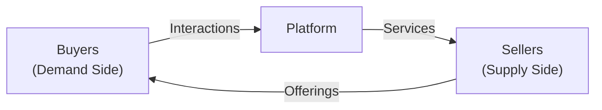

## Overview
Have you ever thought about how certain companies—like streaming services or large online marketplaces—create massive value? Well, I remember an “aha!” moment when I finally realized just how central platform and subscription models are becoming to modern corporate strategies. For corporate issuers, these models aren’t just trendy business ideas; they’re often central to long-term value creation, stable cash flows, and even investor relations.

This section explores the key features of platform businesses and subscription-based revenue models. We’ll talk about why companies are so keen on building “platform moats,” how subscription-based offerings lead to predictable revenue, and the kind of metrics (like recurring revenue) that you might see CFOs highlight in quarterly earnings calls. We’ll also touch on challenges such as user churn, network congestion, and regulatory scrutiny. Let’s start with a look at platforms.

## Defining Platform Business Models
A platform business model is a system that enables interactions between two or more interdependent groups. For instance, an online marketplace may connect sellers and buyers, while a ride-sharing platform connects drivers and passengers. Platforms create value through facilitating these exchanges rather than owning the underlying resources. This is sometimes called the “asset-light” approach, as the platform itself may not own physical inventory or vehicles.

Platform-based companies often gain momentum by offering a core value proposition—for instance, a marketplace that allows individuals to sell services or items directly to other users. Because the platform itself manages the technological infrastructure and user experience, it can scale rapidly with relatively low marginal costs. And that scaling often leads to something even more exciting: network effects.

## Network Effects
In a platform context, network effects are powerful. Put simply, every new user or participant on the platform adds value for existing users. Imagine a social media network with only two users—there’s not much going on, right? But if the user base grows to a million or more, the platform becomes exponentially more interesting and beneficial to all participants.

Companies with strong network effects can build near-monopolistic moats. Competitors face an uphill battle convincing users to switch, especially if the established platform offers a large, engaged community. However, there’s a flip side: a platform that fails to reach critical mass may never attract enough users to sustain transactions, and the entire system can collapse.

## Subscription Revenue Streams
Subscription-based models are another major strategy for corporate issuers. Instead of one-off transactions, subscribers pay periodically—monthly, quarterly, or annually—for ongoing access to products or services. This model appears everywhere: from software-as-a-service (SaaS) and streaming media to specialized data providers and subscription meal kits.

The big benefit of subscription revenue is predictability. Having a locked-in set of subscribers provides more confidence in future cash flow projections, which can be mighty appealing to investors, creditors, and management teams trying to plan expansions. Plus, subscriptions encourage a deep focus on customer satisfaction. High churn can destroy a subscription model’s economics, so companies often build entire departments to reduce customer cancellations.

## Freemium Approach
Freemium is a clever combination of “free” and “premium.” In many freemium models, you give away a certain set of features at no cost. The idea is to secure a large user base—maybe the users say, “Hey, I get a lot of value for free here.” Some portion of those free users eventually sees enough value in advanced features to upgrade to a paid tier.

A friend once told me about a small photo-editing app that took this route. At first, it had only a couple thousand paid users. But once they offered a free version, usage (and brand recognition) soared, and paying users also increased. It’s not always guaranteed, but done right, the freemium approach can build scale rapidly while monetizing a fraction of heavily engaged users.

## Key Metrics
To evaluate the success of platform and subscription businesses, analysts and corporate finance professionals often monitor metrics centered on recurring revenue and cost efficiency. Here are a few:

• Monthly Recurring Revenue (MRR) and Annual Recurring Revenue (ARR): MRR and ARR indicate the revenue that a company expects to receive each month or year. They act as a solid baseline for forecasting and budgeting.  
• User Acquisition Cost (UAC): Reflects how much it costs to acquire each new paying user or subscriber. A lower UAC can help expand the user base more profitably.  
• Customer Churn: The rate at which customers stop subscribing over a specific period. Even a small uptick in churn can translate to a substantial revenue decline over time.  
• Lifetime Value (LTV): An estimate of the total net profit a company expects to earn over its entire relationship with a single customer.  
• Engagement Metrics: In platform businesses, user activity—like messages sent, photos shared, or transactions made—often serves as a proxy for network health.  

In simplified terms, we might represent LTV mathematically as:


\text{LTV} = \frac{\text{ARR} \times \text{Gross Margin}}{\text{Annual Churn Rate}}


Of course, this is just one version of the formula, but it highlights how churn and gross margin directly affect customer profitability.

## Scaling and Marginal Costs
A major reason these business models are so popular is their scalability. Digital platforms have relatively low marginal costs. Once you’ve built a user-friendly app or online portal, adding another thousand or even a million new users may require only minimal server upgrades and marketing spend. This can lead to explosive growth in profit margins once you’ve covered fixed costs (like initial software development and product design).

But be careful: scale can sometimes bring unexpected headaches. Network congestion, data privacy demands, or intense customer service needs can chip away at the rosy margin story.

## Regulatory Concerns
Dominant platform companies occasionally face antitrust and consumer protection scrutiny. Regulators worry that a single platform can dominate a market so completely that competition is harmed. Data privacy is also a hot topic. If the platform collects vast amounts of user data, it must comply with regulations like GDPR in the EU or other local privacy laws in different jurisdictions.

A subscription-focused business, meanwhile, might face accountability in how it discloses recurring fees or automatically renews user subscriptions. Although these aren’t typically as headline-grabbing as antitrust fights, regulatory compliance is an ongoing concern.

## Diagram: Simplified Platform Ecosystem
Below is a simple Mermaid diagram illustrating a generic platform. The platform sits at the center, connecting different user groups:

In this diagram:  
• The platform facilitates demand-side buyers and supply-side sellers.  
• Interactions typically involve listing products or services on the seller side, with buyers searching and purchasing through the platform interface.

## Practical Examples
Imagine a major e-commerce site: it doesn’t usually own the inventory. Third-party merchants handle manufacturing, warehousing, and shipping. The platform’s job is to connect these merchants with millions of potential buyers. Meanwhile, the platform’s brand and user experience control the entire purchase funnel.

Or consider a subscription-based entertainment platform: it publishes new streaming content regularly, collecting monthly fees from viewers. The cost to add one more viewer is negligible compared to the overall infrastructure, so every additional subscriber can significantly boost profitability.

## Best Practices and Pitfalls
Companies adopting platform and subscription models often emphasize long-term customer relationships. This usually involves:  
• Clear value proposition that attracts and retains users.  
• Rigorous data analysis to monitor churn and respond to user behavior.  
• Ongoing feature development or content addition to keep the experience fresh.  

Pitfalls might include poor user experience, uncompetitive pricing, or a lack of network effect. Even a strong platform can falter if it loses focus on regulatory compliance or fails to maintain trust—just think about how quickly negative publicity can reduce user engagement.

## Exam Relevance
From a CFA Level I standpoint, understanding platform and subscription-based models is crucial when analyzing corporate issuers, particularly their revenue sustainability and growth patterns. These models often influence a firm’s capital allocation decisions, cost structures, and corporate governance. Candidates should be prepared to:  
• Evaluate how recurring revenue streams affect valuation multiples.  
• Assess the impact of user churn on profitability and enterprise value.  
• Interpret financial statements where deferred revenue from subscriptions can be significant.  
• Understand the strategic trade-offs between acquiring new customers and upselling or retaining existing ones.  

## References and Further Reading
• Parker, G. G., Van Alstyne, M. W., & Choudary, S. P. (2016). “Platform Revolution.” (W.W. Norton)  
• Mullins, J., & Komisar, R. (2009). “Getting to Plan B: Breaking Through to a Better Business Model.” (Harvard Business Press)  

Additionally, it can help to look up IFRS 15 or ASC 606 guidelines to see how subscription revenue recognition works under various accounting frameworks.

## Test Your Knowledge: Platform and Subscription-Based Models



### Which characteristic best describes a platform business model?
- [ ] Owning all production assets to reduce operating risk
- [ ] Selling only through offline channels to avoid technology costs
- [x] Facilitating exchanges between interdependent groups
- [ ] Maintaining strict pricing controls on each group

> **Explanation:** A platform focuses on connecting different user groups (e.g., buyers and sellers) to facilitate value-creating interactions, rather than owning all assets or strictly controlling pricing.

### Which of the following is most likely an advantage of strong network effects in a platform?
- [ ] Increased taxation from government bodies
- [x] Greater value creation as more users join
- [ ] Less dependency on user data privacy
- [ ] Mandatory equal profit-sharing among users

> **Explanation:** Network effects lead to increasing value for all participants as new users join. This often creates a virtuous cycle of user growth and engagement.

### A freemium approach typically involves:
- [ ] Charging all users from the moment they sign up
- [x] Offering a free tier with optional paid tiers for advanced features
- [ ] Providing no free access whatsoever
- [ ] Restricting user growth to maintain exclusivity

> **Explanation:** Freemium models allow users to access a basic version of the product for free, charging for premium features or additional usage.

### What does recurring revenue typically signify in a subscription model?
- [ ] Revenue generated on a one-off basis per transaction
- [x] Revenue expected to continue regularly in future periods
- [ ] Revenue subject to immediate recognition limits
- [ ] Revenue that cannot be deferred

> **Explanation:** Recurring revenue indicates inflows expected on a regular basis (monthly, quarterly, or annually) due to the subscription nature of the service.

### Which metric is used to approximate the total profit expected from a customer over the entire relationship cycle?
- [ ] ARR
- [ ] Churn rate
- [ ] Net Working Capital
- [x] Lifetime Value (LTV)

> **Explanation:** Lifetime Value measures the estimated net profit from a customer over the duration of their relationship with the company.

### Which of the following statements about marginal costs in digital platform businesses is most accurate?
- [x] They tend to be relatively low once the platform is established
- [ ] They are generally higher than in traditional manufacturing
- [ ] They cannot be optimized by technological improvements
- [ ] They are unaffected by the scale of production

> **Explanation:** Digital platforms often have minimal incremental costs for adding new users after the initial fixed infrastructure is in place.

### Why might a subscription-based business place tremendous importance on churn rate?
- [x] High churn erodes the expected revenue stream and lowers profitability
- [ ] Low churn always indicates inferior product quality
- [x] High churn suggests revenue obligations to customers
- [ ] Churn has no impact on customer lifetime value

> **Explanation:** If churn is high, the business loses future subscription payments, reducing predictable revenue streams and profitability.

### Which of the following is a potential regulatory issue for platform firms?
- [ ] Strictly limiting user data retention
- [x] Antitrust investigations related to market dominance
- [ ] Banning new customers from joining
- [ ] Mandating all firms to adopt the platform model

> **Explanation:** Leading platform firms sometimes face antitrust scrutiny if they become too dominant, thereby stifling competition.

### A major reason platforms offer free basic services is:
- [x] To attract a large user base and benefit from network effects
- [ ] To reduce the marginal cost of customer service
- [ ] To avoid any revenue recognition complexities
- [ ] To ensure compliance with IFRS

> **Explanation:** Offering free services helps the platform quickly grow a user base, strengthening network effects and brand visibility.

### A platform that connects food delivery drivers with consumers is an example of:
- [x] A business model leveraging network effects
- [ ] A purely subscription-based strategy
- [ ] A manufacturing-centric approach
- [ ] A platform with no marketing expenses

> **Explanation:** The food delivery platform creates value by enabling interactions between drivers (supply side) and consumers ordering meals (demand side), thus illustrating a classic two-sided network effect platform.


