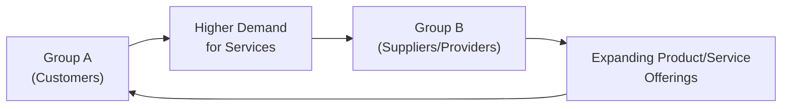
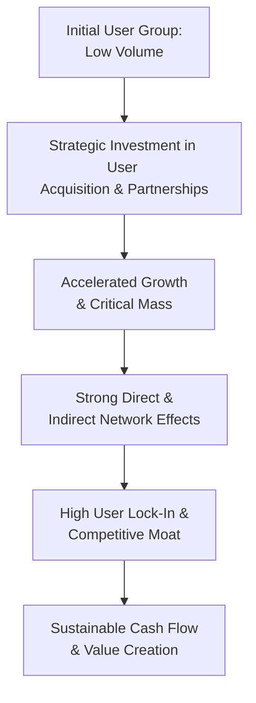

## Introduction and Overview

Network effects can seem almost magical at first glance—suddenly, an obscure social media platform or an e-commerce marketplace transforms into the default daily destination for millions of customers. You might wonder, “Why does everyone flock to it?” The short answer is that the more people who use a product or service, the more valuable it often becomes for each additional user. This phenomenon is at the core of “network effects,” while the term “competitive moat” is just a fancy way of describing a company’s long-term protective barrier against the onslaught of hungry rivals. In the CFA® curriculum, understanding how network effects and competitive moats intertwine with business models is incredibly valuable. After all, these dynamics have profound consequences for valuation, strategic partnerships, capital allocation, and more.

But let me share a quick anecdote—just to illustrate how network effects feel in everyday life. Years ago, I tried out a small, new social networking site that promised cutting-edge features. It was technically impressive but had precisely three active users: me, my best friend, and the site’s founder (I guess?). Great features, but with only three users, the platform was basically useless. That’s a direct network effect in action: if your network is tiny, nobody gains enough value to stick around. And if no one sticks around, well, there’s no one to share content with. This is literally how so many “great ideas” fizzle out in their early stages. Now, let’s dig deeper into how network effects work, why they create high switching costs, and how companies leverage these dynamics to build formidable moats.

## Direct Network Effects

Direct network effects refer to a situation where each new user directly improves the experience or value for all the existing users. Telephones, for instance, demonstrate a quintessential direct network effect: if you were the lone telephone subscriber, there’d be nobody to talk to. Every time a new person gets a phone line, your network of possible connections grows, making telephone service more valuable to you and to everyone else on the network.

In corporate finance terms, direct network effects often boost a company’s expected cash flows and growth potential. From a valuation standpoint, the intangible asset here is the user base itself. Under IFRS or US GAAP, this kind of intangible value is rarely recognized on the balance sheet unless it’s acquired in a business combination, in which case it might appear as goodwill or another intangible. Regardless of the specific accounting treatment, analysts should pay attention to network-driven revenue expansions and cost efficiencies—especially for companies reliant on user numbers. After all, a robust user base can command a premium price in M&A or capital market transactions because the acquirer can tap into that massive network from day one.

Let’s visualize direct network effects using a simple flow diagram:

In this cycle, each new participant draws more potential participants, amplifying the product’s value in an ever-reinforcing feedback loop.

## Indirect Network Effects

Unlike direct network effects—where growth of a single user group drives the platform’s popularity—indirect network effects involve multiple interdependent parties. Think ride-sharing. A bigger pool of drivers makes the service more attractive to riders because wait times are shorter. Conversely, thriving rider demand makes the service more attractive to drivers, because availability of fares is higher. These complementary effects feed one another.

We see indirect network effects in:

• Two-sided marketplaces (e.g., online auctions or freelance platforms).  
• Payment networks (merchants attract shoppers; shoppers attract more merchants).  
• App ecosystems (more developers create more apps, attracting more end users; more end users attract more developers).  

A small note: Indirect network effects often require careful orchestration by management. In Chapter 7.9 (Partnerships and Strategic Alliances), we discuss how these collaborations can help jumpstart the network by securing crucial partners early on. One offset to keep in mind, though—if one side (or multiple sides) of the ecosystem is neglected, the entire system can unravel. For instance, saturating a ride-sharing market with drivers but ignoring the rider experience (through inadequate marketing or poor customer support) might stall the overall network momentum.

Below is a schematic representation to illustrate how growth in one user group can spur the growth of a complementary user group, further increasing the overall platform utility:

## Competitive Moats

Competitive moats, a phrase popularized by legendary investor Warren Buffett, describe long-term barriers that protect a company’s profits and market share from rival incursions. Firms with strong moats can often generate higher returns on capital for a sustained period—an essential element analysts study when forecasting free cash flow or applying discounted cash flow (DCF) models. These moats can take shape in multiple ways:

• Strong brand recognition or loyalty (see Chapter 7.10 on corporate reputation).  
• Proprietary technology or patents.  
• Economies of scale or cost advantages.  
• Regulatory licenses or exclusive rights.  
• Network effects that make the product increasingly indispensable.

While moats provided by brand recognition or patents might be classical, network-driven moats can be incredibly formidable, because they are self-reinforcing. Once a critical mass of users is reached (more on that soon), it becomes outrageously tough for competitors to peel them away.

A side note for exam readiness: The question “Does the company have a moat?” often shows up indirectly in scenario-based prompts for corporate finance or equity valuation questions. In real life, we might ask, “Will the competition replicate these features quickly?” or “How entrenched is the brand loyalty?” Understanding whether the moat is network-based or derived from other factors can significantly alter financial forecasts and risk assessments.

## Lock-In and Switching Costs

High switching costs are one hallmark of strong network effects. Why ditch a social media platform that 99% of your friends are on for a new one where none of them are? This phenomenon of “lock-in” is partly practical: if the network is valuable primarily because of who is on it, leaving means losing vital connections. But it’s also partly psychological—familiar user interfaces, well-established contact lists, saved preferences, user-generated content, etc.

Some companies deliberately design friction to discourage switching (like data portability restrictions or unique content that can’t be transferred). Others rely on the sheer scale of community interactions. Whichever the approach, these switching costs create a significant advantage. In analyzing corporate capital structure decisions (Chapter 6), companies with high user lock-in might leverage that stability to support higher debt levels or raise funds more cheaply, as investors perceive less revenue risk from competitive encroachment.

## Critical Mass and the S-Curve Adoption

Reaching critical mass is the big challenge for any new network- or platform-based venture. Early on, you typically have an awkward “chicken-and-egg” problem. For example, a new payment platform can’t attract enough merchants without a base of customers, and vice versa. This phenomenon often leads to strategic subsidies: a platform might offer discounted or free services to early participants just to get the ball rolling.

Once critical mass is reached, adoption can accelerate exponentially. We typically see an S-curve: slow initial traction, a steep growth spike once momentum hits, and finally, a plateau or maturity stage as the market saturates. If you’re analyzing a company’s business model for a capital investment or a strategic partnership, spotting where it currently sits on that S-curve influences your forecast drastically. Hitting that tipping point can shift the entire business from borderline unprofitable to hyper profitable within just a few quarters.

## Strategic Partnerships to Enhance Network Effects

Strategic partnerships can be a major catalyst for building network effects quickly. For instance, software companies might collaborate with hardware manufacturers to pre-install their apps, or a streaming service can partner with a telecom operator to include a one-year subscription in certain mobile plans. Partnerships can come in many forms—as we discuss in other sections of the curriculum (Chapter 7.9 Partnerships and Strategic Alliances). The objective is to harness someone else’s user base, distribution channels, or brand credibility to achieve faster adoption and scale.

A well-timed alliance can literally catapult a fledgling network from near zero to a critical mass of users, especially if the partnering entity brings valuable synergies such as marketing support, brand trust, or an established customer base. For your CFA® exam or real-world analysis, keep in mind these alliances often come with exclusivity clauses, revenue-sharing agreements, or cross-holding arrangements that can affect the firm’s financial statements.

## Risk of Overexposure and Negative Externalities

Everyone loves a growing user base, but hyper-fast growth can actually backfire if the infrastructure or community governance can’t keep up. Think about an e-commerce platform that onboards millions of sellers in a short timeframe but fails to ensure product quality. Suddenly, customers encounter a flood of low-quality offerings or even fraudulent listings, and the platform’s reputation takes a nosedive—eroding that precious network advantage.

From an operational standpoint, it pays to pace the expansions. From a portfolio management angle, you’ll want to watch for signs that a “hot new platform” is overextending. Cases abound where user dissatisfaction, spam, or negative user-generated content (UGC) significantly reduces the network’s perceived value. Monitoring user churn rates, net promoter scores (NPS), or changes in the traffic-to-active-user ratio can offer valuable insights into whether the network effect is strengthening or faltering.

## Practical Example of a Platform’s Takeoff

Sometimes, it helps to see real data (even if simplified). Suppose an online marketplace invests heavily in attracting 1,000 sellers through a promotional subsidy:

| Phase            | Sellers | Buyers | Revenue per Buyer | Key Observations                  |
|------------------|--------:|-------:|-------------------:|-----------------------------------|
| Start (Month 1)  |     100 |    500 |              $50   | Struggles to attract adequate supply. Revenue is minimal. |
| Growth (Month 3) |   1,000 |  5,000 |              $55   | Substantial variety draws more buyers, revenue growth.     |
| Critical Mass (Month 6) |  1,500 |  15,000 |         $60   | Word-of-mouth and high user satisfaction accelerate growth. |
| Scale (Month 9)  |  2,000 |  30,000 |              $65   | Hits an inflection point, new users join rapidly.           |

As more sellers joined (fueled by early subsidies), the marketplace could rapidly go from a handful of transactions to thousands per day. By Month 9, the marketplace sees a solid base of repeat buyers. This is a simplified example, but it demonstrates that capital investment in user acquisition can turn the tide. The same logic applies in equity valuation: your discounted cash flow or multiples-based analysis might reflect a much different valuation once that steep slope of growth materializes.

## Behavioral and Managerial Considerations

Earlier in Chapter 7.6 on Behavioral Aspects of Management Decisions, we discuss how biases can influence corporate choices. In the context of network effects, a key pitfall is managerial over-optimism—believing that “If we build it, they will come.” Sometimes they don’t come, or at least not fast enough. Another challenge is misjudging how easy it might be for a competitor to replicate at scale, effectively neutralizing one’s perceived advantage. 

Senior executives might also place too much emphasis on vanity metrics—like total downloads or signups—without analyzing daily active users, churn, or real engagement. In practice (and definitely for exam scenarios), it’s important to dissect these usage metrics carefully. If people sign up but never return, you don’t really have a robust network effect in place.

## Diagrams: Visualizing Network Growth and Competitive Advantages

Let’s combine some of these themes—direct network growth, indirect network effects, and the concept of a protective moat—into one integrated diagram:

The journey often involves an initial lift (investments or partnerships), rapid user growth, then a period of sustained advantage characterized by lock-in and strong moats.

## Tying It into Overall Corporate Strategy

In the broader context of corporate issuers (Volume 3), network effects and moats can influence:

• Capital Structure (Chapter 6): Firms with robust moats might sustain higher leverage.  
• Dividend Policies (Chapter 8): Stable cash flows from entrenched user bases could allow more predictable dividends or share repurchases.  
• M&A Strategies (Chapter 9): Acquiring a competitor’s user base can speed up your path to critical mass or help defend your turf against new entrants.  
• Corporate Governance (Chapter 3): Boards overseeing network-heavy companies typically ensure leadership invests enough in platform maintenance, community standards, and product innovation to protect the moat.  

At Level I, understanding these relationships sets the stage for more advanced applications in Level II and Level III, such as scenario analysis on synergy or intangible asset valuation.

## Best Practices and Common Pitfalls

• Thoroughly analyze user metrics: Don’t just watch signups; measure engagement, retention, and churn.  
• Evaluate the supply-demand equilibrium in two-sided markets: Real synergy requires balanced growth on both sides.  
• Maintain quality control: Letting in spammers or poor-quality content can reverse positive network effects.  
• Keep an eye on potential regulatory changes: Rapid growth often attracts antitrust scrutiny, especially in digital platforms.  
• Budget for initial subsidies: Reaching that critical user group often demands up-front financing.  

## Final Exam Tips

• Scenario-based questions might ask you to assess a company’s moat. Use a structured approach: identify sources of advantage (brand, scale, network), evaluate sustainability, and consider regulatory or technological changes that might erode that advantage.  
• When calculating cost of capital or capital structure, factor in the greater stability that a deeply entrenched user base can provide.  
• Watch for “competitive moat” references in case studies focusing on new technologies or platforms. You might be asked to estimate intangible value or synergy in an acquisition.  
• Time management: In essay-style questions, quickly clarify your position on whether a network effect is likely to persist or be threatened by competition. Lay out the rationale and wrap up with key metrics or forward-looking statements.  

## Glossary

Network Effect: When a product or service gains additional value as more people use it.  
Switching Cost: The cost (financial, emotional, or time-based) a user incurs when moving to a competing product or platform.  
Competitive Moat: A durable advantage that protects a company’s profits or market share from rivals.  
Critical Mass: Minimum number of users required for a network effect to become self-sustaining.  
S-Curve Adoption: A pattern of innovation diffusion characterized by early slow growth, rapid uptake, and eventual plateau.  
Indirect Network Effect: Growth in one user type attracts complementary user types, which in turn increase the value for the original user base.

## References and Further Reading

• Shapiro, C., & Varian, H. R. (1999). “Information Rules: A Strategic Guide to the Network Economy.” (Harvard Business School Press)  
• Porter, M. E. (1979). “How Competitive Forces Shape Strategy.” Harvard Business Review.  
• CFA Institute. (Latest Edition). CFA® Program Curriculum. (For deeper insights into business models, moats, and valuation techniques.)  
• OECD Guidelines on Competition for Digital Platforms (online resource), focusing on antitrust concerns around large platform providers.

## Mastering Network Effects and Competitive Moats: Self-Test



### In a direct network effect scenario, how does each additional user affect the platform?

- [x] It directly increases the platform’s value for all current users.
- [ ] It has no impact on user experience.
- [ ] It only benefits the company’s revenue but not customer experience.
- [ ] It dilutes existing user benefits by creating demand overload.

> **Explanation:** Direct network effects mean each new user increases the overall value for others already on the network. A new user creates a new connection possibility, raising the network’s utility.

### Which of the following best describes an indirect network effect?

- [ ] A platform that is used by only one group of users and gains no wider benefit.  
- [ ] A loyalty program that rewards a single user for repeated use.  
- [x] Growth within one user group attracts another complementary group, creating mutual benefits.  
- [ ] When a company uses an exclusive patent to lock in customers.  

> **Explanation:** Indirect network effects center on the interplay between distinct groups, such that increased activity on one side stimulates growth (and benefits) for another side.

### What is a “competitive moat”?

- [ ] A short-term pricing tactic to undercut rivals.  
- [x] A sustainable advantage that protects a company’s market share and profits from competitors.  
- [ ] A government subsidy designed to foster industry growth.  
- [ ] The difference between fixed and variable costs in production.  

> **Explanation:** A competitive moat is a durable protective barrier—stemming from brand strength, network lock-in, cost advantages, etc.—that hinders competitor encroachment.

### High switching costs in a network effect context often originate from:

- [ ] A universal standard that all competitors share.  
- [ ] Minimal user interaction.  
- [x] Losing access to critical social or professional connections upon leaving the network.  
- [ ] Government-imposed limitations on competition.  

> **Explanation:** High switching costs usually arise when the value of the network is strongly tied to the connections or data within it, making leaving far less appealing.

### Which statement accurately captures the concept of critical mass in network-based business models?

- [ ] It is a mandatory corporate legal threshold for platform registration.  
- [x] It is the smallest user base at which network effects become self-sustaining, driving rapid adoption.  
- [ ] It refers to a brand’s marketing budget.  
- [x] It indicates the platform is guaranteed to have a monopoly.  

> **Explanation:** Once critical mass is reached, the platform typically experiences exponential user adoption, reinforcing network effects. However, reaching it does not necessarily guarantee monopoly status.

### In a ride-sharing platform, increased drivers lead to:

- [x] Shorter wait times for riders and more rides for drivers, reinforcing each other’s growth.  
- [ ] Confusion among riders due to too many choices, curbing network effects.  
- [ ] Lower ridership because drivers can’t coordinate effectively.  
- [ ] Less revenue potential because competition among drivers offsets demand.  

> **Explanation:** More drivers reduce wait times and cost, attracting more riders, and thus more riders in turn justify more drivers joining.

### One major risk of overexposure for a rapidly growing network is:

- [x] Poor quality control leading to user dissatisfaction and eventual churn.  
- [ ] Users collectively deciding to limit usage time for personal reasons.  
- [x] The platform inadvertently complying with all consumer-protection guidelines.  
- [ ] Instant regulatory approval due to the platform’s popularity.  

> **Explanation:** While fast growth may seem ideal, it can backfire if quality or user experience deteriorates, prompting users to abandon the platform, eroding the network’s value.

### Which of the following tactics might a platform pursue to reach critical mass quickly?

- [x] Strategic subsidies or discounted services for early adopters.  
- [ ] Eliminating all marketing expenditures to rely on word-of-mouth.  
- [ ] Raising switching costs before even having users.  
- [ ] Preventing partnerships with other brands.  

> **Explanation:** Platforms often subsidize or discount services to attract a critical number of participants so that organic growth takes hold.

### From a CFA curriculum perspective, why is identifying a company’s competitive moat important in valuation?

- [ ] Because moats are required for IFRS intangible asset recognition.  
- [ ] Because short-term liquidity metrics replace the need for analyzing moats.  
- [x] Because moats can sustain higher returns on capital and cash flows, leading to higher valuations.  
- [ ] Because moats are directly reported as line items on the balance sheet.  

> **Explanation:** Strong moats generally allow a firm to earn excess returns for longer, influencing discounted cash flow assumptions and target price estimates.

### True or False: 
Network effects alone guarantee indefinite market dominance for a platform.

- [x] True
- [ ] False

> **Explanation:** Actually, this statement is overly simplistic and somewhat trick. Although network effects can build a formidable advantage, no dominance is absolutely “guaranteed.” However, in many exam or textbook scenarios, platforms with strong network effects do tend to dominate for a protracted period. Yet, in practice, new technologies, shifting user preferences, or regulatory changes can still disrupt the incumbents.


