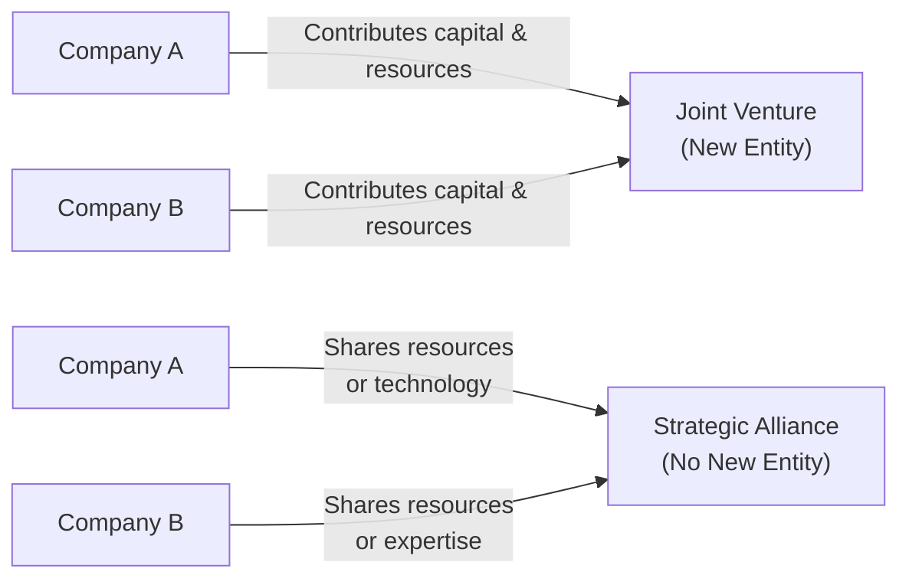

## Introduction
Well, you know how sometimes you want to do something really big—maybe launch a new product line—but your company doesn’t have all the pieces? You might find a partner who has what you’re missing, and together, you share resources to get things done. Welcome to the world of partnerships and strategic alliances. These structures can expand market reach, optimize R&D costs, and create game-changing synergies.

This section explores partnerships and strategic alliances from the perspective of corporate issuers. Whether you’re a seasoned finance professional or stepping into these concepts for the first time, you’ll find it helpful to see how these relationships form, how they’re governed, what can go wrong, and how to measure success. Let’s dive in.

## Defining Partnerships and Strategic Alliances
In general business usage, a “partnership” can mean everything from two people opening a small store to global corporations collaborating in a major venture. For our purposes, partnerships and strategic alliances are formal, long-term relationships in which two or more independent entities share resources, capabilities, and risks to achieve mutually beneficial goals.

• A partnership could be as simple as two companies co-marketing each other’s products or as formal as forming a new entity.  
• A strategic alliance is more about ongoing cooperation without necessarily creating a brand-new corporation.  

The distinction often lies in the level of integration, legal structure, and complexity. 

## Key Differences: Joint Ventures vs. Strategic Alliances
Joint ventures (JVs) and strategic alliances sound similar, but there’s a big difference:

• Joint Venture:  
  – Two (or more) entities form a separate legal entity—think of it like a standalone baby company with “parents.”  
  – Each partner typically contributes capital, technology, or other resources.  
  – Profits (and losses) generally get shared based on ownership percentages.  

• Strategic Alliance:  
  – Less formal structure, no brand-new legal entity needed.  
  – Each partner remains independent but commits resources to shared projects.  
  – Objectives might include co-development, research collaboration, or distribution partnerships.

Here’s a quick visual to illustrate the distinction:

In a JV, you can see that Company A and Company B create an entirely separate legal entity—like a “child.” In a strategic alliance, each company typically remains independent but forms a formal or semi-formal agreement to collaborate on specific business goals.

## Motivations for Partnerships and Alliances
Companies often pursue these relationships to:

• Access New Markets: Maybe you have a groundbreaking product but lack distribution presence in a new geography. A local partner can help you penetrate that market.  
• Acquire Expertise: If a biotech startup needs advanced manufacturing, it might partner with a pharmaceutical giant.  
• Share Risk and Costs: Large-scale projects—like deep-sea oil drilling or big R&D undertakings—can be expensive. Splitting the bill (and potential profits) can make a risky project feasible.  
• Accelerate Product Development: Collaborations can speed up innovation cycles thanks to pooled talent, knowledge, and tech resources.

A personal anecdote: I once worked with a tech startup that had amazing software but struggled with hardware design. After forging a strategic alliance with a hardware supplier, they nailed down a new device in half the time they would have on their own. Yes, there were squabbles over design specs and revenue splits, but the synergy ended up being worth it.

## Complementary Capabilities
For alliances to succeed, each party should bring something unique and valuable:

• Technology & IP: Maybe you’re the R&D powerhouse.  
• Market Knowledge: Your partner understands the local culture, consumer preferences, and regulatory environment.  
• Distribution Channels: Perhaps you have established wholesalers or retailers.  
• Brand Recognition: One partner may have strong global branding, while the other is still building credibility.

In short, synergy happens when 1 + 1 = 3. However, synergy isn’t automatic. You have to work at integrating complementary capabilities, sometimes involving a learning curve—and some diplomacy—on both sides.

## Governance and Control
Even the strongest alliances can unravel without robust governance. The governance framework should address:

• Decision Rights: Who decides on budgets, staffing, or strategic priorities?  
• Intellectual Property (IP) Ownership: If the two companies jointly develop new technology, who keeps the patents?  
• Dispute Resolution Mechanisms: Clear protocols for settling conflicts reduce friction.  
• Exit Strategies: If priorities change down the road, how can each partner walk away without major disputes or inefficiencies?

### Formal Agreements
All of the above is typically spelled out in a contract or memorandum of understanding. Some alliances even create a governance committee composed of senior managers from both sides to oversee key decisions. For example, IFRS (e.g., IFRS 11, Joint Arrangements) and U.S. GAAP have specific guidelines for how to account for joint ventures, but the fundamental principle is that an entity must properly reflect the nature of its rights and obligations, ensuring fair reporting to its shareholders.

## Cultural Alignment
When alliances span different countries—or just different organizational cultures—things can get tricky. A sense of “us vs. them” can doom even the best strategic plan.

• Organizational Culture Clashes: One partner might be hierarchical while the other is more agile and decentralized.  
• National Culture Differences: Communication styles, risk tolerance, negotiation norms—all can introduce misunderstandings.  
• Timing and Deadlines: Some cultures prize punctuality above all else; others focus on relationships over strict timelines.

Open communication, trust-building exercises, and occasional in-person meetups (if feasible) can mitigate cultural friction. Think about having consistent protocol for meetings, updates, and clearing misunderstandings before they become big issues.

## Performance Measurement
It’s easy to sign an agreement, cut a ribbon, and declare victory. But are you actually delivering on the alliance’s goals? That’s where performance measurement comes in.

### Key Performance Indicators (KPIs)
• Financial Metrics: Joint revenue, cost savings, profitability.  
• Operational Metrics: Product development timelines, quality improvements, time-to-market reduction.  
• Market Benchmarks: Growth in market share, improved brand awareness, entry into new customer segments.

Let’s suppose you have a co-marketing alliance. You might track the number of joint leads, conversion rates from those leads, and average revenue per lead. If the alliance is around supply chain management, you might measure inventory turnover or cost savings in shipping.

### Shared or Separate KPIs?
Often each partner has its own internal performance targets, but you’ll also want alliance-specific KPIs so that the partnership’s health can be monitored overall. Make sure the metrics align with your joint objectives—otherwise, you’ll have each partner optimizing different, possibly opposing goals.

## Exit Provisions
Alliances don’t always last forever. Business goals shift, technologies change, or the expected synergy fails to materialize. A well-written alliance agreement:

• Specifies circumstances under which a partner can exit.  
• Details how jointly owned IP, physical assets, and intangible rights are allocated or sold.  
• Outlines transitional support—e.g., if a JV dissolves, how do you handle ongoing customer obligations or warranties?

Failing to plan for exit often leads to protracted legal battles, fracturing relationships, and reputational damage. By defining clear exit or termination provisions upfront, you minimize disruptions.

## Real-World Examples
• Automotive JVs: Many global automakers form joint ventures with local production partners—especially in emerging market countries—to navigate import tariffs and leverage local distribution.  
• Tech Giants’ Alliances: Large tech companies often form alliances to standardize new protocols (e.g., cloud computing standards) or to co-develop next-gen hardware.  
• Pharmaceutical Collaborations: Drug companies often ally to share R&D costs and expedite clinical trials.  

One success story is that of a Japanese automobile manufacturer forming a JV with a U.S.-based car company to gain better access to the North American market. Each side contributed manufacturing know-how but also had to accept the other’s management style. Eventually, the venture became a major production hub, showing how synergy can flourish under healthy governance.

## Practical Diagram of Alliance Lifecycle
Below is a simplified illustration of how a strategic alliance might progress from initial concept to potential exit:

• Concept & Partner Search: Identify why you need the alliance—new technology, shared risk, etc.  
• Negotiation & Due Diligence: Clarify partner strengths, assess financial health, evaluate synergy.  
• Formalization: Draft legal frameworks, set governance structures.  
• Implementation & Integration: Launch operational processes, coordinate teams.  
• Monitoring & Measurement: Track KPIs, adapt if results deviate from expectations.  
• Continuation, Expansion, or Exit: If the alliance is thriving, you might deepen the relationship. If it’s not, an exit plan might be triggered.

## Best Practices and Common Pitfalls
### Best Practices
• Clear, Measurable Objectives: Align on explicit goals and the timeframe.  
• Strong Governance: Define roles, responsibilities, and escalation paths.  
• Mutual Trust and Transparency: Share data and resources fairly.  
• Cultural Sensitivity: Foster open communication across geographies.  
• Regular Performance Checkpoints: Use joint KPIs to pivot if needed.

### Common Pitfalls
• Misaligned Incentives: You’re after short-term profits, your partner wants long-term brand building.  
• Poor Communication: Lack of clarity or withheld information breeds resentment.  
• Overestimating Synergy: Not all 1 + 1 = 3 scenarios become reality.  
• Weak Contracts and IP Provisions: Failing to protect key assets or outline usage rights can cause disputes.  
• Underestimating Cultural Clashes: Especially in cross-border ventures, an unaddressed cultural gap can stifle collaboration.

## Accounting Considerations under IFRS and US GAAP
While we’re not going to dive deeply into complex accounting standards, note that both IFRS and US GAAP have specific treatments for joint ventures and equity investments:

• IFRS 11 (Joint Arrangements): Requires companies to classify arrangements as joint operations or joint ventures, each with unique accounting presentations.  
• US GAAP: Typically requires using the equity method if there’s significant influence but not full control.  
• Disclosure Requirements: Both frameworks demand transparency. You’d likely include details like the scope of your alliance, partner responsibilities, potential liabilities, and contingent obligations in your financial statements.

## Implications for CFA Candidates and Exam Points
From a Level I perspective (and building blocks for higher levels), understanding partnerships and alliances is critical for analyzing a company’s strategic position, risk profile, and potential growth. Exam questions might address:

• How to evaluate joint venture performance.  
• How alliances fit into a company’s capital structure strategy.  
• Identifying when an alliance can create value or become a liability.  
• Interpreting financial statements that reflect equity-method investments or consolidated entities.

You might see scenario-based questions testing your ability to interpret footnotes about alliances or evaluate synergy assumptions in corporate valuations.

## Conclusion
Forming a strategic alliance or joint venture can be a game-changer—allowing firms to tap into each other’s resources, expertise, and markets. But it’s not a guaranteed slam dunk. Real success calls for diligent planning, careful alignment of goals, strong governance, cultural awareness, and ongoing performance measurement. When done correctly, alliances can yield new market opportunities, innovative products, and cost efficiencies that neither partner could reach alone.

## Glossary
• Joint Venture: A business arrangement in which two or more parties form a separate legal entity.  
• Strategic Alliance: A partnership where two or more firms collaborate to achieve strategically significant objectives while remaining independent.  
• KPIs (Key Performance Indicators): Quantifiable measures to gauge how effectively an entity is achieving key business goals.  
• Synergy: The added value resulting from combining the strengths of two distinct entities.  
• Governance: Structures and practices ensuring accountability, fairness, and transparency in a relationship.

## References and Further Reading
• Dyer, J. H., Kale, P., & Singh, H. (2001). “How to Make Strategic Alliances Work.” MIT Sloan Management Review.  
• Bleeke, J., & Ernst, D. (1993). “Collaborating to Compete: Using Strategic Alliances and Acquisitions in the Global Marketplace.” Wiley.  
• IFRS 11, Joint Arrangements.  
• CFA Institute. (Current Edition). “Corporate Issuers,” CFA® Program Curriculum.  

## Partnerships and Strategic Alliances Knowledge Check



### Which of the following best describes a joint venture under IFRS?

- [ ] A temporary project-based collaboration without forming a separate entity.
- [x] A separate legal entity created and jointly owned by two or more firms.
- [ ] A marketing agreement that remains off financial statements.
- [ ] A partnership structured to avoid any shared liabilities.

> **Explanation:** Joint ventures typically involve forming a distinct legal entity, with ownership and profit/losses shared by the partner firms under IFRS 11.

### In a strategic alliance, which of the following is a primary advantage over a joint venture?

- [ ] Potential for higher profitability since there is a new legal entity.
- [x] Greater flexibility without requiring formation of a separate entity.
- [ ] Higher legal complexities and cost structures.
- [ ] Full consolidation of financial statements under both IFRS and US GAAP.

> **Explanation:** Strategic alliances often allow each partner to remain independent while collaborating on specific goals, removing the legal overhead of creating a new entity.

### A firm might form a partnership or strategic alliance primarily to:

- [x] Access complementary resources or capabilities that it lacks.
- [ ] Avoid any cultural or operational complexities.
- [ ] Delay market entry initiatives indefinitely.
- [ ] Increase overhead costs and administrative processes.

> **Explanation:** One key reason for partnerships is acquiring resources or expertise not currently possessed, thereby creating synergy.

### In measuring the success of a strategic alliance, which of the following would be most relevant?

- [ ] The personal rapport between mid-level managers in both companies.
- [ ] The governance structure of boards in each independent company.
- [x] Joint KPIs aligned with shared objectives (e.g., revenue, cost savings).
- [ ] The partner’s market share prior to the alliance.

> **Explanation:** Alliances need clearly defined, shared performance metrics to evaluate whether the collaboration is meeting objectives.

### Which term refers to the increased value resulting from the collaboration of two distinct entities?

- [x] Synergy
- [ ] Leveraging
- [x] None of the above
- [ ] Dividend yield

> **Explanation:** Synergy is the additional value or performance generated when entities combine their strengths, making 1 + 1 > 2.

### What is a common risk if a partnership agreement lacks clear dispute resolution clauses?

- [ ] Continuous improvement in both corporations' technology portfolios.
- [x] Protracted legal battles and disruption in operations.
- [ ] Automatic dissolution of the alliance.
- [ ] The automatic absorption of one partner by the other.

> **Explanation:** Without an agreed dispute resolution mechanism, conflicts can escalate into major legal and operational impediments.

### Which factor commonly motivates companies to form cross-border strategic alliances?

- [x] Local market expertise and distribution networks in a new region.
- [ ] Ensuring all capital expenditures remain strictly domestic.
- [x] Immediate job rotation of all senior managers.
- [ ] Mandatory government requirements for accounting disclosure.

> **Explanation:** When expanding abroad, a local partner’s market knowledge drastically reduces the learning curve, fueling faster growth.

### In joint ventures, IFRS often requires:

- [ ] Full consolidation into the financial statements of all partners.
- [x] The equity method for a joint venture that is jointly controlled.
- [ ] Immediate revenue recognition for future obligations.
- [ ] No disclosures in the financial statements.

> **Explanation:** IFRS usually mandates the equity method for joint ventures that have shared control, unless it’s classified as a joint operation under specific criteria.

### Which of the following best characterizes “cultural alignment” in the context of strategic alliances?

- [ ] Negotiating a permanent seat on the partner’s board.
- [ ] Ensuring uniform global tax rates across both partners.
- [x] Harmonizing values, communication styles, and management practices.
- [ ] Outsourcing conflict resolution to external consultants.

> **Explanation:** Cultural alignment is about bridging gaps in work styles, management approaches, and cultural norms to ensure effective collaboration.

### True or False: Strategic alliances necessarily involve the creation of a separate legal entity.

- [x] True
- [ ] False

> **Explanation:** This statement is false. Strategic alliances do not always require the creation of a separate legal entity; that is a characteristic of a joint venture.


