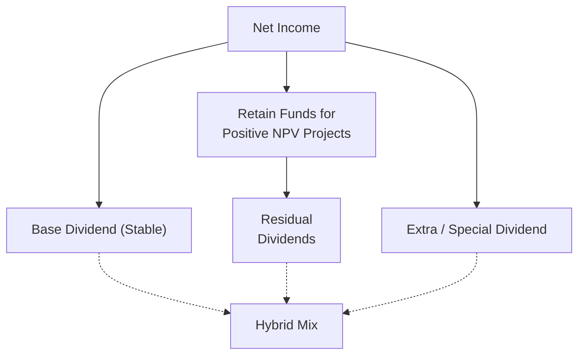

## Introduction to Dividend Policies

Have you ever heard a friend say, “I just love the steady dividend checks from that one stock—it’s like clockwork”? It’s a sentiment that resonates with many income-oriented investors. But behind the scenes, crafting that “clockwork” is no small feat. A firm’s dividend policy—how it decides to dole out profits to shareholders—touches on everything from its expansion plans to its cash flow stability. 

Dividend policies help shape a company’s public image, convey signals about future earnings potential, and keep a business aligned with shareholder expectations. Yet they also raise tricky questions: Should the firm keep more cash on hand for that big project next year? Or should it reward loyal shareholders now with a hefty distribution? Let’s explore three main approaches—Stable, Residual, and Hybrid—and see how professionals weigh such decisions in real-world corporate finance.

## Rationale and Theoretical Underpinnings

Before diving into the specific policies, it helps to remember the underlying theory: in an idealized Modigliani–Miller world (assuming no taxes or transaction costs), dividend policy is theoretically irrelevant to a firm’s value. The logic is that if an investor wants more current income, they can sell shares, and if they want fewer distributions, they can reinvest dividends. 

In the real world, though, we do have taxes, transaction costs, different accounting standards (IFRS vs. US GAAP), shifts in market sentiment, and behavioral factors. Therefore, the way a company structures its dividends actually matters—a lot. For instance, under certain jurisdictions, dividends may be taxed at a higher rate than capital gains—leading some investors to shy away from high-dividend-payout stocks. Meanwhile, other investors—such as retirees—prefer stable dividends to cover their expenses. 

Hence, analysts often examine a firm’s dividend approach alongside its growth prospects, capital structure, and the cost of various financing sources. As a result, dividend policy discussions often overlap with capital investment decisions, corporate governance (can management be trusted to invest wisely if they keep too many internal funds?), and even short-term liquidity considerations. 

## The Stable Dividend Policy

A stable dividend policy is exactly what it sounds like. The company strives to pay out a consistent dividend amount year after year, raising or lowering it only when it’s truly convinced of a long-term shift in earnings capacity. The overall goal? To reduce uncertainty—because nothing rattles markets more than a sudden, unexpected dividend cut.

Companies that use a stable dividend policy usually base their payouts on long-term earnings estimates rather than quarter-to-quarter fluctuations. If next quarter’s earnings dip temporarily, but the board believes they’ll bounce back, the dividend stays the same. Conversely, management increases dividends only if it believes the firm’s earnings have fundamentally risen for the long haul.

You might be thinking: “Why not just distribute dividends proportional to profits each year?” Well, that approach might sound straightforward, but it can lead to wild dividend variability—great in years of bountiful profits, but unnerving for investors in lean times.

### Key Considerations

• Signaling Effect: Investors see a stable or slightly increasing dividend as a sign that management is confident about consistent future cash flows. A cut can trigger anxiety, as it often signals tough times or that previous dividends were unsustainable.

• Investor Clientele: Some investors, especially those seeking steady income (like pension funds), gravitate toward stable-dividend stocks. By maintaining a consistent payout, the firm can cultivate a loyal shareholder base.

• Cash Flow Predictability: Companies with more predictable profits—think utilities, telecommunication providers, or consumer staples—are better suited for stable dividend policies, as they have a clearer line of sight into future cash flows.

### Real-World Case Example

Imagine a major utility company—call it “SteadyPower Inc.” Their monthly revenue from customers is fairly predictable, giving them a pretty stable pool of earnings every year. As a result, SteadyPower opts for a stable dividend approach. Even when they undertake new capital projects, day-to-day volatility in revenue is low, meaning they don’t mind distributing a steady portion of their profits. Over time, income-focused investors flock to SteadyPower because it meets their desire for consistent payouts.

## The Residual Dividend Policy

Under a residual dividend policy, the firm first allocates profits to all the investment opportunities that yield a positive net present value (NPV). After covering those investment needs, whatever remains (the residual) is distributed as dividends. 

In practice, that means dividends could be high one year (if there aren’t many good projects) and low the next (if the company invests heavily). A few CFOs I’ve talked to mention that adopting a purely residual policy can lead to volatility that annoys some shareholders. They might say, “Hey, you raised dividends last year, but now you’re dropping them. What’s going on?” The CFO’s defense might be, “We found some NPV-positive projects—we’d rather plow money into growth!”

### Key Considerations

• Growth Opportunities: If the firm has large expansions or acquisitions on the horizon, its dividend might be minimal for a while—basically, until major investments are funded.

• Agency Issues: Relying on a purely residual approach requires high trust in management to identify truly worthwhile projects. Investors may worry that managers will always point to new “projects” to keep money in-house and avoid paying dividends.

• Impact on Capital Structure: By definition, a firm that uses a residual dividend policy lowers its reliance on external funding for expansions. This means it might carry less debt if it’s mostly reliant on retained earnings. But it could also mean more uneven payouts that might irritate dividend-seeking investors.

### Real-World Case Example

Picture a young technology start-up, “TechSpark Innovations.” They’re constantly developing new software modules and have identified a pipeline of cutting-edge R&D projects. Every time TechSpark sees a promising venture with strong positive NPV, they pour profit into it. Often, there’s little left for dividends—maybe a token payout or none. When a gap occurs in their project queue or if a few projects are delayed, shareholders might suddenly get a bigger dividend than they’re used to. In such situations, TechSpark’s distributions can feel like a roller coaster from quarter to quarter.

## The Hybrid Dividend Policy

You might guess that the hybrid policy attempts to combine the “best of both worlds.” Hybrid approaches generally involve a relatively small, stable “base dividend” that’s maintained consistently, plus the possibility of a “bonus” (or extra) dividend when earnings exceed certain thresholds or when the firm deems it prudent to share excess cash.

Under a hybrid policy, a company can assure income-oriented investors that they’ll receive a minimum, stable payout. At the same time, if the firm is flush with cash after funding any NPV-positive ventures, it can hand out additional dividends. This policy addresses the vulnerability of purely stable or purely residual approaches by balancing predictability with flexibility.

### Key Considerations

• Balancing Stability vs. Growth: By having a secure baseline payout, the company signals confidence and reliability. Meanwhile, special dividends allow for opportunistic distributions without committing to raising the base dividend.

• Shareholder Communication: Investors need a clear explanation of how the “bonus” or “top-up” portion is determined. Lack of transparency might make these extra dividends look arbitrary.

• Market Timing: Timing is everything. If management times the extra dividend for periods when stock prices dip or external financing conditions worsen, it may reduce the company’s cushion. On the other hand, if the firm consistently pays extra dividends when liquidity is strong, it can strengthen investor loyalty.

### Real-World Case Example

Consider a mid-sized manufacturing firm, “IronWorks Co.” They have cyclical but fairly predictable revenues. They pay a base annual dividend of $1.00 per share—stable and modest enough that they can maintain it through moderate downturns. Then in good years, if profits exceed a certain range, they declare an additional special dividend of $0.50 to $0.75 per share. Over time, investors see this consistent baseline plus potential upside as a sweet spot: stable but with the possibility of a nice surprise.

## Diagram of Dividend Flows

Below is a simplified diagram using Mermaid.js that illustrates how these dividend policies connect to corporate earnings and cash requirements:

In this diagram:  
• “Net Income” initially splits into funds retained for profitable investments and funds designated for dividends.  
• Under a strict residual approach, we use “Retain Funds for Positive NPV Projects” first, then pay “Residual Dividends.”  
• Under a stable approach, we set a “Base Dividend.”  
• Under a hybrid approach, we pay that base dividend—and if there’s leftover income, we might throw in a special dividend.  

## Practical Analysis for Dividend Policies

In an exam or real-life scenario, you’d probably assess the following when deciding on or critiquing a firm’s dividend policy:

• Growth Plans and Capital Budget: If the firm has identified multiple NPVs in the pipeline, it might favor a residual or hybrid approach. If growth prospects are uncertain, stable dividends can also reassure investors the firm isn’t just hoarding cash.

• Capital Structure Goals: Firms with high leverage (lots of debt) might struggle to maintain large dividends if they must adhere to debt covenants. Always consider the interplay with overall cost of capital.

• Cash Flow Volatility: Industries with volatile earnings face the risk of “stable dividend” cuts during downturns, potentially signaling negative news to the market. A hybrid approach can mitigate that by lowering the “base” portion and paying extras only when conditions allow.

• Tax Considerations: In some jurisdictions, dividends are taxed at varying rates, which can shape the preferences of the investor base. If your investor base is largely institutional or located in places with favorable dividend taxation, stable or high payouts might be more acceptable.

• Regulatory Requirements: IFRS or US GAAP classification of dividends on the statement of changes in equity is straightforward, but you should confirm whether any region-specific regulations (e.g., certain caps on dividend payouts if a firm is under regulatory scrutiny) apply.

• Corporate Governance & Signaling: A well-thought-out dividend policy can signal confidence. A poorly executed policy or haphazard changes in payouts may imply managerial indecision and create distrust among shareholders.

## Best Practices and Common Pitfalls

It’s worth noting a few best practices and pitfalls for each dividend policy:

• Stable Policy  
  – Best Practice: Establish a clear target payout ratio based on realistic long-term earnings growth.  
  – Common Pitfall: Maintaining an unsustainably high payout ratio leads to sudden cuts if earnings fall.

• Residual Policy  
  – Best Practice: Prioritize internal investment for growth but communicate thoroughly with shareholders to manage expectations.  
  – Common Pitfall: Failing to demonstrate how leftover earnings are allocated can make investors suspect managers are investing in low-return “pet projects.”

• Hybrid Policy  
  – Best Practice: Keep the base dividend at a comfortably sustainable level and have a transparent formula or guidelines for special dividends.  
  – Common Pitfall: If management is not open about how they decide on special dividends, investors might view them as random or inconsistent, reducing the policy’s credibility.

## Potential Exam Triggers and Implications

In the CFA Level III exam context, you could be asked to evaluate a hypothetical company’s strategic move from a stable dividend to a hybrid policy. The question might involve analyzing new capital projects, changes in the firm’s cost of capital, or shifts in its investor demographics. Expect exam item sets to include financial statements, details about upcoming acquisitions, and references to the firm’s capital structure. You might be required to:

• Calculate a forecasted dividend under each approach.  
• Discuss the signaling effects and potential market reaction.  
• Suggest modifications to align the policy with the firm’s capital allocation strategy.  
• Determine how the firm’s leverage influences its ability to commit to certain dividend levels.  

Be ready to illustrate how an analyst would interpret fluctuations in the payout ratio or how a stable approach can buffer the adverse signals that come from erratic payments.

## Conclusion and Final Exam Tips

Selecting between stable, residual, or hybrid requires balancing the firm’s investment needs, liquidity profile, and the preferences of current and potential investors. In the real world, many large firms lean toward a stable or hybrid approach because it keeps investors from panicking when the inevitable business cycle hits. Still, some fast-growing companies embrace a residual model because re-investing in profitable ventures can ultimately enhance shareholder value more than immediate payouts.

For exam success, remember these essential points:
• Evaluate the firm’s capital needs, cost of debt vs. equity, and project pipeline.  
• Understand the firm’s earnings volatility and investor clientele.  
• Weigh the potential signaling effect of dividend announcements—both positive and negative.  
• Identify pitfalls like overpaying dividends or under-communicating the rationale behind payouts.  

Take these insights into scenario-based questions with confidence, remembering to tie them back to the big picture of corporate finance, capital structure, and agency considerations.

## References

• Brigham, E. F. & Ehrhardt, M. C. (Latest edition). Financial Management: Theory & Practice.  
• Brealey, R. A., Myers, S. C., & Allen, F. (Latest edition). Principles of Corporate Finance.  
• CFA Institute readings on Corporate Finance and Dividend Policy (https://www.cfainstitute.org).  

## Evaluate Your Mastery of Dividend Policies



### Which statement best describes a stable dividend policy?

- [x] The firm pays a consistent dividend amount, adjusting it only when earnings show a permanent shift.
- [ ] The firm bases dividends solely on leftover profits after funding new projects.
- [ ] The firm combines a consistent base dividend with occasional bonus dividends.
- [ ] The firm avoids dividends altogether to fund growth.

> **Explanation:** A stable dividend policy is characterized by relatively constant payouts. Management changes the dividend only after confirming that a long-term earnings shift has occurred.

### Under a purely residual dividend policy, which factor is the highest priority for the use of earnings?

- [ ] Keeping dividend payments at a constant level.
- [x] Funding new projects that offer a positive net present value.
- [ ] Maintaining baseline dividends and then paying extra when profits are high.
- [ ] Minimizing tax liabilities for shareholders.

> **Explanation:** A residual policy prioritizes funding all value-generating projects first. Dividends are then paid from the “residual” amount of earnings not allocated to these projects.

### Which type of investor typically prefers a stable dividend policy?

- [ ] Aggressive growth investors
- [x] Income-oriented investors who rely on regular, predictable payouts
- [ ] Day traders focused on short-term price appreciations
- [ ] Private equity funds that hold stocks for a quick flip

> **Explanation:** Income-focused investors—like retirees or certain institutional investors—value consistent dividend streams for regular income and are more comfortable with stable payouts.

### When a firm declares a substantial reduction in dividends, it may be seen by the market as:

- [x] A negative signal of reduced earnings prospects or financial distress.
- [ ] A positive sign that the firm has found new profitable projects.
- [ ] Irrelevant since dividend policy does not affect share value.
- [ ] Merely a routine adjustment in a stable dividend policy.

> **Explanation:** A dividend cut often raises concerns among investors that the firm’s earnings are declining or that it needs to conserve cash to address other liquidity issues.

### Which of the following is an advantage of a hybrid dividend policy?

- [x] It offers a consistent base dividend, while allowing flexibility for special payouts.
- [ ] It minimizes the average tax rate for all shareholders.
- [ ] It relies on a strictly stable payout with no regard for earnings variability.
- [ ] It mandates that all earnings be retained in the firm until unforeseen circumstances arise.

> **Explanation:** Hybrid policies combine a predictable portion with a discretionary component. This can be appealing to investors who value both stability and potential upside.

### In corporate finance theory, why might the Modigliani–Miller proposition consider dividend policy irrelevant?

- [x] In a perfect market without taxes or transaction costs, dividends don’t affect firm value.
- [ ] In real-world contexts, dividends are always taxed.
- [ ] Market inefficiencies always make dividends irrelevant to firm valuation.
- [ ] Managers can always find profitable projects, rendering external financing unnecessary.

> **Explanation:** Modigliani–Miller states that in an idealized world with no taxes or transaction costs, an investor can replicate desired income streams by buying or selling shares, making actual dividend policies irrelevant to the firm’s overall valuation.

### Which approach to dividends is most likely to result in erratic year-to-year payments?

- [ ] Stable dividend policy
- [ ] Hybrid dividend policy
- [x] Residual dividend policy
- [ ] No dividend policy

> **Explanation:** The residual approach depends heavily on the firm’s investment spending. If project expenditures vary, dividend payouts can fluctuate significantly.

### A company with an unpredictable cash flow pattern fears that a stable dividend policy could backfire because:

- [x] Any unpredicted shortfall might force a dividend cut and send negative signals.
- [ ] Investors always prefer stable dividends, so variable cash flows are irrelevant.
- [ ] It is impossible to pay a stable dividend with irregular revenues.
- [ ] Only management can declare dividends, so cash flow unpredictability is never a concern.

> **Explanation:** A stable policy requires the company to pay the same or gradually increasing dividends. If cash flows drop suddenly, the firm may have to cut dividends—and the market usually perceives that negatively.

### Which statement is true regarding a “special” or “extra” dividend?

- [x] It is a one-time or occasional distribution that does not permanently increase the dividend base.
- [ ] It permanently raises the firm’s standard dividend level.
- [ ] It must be guaranteed for all future years, once declared.
- [ ] It is always used to replace a stable dividend policy.

> **Explanation:** Special dividends are designed to be extraordinary, nonrecurring payouts, enabling firms to share extra cash with investors without permanently altering their baseline dividend policy.

### A firm’s choice between a stable, residual, or hybrid dividend policy most directly reflects:

- [x] How it balances shareholder demands with its own strategic investment needs.
- [ ] Its adherence to the Modigliani–Miller theorem.
- [ ] The CFO’s personal preference for short-term stock price movements.
- [ ] The necessity to pay the highest dividend in the industry.

> **Explanation:** Dividend policy decisions revolve around how management chooses to allocate retained earnings among investment opportunities, debt reduction, and shareholder returns. Each policy addresses a different balance of these goals.


