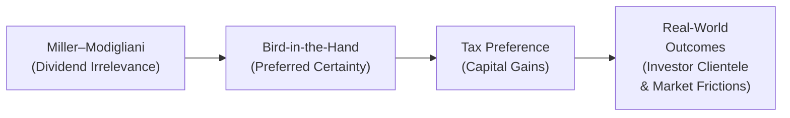

## Overview and Context

Sometimes I like to joke that dividends can spark more debate than dinner table politics among finance folks. You’ll hear one argument about how dividends shouldn’t matter, another about how they’re absolutely crucial, and still another about how taxes alone can tilt the scales. These discussions trace back to three classic theories in dividend policy: the Miller–Modigliani Dividend Irrelevance Theory, the Bird-in-the-Hand Theory, and the Tax Preference Theory. Each offers a unique viewpoint on how—if at all—dividends affect a company’s valuation and how investors respond to different dividend-payment strategies.

In real-world corporate finance, dividends are more than just numbers on a check to shareholders. They encapsulate vital signals about a firm’s health, show management’s confidence in future profitability, and factor into broader portfolio-management decisions—especially at an advanced level, where professionals juggle multiple asset classes and must weigh after-tax returns. 

As you prepare for advanced exam questions (whether in item-set or constructed-response form), you’ll want to understand not only what these theories say but also how they’re applied in actual market scenarios. Let’s dive in, shall we?

## The Miller–Modigliani Dividend Irrelevance Theory

Merton Miller and Franco Modigliani (M–M) famously argued that under a set of idealized conditions—no taxes, no transaction costs, no agency issues, no asymmetric information—a firm’s dividend policy does not affect its overall value. This is often referred to as the “Dividend Irrelevance” proposition. In their 1961 paper, they demonstrated that, in a perfect market, an investor can create their own “homemade dividend” by selling a portion of their shares if the firm decides not to pay dividends. Alternatively, if the firm overpays dividends, the investor can reinvest excess payouts to maintain whatever “income stream” they desire.

To illustrate M–M in a bit more formulaic detail, let’s consider a simplified version of their valuation framework:

Let:  
• P₀ = the current share price  
• D₁ = the expected dividend at time 1  
• P₁ = the expected share price at time 1  

Under the M–M assumptions, the total return to shareholders is D₁ + P₁ - the cost of shares acquired. If you changed D₁ by paying more or less, you’d offset that difference in P₁ because, theoretically, the market would adjust share prices to reflect the reduced or increased retained earnings. 

Hence, from M–M’s viewpoint, a firm’s value is driven by the profitability and risk of its underlying projects, not by how it partitions cash flows between dividends and reinvestment.

### Limitations and Real-World Adjustments

Clearly, everyday finance is not a frictionless wonderland. Investors grapple with taxes, rebalancing costs, constraints on short selling, insider information, and even psychological biases. A well-known corporate example highlighting these limitations is Apple Inc.’s return to issuing dividends. For many years, Apple chose not to distribute dividends, in line with the idea that it could reinvest earnings more profitably. Eventually, the firm realized some shareholders wanted a stable return of cash. Tax considerations, ongoing debates about how retained capital might be used, and Apple’s large cash position ultimately made regular dividends appealing. 

In practice, advanced practitioners (especially at the portfolio manager level) watch more than just a single theory. They also eyeball whether the dividend policy sends signals about management’s outlook, potential agency costs, or whether it’s an attempt to cater to specific clienteles (e.g., funds focusing on stable, dividend-paying stocks).

## The Bird-in-the-Hand Theory

“Better a bird in the hand than two in the bush.” That’s an old saying, and it captures the essence of this theory. The Bird-in-the-Hand Theory, championed by Myron Gordon and John Lintner, contends that investors value dividends as a sure thing today over the potential for (but not guarantee of) capital gains tomorrow. Essentially, dividends reduce investors’ perception of uncertainty, making the stock more attractive, thereby raising its value.

Imagine you’ve got a friend who just loves receiving those quarterly checks—maybe your friend’s grandparents rely on stable dividend income for their ongoing expenses. They might be less interested in riskier growth strategies because they prioritize a steady cash flow. This preference for immediate liquidity can theoretically boost the stock price of a higher-dividend-paying company. 

### Linking It to the Gordon Growth Model

Gordon’s Growth Model (GGM) often emerges in studying dividend-paying stocks. The model is:


P_0 = \frac{D_1}{(r - g)}


Where:  
• \\( P_0 \\) is the current price.  
• \\( D_1 \\) is the next expected dividend.  
• \\( r \\) is the required rate of return on equity.  
• \\( g \\) is the long-term growth rate of dividends.  

Under the Bird-in-the-Hand assumption, a higher \\( D_1 \\) might lower the \\( r \\) because investors feel more certain about the near-term dividend, effectively making them more willing to pay a higher price for the stock. In practice, this can be controversial and heavily debated, but it’s definitely a perspective that resonates with many real-world income-oriented investors.

## The Tax Preference Theory

Now, let’s chat about taxes—everyone’s favorite subject, right? (Or maybe not!) The Tax Preference Theory highlights that in some jurisdictions, capital gains are taxed at a lower rate than dividends. Also, capital gains can often be deferred until the investor sells the stock, making them more tax-efficient. As a result, some investors might prefer companies that reinvest earnings rather than companies distributing large dividends.

Picture a scenario where an investor is operating a well-diversified portfolio that aims to minimize current-year tax liabilities. If the investor’s personal tax rate on dividends is quite high, it clearly becomes more attractive to hold a stock that pays minimal or no dividends, allowing the investor to compound returns inside the firm until a future time—perhaps in retirement or when capital gains tax rates might be lower. 

### Examining Cross-Border Complexities

At a higher, portfolio-management level, cross-border tax rules further complicate the tax preference story. For instance, a U.S.-based investor buying shares in a foreign company may face withholding taxes on dividends from that foreign country, adding another dimension to the preference for capital gains. Meanwhile, local investors in that foreign country might face a different scenario entirely. For advanced exam questions, you might be asked to consider a multinational portfolio with varied tax treatment across jurisdictions, testing your ability to weigh these complexities in asset allocation.

## Visual Overview of the Theories

Below is a simple diagram illustrating how these three theories connect and sometimes clash in the real world. Notice how each theory interacts with realities like taxes, investor preferences, and market frictions.

Each arrow in the diagram represents a transition from a pure theoretical stance to real-world considerations. The M–M theory sits at the far left, ignoring real-world frictions. Then we move through Bird-in-the-Hand, which emphasizes investor preference for immediate income, to Tax Preference, which highlights after-tax returns. Finally, we place these theories together in the real world, where multiple investor clienteles, agency issues, and regulatory constraints mesh with these theories in complex ways.

## Putting It All Together: Real-World Applications

In actual corporate boardrooms, CFOs and management teams often weigh the following when deciding on a dividend policy:

• Investor Clientele: A company with a large base of retail retirees or dividend-focused mutual funds might adhere to a stable or high-dividend payout policy. A technology startup with growth-oriented investors might favor token or no dividends, instead reinvesting to drive capital gains.  
• Signaling Effects: A sudden increase in dividends can signal confidence in future cash flows, while a cut in dividends can spook investors—even if the cut might be the correct strategic move.  
• Legal and Regulatory Conditions: Some countries have mandatory dividend distribution requirements if a company is profitable; others heavily tax dividends, shaping how firms distribute wealth.  
• Market Conditions and Access to Capital: During times of tight credit, stable dividends can reassure potential lenders or bondholders that the firm is well-managed, though at advanced levels, this also ties into the firm’s cost of equity and capital structure choices.

An example worth noting is the behavior of many large-cap utility companies. Their business models are relatively stable, with concentrated regulation, so they tend to pay steady dividends. Investors love them for being “defensive” holdings in portfolio management. Contrast that with a biotech or software startup: free cash flows might be better spent on research, acquisitions, or marketing. As we shift to higher-level, portfolio-wide choices, evaluating how each of these dividend policies affects total portfolio returns—especially after personal taxes—will become crucial in ensuring optimal, risk-adjusted performance.

## Pitfalls and Best Practices

• Overlooking Tax Context: Failing to consider an investor’s specific tax environment can lead to suboptimal portfolio decisions, especially when structuring retirement accounts or tax-sheltered investment vehicles.  
• Assuming One Theory Reigns Supreme: Real markets are complicated. A pure M–M approach would ignore friction, but ignoring M–M can lead you to overstate the importance of dividends. Balance is key.  
• Confusing Signaling With Value Creation: Yes, dividend announcements can be signals, but that doesn’t always mean value creation solely from the payout. Carefully parse out the difference between a real improvement in fundamentals versus “just” the sign of confidence.  
• Not Reevaluating Your Client Base: Over time, the composition of a firm’s investor base might shift. If you’re an investor relations officer or CFO, ignoring changes in who holds your stock can lead to mismatch between policy and shareholder preference.

## Exam Tips and Final Thoughts

At a more advanced exam level, you might see scenario-based questions testing your understanding of these theories in a portfolio context. For instance, you could be given a case of an investor in a high-income tax bracket and asked which type of dividend policy is most appropriate for them—and how that might affect the firm’s cost of equity. You might also be asked to analyze how a specific dividend policy interacts with capital controls or constraints in an international context.

• Know the Key Assumptions: M–M’s irrelevance theory stands firmly on “perfect markets.” Identifying which assumption is violated in a question can lead you to the correct theoretical stance.  
• Connect to Cost of Equity and WACC: Dividend theories don’t stand alone. They integrate with a firm’s capital structure, so be prepared to address synergy between how a firm finances projects and how it rewards shareholders.  
• Use Simple Examples to Illustrate: Even if the question references complex multi-asset portfolios, your best bet is to start with the basics—cost of capital, tax rates, and investor preferences—and build from there.  

Understanding existing theories on dividends is a foundational part of analyzing a corporate issuer’s payout decisions. For Level III–style questions, it’s all about synthesis: you may need to show how each theory modifies or interacts with an overall portfolio strategy, a client’s risk profile, or the firm’s strategic direction. 

## References for Further Exploration

• Miller, Merton H., and Franco Modigliani. “Dividend Policy, Growth, and the Valuation of Shares.” The Journal of Business, 1961.  
• Gordon, Myron J. “Optimal Investment and Financing Policy.” The Journal of Finance, 1963.  
• Bodie, Zvi, Alex Kane, and Alan J. Marcus. Investments.  
• Various articles on dividend signaling, clienteles, and tax considerations found in the Journal of Finance and the Journal of Financial Economics.

----

## Test Your Knowledge: Dividend Theories and Implications



### A scenario-based question requires you to determine which dividend policy best suits a high-net-worth individual who faces both high dividend tax rates and capital gains taxes. According to the Tax Preference Theory, which policy is most likely preferred?

- [x] A policy emphasizing lower current dividends and higher retained earnings for growth. 
- [ ] A policy emphasizing regular high dividends to provide immediate income. 
- [ ] A policy paying 100% of earnings as dividends. 
- [ ] A flexible policy that changes dividend amounts each quarter. 

> **Explanation:** Under the Tax Preference Theory, investors in higher tax brackets may prefer growth over current dividends to defer taxes until share sales.

### A firm announces a significant dividend increase. Bird-in-the-Hand Theory implies which possible investor reaction?

- [x] It may raise the stock’s perceived value due to the feeling of receiving a sure return now. 
- [ ] It won’t matter because of dividend irrelevance. 
- [ ] It will cause investors to sell shares to realize capital gains. 
- [ ] It typically forces the share price to drop immediately. 

> **Explanation:** The Bird-in-the-Hand Theory highlights how investors may prefer a near-certain dividend over future uncertain capital gains, possibly bidding up the share price.

### Under Miller–Modigliani’s assumptions, an investor in need of cash from their holdings in a firm that does not pay dividends can:

- [x] Sell a portion of the shares to create homemade dividends. 
- [ ] Immediately lobby the firm to issue a dividend to fulfill their cash needs. 
- [ ] Not achieve any cash flow unless the firm changes policy. 
- [ ] Only buy a derivative that replicates a dividend. 

> **Explanation:** M–M posits that in a frictionless market, investors can synthesize whatever dividend stream they want by selling shares.

### Which of the following is NOT a key assumption underlying the Miller–Modigliani Dividend Irrelevance Theory?

- [x] Capital gains and dividend taxes are the same. 
- [ ] No transaction costs exist. 
- [ ] There is no asymmetric information. 
- [ ] Investors can buy and sell shares without cost. 

> **Explanation:** M–M assume no taxes, but they do not necessarily assume that capital gains and dividend tax rates are equal. Their version of “no taxes” is more generic—tax does not exist at all in their perfect world.

### If a firm operating in a jurisdiction with very high dividend tax rates decides to commence a high dividend payout, which of the following is the most logical investor concern according to the Tax Preference Theory?

- [x] They will face higher current taxes compared to capital gains. 
- [ ] Dividend signal will make the firm risk-free.  
- [x] They don’t care as M–M suggests.  
- [ ] The stock will become worthless. 

> **Explanation:** High dividend tax rates make certain investors concerned about higher current taxes. (The second correct choice above illustrates a deliberate twist—note that M–M suggests “dividend irrelevance,” but that’s under no-tax assumptions. In the real world with taxes, it’s definitely relevant.)

### According to the Bird-in-the-Hand Theory, a firm that consistently cuts its dividend might:

- [x] Be perceived as riskier by certain shareholders. 
- [ ] Gain credibility with investors looking for stable payouts. 
- [ ] Permanently lower its cost of equity. 
- [ ] Necessarily face regulatory fines. 

> **Explanation:** Investors who adhere to Bird-in-the-Hand logic might interpret a dividend cut as a negative sign and see the firm as riskier, even if rational analysis might say otherwise.

### How can the differing tax treatments of dividends and capital gains influence a firm’s long-term payout policy?

- [x] Firms may retain earnings to allow for capital gains, especially if their investor base is tax-sensitive. 
- [ ] No effect unless the firm is in the energy sector. 
- [x] It triggers a forced sale of shares by existing investors.  
- [ ] Management is legally required to ignore tax implications. 

> **Explanation:** Firms often consider the tax exposures of their investor base and might opt to reinvest earnings to maximize after-tax returns for shareholders.

### A board of directors wants to appeal primarily to retirees seeking reliable immediate income. Which theory best justifies a high and stable dividend policy?

- [x] Bird-in-the-Hand Theory. 
- [ ] Miller–Modigliani Irrelevance Theory. 
- [ ] Tax Preference Theory. 
- [ ] Efficient Market Hypothesis. 

> **Explanation:** The Bird-in-the-Hand Theory states that investors who prefer a sure dividend might reward the firm with a higher valuation if it pays stable dividends.

### Which situation would most directly invalidate Miller–Modigliani’s irrelevance conclusion?

- [x] The presence of significant transaction costs for those trying to create homemade dividends. 
- [ ] The ability to short-sell the stock. 
- [ ] Zero-tax environment across all forms of returns. 
- [ ] The presence of perfectly efficient markets. 

> **Explanation:** Once you allow for transaction costs, homemade dividends are no longer free and frictionless, making the M–M conclusion less applicable.

### True or False: Under the Tax Preference Theory, changes in investor tax policy can materially shift a firm’s optimal dividend policy.

- [x] True
- [ ] False

> **Explanation:** If capital gains become more tax-advantaged (or dividends become more heavily taxed), a firm may reshape its payout strategy to accommodate investor preferences.


