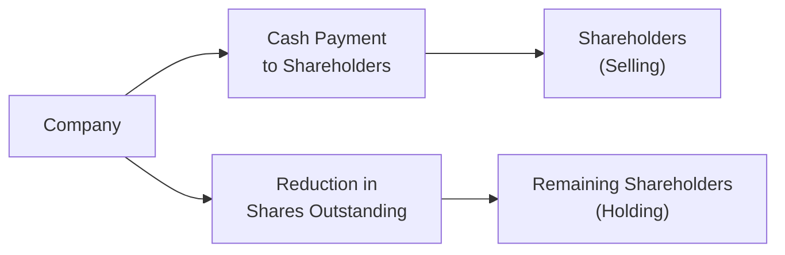

## Introduction
Share buybacks—sometimes called share repurchases—are a fundamental aspect of corporate finance strategy. They happen when a company decides to repurchase its own shares from the marketplace, effectively shrinking the number of shares outstanding. Less outstanding shares usually means higher earnings per share (EPS), all else equal. But, um, does that automatically help shareholders in the long run? Maybe, maybe not. In many cases, buybacks are beneficial for both the company and its investors, but they can also reduce the company’s cash cushion and alter its capital structure in challenging ways.

I remember hearing a senior analyst say, “A well-timed buyback can make you look like a genius, but an ill-timed one can sink your balance sheet.” That sums it up nicely: share buybacks require substantive analysis. You’ll find that buybacks, done at opportune times, can indeed boost shareholder value, but they also require thorough evaluation of factors like liquidity, leverage, and long-term growth prospects.

## Understanding Share Buybacks
At their core, share buybacks reduce the total number of shares in circulation. The simplest measure affected is EPS:


EPS = \frac{\text{Net Income}}{\text{Shares Outstanding}}


When the denominator (Shares Outstanding) shrinks, EPS often increases, even if net income stays flat. This improved EPS could send a strong signal to the market about the firm’s financial health. Yet from a risk management perspective, it’s not just about short-term signals—corporate capital is being used in this transaction, often at the expense of reinvestment or debt repayment.

### Methods of Execution
Most buyback programs fall under one of these categories:

- Open Market Repurchases: The company purchases its shares in the open market, just like any other investor (albeit with regulatory constraints). These transactions are often done gradually.
- Tender Offers: The company announces a fixed price at which it intends to buy back shares. Shareholders can choose whether to “tender” (sell) their shares to the company at that set price.
- Private Negotiations: In some cases, companies negotiate directly with large shareholders or strategic partners to repurchase blocks of shares outside the open market. While less common, these can help the firm quickly retire a large portion of stock at once.

Each method involves different costs, regulatory restrictions, and signaling implications. Under US GAAP or IFRS, the treatment for the share repurchase on financial statements typically reduces share capital (sometimes via a treasury stock approach under US GAAP or a reduction in share capital under IFRS), but the critical point to keep in mind is how these transactions impact the capital structure and the company’s capacity to fund future endeavors.

### Quick Python Example
Below is a tiny Python snippet to show a hypothetical calculation of EPS pre- and post-buyback. It’s not a real trading algorithm—just a fun way to see the numbers:

```python

net_income = 100_000_000  # $100 million
shares_outstanding_before = 50_000_000
shares_outstanding_after = 45_000_000
buyback_cost = 5_000_000  # to retire 5 million shares (hypothetical price factors not shown)

eps_before = net_income / shares_outstanding_before
eps_after = net_income / shares_outstanding_after

print(f"EPS before buyback: ${eps_before:.2f}")
print(f"EPS after buyback:  ${eps_after:.2f}")
print(f"Total buyback cost:  ${buyback_cost:,.2f}")
```

Running this might show that EPS after the buyback is higher than before, even though net income stayed exactly the same.

## Motivations for Share Buybacks
Before analyzing whether share repurchases drive long-term value, it helps to know why management might pursue such a program.

Returning Excess Cash  
Companies with surplus cash that’s not needed for operating expenditures, working capital, or new growth opportunities might find a buyback attractive. Some jurisdictions offer tax advantages for capital gains (arising from share price appreciation) compared to cash dividends.

Signaling Undervaluation  
Management might believe that its shares are trading below intrinsic value. Purchasing shares signals bullishness; after all, if the executives believe the stock is cheap, they may prefer to buy back stock over issuing dividends.

Adjusting Capital Structure  
Share repurchases can shift the debt-to-equity ratio if funded with cash or new debt. As discussed in Chapter 6 (Capital Structure), achieving an optimum leverage ratio might be beneficial if the company can improve its weighted-average cost of capital (WACC).

Offsetting Dilution  
When employees exercise stock options or receive shares as compensation, existing shareholders get diluted. Firms often buy back shares to offset this, maintaining or boosting key per-share metrics like EPS.

I recall analyzing a mid-sized technology firm that was aggressively issuing stock options to attract top talent—resulting in plenty of new shares outstanding each year. Management used a share repurchase program to mitigate the dilutive effect on existing shareholders. It worked nicely, but it also meant the company had less free cash for R&D projects.

## Potential Downsides
While buybacks are compelling for a variety of reasons, there are pitfalls:

Limiting Future Growth  
Using up large sums of cash for share repurchases can leave the company strapped for funds, particularly if an unexpected strategic investment or expansion opportunity appears. By locking up money in the repurchase, the firm’s growth trajectory might become more constrained.

Bad Timing  
Repeating that favorite analyst quote: “A well-timed buyback can make you look like a genius...” But the reverse is also true. If a company repurchases shares at inflated prices, they might destroy shareholder value. Think about a stock that runs into hype. If management is lured into repurchasing shares only for them to plummet later, the entire buyback exercise can appear misguided.

Negative Market Perception  
Sometimes, share buybacks are seen as an indicator that the company lacks profitable reinvestment prospects. Some investors might ask, “Is that the best you can do with your money?” This perception can weigh on the stock price if the market interprets the buyback as a sign of lower growth potential.

## Impact on Shareholder Value
A share buyback can increase shareholder value if:

• The shares truly are undervalued, making the buyback a savvy investment for the firm’s cash.  
• The firm’s capital structure becomes more optimal, potentially lowering its overall cost of capital.  
• It prevents significant dilution from employee stock options.  

But shareholder value can be harmed if:

• The company overpays for its own shares.  
• The repurchase significantly reduces liquidity and reserves.  
• Debt financing is used irresponsibly, increasing financial distress risk.  

### Visual Overview
Below is a Mermaid diagram showing a simplified view of share repurchase flows. Shareholders can either keep their shares and (potentially) benefit from a higher EPS or tender them back to the company in exchange for cash.



This diagram, in a nutshell, demonstrates that a portion of shareholders receives cash, leaving fewer shares outstanding for everyone else.

## Strategic Considerations for Analysts
As an analyst, you want to dig into the details:

Balance Sheet Strength  
Analyze whether the company’s liquidity position and operational requirements remain solid even if a repurchase is executed. Check metrics like the current ratio, quick ratio, and coverage ratios, as discussed in Chapter 4 (Working Capital and Liquidity).

Cost of Financing  
If the firm issues debt to fund the buyback, evaluate the impact on financial risk and WACC. Overleveraging can be risky, especially in volatile industries or if interest rates climb.

Motivations Behind the Repurchase  
Is management repurchasing shares to purely boost EPS or is there a genuine undervaluation? If it’s purely for short-term cosmetic gains, that might indicate a potential red flag.

Long-Term Value Creation  
Look at how the buyback fits into the overall strategy. In Chapter 7 (Business Models), we discuss the importance of innovation and reinvestment for sustainable growth. If the firm is diverting funds away from promising R&D or acquisitions, it could hamper its competitiveness.

### Financial Example
Consider a company with net income of $1.0 billion, 500 million shares outstanding (an EPS of $2.00). Let’s suppose it repurchases 50 million shares at $40 each (a total cost of $2.0 billion—assuming the company has enough cash on hand). After the buyback, the new share count is 450 million. If net income remains $1.0 billion, the new EPS is:


EPS_{new} = \frac{1.0\text{ billion}}{450\text{ million}} \approx \$2.22


Okay, so EPS rose from $2.00 to $2.22. That’s an 11% jump in EPS. However, the company used $2.0 billion of cash that can no longer be applied to new projects, acquisitions, or other strategic moves.

## Best Practices and Common Pitfalls
Best Practices  
• Conduct thorough valuation. Management should confirm the stock price is indeed below intrinsic value.  
• Maintain sufficient liquidity. Don’t fully drain the cash reserves.  
• Communicate clearly. Transparent communication with shareholders about the rationale and expected outcomes helps mitigate negative perceptions.  

Common Pitfalls  
• Trying to time the market. Even skilled management teams can misjudge market conditions.  
• Excessive leverage. Funding buybacks with debt may push the firm into a more precarious financial position.  
• EPS manipulation signals. Overemphasis on short-term EPS improvements can erode trust if no real long-term benefit materializes.

## Case Study: TechCo’s Buyback Program
Imagine a hypothetical “TechCo” that began a $3 billion repurchase plan last year. When the share price hovered around $50, TechCo’s board decided to buy back 60 million shares. Two months after completing the buyback, recession fears led the stock to drop to $35. TechCo ended up “overpaying” for those shares by $900 million in total (since the new post-buyback price was significantly lower). Suddenly, the buyback no longer appears so brilliant, and the company is also short on cash for expansions into new markets.

On the flip side, if the price had climbed to $60 after the repurchase, TechCo’s buyback would have looked amazing. In real life, no one has perfect foresight, so the wisdom of waiting, staggering purchases, or employing a flexible open-market repurchase plan is something to watch for.

## Regulatory and Reporting Highlights
Under both IFRS and US GAAP, share repurchases generally reduce equity (e.g., the treasury stock account in US GAAP). However, there can be differences in disclosure requirements, such as how repurchases are presented on the statement of changes in equity or footnotes. Analysts might need to consult a company’s notes in the annual report to identify the methods of repurchase (tender vs. open market) and see the true cost of repurchases, including fees and premiums.

From a governance perspective (touched on in Chapter 2 and Chapter 3), strong board oversight is crucial. The board should ensure that share repurchases align with the company’s strategic goals and do not serve as a convenient approach for short-term stock price manipulation.

## Conclusion
Share buybacks can add real value by returning surplus capital to shareholders, improving capital structure, and boosting EPS in a constructive way. Yet, folks, it’s not a slam dunk. When a buyback is poorly timed, when the company abandons essential investments, or when it endangers the firm’s balance sheet, it can be a net negative. As an analyst, your job is to put the puzzle pieces together: capital structure, liquidity, strategic objectives, and the broader market environment. Then, weigh the sustainable value that a buyback might create—or destroy.

Staying curious and maintaining a holistic view are key. Share buybacks can be wonder tools or outright blunders depending on management’s judgment, market conditions, and the underlying fundamentals of the business.

## References and Further Reading
- Ross, Westerfield, Jaffe, and Jordan. “Corporate Finance.”  
- CFA Institute Research on Share Buyback Trends:  
  (https://www.cfainstitute.org)  
- Articles in the Financial Analysts Journal on share repurchase impetus and market timing.
- Chapter 4 (Working Capital and Liquidity), Chapter 6 (Capital Structure), and Chapter 7 (Business Models), in this same volume for related discussions.

## Test Your Knowledge: Share Buybacks and Value Enhancement



### Which of the following is a primary reason a firm might repurchase its shares?

- [ ] To dilute existing shareholders.
- [ ] To increase the authorized share count.
- [x] To redistribute capital in a tax-efficient manner.
- [ ] To raise its legal capital requirements.

> **Explanation:** Firms often see share buybacks as a way to return excess cash to shareholders in a potentially tax-advantaged way, especially in jurisdictions where capital gains tax rates may be lower than dividend tax rates.

### What is one of the potential disadvantages of a share buyback?

- [ ] It automatically lowers the firm’s return on equity.
- [ ] It keeps share dilution from occurring.
- [x] It can reduce cash reserves and limit future growth opportunities.
- [ ] It ensures a lower EPS in the next period.

> **Explanation:** When a company spends its cash on buybacks, it might not have enough resources for future growth. This can hamper the firm’s ability to capitalize on attractive investments or expansion plans later.

### A tender offer in the context of share buybacks refers to:

- [ ] Issuing additional shares at a discount.
- [x] Offering to buy a specific number of shares from shareholders at a set price.
- [ ] Negotiating stock sales privately with senior management.
- [ ] Purchasing shares randomly in the open market at daily prices.

> **Explanation:** In a tender offer, the company provides a designated price for shareholders to sell their shares directly back to the firm, often within a specified time frame.

### Under US GAAP, bought-back shares typically appear on the balance sheet as:

- [ ] An asset.
- [x] Treasury stock, which reduces shareholders’ equity.
- [ ] A long-term investment.
- [ ] A liability offset.

> **Explanation:** In the US GAAP framework, repurchased shares are generally recorded as treasury stock under the equity section, reducing total shareholders’ equity.

### How can share repurchases help offset dilution?

- [x] By buying back newly issued stock to reduce the total shares outstanding.
- [ ] By issuing more stock at a higher price.
- [ ] By converting existing debt to equity.
- [x] By covering the shares created from employee stock option exercises.

> **Explanation:** Share options can increase the total number of outstanding shares, diluting existing shareholders. Repurchases served to offset (or reduce) this dilution by reducing the total float.

### If a company overpays for its own shares during a buyback:

- [x] It may destroy shareholder value.
- [ ] It automatically increases its cash balance.
- [ ] It neutralizes the effect on EPS.
- [ ] It has no effect on stock price volatility.

> **Explanation:** Overpaying diminishes the net benefit to the firm and its shareholders, because the company is effectively exchanging more cash than the intrinsic value of the shares worth.

### One rationale behind funding a buyback with debt is:

- [x] It may create a more optimal capital structure if leveraging up lowers the WACC.
- [ ] It always leads to a better credit rating.
- [x] It eliminates interest expenses entirely.
- [ ] It prevents further share dilution.

> **Explanation:** Adding debt can be beneficial if it balances the debt-to-equity ratio, possibly reducing the weighted-average cost of capital. However, this must be carefully managed to avoid excessive leverage.

### Which statement correctly describes the EPS impact of a share buyback?

- [x] EPS often rises because the denominator (outstanding shares) decreases.
- [ ] EPS falls because the repurchased shares are still included in EPS.
- [ ] Net income always falls after a buyback.
- [ ] The EPS calculation is unaffected by a share buyback.

> **Explanation:** Repurchasing shares shrinks the outstanding share count, boosting the EPS if net income remains constant.

### How might open market repurchases differ from tender offers?

- [ ] They involve a fixed buyback price for all shareholders.
- [x] They are often executed gradually over time at prevailing market prices.
- [ ] They are always negotiated in private with large shareholders.
- [ ] They are illegal under IFRS accounting standards.

> **Explanation:** Open market repurchases happen incrementally at the prevailing prices in the market, while tender offers involve a specific share price and time window.

### True or False: One advantage of share buybacks over dividends is that share buybacks are always tax-free for individual shareholders.

- [x] True
- [ ] False

> **Explanation:** In some jurisdictions, shareholders do not pay the same taxes on share price appreciation as they do on dividend income. Hence, buybacks may provide tax advantages compared to dividends. However, the actual tax implications can vary significantly by region and individual shareholder circumstances.


