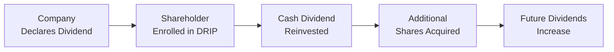

## Overview

When a company decides how to manage its earnings, it doesn’t merely pick a dividend amount out of thin air (though sometimes it feels that way to onlookers). One of the methods companies use to reward shareholders is through periodic cash dividends. But—here’s where it can get interesting—shareholders can often opt to automatically reinvest those dividends to purchase additional shares, commonly via a Dividend Reinvestment Plan (DRIP). Meanwhile, companies may occasionally split their stock to make share prices look more appealing or, in rare circumstances, reverse split to tidy up the share structure. We’ll explore all of these topics in detail, touching on the underlying rationale, benefits, pitfalls, and best practices. And, yes, I'll sprinkle in a few stories along the way (I once forgot I’d enrolled in a DRIP—until I noticed my share count creeping up in my brokerage account!).

## Dividend Reinvestment Plans (DRIPs)

Dividend Reinvestment Plans, or DRIPs, allow shareholders to reinvest their cash dividends into additional shares of the company’s stock—often without transaction fees and sometimes at a discount to the prevailing market price. It’s a straightforward concept, though it can have powerful compounding effects over time.

### Key Characteristics and Benefits

• Automatic Reinvestment of Dividends: When the company pays out a dividend, instead of receiving cash, you automatically receive more shares.  
• Reduced Transaction Fees: DRIPs often eliminate brokerage commissions on reinvested amounts. This perk can be meaningful, especially for smaller retail investors who otherwise face minimum brokerage costs.  
• Possible Discounts: Some DRIPs offer share purchases at a slight discount (e.g., 1%–5% below market price). This discount isn’t guaranteed, but it can be a neat incentive.  
• Compounding Growth: Over time, continuously accumulating more shares can lead to a snowball effect, as each additional share itself earns dividends in the future.

From the company’s perspective, a DRIP can help keep capital within the firm since fewer dividends leave the corporate coffers as cash. It can also encourage shareholder loyalty: people who participate in DRIPs tend to be long-term holders. If you’re aiming to build wealth steadily and you don’t need the cash from your dividends right away, DRIPs can be a winning strategy.

### Example: Long-Term Compounding

Imagine you hold 100 shares of a company that pays an annual dividend of $2.00 per share. Over the course of the year, you’d receive $200 total in dividends. Under a DRIP, that $200 is reinvested. Suppose the current share price is $50 at the time dividends are paid. Then you’d automatically pick up four more shares (assuming no transaction fees). Next year, you get dividends on 104 shares—so about $208 if the dividend per share stays the same.

Yes, it’s a small difference in the short run, but if the stock price rises and the dividend grows over time, you might end up with significantly more shares, which themselves earn larger and larger dividends each payout cycle. It’s that classic compounding argument that shows up in most long-term investing textbooks (Benjamin Graham’s The Intelligent Investor being a timeless example).

### Practical Considerations and Tax Implications

One small caveat: In many jurisdictions, dividends are still taxable in the year they’re paid, whether or not they’re reinvested. That means you may need cash on hand to cover taxes even though you haven’t actually received the cash—an important consideration for those who automatically reinvest. Always double-check local tax regulations (and, well, talk to a tax pro if needed).

Another angle to consider is that frequent DRIP transactions mean frequent adjustments to your cost basis. Each new purchase, no matter how small, effectively changes the average cost basis of your position. This can become an administrative headache if you ever decide to sell your shares. Brokerage firms sometimes handle the cost basis tracking for you, but it’s good to keep an eye on it.

### DRIPs in a Capital Allocation Context

From a corporate finance standpoint (and relevant to earlier capital allocation discussions, see Chapter 5: Capital Investments and Capital Allocation), the funds not leaving the company can be seen as a low-cost source of capital. While the money doesn’t exactly flow to the company as new equity in the same sense as a seasoned offering, the net effect is that fewer net cash dividends leave the firm’s bank account. In a sense, DRIPs can help preserve the company’s liquidity and fund internal projects, such as expansions or new product lines, or simply reduce external financing needs.

### A Quick Mermaid Diagram of the DRIP Flow

Below is a simple Mermaid diagram illustrating the DRIP cycle:



As you see, the DRIP loop coolly reinvests cash distributions back into the share base.

### Python Snippet for DRIP Projections

You might find it helpful to do some quick calculations on how a DRIP might influence your share count over time. Below is a simplistic Python snippet to illustrate this:

```python
initial_shares = 100
annual_dividend_per_share = 2.0
annual_growth_rate = 0.03    # 3% annual dividend growth
share_price = 50.0
annual_price_growth = 0.05   # 5% annual stock price increase
years = 5

shares = initial_shares
for year in range(1, years + 1):
    dividend_received = shares * annual_dividend_per_share
    shares_purchased = dividend_received / share_price
    shares += shares_purchased
    
    print(f"Year {year}: Total Shares = {shares:.2f}, Share Price = ${share_price:.2f}")
    
    # Update for next year
    annual_dividend_per_share *= (1 + annual_growth_rate)
    share_price *= (1 + annual_price_growth)
```

This simplistic approach shows how your share count might grow under a DRIP. It also assumes that the dividend per share grows at a constant rate and share price increases steadily every year. Real markets are rarely so clean and predictable, of course.

## Stock Splits

Stock splits are an entirely different (yet often intertwined) phenomenon. Companies split their stock by issuing additional shares to existing shareholders in a certain ratio—two-for-one, three-for-one, and so on. After a stock split, a shareholder ends up holding more shares, but the share price adjusts downward proportionally, so the total market value of the shares (theoretically) remains the same.

### Why Companies Undertake Stock Splits

• Boost Liquidity: A lower share price can bring in more individual investors or smaller institutions, thereby increasing liquidity.  
• Psychological Price Range: Some companies prefer to see their stock trading in a “comfortable” range—say $20 to $100—rather than at several hundred dollars per share.  
• Signaling Confidence: A stock split can send a signal that the company’s share price has risen significantly, reflecting strong historical growth, although in itself it doesn’t change the fundamentals.

In truth, stock splits are often more of a cosmetic move than a real value driver. But many managers believe there’s intangible benefit to ensuring shares remain accessible to the broadest investor base possible.

### Mechanics of a Split

Let’s say you hold 100 shares of a stock at $100 each. That’s $10,000 in total value. If the company declares a 2-for-1 split (sometimes called a “forward split”), you’ll now hold 200 shares, but each may trade around $50 after the split. Again, your total value remains roughly the same at $10,000—barring any minor market reaction. Splits typically result in a short spike of attention in the market, but it’s not a reliable way to “create” or “destroy” value on its own.

### Stock Splits and Liquidity

Some equity analysts suggest that stock splits can help with liquidity—meaning more shares might change hands daily, narrowing bid-ask spreads. Meanwhile, extremely high share prices can hamper trading volumes, as fewer investors may be willing (or able) to buy expensive stocks in round lots (though fractional shares have become more common).  

For instance, a company like Amazon eventually split its stock after the price soared to well above $3,000 per share. The official reason for the split was partly about making the stock more easily tradable for a wider base of investors. While a large portion of the market trades electronically (and often fractionally), the psychological effect is still real: many individuals feel more comfortable buying a $100 share than a $3,000 share.

## Reverse Stock Splits

Not all splits move in the same direction. Reverse splits—sometimes called share consolidations—reduce the total number of shares while pushing up the share price proportionally. Reverse splits often happen when the share price has fallen so low that the company risks breaching a major exchange’s minimum price requirements—think listing rules of NYSE or NASDAQ. By carrying out a reverse split, the company can regain compliance (for instance, moving from $0.50 to $5.00 by doing a 1-for-10 reverse split). While it can remove the stigma of a “penny stock,” a reverse split can also raise red flags for some investors who see it as a symptom of underlying struggles.

## Potential Implications for Shareholders

### Valuation and Market Perception

For better or worse, both forward and reverse splits can impact how investors perceive a security. A forward split may be interpreted as good news (“our share price is so high we need to split”), while a reverse split might be viewed skeptically (“were things that bad?”). In both cases, a fundamental revaluation of the company shouldn’t automatically result. Serious investors remain focused on earnings, cash flows, dividend policy, and corporate governance practices, as covered in earlier chapters, especially Chapter 3 on Corporate Governance.

### Share Price Volatility

Occasionally, stock splits facilitate greater day-to-day volatility. With more shares outstanding and typically more liquidity, short-term traders may find it easier to buy and sell. But absent any fundamental change, the share price should reflect the same underlying value.

### Impact on Index Membership or Dividend Mechanics

Some market indexes have specific requirements for share prices, or they might track price-weighted metrics. For instance, in a price-weighted index, changing the number of outstanding shares in combination with the new share price might alter how the stock influences the index. Also, for DRIP participants, a stock split effectively raises the number of shares eligible for the next dividend payment. This detail matters for those meticulously projecting dividend-based cash flows.

## Best Practices and Common Pitfalls

• For DRIPs, keep track of your cost basis meticulously. This can get complex with numerous small reinvestments.  
• Consider whether taking the cash dividend might be more beneficial, especially if you need to diversify your portfolio or pay taxes.  
• Stock splits provide no free lunch: they do not inherently increase or decrease shareholder value, though improved liquidity can have second-order effects.  
• Reverse splits may help maintain listing status, but they often come with negative market sentiment.  
• If you’re enrolled in a DRIP, double-check each year. You might prefer the flexibility of receiving cash (maybe to rebalance your portfolio or invest elsewhere).  

## Exam Relevance for CFA Candidates

CFA exams (even at Level I) frequently include questions that test your understanding of the mechanics of dividend policies and the theoretical versus practical impacts of corporate actions like splits. You might find scenarios that ask: “Does a stock split increase the total value of the company?” or “Which corporate action best addresses compliance with listing requirements if share prices fall below specified thresholds?” Understanding how DRIPs can compound returns—and how they affect cost basis—can also appear in item sets or short-answer questions. As you move into advanced levels (especially Level III), you’ll see how these concepts can tie into portfolio management decisions, investor tax strategies, and broader corporate governance issues.

## References and Further Reading

• Graham, B. (2006). “The Intelligent Investor.” HarperBusiness Essentials. (Explains the power of long-term investing, compounding, and fundamental analysis.)  
• Fidelity, Charles Schwab, and Other Major Brokerage Firms: Online resources on Dividend Reinvestment Plans, including mechanics, tax considerations, and examples.  
• NYSE and NASDAQ Listing Rules: Particularly around minimum share price thresholds that often motivate reverse splits.

## Test Your Knowledge: Dividend Reinvestment Plans and Stock Splits



### Which of the following is typically an advantage for shareholders participating in a Dividend Reinvestment Plan (DRIP)?

- [ ] Significant reduction in tax liability
- [x] Ability to acquire additional shares without transaction fees
- [ ] Receipt of higher dividends in the current period
- [ ] Guaranteed increase in market value

> **Explanation:** Shareholders in DRIPs generally gain the benefit of acquiring new shares without commission (and sometimes at a discount). However, participating in a DRIP does not reduce tax liability; dividends are often still taxable upon receipt, even if reinvested.

### In a 2-for-1 stock split, what happens to a shareholder’s total value of holdings, all else being equal?

- [ ] It doubles.
- [ ] It increases by 50%.
- [ ] It decreases by 50%.
- [x] It remains unchanged in theory.

> **Explanation:** In a 2-for-1 stock split, the shareholder simply ends up with twice as many shares at half the share price. The total market value remains the same in theory, although minor fluctuations can happen in practice.

### Why might a company perform a reverse stock split?

- [x] To meet minimum share price requirements on an exchange
- [ ] To signal that its stock price has become too expensive
- [ ] To reduce volatility for day traders
- [ ] To raise new capital from existing shareholders

> **Explanation:** Reverse splits are commonly done to consolidate shares and push the share price above exchange minimums, thus maintaining listing requirements. It does not directly raise new capital.

### Which of the following statements describes a potential downside to DRIPs for individual investors?

- [ ] Inability to buy partial shares
- [ ] Dividends are applied solely to buy company bonds
- [x] Tax liability is incurred even if the investor didn’t receive cash
- [ ] DRIPs typically charge additional brokerage commissions

> **Explanation:** With DRIPs, dividends are still taxable upon payment, potentially creating a cash-flow issue because the shareholder has reinvested those dividends rather than receiving them as cash.

### What is a primary reason companies perform stock splits?

- [x] To bring the share price into a more affordable range
- [x] To potentially improve liquidity by increasing the number of outstanding shares
- [ ] To increase the market capitalization of the company
- [ ] To reduce the overall volatility of the share price

> **Explanation:** While stock splits do not inherently change the total market capitalization, they often make the per-share price more accessible for a broader investor base. This, in turn, can improve liquidity.

### Under a Dividend Reinvestment Plan, how might an investor’s cost basis be affected over time?

- [x] Each new reinvestment can change the overall cost basis
- [ ] Cost basis remains static after the first dividend payment
- [ ] Cost basis only changes if share prices decline
- [ ] Cost basis decreases automatically to reflect no out-of-pocket investment

> **Explanation:** Because you are continuously buying additional shares at the market price (or a slight discount) at various points in time, your cost basis evolves with each purchase.

### How do stock splits sometimes influence the bid-ask spread?

- [x] They can narrow the spread by increasing liquidity
- [ ] They can widen the spread by reducing liquidity
- [x] They usually result in more frequent trading
- [ ] They have no potential to change bid-ask spreads

> **Explanation:** By making shares more accessible (lower price per share, higher total number of shares), splits often increase trading volume and reduce bid-ask spreads. However, the extent of this effect can vary.

### Which of the following does NOT occur during a standard (forward) stock split?

- [ ] The number of shares outstanding increases
- [x] The company’s market capitalization doubles
- [ ] The share price is reduced proportionally
- [ ] Each existing shareholder ends up with more shares

> **Explanation:** In a forward stock split, market capitalization is not necessarily affected. The total value of the firm (in theory) remains the same, while the number of shares increases, and the price per share decreases correspondingly.

### A firm that sees its share price rise from $50 to $200 over three years might perform a split primarily to:

- [x] Keep shares within a more accessible price range for average investors
- [ ] Increase year-over-year earnings growth artificially
- [ ] Reduce the total number of shares outstanding
- [ ] Comply with minimum listing requirements of the exchange

> **Explanation:** Once the share price appreciates significantly, some firms split their stock to retain a “friendly” price range, potentially making the shares more appealing to a broader pool of investors.

### True or False: A DRIP arrangement will always guarantee a higher total return compared to receiving dividends in cash and investing elsewhere.

- [x] True
- [ ] False

> **Explanation:** Indeed, many advocate DRIPs for the power of compounding, but it is not always optimal. Other investments might outperform the original stock, or you might have alternative reasons to keep your capital in cash. The question as worded, however, might appear simplistic—on the CFA exam, they’d phrase it more carefully. Always evaluate opportunity costs and portfolio diversification needs before enrolling in a DRIP.


