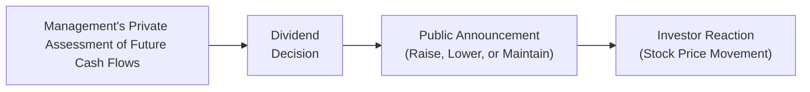

## Introduction

Have you ever wondered why companies fuss so much about dividends? It’s not just about handing out cash to shareholders; it’s about telling a story. Yes, a simple dividend announcement often tells the market (and individual investors like us) how confident management feels about the future. This is where the concept of the "signaling effect" comes into play. The gist is: an increase in dividends can indicate that management sees stable or growing earnings ahead, whereas a dividend cut might flag trouble. But let’s not jump to conclusions—there’s a lot more nuance here.

In the broader context of corporate issuers (as we explore throughout Volume 3 of the CFA® 2025 Level I curriculum), dividend policy is a critical part of overall corporate strategy. It’s closely interlinked with the company’s capital structure, governance practices, and communication with stakeholders. So, think of dividends not just as a distribution of cash, but also as a powerful communication tool in the corporate playground.

## Understanding the Signaling Theory

Signaling theory suggests that corporate managers have better information about the company’s prospects than outside investors do (this is known as “information asymmetry”). When management decides to pay or increase a dividend, it can signal greater confidence in the firm’s future earnings. After all, committing to paying out more cash regularly implies that management believes the company can generate sufficient cash flows to continue meeting this obligation.

On the flip side, a dividend cut might broadcast worries about the firm’s ability to maintain prior payout levels. Even if the cut is done for strategic reasons (like funding a big investment), the market can still interpret it negatively if the rationale isn’t well-communicated. As a result, share prices might drop—sometimes sharply—reflecting the reduced optimism about the stock.

You can think of dividends like an announcement from a close friend who always keeps their word. If they promise something big, it must mean they are pretty sure they can deliver. But if they suddenly can’t, the trust you have in them can waver. The same dynamic often applies in finance.

## Why the Market Reacts Strongly

Capital markets often believe that the executive team has superior insight into the firm’s true financial condition. If you’re an analyst or an investor, you’re always looking for signals: data points and announcements that reduce the information gap. Dividend announcements are among the clearest corporate signals out there. That’s partly because:
• Dividends must be paid in real cash—unlike certain accounting measures susceptible to manipulation.  
• A dividend decision is often approved by the board of directors, adding credibility.  

Moreover, markets are swift in pricing in any new insight. This can lead to dramatic stock price movements if management’s dividend action defies investor expectations. And because public companies are required to follow legal and regulatory guidelines in disclosing information (see Chapter 1.7 on Legal and Compliance Requirements for Corporate Issuers), a dividend hike or cut can sometimes be the very first time the market receives a formal statement about management’s forward-looking confidence.

## The Dilemma of Unsustainable Dividends

Now, a big caution: not all dividend increases are positive signals of genuine financial strength. Sometimes, companies might be tempted to boost dividends just to appear confident. This is risky if the underlying business fundamentals can’t support higher payouts. If a firm later reverses course and slashes the dividend, it can severely damage not only the stock price but also management’s credibility. 

Let’s say you’re running a company that’s had a rough quarter. You might be tempted to maintain or even raise dividends, hoping the market sees it as “Everything’s fine, folks!” But if you do that repeatedly with no earnings growth to back it up, you’re effectively digging a hole for future cuts. And once a company cuts dividends after raising them, the negative reaction is often more pronounced than if it had just been conservative from the start.

So, from a risk management perspective (recall Chapter 3.4 on the Risks of Weak Governance), a sustainable, carefully considered dividend policy is typically best. It reinforces market trust and helps avoid damaging signals in the future.

## Key Elements for Analysts

Analysts and portfolio managers watch for these signals closely. In practice:

• Monitor announcements over time: A single dividend decision may not tell the whole story. Look at the quantitative trends in payouts, as well as the qualitative commentary from management.  
• Consider consistency: Firms that pay steady or growing dividends over many years are often perceived as more stable (think classic dividend aristocrats). This ties into the concept of payout consistency—a crucial factor in how the market views the firm’s risk profile.  
• Evaluate broader context: Sometimes, a dividend cut could be good news if the capital is redirected toward high-return growth projects. Check for management’s explanation. And track any insider buying or selling around the payout decision, as that can reveal additional insight into manager sentiment.  
• Incorporate capital structure elements: In some cases, companies use alternative routes like share repurchases (see Chapter 1.3 on Equity and Debt Claims and Chapter 1.6 on Hybrid Securities) to return value without sending the same potent public signals as dividends.  

## Case Example: Unexpected Dividend Hike

Imagine a mid-sized manufacturing firm, Zenith Tools Co., that has historically paid a modest but steady dividend. Let’s say Zenith unexpectedly raises its quarterly dividend by 20%—far above the usual 3%–5% annual increase. Investors might interpret this as management’s newfound confidence in robust future cash flows. Indeed, Zenith’s stock jumps 8% the next day, fueled by speculation that the firm’s new product lines or cost efficiencies are going better than the market realized.

But a few quarters later, Zenith’s earnings show only a minor uptick, not enough to justify the big dividend expense. Their CFO eventually announces that they need to revise the dividend downward, as they must invest in urgent technology upgrades for long-term competitiveness. This dividend cut triggers a 12% decline in share price, wiping out earlier gains and leaving investors questioning management’s credibility. The moral? Overly optimistic dividend signals can quickly backfire if not grounded in solid fundamentals.  

## Signaling in the Broader Corporate Context

The signaling effect of dividends doesn’t exist in a vacuum. It’s intertwined with:

• Corporate Governance: Strong governance structures (Board of Directors, audit committees, etc.) often reduce the chance of “game playing” with dividends. Good governance usually means more reliable signals, which in turn can stabilize investor confidence (see Chapter 3).  
• Capital Allocation Strategy: Management has finite resources and multiple uses for capital—reinvesting in the business, acquiring another company, paying down debt, or returning money to shareholders. Dividend decisions are part of this strategic puzzle (discussed in Chapter 5 on Capital Investments and Chapter 6 on Capital Structure).  
• Investor Preferences: Some investors (like retirees or income funds) prefer stable dividends, while others might be more growth-oriented. If your investor base loves dividends, a cut can be especially jarring.  

## Visualizing the Dividend Signaling Flow

Below is a simple Mermaid diagram illustrating how a dividend decision flows from management’s internal views to the market’s perception:

In this diagram, management has inside information (A) about future prospects. They make a dividend decision (B) based on that assessment. Once the decision is announced publicly (C), investors immediately react—often through changes in the stock price (D).

## Practical Insights for the CFA Exam

On your CFA journey, particularly at Level I as you’re learning foundational corporate finance concepts, you might see exam questions that test your understanding of how dividend announcements impact share price, and how to analyze whether a dividend policy is sustainable. They might give you scenarios like:

• A company that’s had five consecutive years of declining dividends, and ask you what that signals.  
• A company that maintained dividends through a recession despite reduced earnings, and ask how that might be interpreted.  
• A scenario involving an unexpected dividend increase right before a major product launch, and test your understanding of possible market interpretations.  

Exam tip: Always consider the context. Dividend policy never exists in isolation. Check the firm’s earnings trend, cash flow statements, capital expenditure plans, and strategic outlook. A question might try to trip you up with a scenario where a dividend increase seems positive at first glance but reveals deeper issues upon further inspection (like the Zenith Tools Co. example).

## Common Pitfalls

• Over-reliance on Dividend Signals: While important, dividends are just one piece of the puzzle. Don’t ignore fundamentals like earnings quality, liquidity, or governance structure.  
• Misreading a Strategic Cut: Not all dividend cuts mean doom. A firm might cut dividends to reinvest in high-return projects—potentially boosting long-term valuation.  
• Ignoring Market Conditions: External factors (like economic downturns) can force changes in dividend policy that don’t reflect management’s actual perception of future earnings.  

## Conclusion

Anyway, the signaling effect of dividends can be quite powerful. Investors and analysts alike pay close attention to how dividends shift over time, because these signals can offer hints about a firm’s earnings quality and future prospects. Yet, as with any market signal, context is king. Sustaining dividend growth without the underlying cash flows to back it up can erode trust—and cause serious damage down the road.

Feel free to explore John Lintner’s classic works if you want to see where a lot of modern dividend policy research started. Empirical studies over the years have consistently found that markets do, in fact, respond to dividend changes. But at the end of the day, it’s up to each individual investor or analyst to figure out whether those signals reflect reality or are just noise.

## References and Further Reading

• Lintner, John. “Distribution of Incomes of Corporations Among Dividends, Retained Earnings, and Taxes.” American Economic Review.  
• “Dividend Policy, Agency Costs, and Information Asymmetry,” Journal of Finance.  
• CFA Institute Program Curriculum: Dividend Policy and Signaling Theory.  
• Chapters 3, 5, and 6 of this text for deeper discussions on governance, capital investment, and capital structure considerations.

## Test Your Knowledge: Diving into Dividend Signaling



### Dividend Signaling and Information Asymmetry
- [x] Management often has more information about the firm than external investors, so changes in dividend policy can convey insider confidence.
- [ ] Investors typically have better information about future cash flows than the board of directors.
- [ ] Dividend signals are only relevant for regulated utilities.
- [ ] Dividend policy is never relevant in capital structure decisions.

> **Explanation:** Signaling theory emphasizes that managers hold superior information. By adjusting dividends (either up or down), they signal confidence or concerns. This dynamic arises from information asymmetry between management and shareholders.

### Sustaining Dividend Growth
- [ ] Constantly raising dividends, even if future earnings are uncertain, helps ensure investor confidence in the long run.
- [x] Raising dividends beyond a company’s sustainable earning power can lead to issues when earnings don’t keep pace.
- [ ] Cutting dividends always leads to higher stock prices.
- [ ] Dividend policy does not need to consider future capital investments.

> **Explanation:** A firm that unsustainably raises dividends risks negative market reactions when a cut eventually becomes necessary. Capital investments and future earnings must be factored into dividend policy to avoid undermining management credibility.

### Market Interpretations of Dividend Cuts
- [ ] A dividend cut is always a negative signal about financial distress.
- [x] A dividend cut can sometimes be positive if the freed capital is invested in value-adding projects.
- [ ] Dividend cuts have no effect on stock prices if announced after market close.
- [ ] Dividend cuts are illegal in most jurisdictions.

> **Explanation:** While dividend cuts are often interpreted negatively, there are instances where cutting dividends is strategic, such as funding high-ROI projects. Markets may reward this if communicated effectively.

### Role of Board Approval
- [x] Dividend decisions typically require board approval, adding credibility to the signal.
- [ ] Boards of directors rarely influence dividend policy.
- [ ] Dividend decisions can be made solely by the CFO without checks.
- [ ] Shareholders must vote directly on every dividend issuance in ordinary circumstances.

> **Explanation:** Boards typically exercise oversight on major financial decisions, including dividends. This formal approval helps enhance the signal’s credibility.

### Comparing Dividend Strategies
- [x] Steady dividend policies can attract risk-averse investors.
- [ ] Highly volatile dividend strategies are generally seen as more stable.
- [x] Dividend announcements can lead to immediate stock price movements due to new information entering the market.
- [ ] Changes in dividends rarely affect stakeholder perceptions.

> **Explanation:** A steady payout approach is often favored by conservative investors (like retirees or income funds), while surprise changes in the dividend stream can cause swift market reactions.

### The Zenith Tools Co. Example
- [x] Shows how an unsustainable dividend hike can later damage management credibility.
- [ ] Demonstrates that large increases in dividends never lead to negative consequences.
- [ ] Indicates that dividend policies are irrelevant to stock price movements.
- [ ] Confirms that a dividend cut always signals fraud.

> **Explanation:** Zenith Tools exemplifies the pitfalls of raising dividends without strong fundamentals. It can boost stock price briefly but subsequent cuts may lead to even more severe price declines and credibility issues.

### Ties to Agency Conflicts
- [x] Management’s insider knowledge exploits information asymmetry, leading to potential agency conflicts.
- [ ] Dividend announcements eliminate all agency conflicts.
- [x] Dividend policies can reduce agency costs by distributing cash instead of letting management spend it on non-value-adding projects.
- [ ] Large dividend distributions are always detrimental to shareholders.

> **Explanation:** Dividend policy can both reflect and mitigate agency problems. Paying out dividends can reduce free cash flow available for wasteful spending, thus aligning management actions with shareholder interests.

### Short vs. Long-Term Signals
- [x] Investors often scrutinize not only current dividends but also the firm’s commitment to maintaining or growing them.
- [ ] Dividend signals have no bearing on long-term investors.
- [ ] Once a company sets a dividend level, it never changes.
- [ ] Dividend changes only affect short sellers.

> **Explanation:** Investors seek consistency and a commitment to ongoing dividends. Frequent changes raise uncertainty regarding management’s reliability and long-term outlook.

### Dividend Reinvestment Plans
- [x] Allow shareholders to reinvest dividends into additional shares, potentially compounding returns.
- [ ] Are mandated by law for all publicly listed companies.
- [ ] Eliminate the signaling effect of dividends entirely.
- [ ] Generally hide the company’s financial condition from the market.

> **Explanation:** Dividend reinvestment plans (DRIPs) enable shareholders to automatically reinvest dividends into more shares, often at a slight discount. They do not eliminate the signaling effect but give investors another option for using their dividends.

### True or False: Dividend Signaling
- [x] True
- [ ] False

> **Explanation:** Dividend signaling is a real concept wherein changes in dividend policy convey messages about management’s outlook and confidence level. It’s widely studied in corporate finance and tested in CFA exams.


