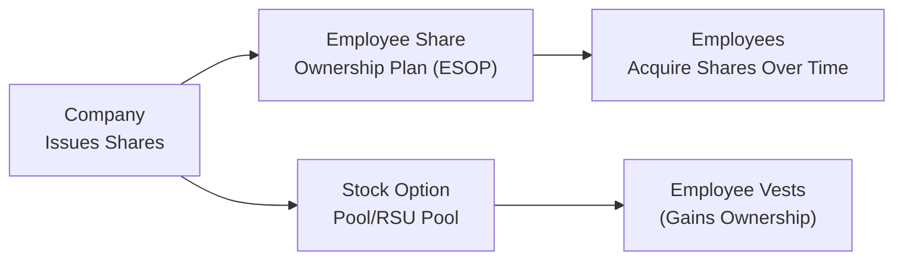

## Introduction
Sometimes, when we think about “owning a piece of the pie,” we picture an actual, well, pizza—especially if we’re hungry. But in the corporate world, giving employees a “piece of the pie” usually means granting them equity in the form of shares or share-based compensation. Employee Share Ownership Plans (ESOPs), Stock Options, and Restricted Stock Units (RSUs) are all ways companies let employees share in future success. The idea is straightforward: if employees stand to gain financially as the share price rises, they might work a little harder and stick around a little longer.

Whether you’re a brand-new analyst or a longtime finance professional, ESOPs and stock compensation can feel overwhelming. After all, they impact not just the employees receiving the shares but also the company’s capital structure, dividend policy, and even overall valuation. In this article, we’ll unpack the different forms of employee share ownership, walk through their features and implications, and highlight key considerations for analysts. So grab a (figurative) slice of that pie, and let’s talk ESOPs and stock compensation.

## Why Employee Ownership Matters
Employee share ownership turns participants into part-owners—making them more conscious of the company’s performance. When those employees are also the ones creating the products, serving the customers, and driving innovation, that sense of ownership can lead to stronger loyalty and a push for higher productivity.

On the firm side, providing equity can help conserve cash that might otherwise be spent on hefty salaries or bonuses. It also sets up potential retention benefits if equity awards vest over several years. Of course, there’s a flip side: equity awards can dilute existing shareholders’ ownership and affect key metrics like earnings per share (EPS). We’ll get to that soon.

## Understanding ESOPs
Employee Share Ownership Plans (ESOPs) are specialized programs where a company essentially sets up a trust that holds shares for the benefit of employees. Over time—often annually—companies contribute shares (or cash to buy shares) into this trust. Employees receive a vested interest in these shares, typically according to a vesting schedule tied to years of service.

• Alignment of Interests: ESOPs tie employee rewards to the company’s valuation, nudging employees to think more like owners.  
• Tax Advantages (in Many Jurisdictions): ESOP structures can generate significant tax benefits, both for the company and for employees. Under US GAAP, for example, contributions to an ESOP can be tax-deductible up to certain limits. IFRS jurisdictions often follow similar but not identical rules.  
• Long-Term Focus: Because ESOP shares typically vest over time, employees become more focused on sustained company performance.

### Corporate Governance and ESOPs
ESOPs can influence corporate governance. Employees who own shares may gain voting rights (depending on the plan structure), effectively giving the workforce a say in company decisions. This can have both positive and negative implications. On one hand, employees might be more engaged; on the other, having a large employee bloc could complicate takeovers or strategic moves.  

### Dilution and ESOPs
An ESOP can lead to share dilution. Each plan contributes new shares or purchases existing shares to allocate to employees. This increase in total share count may reduce earnings per share (EPS) if net income stays constant. Analysts often examine how ESOPs are structured and forecast the ultimate dilution effect on share price performance.

## Stock Options
A stock option gives employees the right, but not the obligation, to purchase a specific number of shares at a predetermined price (the strike or exercise price). The typical life span of an option is around 5–10 years, though it varies by plan. If the company’s stock price rises above the strike price, employees can buy the shares at a discount (relative to market value) and potentially sell them later at a gain.

Here’s a small personal anecdote: once, I worked at a startup that offered stock options as part of our compensation package. We all thought, “Hey, if this thing goes big, we’re set!” The day the stock price finally shot up above the exercise price was a cause for more than a couple high-fives in the hallway (and maybe a celebratory doughnut run). That excitement is exactly the sense of ownership companies like to foster.

### Incentives and Timing
Stock options commonly vest over time (e.g., 25% per year over four years) or according to performance metrics (like reaching certain sales targets). This vesting schedule helps retain employees: if they leave early, they forfeit unvested options.

### Impact on Dividend Policy
From a dividend policy standpoint, stock options matter because employees with unexercised stock options generally do not receive dividends (unless the plan has a dividend equivalent feature). But once exercised, employees get actual shares that are dividend-eligible. When companies forecast future dividend obligations, they consider the number of potentially exercisable options. If a large portion of options is likely to be exercised soon, the firm’s future dividend cost could be higher.

### Dilution from Option Exercises
When employees exercise stock options, new shares are generally issued, increasing the total shares outstanding. This can reduce EPS and possibly the share price if the market had not fully accounted for the dilution. Analysts usually incorporate the treasury stock method in calculating diluted EPS to reflect the potential for outstanding options to become actual shares.

## Restricted Stock Units (RSUs)
Restricted Stock Units (RSUs) are a promise to deliver shares to employees upon completing certain requirements (often time-based or performance-based vesting). Unlike stock options, RSUs require no purchase by the employee; once they vest, employees receive the shares outright.

• Simplicity: Employees often prefer RSUs because they receive actual shares without needing to pay an exercise price.  
• Less Volatility for Employees: RSUs retain some value as long as the stock price remains above zero. Stock options, by contrast, can expire worthless if the market price stays below the strike price.  
• Dividend Considerations: Some RSU plans include dividend equivalents, meaning RSU holders can receive cash payments or additional shares that reflect declared dividends. This can affect the company’s total dividend payout obligations.

## Impact on Dividend Policy and Capital Allocation
A company’s dividend policy hinges on distributing excess cash to shareholders while funding growth. But layer on employee ownership, and the puzzle becomes more interesting:

1. Cash Requirements: If the firm issues dividends on unvested shares or pays dividend equivalents on RSU awards, cash needs rise.  
2. Share Count Forecasting: As ESOPs accrue more shares or employees exercise options, the outstanding share count can jump, changing per-share ratios.  
3. Signaling: Companies might worry that cutting dividends to cover high equity compensation costs could send a negative signal to the market—even if it’s a good long-term decision. That can compel them to keep a certain dividend level.  
4. Future Dilution: A bigger share base from stock plans means that each shareholder’s stake is proportionally reduced, which might make management more or less inclined to revise dividend policy.  

In practice, some companies set a stable or steadily growing dividend and then manage equity compensation around it. Others see buybacks as a way to offset dilution from employee stock plans. For instance, a firm granting a large block of options can repurchase shares on the open market to keep net shares outstanding stable.

## Analyzing ESOPs and Stock Compensation as an Analyst
From a CFA exam perspective—or really, from any financial analyst’s perspective—equity compensation is a key piece of the puzzle in corporate valuation and capital structure analysis.

• Projecting Dilution: Estimate how many shares will be added over time. Look at the vesting schedules, typical employee turnover, and the strike prices of options compared to the current market price.  
• Understanding Vesting Schedules: Is vesting time-based, performance-based, or both? Do shares or options cliff vest (all at once) or gradually? This influences growth expectations and potential pressure on the share price.  
• Dividends Paid on Unvested Shares (or Dividend Equivalents): If the company pays dividends to employees even before their shares fully vest, that can change the firm’s cash outflows.  
• Tax Implications: Different jurisdictions have varied tax treatments for ESOPs, RSUs, and stock options. For instance, under US GAAP, the company must record compensation expense in the income statement over the vesting period. IFRS has similar guidelines under IFRS 2 “Share-based Payment,” but the specifics around tax deductions and timing can differ.  
• Corporate Governance Risks: A workforce with significant ownership might vote differently than large institutional shareholders. Or a poorly structured plan could saddle the firm with large share-based compensation expenses.

Below is a quick diagram summarizing how these instruments fit into the bigger picture:

## Practical Financial Examples and Case Studies

### Example 1: The Startup with Generous Options
Imagine a startup, QuickTech Inc., that issues 1 million stock options at an exercise price of $10 when its current market price is $10. The options vest evenly over four years. If QuickTech’s share price rises to $20 in Year 3, employees might start exercising. This adds up to 1 million new shares into the market (assuming all are exercised). If QuickTech’s net income stays the same, and outstanding shares were originally 5 million, that’s a 20% increase in share count (going from 5 million to 6 million). EPS—and possibly the share price—could be affected, especially if the market had not accounted for that dilution.

### Example 2: RSUs and Dividend Equivalents
Now consider MegaCorp, which grants 500,000 RSUs to senior managers with a three-year vesting period. Each RSU is entitled to dividend equivalents. MegaCorp currently pays an annual dividend of $1 per share. That means each holder of 500,000 RSUs gets $1 per unvested share (unless the plan is structured to reinvest the dollar in additional shares). This effectively increases the company’s dividend burden by $500,000 each year until vesting is complete. If MegaCorp’s cash flows are tight, this could affect overall dividend policy (possibly limiting the dividend growth rate to handle the extra outflow).

## Common Pitfalls and Best Practices
• Underestimating Dilution: It’s easy to ignore the potentially large number of shares lurking in unvested options or ESOP allocations.  
• Incorrect Accounting: Failing to account properly for share-based compensation expense can lead to overstating reported earnings.  
• Overly Generous Grants: Some companies keep awarding new rounds of stock options without assessing the cumulative impact on existing shareholders.  
• Poor Communication: If management doesn’t clearly communicate the purpose and structure of ESOPs or equity grants, employees—and investors—may lose faith or misunderstand their value.  

### Strategic Use of Buybacks
A firm might use share repurchases to offset the newly created shares from exercised options or distributed ESOP allocations. The buyback strategy can maintain stable share counts, supporting EPS and potentially mitigating negative price pressure from dilution.

## ESG and Employee Ownership
In many markets, ESOPs are viewed as part of a broader Environmental, Social, and Governance (ESG) ethos—particularly the “Social” aspect. Encouraging employee stock ownership can signal a commitment to employees’ wellbeing and reflect inclusive business practices. Some institutional investors increasingly consider such measures as positive ESG indicators, which can affect investment decisions.

## Final Exam Tips
• Expect scenario-based questions: The CFA exam might give you a company that sees a jump in share price, leading to a wave of option exercises. You’ll need to model the effect on EPS or other per-share metrics.  
• Keep an eye on tax treatments: In realistic exam scenarios, you may have to figure out how share-based compensation expense hits the income statement under IFRS vs. US GAAP.  
• Integrate with capital structure and payout policy: Test-takers love to ask how these plans influence a firm’s decision to pay dividends vs. repurchase shares. Make sure you’re prepared to handle a question that merges all of these topics.  
• Read carefully for vesting conditions: A common exam trap is missing the difference between time-based and performance-based vesting. If you see that half the shares vest only if the company hits a certain EBITDA target, incorporate that detail into your analysis.  
• Don’t ignore the big picture: Remember to integrate employee ownership analysis with the broader scope of financial ratios, capital budgeting decisions, and corporate governance.

## References
• Balsam, S. (various articles and textbooks on Equity Compensation Strategies).  
• The National Center for Employee Ownership (NCEO): https://www.nceo.org  
• Society for Human Resource Management (SHRM): https://www.shrm.org (Compensation and Equity Plan Design).  
• IFRS 2 – Share-based Payment.  
• FASB ASC Topic 718 – Compensation – Stock Compensation.  
• Official CFA Institute Curriculum Readings on Corporate Issuers.

## Test Your Knowledge: Employee Share Ownership and Stock Compensation



### Which of the following statements is most accurate regarding ESOPs?
- [ ] ESOPs require employees to purchase shares at the current market price.  
- [x] ESOPs often involve the company contributing shares into a trust for employees.  
- [ ] ESOPs never offer any tax benefits to employees or companies.  
- [ ] ESOPs distribute all shares to employees immediately without any vesting period.  

> **Explanation:** In an ESOP, companies typically make contributions of shares or cash to a trust, which allocates shares to employees over time (often subject to a vesting period). Participants do not normally buy shares at market price under most ESOP structures.

### How do stock options primarily differ from RSUs upon vesting?
- [x] Stock options require the employee to purchase shares at the strike price, whereas RSUs convert to shares automatically at no cost.  
- [ ] Stock options let employees acquire shares at a price below zero.  
- [ ] RSUs force employees to pay the current market price upon vesting.  
- [ ] There is no difference once they both vest.  

> **Explanation:** Stock options grant the right to buy shares at the strike price, potentially cheaper than the market if the stock has appreciated. RSUs simply turn into shares when vested, with no purchase required from the employee.

### A company’s dividend policy could be influenced by ESOPs and stock options primarily due to:
- [ ] Shortening the company’s fiscal year.  
- [x] The potential increase in total outstanding shares, which can alter the total dividend payout.  
- [ ] The prohibition of dividends in ESOPs.  
- [ ] The absence of share-based compensation expense.  

> **Explanation:** As stock plans are exercised or vest, new shares come into circulation. That increases the total number of shares that may be eligible for dividends, which can influence the company’s dividend obligations.

### Under the treasury stock method for diluted EPS:
- [x] Exercised options are assumed to be paid for at the strike price, and that cash is hypothetically used to buy back shares.  
- [ ] No adjustment is made for any option exercises.  
- [ ] All outstanding options are ignored for EPS calculations.  
- [ ] Dividends are deducted from net income on the income statement.  

> **Explanation:** The treasury stock method assumes that employees exercise options; the strike price proceeds are used to buy back shares at the prevailing market price. The net increase in shares is used in calculating diluted EPS.

### Which of the following is a potential advantage of RSUs compared to stock options for employees?
- [x] RSUs still have value even if the stock price is only slightly above zero.  
- [ ] RSUs grant employees the right to purchase shares at a discount to market price.  
- [x] RSUs require no upfront cash from employees.  
- [ ] RSUs are exempt from any share-based compensation expense.  

> **Explanation:** RSUs don’t require employees to pay a strike price, and they hold some value regardless of the stock’s appreciation level because, on vesting, employees simply receive shares (assuming the company’s stock has not dropped to zero).

### What is the typical effect of a large increase in share-based compensation expense on net income?
- [x] Reduced net income due to higher compensation costs.  
- [ ] No impact on net income, since it’s purely a balance sheet transaction.  
- [ ] Increased net income because of tax benefits.  
- [ ] No effect unless employees actually exercise their options that year.  

> **Explanation:** Share-based compensation is an expense recognized over the vesting period under both IFRS and US GAAP, reducing reported net income.

### Why might a company prefer share buybacks over cash dividends when it has large outstanding stock option grants?
- [x] Buybacks may help offset the dilution caused by inbound option exercises.  
- [ ] Share buybacks increase the vesting period.  
- [x] Buybacks allow the firm to pay employees directly in cash.  
- [ ] Share buybacks are mandatory when there are option grants.  

> **Explanation:** Repurchasing shares can mitigate the dilution caused by new shares issued when employees exercise options. Companies often use buybacks strategically to manage outstanding share count.

### What is a primary consideration for analysts when evaluating ESOPs?
- [x] Projecting the dilution effect on per-share metrics and potential changes to capital structure.  
- [ ] Assessing whether individual employees are satisfied with gift cards.  
- [ ] Ensuring that employees are restricted from selling shares forever.  
- [ ] Guaranteeing that the company assigns no voting rights to ESOP participants.  

> **Explanation:** Because ESOPs often issue new shares, analysts should focus on how the resultant dilution affects EPS and other key metrics.

### How do dividend equivalents on RSUs affect a company’s dividend policy?
- [x] They can increase the total dividend or dividend-equivalent payout obligations.  
- [ ] They generally eliminate the need for dividends on common shares.  
- [ ] They are paid only after employees retire.  
- [ ] They are not permitted under IFRS.  

> **Explanation:** RSU dividend equivalents require additional cash outflow or additional shares to parallel what shareholders receive. Thus, total cash required for dividends can rise, influencing the company’s broader payout decisions.

### In general, can ESOPs and other equity compensation plans be linked to a company's ESG objectives?
- [x] True  
- [ ] False  

> **Explanation:** Many view broad-based employee ownership as fostering a socially responsible work environment, enhancing employee engagement, and potentially aligning with ESG considerations.


