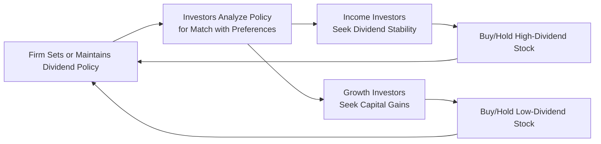

## Introduction and Overview

If you’ve ever wondered why some companies pay high dividends while others hardly pay anything at all, it might be due to what we call the “clientele effect.” This is the phenomenon where certain groups of investors develop strong preferences for specific dividend policies. And you know what’s extra fascinating? Over time, each firm’s dividend policy tends to attract (or repel) particular types of investors—kind of like how certain restaurants attract a loyal crowd based on the cuisine they serve. 

Maybe you once knew a retiree—like my old neighbor, who insisted on a steady quarterly dividend check to help fund his leisurely lifestyle. That’s a classic income-oriented investor, someone who might naturally align with utility stocks or stable, dividend-paying blue-chip companies. On the flip side, younger folks or more aggressive traders often focus on growth and prefer the company to reinvest its profits instead of handing out dividends. The interplay among these diverse investor mindsets is precisely what sets the stage for the clientele effect.

## Defining the Clientele Effect

The clientele effect in finance describes how different groups of investors—called “clienteles”—are attracted to different dividend policies. Corporations vary widely in how they return value to shareholders: some are known for consistent, generous payouts; others for reinvesting every cent into expansion. Because of tax considerations, personal cash flow needs, or simple comfort levels, investors tend to cluster into the stocks that align best with their preferences.

### How It Connects to Chapter Concepts

• In Chapter 1, Dividends and Share Repurchases, we look at how companies distribute cash. The clientele effect references how these payout decisions shape who actually buys (and holds) the stock.  
• With knowledge of stakeholder priorities (see Chapter 2), managers might also consider how their investors perceive shifts in payment patterns.  
• In governance discussions (Chapter 3), board members often debate how best to serve or balance the preferences of long-term income investors versus other stakeholders.

## Key Theoretical Underpinnings

### Tax-Based Interpretations

Elton and Gruber in their classic work suggest that differences in investors’ marginal tax rates create natural preferences for either dividends or capital gains. A high-income investor might prefer lower dividends because dividends can be taxed more heavily (depending on jurisdiction), while lightly taxed entities (like pension funds or university endowments) might be ambivalent or even prefer dividends. The presence of these tax “clienteles” means that if a company changes its dividend policy strongly, the firm might end up with a sudden change in its investor base.

### Behavioral Considerations

It’s not always about raw math—psychology can play a part, too. Many income-oriented investors simply like consistent dividends because it gives them a sense of stability and discipline. Even if from a purely rational standpoint (think dividend irrelevance from Modigliani–Miller) it shouldn’t matter if value is returned in dividends or share buybacks, individuals might still have a “bird in the hand” mentality. They’re comfortable seeing that regular cash coverage.

At the other extreme, certain investors care more about share price appreciation. They prefer that the company plow back earnings into research, development, acquisitions, or expansions. This difference in preference also dictates how a firm’s stock might be perceived among growth-oriented investment funds.

### Stability of Clienteles Over Time

A neat twist is that once a firm sets a pattern for dividends—like a streak of stable quarterly payouts—it can attract loyal fans who become vocal if the payout changes. This dynamic typically encourages companies to avoid abrupt shifts. Managers often keep the payback policy consistent to satisfy their existing base and avoid turnover that might cause a wave of selling (and possibly a drop in share price).

## Practical Implications for Corporate Managers

1. Dividend Policy Alignment: CFOs and boards base their dividend policy not just on earnings alone but also on who owns their stock. Alienating a faithful, income-focused crowd with sudden policy cuts can be messy.

2. Market Response to Policy Change: If the company initiates a higher dividend, it might suddenly appear on the radar of particular dividend-themed ETFs or retirement-focused institutions. That new demand can buoy the price. On the other hand, a cut can chase away investors who rely on stable dividends, sometimes leading to downward pressure on the share price.

3. Communication Strategies: Managers often pre-announce or signal changes in dividend policy. The signaling angle is connected to the “bird-in-the-hand” idea—many believe a public statement on dividend changes indicates some insider knowledge of the firm’s profitability. Good corporate governance (Chapter 3) and robust communications channels (Chapter 2) help to minimize confusion and potential negative market reactions.

## An Illustrative Mermaid Diagram

To visualize how dividend policy can shape the investor mix, let’s see a simplified flow diagram. This diagram shows how a firm’s dividend policy resonates with certain investor groups and how that feedback loop might reinforce the existing policy.

In this simplified cycle, the company sets or adjusts its policy; investors who value those specific payout structures are attracted or retained, which in turn reinforces the policy.

## Real-World Examples and Scenarios

• Utilities and Telecom Companies: Commonly have high payout ratios. They pull in retirees, pension funds, and others who thrive on predictable distributions.  
• Tech and Biotech Firms: Often keep dividend yields at zero or minimal levels. They attract growth-oriented investors who anticipate capital gains.  
• Partial Transitions: Some tech giants initially paid no dividends, but as they matured (and faced pressure with large cash balances), they introduced or increased dividends. This shift caused a partial rotation in shareholders over time.

### A Quick Anecdote

I remember chatting with a friend who works at a rapidly growing start-up. He was genuinely puzzled by big, stable companies paying dividends, saying, “Why wouldn’t they just keep investing in the business?” Meanwhile, my neighbor who’s about to retire loves his monthly or quarterly dividend checks because “it’s like having a dependable paycheck.” That’s precisely the clientele effect in action—two different investors, two different sets of goals, happily self-selecting into their preferred types of stocks.

## Important Considerations Around Tax Efficiency

• Investor-Level Taxation: Dividend income might trigger immediate taxation for individuals, whereas capital gains can often be deferred until the investor sells the stock.  
• Institutional Investors: Some institutions are tax-exempt (e.g., certain pension funds, sovereign wealth funds), so for them, the tax friction is minimal.  
• Share Buybacks vs. Dividends: Companies sometimes favor share repurchases if capital gains taxes are more favorable to their investor base. This interplay ties into our broader conversation about share repurchases (see earlier sections of Chapter 1).

## Best Practices and Common Pitfalls

• Consistency Matters: Sudden fluctuations or confusing signals about payouts can cause a rush to the exits among your loyal shareholders.  
• Listen to the Investor Base: Use shareholder meetings, analyst calls, and market research to gauge if you’re serving your existing clientele effectively.  
• Avoid Over-Reliance on Past Stereotypes: Sometimes younger segments want dividends too. Preferences shift over time, so keep a pulse on changing demographics.  
• Watch for Conflicts: Corporate managers might face conflicting suggestions from different stakeholders (see Chapter 2 on stakeholder conflicts). Balancing them responsibly is key.

## Exam Relevance and Possible Question Angles

At the CFA Level III exam, you can expect scenario-based questions that link dividend policy changes to potential investor reactions. You may be asked to analyze how altering a payout structure (dividend initiation or share buyback) might shift the firm’s investor base or how differing tax regimes influence investor preferences.  
• Constructed Response Angle: You might get a prompt describing a multi-asset portfolio with certain risk-return objectives where your client insists on generating stable income. The question could ask how to incorporate high-dividend equities to satisfy immediate income needs.  
• Item Set Angle: You might see a case where a CFO proposes a dividend cut to fund a high-return project. The question might ask about the implications for the existing investor base and any signaling effects.

## Conclusion

The clientele effect illustrates a self-reinforcing cycle: companies tend to adopt payout policies that end up attracting investors who actually favor those policies. That might sound so convenient that you wonder, “Why doesn’t everyone just pick a policy and run with it?” The catch is it’s not always stable. External shifts in regulation, tax law changes, or evolving corporate strategies can force abrupt changes, which can create a mismatch between what the company’s paying and what its investors expect.

Nonetheless, the clientele effect highlights the importance of understanding who’s in your shareholder base—and why. By appreciating these preferences, corporate managers and boards navigate the delicate equilibrium between returning cash to shareholders and maintaining enough capital for growth. Minimizing abrupt changes to dividend policy usually preserves a loyal investor base and stabilizes the share price.

## References and Further Reading

• Elton, E. J., & Gruber, M. J. (1970). Marginal Stockholder Tax Rates and the Clientele Effect. Review of Economics and Statistics.  
• Journal of Financial Economics – Various studies on investor preference and ownership structures.  
• CFA Institute Level III Curriculum Readings on Payout Policy and Tax Considerations.  
• “Corporate Finance: Theory and Practice” by Aswath Damodaran, for deeper insights into payout policy.

---

## Test Your Knowledge: The Clientele Effect of Dividends Quiz



### According to the clientele effect, different investors are attracted to firms based on:
- [ ] The firm’s brand image alone
- [x] The firm’s dividend policy
- [ ] The firm’s board structure
- [ ] The firm’s CEO compensation

> **Explanation:** The clientele effect refers to the tendency of investors to seek out companies whose dividend policies match their particular needs or preferences.

### Which of the following illustrates the impact of a dividend policy change on the clientele?
- [ ] The company’s debt ratings are unaffected by new dividends.
- [x] Retirees might sell shares if a historically high dividend is cut significantly.
- [ ] The firm’s board composition automatically changes with each dividend adjustment.
- [ ] All investors are indifferent to dividend changes.

> **Explanation:** Investors who seek regular income are often sensitive to dividend cuts. They may exit investments that no longer meet their income preferences.

### Elton and Gruber’s tax-based interpretation suggests that:
- [x] Investors in higher tax brackets may prefer capital gains over dividend income.
- [ ] Dividends are never taxed.
- [ ] Shareholders always prefer higher dividend payouts regardless of tax implications.
- [ ] Institutional investors are more tax sensitive than individuals.

> **Explanation:** Elton & Gruber showed how investors in higher tax brackets might opt for stocks with lower dividends to minimize immediate tax liabilities.

### Which group might particularly favor stocks with a high dividend payout?
- [x] Income-oriented investors seeking steady cash flow
- [ ] Investors with only short-term trading objectives
- [ ] Investors who ignore cash distributions
- [ ] Day traders concerned with intraday volatility

> **Explanation:** Income-oriented investors often prioritize stable and predictable dividend payments to meet recurring expenses or income needs.

### Select the statements that accurately describe the clientele effect:
- [x] Different investors have unique preferences for dividends.  
- [ ] It is unrelated to taxes.  
- [x] Companies’ investor bases can shift if dividends change.  
- [ ] It hinges solely on stock market liquidity.

> **Explanation:** The clientele effect arises from distinct investor preferences and can cause changes in a firm’s investor base if dividends are modified drastically.

### A sudden reduction in dividends can:
- [x] Lead certain dividend-seeking investors to sell their shares.
- [ ] Attract more income-based investors.
- [ ] Be seen as a guaranteed signal of strong future growth.
- [ ] Eliminate taxes for existing shareholders.

> **Explanation:** A sudden cut often frustrates income-focused investors who rely on stable payouts, prompting them to look elsewhere.

### Which factors influence dividend clientele formation? (Select all that apply)
- [x] Tax rates applicable to dividends
- [ ] CEO’s educational background
- [x] Investors’ cash flow needs
- [ ] Pre-tax corporate profits without considering distribution

> **Explanation:** Dividend clientele formation is typically driven by the interplay of tax considerations and investors’ income preferences.

### For a firm targeting mostly tax-exempt investors:
- [x] Dividend policy may be more flexible because those investors face fewer tax consequences.
- [ ] Dividends should be minimized due to extreme tax burdens.
- [ ] It’s unnecessary to pay dividends at all.
- [ ] It’s guaranteed to attract only individual retail investors.

> **Explanation:** Tax-exempt investors don’t bear the usual dividend tax burdens and thus are less sensitive to payout structure.

### Which statement best describes Nelson, who invests strictly in high-dividend stocks?
- [x] He is an income-oriented investor seeking regular cash distributions.
- [ ] He is unconcerned about payouts and invests only in capital gains.
- [ ] He always buys low-dividend technology stocks.
- [ ] He invests only in zero-yield corporate debt.

> **Explanation:** Preferring high dividends is a hallmark of an income-oriented investor.

### True or False: The clientele effect suggests that if a firm changes its dividend policy, a shift in its investor base may follow.
- [x] True
- [ ] False

> **Explanation:** The core idea of the clientele effect is that investors gravitate to dividend policies that fit their preferences; hence, changing the policy can alter the investor base.


