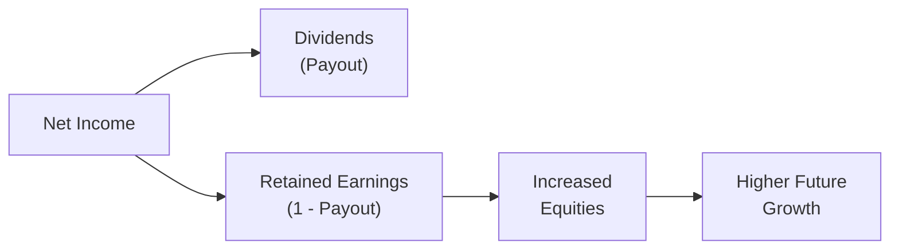

## Overview and Context

Dividends are often a highlight for investors—everyone likes the idea of receiving a steady stream of income from their investments. But there is a trade-off for companies: The more you pay out in dividends, the less you have left to reinvest in new projects, expansions, and growth opportunities. This balancing act is what we refer to as managing the payout ratio and ensuring the firm’s long-term growth is sustainable.

From our earlier discussions in Chapter 1 on Dividend Policies, we saw how companies can tailor their dividend strategies to fit their goals. In this section, we’re going to connect those discussions to the concept of sustainable growth. And to keep things a bit more casual, I’ll even share a silly personal story or two—because I remember one time when I first tried to apply these ideas to my own personal budget: I spent so much on “dividends to myself” (read: dinners out!) that I left almost nothing for my “reinvestment” (my savings and self-development). It’s a dynamic that’s surprisingly similar to how a corporation juggles dividends and retained earnings.

## Understanding Payout Ratios

The payout ratio is basically the portion of a firm’s income that it returns directly to shareholders as dividends:

Dividends Payout Ratio = (Dividends per Share) / (Earnings per Share)

Or, on a more aggregate basis:

Payout Ratio = Total Dividends / Net Income

An alternative measure—especially for analysts who focus on cash flow—is the cash payout ratio, which replaces net income with free cash flow. Either way, the underlying principle is the same: If a company distributes 40% of its earnings as dividends, its payout ratio is 40%. 

### Why It Matters
• A higher payout ratio can indicate that a company is strongly committed to distributing cash to shareholders.  
• Too high a ratio might threaten the company’s ability to fund its own growth if it doesn’t have robust external financing options.  
• A stable and consistent ratio over time might signal management’s desire to commit to a predictable dividend policy.  

If you recall from earlier sections such as Dividend Policies (stable, residual, hybrid), some companies maintain a stable dividend (leading to a gradually evolving payout ratio), whereas others adjust the dividend to reflect leftover (residual) earnings after all necessary projects are funded. Investors pay close attention to these nuances. If a firm’s payout ratio begins to skyrocket with no clear reason, you might hear analysts say something like, “Uh, that’s not sustainable.”  

## The Retention Ratio (Plowback Ratio)

The retention ratio is basically the flipside of the payout ratio. It represents the fraction of earnings that the company keeps in-house for reinvestment:

Retention Ratio = 1 − Payout Ratio

If a company has a 40% payout ratio, then its retention ratio is 60%. This is the portion of earnings the firm is “plowing back” into new projects, expansions, acquisitions, or maybe just building up cash reserves. Personally, I find it helpful to think of it like your monthly take-home salary: if you can’t pay yourself first (i.e., stash some money into savings or investments), your future prospects for growth might be limited.

### Balancing Retention and Payout
• If a firm retains too little, it might have to rely excessively on external funding (like issuing new shares or borrowing).  
• If a firm retains too much, it might accumulate more cash than it can effectively invest.  

Corporate finance is all about finding the sweet spot. And that’s where the concept of sustainable growth steps in, helping us tie together the notion of dividends, reinvestment, and overall strategic objectives.

## The Concept of Sustainable Growth Rate (SGR)

The sustainable growth rate (SGR) is a widely used metric to see how fast a firm can grow without having to issue new equity. It’s determined by the company’s profitability (as measured by Return on Equity, ROE) and how much of that profit it retains (retention ratio):


\text{SGR} = \text{ROE} \times \text{Retention Ratio}


In KaTeX syntax, that looks like:


\text{SGR} = \text{ROE} \cdot \text{(1 - Payout Ratio)}


### An Intuitive Explanation
Imagine the company invests $1 of shareholder equity. If it earns an ROE of 12%, that $1 becomes $1.12 after one year. If the payout ratio is 50% (meaning 50% is returned to shareholders), the company keeps half of that gain—in this case, $0.06. Now the new total equity that remains reinvested in the business is $1 + $0.06 = $1.06. Effectively, the firm grew by 6%. So the firm’s sustainable growth rate is 0.12 × 0.50 = 0.06 or 6%.

### A Simple Numerical Example
Let’s do a more concrete example, step by step, and add a slight personal twist:

• Company CozyCups has $200 million in equity.  
• Its net income (after taxes and interest) last year was $40 million, giving it an ROE of 20% ($40 million / $200 million = 0.20).  
• CozyCups pays out 40% of that $40 million, which is $16 million, leaving $24 million to be retained. Hence, retention ratio is 60%.  
• The sustainable growth rate = 20% (ROE) × 60% (Retention) = 12%.  

As long as CozyCups grows its operations at or below 12%, it can do so without needing external financing—no need to issue new shares or take on excessive new debt. If management announces a 20% growth target, you might wonder how they plan to finance the difference (8%) or whether they’d need to reduce the dividend or issue more shares.  

## Visualizing the Flow

Sometimes, it helps to see the big picture of how net income feeds into dividends, retained earnings, and future equity. Here’s a small Mermaid diagram to illustrate this process:




## Why Payout Ratios and SGR Matter in Corporate Issuers

Balancing profits between dividend payout and retention for growth is a key strategic decision for corporate issuers. If you look at Chapter 5 on Capital Investments and Capital Allocation, you’ll see that companies need to decide which projects to fund next. Those projects, in turn, determine future cash flows, which can later be paid out as dividends or reinvested again. The puzzle is continuous.

### Aligning with Market Expectations
Investors often have distinct preferences, or clientele effects, regarding dividend yields. Some want stable, reliable dividends (e.g., retirees, pension funds). Others may prefer the firm to reinvest heavily. Striking that balance can enhance the company’s valuation because it reduces investor uncertainty about the firm’s capital allocation plans.

### Signaling
Recall from earlier sections (like 1.5 Signaling Effect of Dividends) that changes in dividends can send strong signals to the market about management’s outlook on future earnings. A slight drop in the payout ratio might initially scare income-focused investors, but if it’s done to fund an exciting new growth project, the market might applaud that decision in the long run—especially if the project’s returns exceed the cost of capital.

## Linking Dividend Policy to Sustainable Growth

A high payout ratio means a low retention ratio, which often drives a lower SGR. If your SGR sits below your desired expansion rate, you’ll need external equity or additional leverage to keep growing. Similarly, if your firm’s actual growth is lagging below the SGR, you might be retaining too much capital—sitting on excess cash that could have been distributed to shareholders or used for share buybacks.

### Potential Conflicts
• **Over-Retaining Earnings:** The firm piles up cash, invests in subpar opportunities, or sits idle.  
• **Over-Paying Dividends:** The firm increases financial risk or must continually raise capital to fund expansions, which might erode shareholder value if the new shares dilute existing holdings.  

Finding harmony between these extremes is often the hallmark of effective strategic planning.  

## Practical Tips for Analysts

• Look at companies’ historical payout ratios: Are dividends growing faster than earnings? That hints at potential future cuts.  
• Check the firm’s projected growth versus its SGR. If the two are wildly out of sync, investigate how the gap will be bridged.  
• Don’t forget to evaluate the firm’s fundamental profitability (ROE). A modest retention ratio with a strong ROE might yield a higher SGR than a large retention ratio with a weak ROE.  

I once evaluated a mid-cap tech manufacturer that was funding aggressive expansions while also increasing its dividend each year. At first glance, that seemed awesome. But then I noticed its free cash flow was negative, and the company had to keep issuing new debt. Its “healthy” dividend was, in fact, limiting its capacity to self-fund expansions. The share price eventually took a hefty hit when the dividend was slashed. So always connect these dots and ask “Where’s that dividend money coming from?”

## Regulatory and Accounting Nuances

From an IFRS or US GAAP standpoint, dividends flow out of retained earnings reported on the balance sheet. In general, the recognition of dividends does not significantly differ—once declared, they reduce retained earnings. For analysts, the main question is whether the reported earnings themselves are reliable, so you might look at footnotes and any potential earnings management. But in essence, the relationship between net income, dividends, and sustainable growth remains consistent across different accounting standards.

## Best Practices and Common Pitfalls

**Best Practices**  
• Thorough scenario analysis: Estimate how changes in ROE or the payout ratio might shift the SGR.  
• Transparent communication: Management should articulate how dividends align with expected growth and capital structure—this can help prevent nasty surprises for stakeholders.  
• Regular reviews: The board and management should regularly revisit their dividend policy, especially if the firm’s capital allocation priorities change.

**Common Pitfalls**  
• Ignoring cyclical earnings patterns: A short-term earnings spike might mislead management into setting too high a dividend payout.  
• Underestimating external financing costs: Overly optimistic assumptions about raising new equity or borrowing cheaply might prove false if market conditions worsen.  
• Neglecting intangible growth opportunities: If the firm has intangible or uncertain R&D projects, a high retention ratio might or might not pay off. Analysts should examine the feasibility and internal rate of return (IRR) of such expansions.

## Real-World Examples and Case Studies

• **Steady Dividend Achievers:** Firms like Coca-Cola historically show consistent dividend increases. Their payout ratios have generally been stable, and their modest but steady growth remains largely funded by strong global operations.  
• **Tech Growth Story:** Some high-growth tech companies prefer minimal dividends or none at all, plowing back profits into expansions (high retention ratio). These companies rely on robust ROE to justify that strategy.  
• **Resource Cycles:** Firms in cyclical industries (e.g., oil and gas) may have variable payout ratios to adjust for commodity price swings. This can lead to a bumpy SGR.  

## A Short Python Example

You might sometimes want to do a quick calculation or a stress test for different payout ratios. Here’s a basic Python snippet to show how you might vary the payout ratio, given a certain ROE, and track the resulting SGR:

```python

ROE = 0.15  # 15% return on equity
payout_ratios = [i/100 for i in range(0, 101, 10)]  # from 0% to 100% in steps of 10

for pr in payout_ratios:
    rr = 1 - pr
    sgr = ROE * rr
    print(f"Payout Ratio: {pr:.0%}, Retention: {rr:.0%}, SGR: {sgr:.2%}")
```

You could run this in any Python environment to see instantly how your chosen payout ratio influences the sustainable growth rate.

## Final Exam Tips

• Be able to do quick mental math with the SGR formula. The exam might present a scenario describing projected growth and ask which financing method is needed if the firm’s desired growth exceeds its SGR.  
• Understand the interplay of dividends, share repurchases, and growth—especially how share repurchases can also impact a firm’s capital structure and future financing needs (see earlier sections on Share Buybacks).  
• Pay attention to unusual or contradictory patterns in payout ratios. You may be tested on identifying red flags for future dividend cuts.  
• Practice writing concise explanations in a constructed-response format, clearly stating how you derive your answer from the ROE, payout ratio, and other given info.  

## References and Further Reading

• Analysis for Financial Management (Higgins) – for deeper insights on the sustainable growth model.  
• Principles of Corporate Finance (Brealey, Myers, and Allen) – for thorough discussions on dividend policy and cost of capital.  
• Harvard Business Review articles on balancing dividend policy and growth – these were known to have shorter, practitioner-oriented insights.  

---

## Test Your Knowledge: Payout Ratios and Sustainable Growth



### Which formula best represents the relationship between dividend payout, retention, and sustainable growth?

- [ ] SGR = Retention Ratio × (1 − Return on Equity)
- [ ] SGR = Payout Ratio × Return on Equity
- [x] SGR = Return on Equity × Retention Ratio
- [ ] SGR = (Return on Equity / Retention Ratio)

> **Explanation:** The sustainable growth rate is computed as ROE × Retention Ratio, where Retention Ratio = 1 – Payout Ratio.

### A firm that maintains a high payout ratio is most likely to:

- [x] Retain less of its earnings.
- [ ] Rely less on external financing.
- [ ] Achieve a higher sustainable growth rate.
- [ ] Maintain unlimited growth without issuing new shares.

> **Explanation:** A high payout ratio directly implies the firm retains less of its earnings, which lowers its retention ratio and typically lowers the SGR.

### If a firm’s sustainable growth rate (SGR) is below its targeted expansion rate, it will likely:

- [ ] Reduce its margins to match the SGR.
- [x] Seek external financing or reduce dividends.
- [ ] Increase its dividend payout to stimulate demand.
- [ ] Immediately repurchase shares to boost the share price.

> **Explanation:** If the desired growth exceeds the SGR, the firm typically needs to either lower the dividend payout or rely on additional external funding.

### The retention ratio is defined as:

- [x] 1 − Payout Ratio.
- [ ] 1 − Sustainable Growth Rate.
- [ ] Net Income / Total Dividends.
- [ ] Net Income − Dividends.

> **Explanation:** The retention ratio is simply 1 minus the payout ratio.

### Which insight about over-retaining earnings is most accurate?

- [x] It can lead to surplus cash that might be invested in low-return projects.
- [ ] It guarantees higher shareholder value in the short run.
- [x] It avoids any reliance on external financing forever.
- [ ] It automatically increases the payout ratio.

> **Explanation:** Over-retention of earnings can result in inefficient capital allocation if profitable opportunities are lacking. Two correct statements are provided in the list to target multi-correct question types.

### A firm has an ROE of 10%, a payout ratio of 50%, and zero external equity financing. Its SGR is:

- [ ] 10%
- [ ] 9%
- [x] 5%
- [ ] 2%

> **Explanation:** SGR = ROE × Retention Ratio = 10% × (1 − 50%) = 10% × 50% = 5%.

### Which statement about payout ratios and share repurchases is most accurate?

- [x] Share repurchases reduce outstanding shares but do not affect the traditional dividend payout ratio directly.
- [ ] Share repurchases increase the current payout ratio but decrease future ROE.
- [x] Share repurchases never impact future earnings growth.
- [ ] Share repurchases always lead to an increase in net income.

> **Explanation:** Repurchases reduce the number of shares outstanding, potentially increasing EPS; the firm’s traditional dividend payout ratio is typically measured relative to net income, so it doesn’t directly measure repurchase outflows.  

### True or false: A firm must always issue new equity to achieve growth above its SGR.

- [x] False
- [ ] True

> **Explanation:** The firm could alternatively take on additional debt or adjust its dividend strategy. Issuing new equity is one, but not the only, path to growth above the SGR.

### Assuming net income stays constant, which of the following best describes the effect of an increase in dividends on the firm’s SGR?

- [x] It decreases, because the retention ratio falls.
- [ ] It remains unchanged since net income is constant.
- [ ] It increases, as higher dividends boost investor confidence.
- [ ] It is indeterminate without knowing cost of debt.

> **Explanation:** When dividends go up, the payout ratio goes up, leaving less for retention, which decreases the sustainable growth rate.

### The best reason to compare historical payout ratios with actual free cash flow generation is to:

- [x] Spot potential mismatches that could lead to dividend cuts.
- [ ] Ensure that financial statements comply with IFRS.
- [ ] Identify the firm’s exact share price trajectory.
- [ ] Force the board to rely on only internal financing.

> **Explanation:** If a firm’s dividends aren’t supported by its free cash flow, analysts often expect the payout to be adjusted (cut) eventually.


