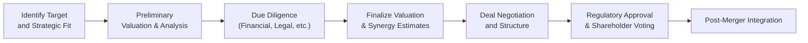

## Introduction and Key Concepts

Mergers, acquisitions, and takeovers can shape entire industries. I remember the first time I sat in on an M&A meeting—it was, well, a bit nerve-racking. The lawyers were tossing around terms like “fairness opinion,” “hostile takeover,” and so on, and I was frantically scribbling notes, thinking: “Ah, I hope I can keep all of this straight!” So I get it if you find the process a little overwhelming at first. But fear not. By the end of this, you’ll have a sturdy foundation on the key frameworks and practical insights required to analyze these transactions from a corporate issuer’s perspective.

This section addresses the various modes of corporate combinations, their strategic drivers, financial implications, and the due diligence protocols that make or break a deal. We’ll also discuss synergy analysis, forms of payment (cash vs. stock, etc.), regulatory considerations, and some typical pitfalls that companies (and practitioners) might experience.

## Types of Deals: Mergers, Acquisitions, and Takeovers

A merger typically sees two entities combine to form a single legal entity—like a union of equals (though in practice, one firm often emerges as the dominant entity). An acquisition, on the other hand, is when one firm outright purchases another (referred to as the “target”). Meanwhile, a takeover emphasizes the acquiring company’s pursuit of control of a target—sometimes welcomed, sometimes not.

• Friendly transactions happen when the target management supports the deal.  
• Hostile transactions emerge when the target’s management or board resists and the acquirer goes directly to shareholders (or uses other levers).  

### Strategic Rationale

Motivations behind M&A activity can be extensive. Let’s name a few key drivers:

• Market Expansion: Entering new geographical regions or broadening product lines.  
• Synergy Realization: Combining operations to yield cost savings or additional revenue.  
• Technology Gains: Acquiring more advanced technology or intellectual property typically seen in R&D-heavy sectors like pharmaceuticals or tech.  
• Diversification: Reducing exposure to a single product, service, or market.  
• Cultural or Brand Consolidation: Gaining brand presence, loyal customer bases, or intangible assets like patents/ trademarks.

A personal anecdote: I once worked on a project where the acquiring firm was enamored with a competitor’s brand image. They didn’t care so much about the competitor’s distribution channels, but wanted that intangible brand equity. Fascinating stuff. In the end, synergy wasn’t purely “hard” cost-based synergy; intangible synergy was huge.

## Synergy Assessment

The concept of synergy is central to M&A valuations. In short, synergy is the potential additional value created when two firms combine resources, operations, or market positions. The “textbook” synergy formula is often stated as:


\text{Value}_{\text{combined}} = \text{Value}_{\text{acquirer}} + \text{Value}_{\text{target}} + \text{Synergies} - \text{Integration Costs}


Yes, that looks simple enough, but synergy analysis can get complicated. Let’s break down some synergy types:

• Revenue Synergies: Cross-selling, new product expansions, expanding into each other’s distribution channels.  
• Cost Synergies: Elimination of redundant operating costs (like overlapping administration, IT, or back-office functions).  
• Financial Synergies: Improved debt capacity, better tax optimization structures, or lower financing costs.  

From a more advanced standpoint, synergy doesn’t always materialize as easily as pitch decks suggest. In practice, synergy estimates might come from discounted cash flow projections or scenario analyses that incorporate multiple cost and revenue assumptions. Just a heads up: synergy is often overestimated if the due diligence process is rushed.

## Forms of Payment and Implications

Choosing how to pay for a transaction—cash, stock, or a combination—has major consequences for capital structure, control, and shareholder wealth. Here’s a quick snapshot:

• Cash Transactions:  
  – Straightforward for shareholders receiving the cash—the final price is known.  
  – Typically reduces the acquirer’s cash balance or increases its debt if they finance the acquisition with borrowed funds.  
  – Immediate tax consequences for target shareholders in some jurisdictions.

• Stock Transactions:  
  – Offers the target’s shareholders participation in the combined company’s future (potential for upside but also risk if synergy doesn’t materialize).  
  – Acquirer’s ownership dilutes, which might be acceptable for synergy plays but can upset existing shareholders.  
  – Valuation complexity, as the exchange ratio depends on both companies’ stock prices.

• Mixed:  
  – Often tries to strike a balance—assuring partial liquidity in cash while offering an upside in equity.  
  – Complexity can increase in deal structuring, as parties hash out the exact ratio.

In corporate governance contexts, boards often weigh the impact on the stock price, the tax implications, and the alignment of incentives. If you recall from the section on capital structure (see “6.1 Weighted-Average Cost of Capital (WACC)” for cross-reference), raising debt for a cash deal can alter WACC and shift the risk-return profile for the acquirer.

## Due Diligence: Reducing Deal Risk

Due diligence is basically the corporate version of “checking under the hood” before you buy a used car. But the stakes are obviously bigger—if you skip robust due diligence, you could unwittingly adopt the target’s liabilities or overextend your own balance sheet.

Key areas of investigation:

• Financial Due Diligence: Historical statements, forecast reliability, asset quality, off-balance-sheet liabilities.  
• Legal Due Diligence: Contractual obligations, pending lawsuits, regulatory requirements, compliance with IFRS or US GAAP.  
• Operational and Cultural Fit: Systems compatibility, supply chain complexities, and cultural alignment.  
• Intellectual Property (IP): Valuation and ownership of patents, trademarks, trade secrets.

Once, I participated in an M&A where the target had pending litigation that wasn’t widely disclosed. The acquiring company discovered it at the eleventh hour, which allowed them to renegotiate. Big lesson: if you suspect a target is hiding something, dig deeper.

## Financial Analysis and Valuation Methods

Valuation is the bedrock of any M&A negotiation. While the synergy arguments and fancy pitch slides might be the sizzle, the valuation methods are the steak.

Common methods include:

• Discounted Cash Flow (DCF): Projects future free cash flows, discounted at the appropriate discount rate or WACC.  
• Comparable Company Analysis (Comps): Looks at how the market values peer firms. Usually uses multiples like EV/EBITDA or P/E.  
• Precedent Transactions: Examines M&A deals in the same sector or with similar profiles.  

DCF might require you to assess synergy upside. If synergy is uncertain, you can incorporate scenario or sensitivity analysis to gauge how changes in synergy assumptions affect the overall IRR. For intangible synergy, it can be tricky to quantify good will or brand synergy precisely, but M&A practitioners try approximations with premium analyses.

### Example: Synergy Calculation in Python

Sometimes you just want a quick script to compare synergy scenarios. Consider this snippet where synergy is estimated for multiple scenarios:

```python
import numpy as np

synergies = [200, 300, 400]
integration_costs = 50

for synergy in synergies:
    value_combined = 1000 + 600 + synergy - integration_costs
    print(f"Synergy: {synergy} | Combined Value: {value_combined}")
```

This snippet prints out combined valuations using synergy estimates of 200, 300, and 400 million, adjusting for a single integration cost of 50 million. In practice, synergy modeling can involve many more parameters (like additional capital expenditures, timeline for synergy realization, etc.), but you get the idea.

## Hostile Takeovers and Defense Mechanisms

While many acquisitions are friendly, corporate history is rife with stories of hostile takeovers. A hostile takeover transpires when an acquirer bypasses the target’s board or management. Strategies include:

• Tender Offer: The acquirer directly offers to buy shares from the target’s shareholders.  
• Proxy Fight: The acquirer persuades existing shareholders to replace the target’s board.  

Target companies sometimes employ defense tactics, such as:

• Poison Pills: Triggering the issue of new shares to existing shareholders at a discount when an acquirer’s stake hits a certain threshold, diluting the acquirer.  
• Golden Parachutes: Large compensation packages for existing executives upon a takeover, making acquisitions more expensive.  
• Staggered Board Structures: Only a fraction of board members are up for election each year, making it harder for a hostile bidder to gain control quickly.

A pro tip: watch for these defense tactics when analyzing a potential takeover’s feasibility. The presence (or absence) of robust defenses can shape the acquirer’s cost-benefit analysis.

## Regulatory and Cultural Considerations

Regulatory risk looms large—especially in cross-border deals or when the combined firm’s market share raises antitrust concerns. In some countries, deals above certain thresholds require government clearance for competition or national security reasons. IFRS or US GAAP standards might require specific disclosures or treatments (like how intangible assets are recognized, or how the purchase method is accounted for).

Cultural considerations are just as critical. Culture “clashes” can stymie integration and hamper synergy realization—something we might not see on the fancy synergy slides but that can be crucial to your ultimate success.

## A Quick Visual on the M&A Process

Below is a Mermaid diagram representing a simplified flow of a typical M&A process. Please note that real transactions can have more loops and parallel processes, but this depicts a fairly standard overview.



## Implementation and Post-Deal Integration

Even if the deal is signed, the real heavy-lifting often starts afterward—post-merger integration. It’s about integrating corporate cultures, aligning processes, merging financial systems, reorganizing product lines, etc. This is where synergy is either realized or lost.

Common integration pitfalls:

• Poor Communication: Employees (and customers) mistrust the new entity.  
• Cultural Incompatibility: Different management styles, risk tolerances, or corporate traditions.  
• Underestimating Integration Costs: Integration can be expensive—IT systems, consulting fees, HR harmonization, rebranding, and so forth.  

Yet, if well-executed, integration can bring that synergy sweet spot—like cost savings from combined supply chains or revenue boosts from cross-selling.

## Best Practices, Common Pitfalls, and Recommendations

• Thorough Due Diligence: Resist rushing. Revisit all assumptions rigorously.  
• Clear and Open Communication: Specifically critical for stakeholder buy-in (see “2.9 Communication Channels with Stakeholders” if you want more background on stakeholder management).  
• Alignment of Incentives: Make sure management compensation and performance metrics align with post-merger goals.  
• Comprehensive Integration Plan: Have a robust timeline, assign integration teams, and track synergy realization.  
• Cultural Assessment: Perform a deep dive to see if the corporate cultures “mesh.”  

One final note: Don’t indulge in M&A purely for the sake of “company empire building.” That can lead to the dreaded “winner’s curse”—where the acquirer pays more than the target’s intrinsic value. Overconfidence and poor synergy assumptions are common culprits here.

## Conclusion and Exam Tips

Mergers, acquisitions, and takeovers naturally bring excitement to corporate finance, as they can drastically reshape corporate trajectories. For CFA candidates, remember to focus on synergy valuation, capital structure impacts, and the regulatory compliance aspect. Keep in mind that you might see disguised exam questions linking synergy analysis to corporate governance or capital budgeting techniques. Also, be ready for scenario-based questions involving partial synergy realization or the conflict among different shareholder groups.

When you see M&A questions in the exam context, watch out for:  
• Calculation mistakes in synergy adjustments.  
• Weighted-average cost of capital changes if debt is used.  
• Whether intangible assets are accounted for properly.  
• The potential conflict of interest (agency issues) if management stands to benefit from a large compensation package.

Below you’ll find a set of sample questions to help you test your knowledge. Work through them carefully, as similar prompts could appear in the constructed-response or item set format at the exam. Good luck, and remember, thorough analysis and methodical approach often trump flashy synergy claims!

## References and Further Reading

• Bruner, R. F. (2004), “Applied Mergers and Acquisitions.” John Wiley & Sons.  
• Gaughan, P. A. (2017), “Mergers, Acquisitions, and Corporate Restructurings.” John Wiley & Sons.  
• Thomson Reuters Eikon and Bloomberg for M&A data.  
• Harvard Business Review M&A strategy articles: https://hbr.org  

--------------------------------------------------------------------------------

## Test Your Knowledge: Mergers, Acquisitions, and Takeovers Basics



### Which of the following statements accurately describes a friendly acquisition?

- [x] It's an acquisition supported by the target’s board and management.
- [ ] It's an acquisition that uses poison pills to prevent hostile action.
- [ ] It's an acquisition that automatically requires a proxy fight.
- [ ] It's an acquisition that uses only cash as consideration.

> **Explanation:** In a friendly acquisition, the target’s board and management endorse the terms, and negotiations are cooperative rather than contentious.

### What is the most common reason for overestimating synergies in an M&A deal?

- [ ] The synergy takes too long to materialize.
- [x] Over-optimistic back-of-the-envelope assumptions made prior to thorough due diligence.
- [ ] Understated transaction costs.
- [ ] Over-reliance on stock deals vs. cash deals.

> **Explanation:** While many factors can lead to failed synergy realization, an over-optimistic approach or insufficient due diligence is often the root cause of inflated synergy projections.

### Which defense mechanism involves allowing existing shareholders (other than the acquirer) to purchase additional shares at a discount once a trigger is hit?

- [ ] Golden parachute
- [ ] Staggered board mechanism
- [ ] Proxy contest
- [x] Poison pill

> **Explanation:** The poison pill tactic dilutes the acquirer’s stake by issuing additional shares to other shareholders, thus making a hostile takeover more expensive.

### In a stock-for-stock transaction, which primary concern might existing shareholders of the acquirer have?

- [x] Dilution of their ownership stake.
- [ ] A lack of immediate cash receipt.
- [ ] Rising short-term debt costs.
- [ ] Reduced intangible asset valuation.

> **Explanation:** By issuing new stock to pay the target’s shareholders, the ownership stake of existing shareholders is diluted.

### When a firm is determining the form of consideration (cash, stock, or hybrid), which factor is typically most relevant to shareholders of the target firm?

- [x] The potential for upside participation in the combined entity’s future growth.
- [x] The immediate liquidity and tax implications.
- [ ] The composition of the buyer’s board of directors.
- [ ] The existence of golden parachutes for senior management.

> **Explanation:** Target shareholders regularly weigh the advantage of immediate liquidity from a cash offer against the potential for future gains when paid in stock. They also factor in the capital gains tax consequences.

### Within the context of M&A, which valuation method most explicitly incorporates the target’s future cash flows, growth, and synergy potential?

- [x] Discounted Cash Flow (DCF)
- [ ] Comparable Company Analysis (Comps)
- [ ] Precedent Transactions
- [ ] Book Value

> **Explanation:** DCF models future free cash flows and applies a discount rate, making it ideal for including synergy assumptions and projecting the combined firm’s performance.

### Which statement best describes why cultural analysis is essential during due diligence?

- [x] Cultural misunderstandings post-merger can reduce overall synergy realization.
- [ ] Cultural alignment is only relevant in horizontal mergers, not vertical ones.
- [x] Shared values and productivity norms directly affect staff engagement and integration success.
- [ ] Cultural issues can be easily remedied by distributing employee handbooks in multiple languages.

> **Explanation:** Cultural conflicts often erode synergy by harming employee morale, team efficiency, and brand reputation. Understanding these risks early can improve integration strategies.

### What is a proxy fight in the context of a hostile takeover?

- [x] An attempt by the acquirer to convince shareholders to vote out the current board.
- [ ] A legal decision that allows the target’s board to sue the acquirer.
- [ ] A market scenario where both firms’ shares trade below their book value.
- [ ] A bet by short-sellers that the acquirer’s share price will drop.

> **Explanation:** A proxy fight is a method used by acquirers to gain control over the target’s board, usually in direct opposition to management.

### What is the primary regulatory concern when two large competitors merge?

- [x] Potential reduction in market competition, leading to monopoly or oligopoly power.
- [ ] The form of payment (cash vs. stock).
- [ ] The size of the management compensation packages.
- [ ] The need to replace intangible assets with tangible assets.

> **Explanation:** Antitrust or competition regulators will primarily assess whether the combined entity can unfairly dominate the market or undermine competitive forces.

### Mergers, acquisitions, and takeovers aim to combine businesses, but an important factor is post-merger integration. True or False?

- [x] True
- [ ] False

> **Explanation:** No matter how attractive the deal’s strategic rationale or how robust the synergy projections, post-merger integration ultimately determines whether those synergies are realized.


