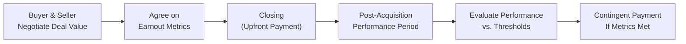

## Introduction and Overview

Sometimes, in mergers and acquisitions (M&A), a buyer and seller just cannot see eye to eye on the worth of the target company. Maybe the seller believes a product line is on the verge of skyrocketing sales, but the buyer is not so sure. Enter earnouts and contingent payments—the not-so-secret tools to help bridge these valuation gaps by tying part of the purchase price to future performance. If you’re reading this and thinking, “Well, that sounds like a neat solution,” you’d be right. But, you know, these deals can get tricky. Earnouts might prevent disagreements at the negotiation table, but you also need to be aware of the potential pitfalls, such as manipulation of performance metrics or legal tangles down the line.

In this section, we’ll walk through how earnouts work, how they’re structured, and what you need to watch out for if you’re a buyer, a seller, or even an advisor in the M&A process.

## Rationale for Earnouts and Contingent Payments

An earnout is an arrangement where the buyer pays the seller a portion of the purchase price in the future if (and only if) the business hits specific targets after closing. These targets often relate to revenue, EBITDA, or other agreed-upon financial metrics. The idea is to:

• Align Incentives: Buyers typically want to ensure that key sellers, especially if they continue managing the business post-acquisition, remain motivated to achieve strong performance.  
• Bridge Valuation Gaps: When there is uncertainty about future performance, the party with the greater optimism (usually the seller) accepts that a portion of the deal payout is contingent on realizing those presumed earnings.  
• Manage Risk: Buyers avoid overpaying upfront for rosy forecasts that may or may not materialize, while sellers still retain potential upside if those forecasts become reality.

I once worked on a deal where the seller confidently projected a threefold increase in sales within two years, based on a brand-new product rollout. The buyer was intrigued but nervous, saying, “We have no idea whether that product is going to tank or triumph.” The solution: tie a chunk of the purchase price—say 20%—to reaching the seller’s projected sales goals. This gave the seller a real shot at the higher valuation if their promised performance arrived, and it calmed the buyer’s nerves about overpaying.

## Common Structures and Key Terms

### Defining Performance Goals

Earnouts hinge on measurable outcomes. The most common metrics include:
• Revenue or Sales  
• EBITDA or EBIT  
• Net Income  
• Customer Retention or Renewals (popular in subscription-based models)  

The measurement period can range from a few months to several years. A short period (e.g., 12 months) might be used to quickly test the new owners’ strategy, whereas a longer period (e.g., up to five years) can reflect a more extended growth plan.

### Determining Payout Schedules

Contingent pay might be disbursed in one lump sum or multiple installments. For instance, an agreement might stipulate:
• An initial payment of 80% of the purchase price at closing.  
• Two or three subsequent contingent payments if performance targets are hit within the first two to three years post-acquisition.  

### Setting the Maximum or Minimum

Some earnouts specify a maximum payout limit—a ceiling on how much additional money the seller can get. Others include a minimum threshold, which might guarantee some payout if performance is near-target. If you’re the seller, you often aim for a “no cap” structure when you’re super confident in your projections. Of course, the buyer usually wants a cap to keep risk in check.

## Bridging the Valuation Gap

Earnouts and other contingent structures become particularly useful when there is considerable uncertainty around the target’s prospects. If the seller believes strongly in robust future growth or synergy upsides, they might accept an earnout to show their confidence. This approach allows a lower upfront price (which suits the buyer) but preserves the possibility of a higher overall payday (which suits the seller).

For instance, let’s say the buyer’s initial offer is $50 million, but the seller wants $70 million because they foresee expanded market share. An earnout might close the gap by offering $50 million at closing, plus an additional $20 million if sales exceed agreed targets in the next two years. Voila—no more endless haggling over uncertain forecasts.

## Diagram: How an Earnout Might Flow

Below is a simple Mermaid diagram summarizing the earnout process from initial negotiations to final payment:

This diagram shows how the conversation (A) leads to the definition of performance metrics (B), the initial payment at closing (C), the performance evaluation (D & E), and finally the contingent payment (F) if performance hits the agreed benchmarks.

## Negotiation Considerations and Pitfalls

### Setting Realistic Targets

Target metrics should be reasonably attainable and reflect the business climate. Sometimes, the buyer might set targets that are excessively high, making it almost impossible for the seller to collect. On the other hand, the seller might aim for unrealistic optimism, wanting a massive payout. Both sides benefit from data-driven, transparent frameworks.

### Potential Manipulations

When the earnout is tied to earnings or revenue, the buyer has some control over how the company operates post-acquisition. This invites suspicion from the seller: “Will the buyer inflate costs in the business so as to reduce EBITDA-based payouts?” Clear definitions of what counts as revenue, allowable expenses, or any pass-down charges from the parent entity can help avoid future disputes. You might see creative wording in contracts that limit the buyer’s ability to shift overhead or to make acquisitions and consolidate books in ways that skew performance metrics.

### Post-Acquisition Autonomy

After the deal closes, the buyer often controls major strategic decisions. If the buyer drastically changes the business model, merges the target with another entity, or reorganizes the distribution channels, it may influence the performance metrics used for the earnout. Sellers frequently negotiate covenants that obligate the buyer to keep business operations “substantially similar” or maintain a certain budget for marketing. Without those protections, the seller’s upside in an earnout could vanish because the buyer pivoted to a new strategy.

### Dispute Resolution

Disagreements about whether the agreed metrics have been met are, well, pretty common. Earnout clauses should contain robust dispute-resolution provisions such as:
• Arbitration Rules (Who are the arbitrators? Which regional laws apply?)  
• Audit Rights (Seller might get a chance to review financials relevant to the earnout calculation)  
• Clear Calculation Methods (Define terms like “EBITDA” precisely)  

Believe me, having a well-drafted arbitration clause can save everyone a lot of headaches, not to mention steep legal fees and a big chunk of time.

## Accounting and Regulatory Treatment

Under IFRS (particularly IFRS 3, Business Combinations) and US GAAP (ASC 805, Business Combinations), earnouts may be classified either as part of the purchase price or as compensation expense—depending on the structure.

• If a contingent payment is purely to pay for the acquisition of the business, it is often considered part of the purchase consideration.  
• If it’s effectively tied to continued employment of the seller or certain management teams, it may be partially or entirely deemed compensation.  

Getting this classification right is crucial. Misclassification can lead to restatements of financial statements and potential regulatory scrutiny. Tax implications also differ according to how the earnout is classified. Sellers typically want capital gains treatment on purchase price components (which may be taxed more favorably), whereas compensation is generally taxed at higher ordinary income rates.

## Legal, Strategic, and Tax Implications

### Autonomy vs. Buyer Involvement

By tying performance to the seller’s leadership, you encourage the seller to stay involved. However, the buyer might simultaneously want to fold the target into its broader corporate structure. The more integrated the target becomes, the trickier it can be to isolate its performance. 

### Tax Complexity

From a tax perspective, earnout payments recognized as capital gains may be taxed at a lower rate than ordinary income or payroll taxes. Meanwhile, certain jurisdictions might have withholding requirements for contingent payments. Early collaboration with tax advisors can prevent nasty surprises.

### Potential for Long-Term Partnerships

If the seller truly believes in the future success of their former company under new ownership, an earnout can be a nice middle ground. But ironically, if performance is subpar, the relationship can become tense, with each side blaming the other for the shortfalls.

## Case Study: Tech Startup Acquisition

Picture a mid-sized software company acquiring a small, innovative tech startup. The startup’s founder (also the CEO) expects huge growth from a new cyber-security application. The bigger company likes the technology but remains unconvinced about the adoption rate. So they set up an earnout arrangement with these basic terms:

• $20 million paid at closing.  
• Up to $10 million in contingent payments over two years if the application’s revenue grows by at least 20% annually.  
• Explicit language preventing the larger company from reallocating the tech staff to unrelated projects.  
• Audit rights for the founder to verify annual revenue.  

Sure enough, after year one, the newly acquired startup sees a 25% increase in application revenue, leading to a partial payout. Year two, it rises another 22%. The founder collects the remainder. The buyer is happy because the product performed well—and only paid more once they witnessed real success. The founder, on the other hand, feels validated and rewarded for his confident forecasts. Bingo—a textbook earnout scenario.

## Risk Management and Best Practices

1. Perform Thorough Due Diligence: Earnouts often arise from uncertainty, so if you’re the buyer, do your homework on the target’s forecasts and competitive landscape.  
2. Draft Clear, Specific Metrics: Use well-defined accounting principles to measure performance. Provide examples in the agreement so both parties know how to compute the relevant metrics.  
3. Negotiate Operational Covenants: Ensure that responsibilities and approvals for major decisions are spelled out, especially if they can affect the performance measures.  
4. Include Dispute Resolution Mechanisms: Arbitration clauses, third-party audits, or expert reviews can prevent small disagreements from ballooning into deal-breakers.  
5. Think About Tax Efficiency: Both parties should analyze how the earnout is taxed in their jurisdiction. Carefully structuring the earnout can lead to a more optimal after-tax result.  

## Glossary

• Earnout: A provision tying part of the purchase price to the acquired company’s performance over a set period.  
• Contingent Payment: An additional sum that the buyer pays if certain milestones or metrics are met.  
• Valuation Gap: The difference in perceived value between buyer and seller, often stemming from diverse assumptions about risk or future growth.  
• Performance Metrics: The specific accounting or operational measures—commonly revenue or EBITDA—that determine whether an earnout is payable.  
• Dispute Resolution Clause: Contract language specifying how parties will address disagreements (e.g., arbitration or mediation).

## References and Further Resources

• PWC M&A Insights on earnouts: [https://www.pwc.com](https://www.pwc.com)  
• Scholarly articles on contingent valuation mechanisms in SSRN: [https://www.ssrn.com/](https://www.ssrn.com/)  
• ABA (American Bar Association) “Model Merger Agreement” for private company acquisitions, which includes sample earnout clauses  

## Final Thoughts

Earnouts and contingent payments can be an artful negotiation strategy, ensuring a fair price for both buyer and seller when forecasting the future seems murky. These instruments can smooth over big differences of opinion about a target company’s value, while keeping the seller motivated to perform. But make no mistake: if you don’t handle the details—metrics, legal structure, dispute resolution, and accountability—things can turn sour faster than you might expect. By paying close attention to each step discussed here, you can set up a deal that truly benefits everyone involved.

Keep these guidelines in mind, use them wisely, and you’ll be well-positioned to navigate one of M&A’s more nuanced deal structures. After all, the best deals are those where both sides walk away feeling like they’ve won.

## Test Your Knowledge: Earnouts & Contingent Payments in M&A



### Which of the following is the primary purpose of an earnout structure in an M&A transaction?

- [x] To bridge valuation gaps by tying part of the payment to future performance
- [ ] To guarantee sellers receive full payment at closing
- [ ] To avoid any tax implications for the buyer
- [ ] To replace all equity financing in a transaction

> **Explanation:** Earnouts align buyer-seller incentives and address uncertainty by linking additional payments to specific performance benchmarks after closing.

### In most earnout agreements, which metric is commonly used to determine the contingent payment?

- [ ] Market share
- [ ] Number of staff
- [x] EBITDA or revenue
- [ ] Weighted-average cost of capital (WACC)

> **Explanation:** Common performance metrics include revenue or EBITDA. Market share and number of staff are less frequently used than traditional financial indicators.

### Under IFRS 3 and ASC 805, when do earnout payments typically get classified as purchase consideration rather than compensation?

- [x] When the payments are linked purely to achieving performance milestones for the business, rather than to employment
- [ ] When the seller remains employed by the acquirer post-deal
- [ ] When earnouts exceed 50% of the business’s original valuation
- [ ] When the payments are contingent on interest rate fluctuations

> **Explanation:** An earnout is considered part of the purchase consideration if it’s tied solely to the target’s performance, not to ongoing employment requirements.

### What is the main risk if performance metrics are not well-defined in the earnout agreement?

- [ ] The seller can freely lower product prices
- [x] The buyer may manipulate costs or revenue reporting
- [ ] The seller automatically receives the maximum payout
- [ ] The target’s board must resign

> **Explanation:** Vague metrics or definitions can lead to disputes over “what counts” toward performance and whether the buyer is unfairly inflating or reducing costs.

### Which of the following approaches best mitigates earnout disputes related to performance calculations?

- [x] Including a clear dispute resolution clause and audit rights
- [ ] Establishing the seller’s unconditional right to control the business
- [x] Defining multiple performance metrics to balance out manipulation risks
- [ ] Allowing the buyer full discretion on accounting policy changes

> **Explanation:** Earnout agreements should clearly define metrics, allow third-party audits, and specify dispute resolution to prevent or quickly resolve disagreements.

### If the buyer integrates the target’s operations immediately after closing, potentially affecting reported net income, what provision might the seller negotiate to protect the earnout?

- [x] Operational autonomy or covenant
- [ ] A stricter confidentiality clause
- [ ] Early termination rights
- [ ] A mandatory debt covenant

> **Explanation:** By negotiating operational autonomy (or at least limiting the buyer’s ability to make drastic changes), the seller can help protect the integrity of earnout calculations.

### How might buyers and sellers address the risk that future strategic decisions by the acquirer could depress the acquired company’s metrics?

- [x] Incorporate a “best efforts” covenant to maintain continuity
- [ ] Require the buyer to pay the earnout in full at closing
- [x] Impose tax penalties on the buyer for restructuring
- [ ] Replace the earnout with employee stock options

> **Explanation:** Protective covenants or “best efforts” language helps ensure the buyer won’t undermine the target’s results through strategic moves that knowingly hurt earnout metrics.

### Which of the following best describes a typical advantage for the buyer when using earnouts?

- [x] Reduces the buyer’s risk of overpaying if optimistic projections do not materialize
- [ ] Eliminates the need to pay any cash at closing
- [ ] Moves all liability to the seller
- [ ] Guarantees easy integration of the target’s management

> **Explanation:** Earnouts let the buyer defer a portion of the purchase price and only pay if certain performance targets are actually met.

### How can earnouts affect the seller’s motivation post-acquisition?

- [x] They often keep the seller motivated to ensure performance targets are met
- [ ] They reduce the seller’s interest in achieving growth
- [ ] They strictly eliminate the seller’s involvement
- [ ] They allow the seller to ignore performance metrics

> **Explanation:** Because earnouts are contingent on performance, the seller generally remains motivated to help the company succeed even after the sale.

### True or False: If the seller believes strongly in the future potential of the business, an earnout can be a suitable way to secure a higher ultimate sale price.

- [x] True
- [ ] False

> **Explanation:** Sellers confident in the target’s growth prospects often prefer earnouts to capture some of the upside that the buyer is initially unwilling to pay for.


