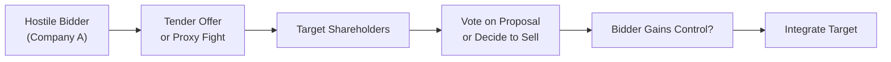

## Overview

Hostile takeovers may sound like something out of a blockbuster corporate drama, but they’re a very real (and sometimes quite common) feature of the capital markets. The essence of a hostile takeover is that the acquiring company attempts to gain control of a target firm against the wishes of the target firm’s management or board of directors. This dynamic often sets the stage for high-stakes negotiations, legal maneuvers, and the occasional downright standoff between the two parties.

I remember the first time I read about the famed RJR Nabisco bidding war, thinking: “Wow, can management really do that?” and “Will shareholders always just follow the highest bid?” The truth is, as you’ll see, there are many layers at play—shareholder preferences, regulatory hurdles, strategic maneuvering, and sometimes personalities that just don’t get along (which might be the biggest shocker, but oh well).

In this section, we’ll explore the main aspects of hostile takeovers, including the fundamental tactics employed by bidders, the defenses available to target firms, and the nuts and bolts of how the regulatory environment impacts this process. And if you’re wondering why we’re devoting so much time to something that might seem niche—well, these events can shift entire industries, affect corporate governance best practices, and influence investment strategies. Understanding them is crucial for those shaping or analyzing corporate strategies. 

## Key Characteristics of a Hostile Takeover

• Hostile Intention: A hostile takeover attempt perseveres despite opposition from management or the board. This means the acquirer pursues control either by going directly to shareholders or by attempting to replace the incumbent board.

• Acquisition Structure: Often, a hostile deal is launched via a tender offer—where the acquirer publicly offers to buy shares at a set price. Alternatively, the bidder may mount a proxy fight, aiming to get shareholders to vote in a board that supports the takeover.

• Premium Over Market Price: Because the acquirer is not receiving the enthusiastic cooperation of the target’s management, shareholders often expect a substantial premium above the prevailing share price to compensate for the uncertainty and perceived risk. 

• Possible Inflection Point for Corporate Value: Hostile bidders often claim that the target is undervalued and poorly managed. By replacing the management, the acquirer hopes to create additional shareholder value (or synergy) that is not yet realized.

## Why Hostile Takeovers Happen

Hostile acquisitions can be motivated by a variety of factors:

• Undervalued Assets: The target might be trading at a discount, creating an arbitrage opportunity if the acquirer can improve performance after taking control.  
• Strategic Fit or Synergy: The acquirer sees cost savings, revenue expansion, or strategic advantages.  
• Managerial Underperformance: Sometimes, a firm’s existing managers are seen as ineffective, and the acquirer believes it can do better.  
• Shareholder Activism: Hedge funds or activist investors sometimes initiate or support hostile actions where they see easy-to-unlock value.

On the flip side, target management may strongly believe that the asset is already fairly valued—or that the acquirer’s interest is opportunistic and detrimental to the firm’s long-term strategic goals.

## Hostile Takeover Tactics

### Tender Offers
In a tender offer, the acquiring firm (or “bidder”) bypasses the target company’s management and goes directly to shareholders with an offer to purchase shares at a certain price (normally at a premium to the current market price). For a tender offer’s success, a sufficient percentage of target shares must be tendered (i.e., offered for sale) by shareholders. Several key points:

• Offer Price: Typically includes a premium over the current market price. The size of the premium often reflects the perceived synergy, the strategic nature of the transaction, and the acquirer’s desire to entice shareholders to accept, despite management pushback.  
• Conditionality: Many tender offers are contingent on the bidder receiving a minimum percentage of shares outstanding.  
• Time Frame: Tender offers remain open for a specified period, during which shareholders must decide whether to sell.

### Proxy Fights
If a direct purchase of shares fails, the acquirer (or an activist group) can attempt to vote out the existing board or management via proxy contests. This approach often involves persuading shareholders to sign over their votes (“proxies”) to the dissident group. 

• Key Goal: Replace current management with individuals who are open to or supportive of the acquisition.  
• Communication Tactics: Heavy use of shareholder communication, social media, or public letters that challenge the track record of management.  
• Meeting and Voting: Proxy fights typically get resolved at an annual or special meeting, where shareholders officially vote for new directors or decide on certain corporate actions.

### Creeping Tender Offers
An acquirer can build up a controlling stake through gradual market purchases—sometimes referred to as a creeping tender approach. Although not strictly “hostile” in the conventional sense, the acquirer might eventually accumulate sufficient shares to exercise influence without a formal takeover attempt. However, securities regulations in many jurisdictions impose disclosure requirements once certain ownership thresholds are crossed.

## Defenses Against Hostile Takeovers

### Poison Pills
This is one of the most talked-about defenses—probably because it sounds dramatic. A poison pill (or shareholder rights plan) is a mechanism that triggers adverse consequences for the acquirer if they accumulate shares above a certain threshold. For instance, the target may allow existing shareholders (other than the acquirer) to buy additional shares at a heavy discount, thus diluting the bidder’s stake.

### Staggered (Classified) Board
A staggered board structure ensures that board members serve multi-year terms with only a fraction of seats up for election each year. This can slow down or obstruct a hostile acquirer’s attempt to gain board control through a proxy fight, because the acquirer must wait multiple election cycles to replace the entire board.

### White Knight
Sometimes, a target firm under siege from a hostile bidder will try to find a friendlier acquirer—affectionately known as the “white knight.” This second bidder offers a more acceptable deal to the target firm’s board and management, often with better terms or alignment around the firm’s strategic direction.

### Other Defense Tactics
• Crown Jewel Defense: Selling off key assets that the acquirer is most interested in, potentially making the target less attractive.  
• Golden Parachutes: Lucrative severance packages that become payable to top executives if they lose their jobs after a takeover, effectively increasing the cost of acquisition.  
• Pac-Man Defense: A tactic in which the target firm tries to acquire the original bidder. Rare, but it has happened!  

## Regulatory and Antitrust Considerations

Both friendly and hostile takeovers typically fall under the same regulatory review standards. Still, hostile deals can face more intense scrutiny if the bidder is perceived as a competitor or if the combined entity would raise concentration concerns in a particular market.

• Disclosure Requirements: In many markets, once an acquirer crosses a certain share ownership threshold (e.g., 5% in the United States), it must disclose its intentions and ownership stake.  
• Antitrust/Competition Law: Regulatory agencies (like the Federal Trade Commission (FTC) in the US or the European Commission in the EU) may review the transaction to ensure it doesn’t harm competition.  
• National Security Reviews: Some jurisdictions (e.g., CFIUS in the US) have provisions to block foreign acquisitions if they present national security risks.

## Illustrative Mermaid Diagram

Below is a simplified overview of how a hostile takeover might flow from the acquirer’s perspective. Note: This is a streamlined depiction—real deals often involve many more steps and complexities.

- The bidder initiates a takeover attempt through a tender offer or a proxy fight.  
- Target shareholders must decide whether to tender their shares under the offer price or, in the case of a proxy fight, vote to replace the board.  
- If shareholders support the bidder, the bidder gains control.  
- Finally, upon a successful acquisition, the bidder integrates the newly acquired firm.

## Potential Outcomes and Shareholder Considerations

Shareholders hold a critical role in deciding the fate of a hostile takeover. Several key factors influence their vote or decision to sell:

• Offer Price and Premium: If the premium is too low, shareholders might reject the offer (especially if they think the target’s standalone value or alternative offers could be higher).  
• Belief in Management: If the current management is well-regarded, shareholders might ignore or reject an unsolicited approach, even if the offer includes a modest premium.  
• Risk Tolerance: Some shareholders might prefer a “bird in the hand” (i.e., a guaranteed premium) over possible but uncertain future gains.  
• Alternative Bids: Competition from other bidders (white knights) can drive up the ultimate acquisition price.

## Real-World Observations and Case Examples

• Yahoo! vs. Microsoft (2008): Microsoft tried to acquire Yahoo! in what many perceived as a hostile approach. Yahoo!’s management resisted, leading to a protracted standoff. Eventually, Microsoft withdrew its offer, highlighting that a hostile acquirer can indeed walk away if negotiations stall.  
• Air Products vs. Airgas (2010–2011): Air Products made a hostile bid for Airgas, but the latter deployed a poison pill and convinced shareholders it was worth far more than what Air Products offered. The eventual outcome? The poison pill remained in place and Air Products never acquired Airgas.  
• RJR Nabisco (1988): Although technically initiated as a management buyout, it later became a contentious bidding war involving back-and-forth proposals between various private equity firms—revealing just how aggressive hostile acquisitions can become.

## Best Practices, Pitfalls, and Challenges

• Thorough Valuation Analysis: An acquirer should carefully justify the premium offered. Overpaying can lead to future write-downs and negative investor sentiment.  
• Engaging with Target Shareholders: Because shareholders ultimately decide, effective communication can be as vital as having the capital.  
• Long-Term Strategic Fit: Even if a hostile acquisition is successful, poor cultural integration or lack of synergy can undermine expected value.  
• Managing Reputational Risk: Hostile takeovers can damage relationships within an industry and might even spark investor backlash if perceived as opportunistic or value-destroying.

## Final Exam Tips

• Pay attention to the interplay between defensive tactics and takeover outcomes. You’ll likely see scenario-based questions asking how the presence of a poison pill or staggered board can affect the success probability of a hostile offer.  
• Understand how a proxy fight differs from a tender offer. Expect to be tested on how each approach influences board composition and the ultimate control of the target.  
• Be able to connect these concepts to broader corporate governance frameworks (from Chapter 3: Corporate Governance) and stakeholder interests (Chapter 2: Investors and Other Stakeholders).  
• Practice numeric scenarios: a question might give you a share price, a proposed premium, and a certain acceptance threshold. You’ll need to calculate potential payoffs or evaluate the break-even takeover price.  
• Don’t ignore the ethics dimension. While the CFA Institute Code and Standards do not forbid hostile takeovers, you should think about how these transactions might create conflicts of interest impacting management and shareholders.  
• Timing questions often appear! For instance, you might be asked how the timeline of a staggered board or the length of a tender offer influences the outcome.  

## References for Further Study

1. Schwert, G. W. (2000), “Hostility in Takeovers: In the Eyes of the Beholder?” The Journal of Finance.  
2. The Art of M&A: A Merger Acquisition Buyout Guide, 5th Edition, by H.P. Weston, S. L. Weaver, and J. E. Weston.  
3. Corporate Law Firm Blogs (e.g., [Skadden, Arps](https://www.skadden.com/)) for current cases on proxy fights and takeover battles.  
4. Chapter 3 (Corporate Governance), Chapter 2 (Investors and Other Stakeholders), and Chapter 6 (Capital Structure) in this volume for integrated insights.  

---

## Hostile Takeovers: Practice Questions



### Which of the following best describes a hostile takeover?

- [ ] A transaction in which the target’s management fully cooperates with the acquiring firm.  
- [x] An acquisition attempt opposed by the target’s management or board of directors.  
- [ ] A situation in which a company acquires its largest supplier through a friendly merger.  
- [ ] A scenario where both firms agree to form a joint venture for mutual expansion.  

> **Explanation:** In a hostile takeover, the acquirer pursues control despite opposition from management or the board.

### What is the primary advantage of a tender offer for an acquirer in a hostile takeover?

- [ ] It allows the acquirer to obtain the target firm’s assets without paying any premium.  
- [ ] It automatically replaces the target’s entire board of directors.  
- [x] It bypasses target management and appeals directly to shareholders.  
- [ ] It allows the acquirer to avoid all securities laws by purchasing shares in private markets.  

> **Explanation:** A tender offer is a direct approach to shareholders, circumventing potential board or management resistance.

### A “white knight” strategy refers to:

- [ ] The acquirer using stealth purchases to accumulate shares of the target.  
- [x] Another friendly suitor sought by the target company to fend off a hostile bidder.  
- [ ] A plan that blindsides the shareholders with surprise management buybacks.  
- [ ] A large share repurchase by the target to reduce the overall float.  

> **Explanation:** A white knight is a more acceptable or “friendly” acquirer that the target might solicit to avoid a hostile takeover.

### What is a poison pill in the context of hostile takeovers?

- [ ] A debt instrument that automatically converts into equity upon a takeover.  
- [x] A mechanism allowing existing shareholders to buy shares at a discount, diluting the hostile acquirer.  
- [ ] A strategy involving the sale of key assets to the acquirer at a premium.  
- [ ] A type of board restructuring that simplifies the acquirer’s path to control.  

> **Explanation:** Poison pills trigger share dilution for the hostile bidder by letting existing shareholders purchase shares cheaply.

### Which of the following is a potential downside for an acquirer that offers a large takeover premium in a hostile bid?

- [x] The acquirer may overpay for the target, leading to future write-downs or losses.  
- [ ] The target becomes automatically eligible for national security review.  
- [x] It allows other bidders to “free-ride” and acquire the target at the same price.  
- [ ] The target firm must lower its share price to match the premium.  

> **Explanation:** Offering a high premium can hurt the acquirer’s returns if the synergy doesn’t materialize, potentially resulting in overpayment (and possibly large goodwill impairments). Also, a high premium signals to potential competing bidders the possibility of even higher offers.

### In a proxy fight, an acquirer attempts to:

- [ ] Increase the target’s production capacity by providing new technology.  
- [ ] Merge both companies in a friendly manner.  
- [x] Replace the target’s board or management through shareholder votes.  
- [ ] Acquire bonds of the target to gain voting rights directly.  

> **Explanation:** Proxy fights seek to gain control via shareholders’ votes to overthrow current management or board members.

### Under what circumstances might a hostile takeover fall under greater regulatory scrutiny?

- [ ] The bidder and target operate in unrelated industries.  
- [ ] The bidder has never before made an acquisition.  
- [x] Both the bidder and target are in the same industry, raising antitrust concerns.  
- [ ] The bidder is a domestic firm.  

> **Explanation:** Regulators closely check if the merger would lead to monopoly-like conditions in a shared market.

### Which of the following is an example of the “Pac-Man defense”?

- [ ] The target intentionally increases its debt burden to become less attractive.  
- [ ] The target offers all shareholders an opportunity to buy discounted shares.  
- [ ] The target sells its core division to sabotage the acquirer’s strategic aims.  
- [x] The target attempts to acquire the original hostile bidder instead.  

> **Explanation:** The Pac-Man defense flips the takeover attempt, making the target try to buy the hostile bidder.

### Which factor most influences whether shareholders accept a hostile takeover offer?

- [ ] Whether the target’s CEO has a good personal relationship with the acquirer’s CEO.  
- [x] The premium over the current market price and the perceived long-term value of staying independent.  
- [ ] Requirements under IFRS or US GAAP for intangible assets.  
- [ ] The presence of a proxy voting system.  

> **Explanation:** Shareholders tend to focus heavily on the premium and the risk-return outlook relative to alternative scenarios.

### True or False: If a bidder launches a proxy fight, it automatically gains control of the target’s board.

- [ ] True  
- [x] False  

> **Explanation:** A proxy fight aims to sway shareholder votes, but there’s no guarantee the majority will support the bidder’s nominees.


