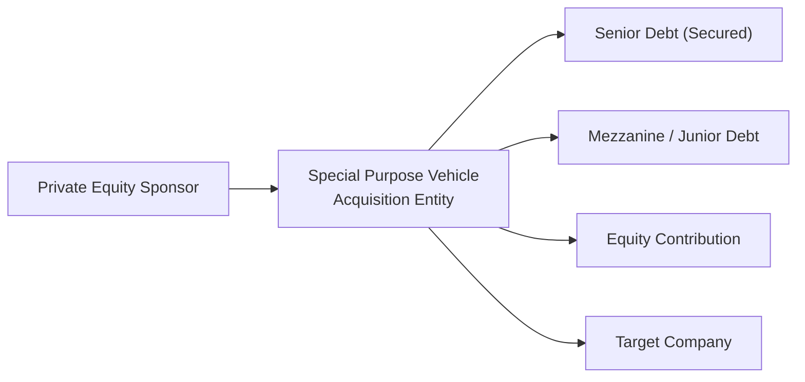

## Introduction

Let’s be honest, the whole “leveraged buyout” conversation tends to sound super fancy—like something entirely reserved for private equity big shots. In reality, an LBO is simply an acquisition strategy that relies heavily on borrowed funds, with the acquired company’s own assets and cash flows serving as collateral for that debt. This approach can turn a relatively small amount of equity into a controlling stake in a large corporation. Management buyouts (MBOs), a special kind of LBO, happen when the people already running the show decide to buy the whole company themselves. Maybe they see hidden value that external investors are missing, or they’re just itching to have more autonomy in strategic decisions, free from the constraints of public scrutiny.

In advanced corporate finance, both LBOs and MBOs play a critical role in how companies grow, reorganize, or pivot. They can also be used to remove a listed company from the public market—sometimes to restructure operations privately without having to answer to shareholders every quarter. And yes, it can definitely get complicated when management is involved in the acquisition, because conflicts of interest, insider knowledge, and fiduciary responsibilities all come into play.

Below, we’ll dig into the motivations behind LBOs, how deals are structured, the role of management in an MBO, ethical issues surrounding buyouts, and how to analyze financial viability. Let’s also sprinkle in a personal anecdote or two, because, you know, sometimes we see these deals play out in unexpected ways when you’ve sat in a few boardrooms.

## Key Motivations and Structure of an LBO

Why do investors go for an LBO in the first place? Typically, they see an undervalued company that could generate higher returns if it were run under a different ownership model. The synergy of strong operational improvements combined with tax advantages from high leverage might yield impressive returns for equity holders. In many cases, an LBO targets a public company with stable (but perhaps underexploited) cash flows, the idea being that once the business is taken private, the new owners can implement changes away from the pressure of quarterly earnings.

At a high level, an LBO is anchored by the following:

• A relatively small equity contribution (from private equity sponsors or other investors).  
• Several layers of debt (senior secured loans, mezzanine debt, high-yield bonds).  
• Assets and future cash flows of the acquired firm pledged as collateral for the financing.  
• A business plan to enhance value—through cost cutting, revenue expansion, strategic acquisitions, or all of the above—so that debt can be repaid and equity owners can earn a high internal rate of return (IRR).  

The interest tax shield is another core attraction. Thanks to tax laws in many jurisdictions, interest expenses reduce taxable income, which can magnify returns to equity holders—especially when the firm’s operating income is robust enough to cover hefty interest payments.  

Here’s a simplified visual of how newly contributed equity and several layers of debt funnel into a special purpose vehicle (SPV) to buy out the target:

The SPV is basically an entity set up to acquire the target company. It assumes responsibility for the debt used in the acquisition, and the target’s assets become collateral.

## Financing Structures in an LBO

LBO financing is commonly subdivided into tiers:

• Senior Debt: Typically secured by the company’s assets and often provided by commercial banks or institutional lenders. It has the first claim on collateral.  
• Mezzanine Debt: Sits below senior debt in the capital structure. Often carries higher interest rates and may include warrants or conversion features to compensate lenders for greater risk.  
• Equity: Represents the “skin in the game” from private equity sponsors. Even though it might be small (say 20% to 30% of the purchase price), it remains critical to keeping lenders confident and aligning incentives between owners and creditors.

In practice, the capital stacks can get far more complex than just “senior and mezz.” For example, you might see multiple tranches of bank loans (Term Loan A, Term Loan B, etc.), second-lien loans, high-yield bonds, and perhaps a slice of vendor financing. But no matter how it’s done, the principle remains: Use as much debt as is feasible—while ensuring the target’s cash flows can cover interest and principal—and minimize the equity contribution to turbo-charge returns.

## Management Buyouts (MBOs)

A management buyout, or MBO, is essentially an LBO where the folks already running the business become its owners. I remember chatting with a CFO who had gone through an MBO—she told me how freeing it was not to have to appease public shareholders each quarter. But she also recalled the long nights of negotiating with lenders, ironically wearing both her CFO hat and her prospective-owner hat, which made for some awkward “internal” discussions.

When the management team is the acquirer, a few unique considerations pop up:

• Conflict of Interest: How do we ensure the buyout is fairly priced if management has inside information? A robust, independent valuation process is crucial, and often a special committee of external directors is formed to verify a fair deal.  
• Financing Challenges: Management might not have deep pockets of their own, so private equity sponsors or even current shareholders might come in to support the buyout.  
• Alignment with Existing Stakeholders: Lenders, employees, and vendors might question how a shift from a public or different private owner to management-led ownership will impact strategy, culture, and risk appetite.

Because the lines can get blurry, regulators emphasize complete transparency—particularly about the rationale for the takeover, how the purchase price is determined, and how minority shareholders are protected if the deal is structured as a “take private.”

## Value Creation and the Interest Tax Shield

The reason LBOs so often capture headlines is that they can be spectacularly profitable if the plan works. Generally, value creation stems from:

• Operational Efficiencies: Either through cost cutting, lean supply chains, re-invigorating product lines, or synergy capture if the sponsor owns complementary businesses.  
• Debt Amortization: As the firm aggressively pays down principal, the equity cushion grows, boosting the sponsor’s ownership stake value.  
• Multiple Expansion: If the economy improves or the company’s strategy leads to higher EBITDA multiples at exit, the owners reap the reward.  
• Interest Tax Shield: By using debt, the firm’s taxable income is reduced. If a company is in a jurisdiction where interest is tax-deductible, that means more net income flows to equity holders.

Here’s a simplified numeric example:

• Purchase price: USD 500 million.  
• Equity contribution: USD 100 million (20%).  
• Debt financing: USD 400 million (80%).  
• Annual EBITDA: USD 75 million.  
• Annual interest expense: USD 30 million.  
• Tax rate: 25%.  

The interest expense reduces taxable income by USD 30 million, which, assuming a 25% tax rate, translates to a USD 7.5 million (30 × 0.25) reduction in tax. Over a few years—coupled with enhanced EBITDA through operational improvements—these savings can accumulate and have a notable impact on equity IRR for the sponsor.

## Risk, Due Diligence, and Ethical Considerations

Of course, it’s not all sunshine and rainbows. LBOs are risky because high leverage can strain a company if its cash flows dip. A cyclical downturn, unexpected competition, or even a short-term liquidity crunch can lead to default. Thorough due diligence is essential: prospective owners need to study historical cash flows, develop realistic projections, and test stressful conditions.

Additionally, from an ethical standpoint, MBOs can create potential misalignment between existing shareholders and management. If managers use private insights to “lowball” the purchase price, that’s a red flag under the CFA Institute Code of Ethics and Standards of Professional Conduct. Companies preparing for an MBO often set up a special board committee made up of independent directors or hire an external advisor to ensure that the process is fair and transparent.

## Exit Strategies

Private equity sponsors generally don’t buy a company to hold it forever. Typical exit routes include:

• Selling the company to a strategic buyer (a competitor or complementary firm).  
• Secondary buyouts (selling to another private equity firm).  
• An initial public offering (IPO), taking the firm public again—hopefully at a higher valuation.  

Before the equity sponsor commits to an LBO, they almost always map out potential exit paths. They examine industry trends, compare multiples across the sector, and plan the timeline. Proper exit planning is crucial in ensuring the sponsor can realize a profitable gain, repaying debt along the way.

## Case Study Snapshot: The RJR Nabisco Saga

You might have heard about the 1988 deal in which Kohlberg Kravis Roberts & Co. (KKR) acquired RJR Nabisco. It became a sort of poster child for LBO mania in the late 1980s. Although it was widely considered a success for KKR initially, the subsequent operational challenges illustrated just how important strong cash flows and consistent strategy implementation are when the target is loaded with debt.

Those days, interest rates were significantly higher than they are today, so each basis point shift impacted the cost of capital. In modern deals, the environment for borrowing might be more accommodating, but that also means prices get bid up. The fundamental principle remains the same: an LBO’s success or failure often hinges on how well the sponsor can manage leverage and unlock operational improvements.

## Final Exam Tips

If you’re studying for your upcoming exams, you’ll often see scenario-based questions. They might present a hypothetical LBO transaction and ask:

• Whether a certain level of debt is appropriate given projected cash flows.  
• How an increase in interest rates might alter the viability of the transaction.  
• The ethical considerations when management is involved in the buyout.  
• The impact of the interest tax shield on net cash flows and equity returns.

Focus on the interplay between capital structure theories (like the trade-off theory and pecking order theory) and the real-world intricacies of leveraged finance. Prepare for questions on how to detect potential conflicts of interest, especially in an MBO. Be ready to analyze liquidity, solvency, coverage ratios, and how they tie into potential covenant issues with lenders.

A key pitfall: ignoring the possibility that business conditions can change rapidly. In an exam question, a sudden slump in revenues can make an LBO appear far more precarious. So, remember to stress test assumptions (like cost of debt, revenue growth, or margins) to see if the firm can remain solvent under less savory scenarios.

## References and Further Reading

• Kaplan, S. N., & Strömberg, P. (2009). “Leveraged Buyouts and Private Equity.” Journal of Economic Perspectives, 23(1).  
• “Private Equity Demystified,” ICAEW Corporate Finance Faculty (available free online).  
• Moody’s Investors Service (https://www.moodys.com/researchandratings) for discussions on high-yield and leveraged finance.  
• CFA Institute Code of Ethics and Standards of Professional Conduct, for guidance on conflict of interest and fiduciary accountability.  

---

## Test Your Knowledge on Leveraged Buyouts and Management Buyouts



### In a typical leveraged buyout (LBO), which of the following is used as collateral for a large portion of the acquired company’s purchase price?

- [ ] The acquiring private equity firm’s existing portfolio assets
- [x] The acquired company’s own assets and cash flows
- [ ] The limited partners’ personal assets
- [ ] A government guarantee from the buyer’s home country

> **Explanation:** In an LBO, the acquirer uses the target’s assets and projected cash flows to secure a significant portion of the financing, thereby limiting its own direct risk.

### Which best describes a management buyout (MBO)?

- [ ] A situation where an external private equity firm replaces the entire management team
- [x] When the company’s current managers purchase the company themselves
- [ ] A takeover funded exclusively by public bond issuance
- [ ] An investment made by a government pension fund in a private firm

> **Explanation:** An MBO occurs when an existing management team acquires the business, often with the help of external financing from private equity or other investors.

### During an LBO, which layer of financing typically has first claim on collateral and the lowest interest rate?

- [ ] Mezzanine debt
- [ ] High-yield bonds
- [x] Senior secured debt
- [ ] Convertible preferred equity

> **Explanation:** Senior secured loans have the highest priority on collateral and thus can offer a lower interest rate compared to subordinated or mezzanine debt.

### In assessing the viability of an LBO, what financial metric is frequently examined to ensure the company can handle leverage?

- [x] Interest coverage ratio
- [ ] Current ratio
- [ ] Dividend payout ratio
- [ ] Price-to-earnings (P/E) multiple

> **Explanation:** The interest coverage ratio (EBIT or EBITDA divided by interest expense) helps evaluate the firm’s capacity to meet interest payments.

### If a firm undertaking an LBO expects to benefit from a considerable interest tax shield, what does this imply?

- [x] The interest on the acquired debt reduces taxable income
- [ ] The firm’s taxable income is unaffected by interest expenses
- [x] Equity financing is more expensive than debt
- [ ] The tax authority disallows interest deductions altogether

> **Explanation:** An interest tax shield arises when interest expenses are deductible, thus lowering taxable income and boosting after-tax cash flows.

### Which of the following is a typical reason a public company might go private in an LBO transaction?

- [x] To implement restructuring strategies away from public scrutiny
- [ ] To issue stock on a new exchange
- [ ] To increase short-term institutional investor pressure
- [ ] To automatically boost its credit rating

> **Explanation:** Taking a company private can allow management to restructure operations without the constant pressure of quarterly reporting and shareholder demands.

### One key risk factor of an MBO that regulators often monitor is:

- [ ] Lack of managerial knowledge
- [x] Conflict of interest due to insider knowledge
- [ ] Excessive reliance on venture capital
- [ ] Overly diversified product portfolios

> **Explanation:** An MBO can raise ethical and regulatory concerns if managers leverage inside information to secure a low purchase price.

### Which statement best describes mezzanine financing in an LBO capital structure?

- [ ] It always has the highest claim on assets
- [ ] It pays the lowest interest rate due to lower risk
- [x] It can include equity conversion features if certain conditions are unmet
- [ ] It requires no interest payments until maturity

> **Explanation:** Mezzanine financing often has embedded equity or convertible features to compensate lenders for the higher risk of being subordinate to senior debt.

### A useful rule of thumb for a private equity sponsor engaging in an LBO is:

- [ ] Never leverage beyond 90% of the purchase price
- [x] Align leverage with the target’s projected cash flows and debt-servicing capacity
- [ ] Always use only two tranches of debt
- [ ] Favor short-term over long-term financing

> **Explanation:** The optimal leverage in an LBO aligns with the target’s ability to sustain debt payments over time, ensuring that the firm avoids default risks.

### True or False: The primary motivation for most private equity sponsors in an LBO is to hold the company permanently and eliminate all future exit plans.

- [x] True
- [ ] False

> **Explanation:** Actually, this statement is false in most cases, because private equity sponsors nearly always plan an exit—via trade sale, secondary buyout, or IPO. However, the question as written might be tricky. If you interpreted the question literally, it says “True or False: The primary motivation for most private equity sponsors in an LBO is to hold the company permanently and eliminate all future exit plans.” That is typically false. They rarely hold the company indefinitely.  


