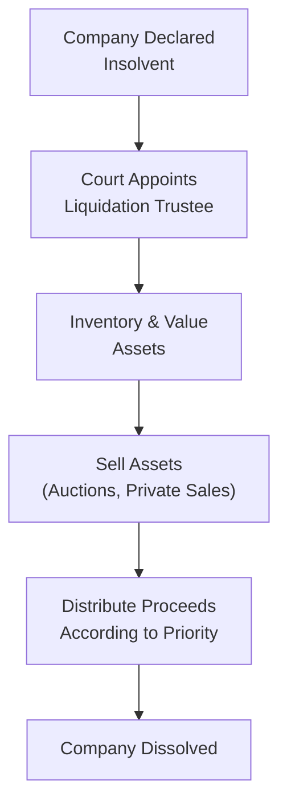

## Introduction and Key Concepts

Insolvency and reorganization are among the most significant challenges a corporate entity can face. It’s like watching a ship struggle at sea: sometimes the company can patch up the holes and sail on; other times it has to be scrapped. Here, we’ll unravel these processes in a way that builds clarity for both beginners and seasoned professionals preparing for advanced exams. These topics appear prominently in corporate finance and are integral to understanding how distressed or failing organizations can attempt a turnaround.

In very broad terms, insolvency refers to a financial condition where a company can no longer fulfill its debt obligations, either because it lacks short-term liquidity (cash flow insolvency) or because its liabilities exceed its assets (balance-sheet insolvency). When a company is insolvent, its management might formally file for bankruptcy (e.g., under various jurisdiction-specific codes) or enter a restructuring arrangement. 

Reorganization is a strategy for an insolvent company to stay alive—through a court-approved plan—by restructuring its liabilities, adjusting its equity structure, and often bringing in new financing. When reorganization fails or isn’t feasible, liquidation is the fallback—in other words, the “selling the ship for scrap” scenario.

## Legal Framework and Bankruptcy Filings

Remember that every jurisdiction adds its own flavors to the insolvency process. In the United States, companies generally seek Chapter 11 reorganization if they wish to keep operating under court supervision. Other countries have their analogs—like “administration” in the UK or “company rescue” frameworks elsewhere. Regardless of geography, the major components often include:

• An automatic stay on creditor actions that halts lawsuits and foreclosure efforts.  
• Priority rules that specify who gets paid first (secured creditors, senior unsecured creditors, preferred shareholders, etc.).  
• An appointed or existing management team (as debtor-in-possession, or DIP) formulating a reorganization plan.  

### Automatic Stay

This is that moment in a storm when all the pounding waves (i.e., the creditors) are instructed by the court to hold off. The automatic stay halts collection actions, giving the debtor a chance to formulate a plan without having assets forcibly seized by each creditor. In practice, the stay is crucial for the survival of the reorganization process because it provides breathing room.

### Debtor in Possession (DIP) Financing

When a firm files for reorganization, it usually needs fresh liquidity to keep going. That’s where Debtor in Possession (DIP) financing comes in. DIP lenders provide new capital with a court-approved first claim on the reorganizing company’s assets. In some sense, DIP financing is like a lifeline extended to the struggling entity; ironically, DIP loans often have lower default rates because they carry superpriority status if the restructuring plan is confirmed by the court.

## Priority of Claims

All creditors are not created equal in a bankruptcy. The priority ladder typically goes like this:

1. Secured creditors: They have specific claims on assets (e.g., mortgage on property).  
2. Unsecured creditors (senior, then junior): They have no specific collateral but might have contractual priority.  
3. Subordinated debtholders: They are on the lowest rung among creditors.  
4. Preferred shareholders: They come after all creditors but before common equity.  
5. Common shareholders: They typically stand last in line.

If you’ve ever watched the distribution of life jackets on a sinking ship, the priority ladder feels all too familiar: first the secured creditors take only their designated assets or get paid out in proportion to the collateral they hold. Then the next classes of claims line up, and so on, until nothing remains for junior claimants. For common equity holders, there’s significant risk that their stake will be completely wiped out.

Here’s a simple table illustrating the typical priority structure:

| Rank | Claimant Type        | Description                                                     |
|-----:|----------------------|-----------------------------------------------------------------|
|  1   | Secured Debt         | Backed by specific collateral (e.g., real estate, equipment).    |
|  2   | Administrative Claims| Bankruptcy administrative expenses, DIP financing obligations    |
|  3   | Senior Unsecured     | Broad claims not secured by collateral                          |
|  4   | Junior Unsecured     | Possibly subordinate or second-lien claims                     |
|  5   | Preferred Equity     | Paid after all creditors but before common equity               |
|  6   | Common Equity        | Residual claimants. Usually last in line                        |

## Reorganization Plans

The core of a reorganization is the plan of arrangement (or plan of reorganization). It outlines who gets how much and when. Typically, this plan must achieve:

• Feasibility: The reorganized company should be able to meet its post-reorganization obligations.  
• Fairness and good faith: Creditor classes with similar claims are treated similarly.  
• Acceptance by creditor classes and eventual court approval.  

### Example Reorganization Scenario

Imagine that Company A designs fancy sports gear but hits a major liquidity crisis due to a supplier disruption. They owe senior secured creditors $50 million, unsecured bondholders $80 million, and have $10 million in DIP financing. The DIP lenders are first in line. Suppose a new plan emerges:

• DIP lenders get repaid in full from available cash and partial asset sales.  
• Senior secured lenders agree to extend maturities and reduce interest.  
• Unsecured bondholders swap part of their debt for newly issued shares and maybe a haircut on the principal.  
• The old common equity is either drastically diluted or wiped out. Some portion of new equity might remain to the existing shareholders—if the overall value can support it—otherwise, they might get nothing.

The court reviews the plan. If it’s fair, feasible, and accepted by the requisite majority of creditors (determined by both number of creditors and amount of claims), the judge “confirms” it, resulting in a reorganized Company A.

## Liquidation

If reorganization fails or is deemed unviable, liquidation is the final recourse. In some jurisdictions like the U.S., this generally happens under Chapter 7, where a trustee liquidates assets to pay off claimants. Picture a giant yard sale, with everything from office computers to intangible assets such as patents sold to the highest bidder. The proceeds go to creditors according to the priority ladder, while the corporate entity typically ceases to exist.  

### Liquidation Flow Diagram

Below is a Mermaid diagram illustrating a simplified liquidation process:

In many advanced-level exam scenarios, you might be given a set of asset values and claims and asked to compute who recovers what. The math can be quite revealing—especially to show that often unsecured creditors get pennies on the dollar, and common equity might end up getting zero.

## Distressed Financing and Corporate Strategy

Bankruptcy is rarely the desired endgame for any company, but occasionally it is used strategically. Some management teams file “prepackaged” bankruptcies to expedite the process, especially when they’ve already negotiated a plan with major creditors. This approach avoids a long, drawn-out fight in court, which can reduce the business’s operational uncertainties.

While a firm is working through the process of insolvency and possible reorganization, it’s balancing many complex considerations:

• Preservation of core business lines  
• Maintenance of valuable employees and relationships  
• Raising DIP financing  
• Avoiding further deterioration of brand and reputation  

## International Considerations

Cross-border insolvencies add another layer of intricacy. Firms with subsidiaries around the globe must navigate multiple jurisdictions. Various treaties and protocols address how courts coordinate cross-border bankruptcies, but the gist is that multinational restructurings demand extremely careful planning, often with specialized legal counsel in each major jurisdiction.

## Analyzing Distressed Companies

From an analyst’s standpoint, it’s vital to understand the nuances of priority claims, feasible reorganization strategies, and potential outcomes. You might be asked:

• Does the firm have enough liquidity to avoid a near-term default?  
• Does a reorganization plan preserve substantial value for bondholders but doom equity holders?  
• Could a partial liquidation or a spin-off (see Section 9.2 on Corporate Restructuring) fetch better recoveries for creditors than a full-blown reorganization?

Working through hypothetical scenarios of shortfalls, recovery rates, and different classes’ payouts is central to exam readiness. I remember analyzing a distressed shipping company once—variables like vessel scrap values, charter rates, and bank covenants all played a role in what eventually became a “prepackaged” reorganization. It taught me that no two insolvency processes are the same.

## Real-World Example: Chapter 11 in Action

Consider the case of a large U.S. retailer that found itself with excessive debt after an ambitious expansion plan. When sales slowed, the firm couldn’t meet interest payments. Enter Chapter 11:

• The retailer continued operating stores to generate revenue.  
• Lenders provided DIP financing to keep the supply chain moving.  
• A new business plan proposed shuttering unprofitable locations and focusing on e-commerce.  
• Senior unsecured bondholders exchanged a portion of their debt for equity in the reorganized company.  
• The newly reorganized retailer emerged from Chapter 11 after about 18 months.

This example underscores how an effective reorganization can revitalize a distressed business and sometimes leave equity holders with at least some stake—though often heavily diluted.

## Strategic Takeaways and Exam Tips

• Prioritize understanding how different creditors are treated—this is a perennial favorite in exam scenarios.  
• Familiarize yourself with the language of bankruptcies: “automatic stay,” “DIP financing,” “plan of reorganization,” “liquidation preference,” and so on.  
• Know that reorganization can improve stakeholder recoveries compared to liquidation, but not always.  
• In an exam setting, watch for “signals” that reorganization is feasible (positive operating cash flows going forward, strong DIP financing support, and acceptance from major credit classes) versus signals of an inevitable liquidation (massive asset shortfalls, no DIP lenders, or inability to gain creditor consensus).  

### Pitfalls to Avoid

• Ignoring the legal constraints. Analysts sometimes forget that courts wield tremendous influence over the timing and structure of a plan.  
• Confusing secured and unsecured claims. Study precisely how security interests are enforced in your target jurisdiction.  
• Overlooking administrative expenses (e.g., lawyers, accountants, trustee fees): They can be quite large and almost always have top priority.  

## References and Further Reading

- The U.S. Bankruptcy Code, Title 11:  
  https://uscode.house.gov  
- Finch, V., & Milman, D. (2017). Corporate Insolvency Law: Perspectives and Principles. Cambridge University Press.  
- KPMG Restructuring Updates:  
  https://home.kpmg/xx/en/home.html  
- EY Restructuring Services:  
  https://www.ey.com/  

## Test Your Knowledge: Corporate Insolvency and Reorganization Quiz



### Which scenario best describes insolvency?  
- [ ] A firm’s assets exceed its liabilities, yet it faces a strong equity market.  
- [x] A firm cannot meet its obligations as they come due, and its liabilities exceed its assets.  
- [ ] A firm defaults on a minor payment but retains more assets than liabilities.  
- [ ] A firm misses a shipment of inventory because of logistic bottlenecks.  

> **Explanation:** Insolvency is typically defined as an entity’s inability to pay its debts when they become due, or when liabilities exceed the total value of its assets.  

### What is the fundamental purpose of an “automatic stay” in bankruptcy proceedings?  
- [x] To halt creditor attempts at collection and preserve the debtor’s remaining assets.  
- [ ] To assign new equity shares to unsecured creditors.  
- [ ] To require management to immediately liquidate any non-core assets.  
- [ ] To convert secured debt to DIP financing.  

> **Explanation:** An automatic stay suspends all collection actions and legal proceedings against the debtor, allowing breathing room to develop a reorganization plan.  

### Which of the following typically has the highest priority when distributing proceeds in a liquidation?  
- [ ] Common shareholders  
- [x] Secured creditors  
- [ ] Unsecured debtholders  
- [ ] Preferred shareholders  

> **Explanation:** Secured creditors typically rank at the top of the distribution chain because they hold security interests in specific collateral.  

### What is a key characteristic of Debtor-in-Possession (DIP) financing?  
- [ ] It is only available to solvent companies planning a new bond issue.  
- [ ] Its providers must wait until all existing creditors are repaid.  
- [x] It enjoys a superpriority claim approved by the bankruptcy court.  
- [ ] It only applies when the debtor’s management has resigned.  

> **Explanation:** DIP financing holds superpriority status, meaning DIP lenders typically get repaid before other classes of creditors if the firm’s reorganization is confirmed by the court.  

### Which statement best summarizes the difference between a Chapter 11 reorganization and a Chapter 7 liquidation in U.S. bankruptcy law?  
- [ ] Chapter 7 is for micro enterprises, while Chapter 11 is for large public companies.  
- [ ] Chapter 11 forces immediate asset sales, while Chapter 7 preserves operations.  
- [x] Chapter 11 aims to reorganize and continue operations; Chapter 7 is intended for liquidation.  
- [ ] They differ purely in tax treatments of the bankrupt entity.  

> **Explanation:** Under Chapter 11, companies attempt to restructure and continue as going concerns. Chapter 7 generally involves liquidation and dissolution.  

### Which of the following is least likely to happen during a court-supervised reorganization?  
- [x] Common shareholders always retain all their equity shares unaltered.  
- [ ] DIP lenders obtain top-priority claims on assets needed for financing.  
- [ ] A plan of reorganization proposes exchanging some debt for equity.  
- [ ] Secured creditors may accept extended maturities on their loans.  

> **Explanation:** It’s quite common for common shareholders to lose part or all of their equity under reorganization, especially if the company is deeply insolvent.  

### When analyzing a firm undergoing a reorganization, which factor provides the best indication that the process might succeed?  
- [x] A realistic restructuring plan and consistent cash flows post-reorganization.  
- [ ] Absence of any secured debt on the balance sheet.  
- [x] Significant DIP financing already lined up.  
- [ ] Immediate liquidation of all non-core assets.  

> **Explanation:** Feasibility, consistent cash flows, and availability of DIP financing typically indicate that the firm has a sustainable path to continue operations.  

### If creditors do not accept a company’s proposed plan of reorganization, the court may still approve it if:  
- [ ] The court suspects the debtor has undisclosed assets.  
- [x] The plan is deemed fair and equitable and meets “cramdown” provisions.  
- [ ] The equity holders unanimously vote in favor of it.  
- [ ] DIP lenders do not exercise superpriority rights.  

> **Explanation:** Under “cramdown” provisions in many jurisdictions, a court can still confirm a plan if it is fair and equitable to dissenting classes.  

### Which of the following best describes a “prepackaged” bankruptcy?  
- [ ] A forced liquidation by the trustee.  
- [x] A bankruptcy process where the debtor negotiates and files a plan of reorganization at the same time as the petition.  
- [ ] A scheme where creditors receive DIP financing in return for equity.  
- [ ] A partial liquidation under Chapter 7.  

> **Explanation:** In a prepackaged bankruptcy, the debtor negotiates with major creditors before the official filing, thereby shortening the in-court process.  

### In a liquidation waterfall, which of the following statements is most accurate?  
- [x] Administrative claims like legal and trustee fees often rank just below DIP lenders and secured creditors.  
- [ ] All unsecured creditors rank higher than DIP lenders.  
- [ ] Preferred shareholders are above secured creditors.  
- [ ] Common shareholders usually recover a portion equal to their original share price.  

> **Explanation:** Administrative claims typically rank very high, usually after DIP financing has been satisfied but ahead of unsecured creditors. Common shareholders, on the other hand, often receive little or nothing.  


