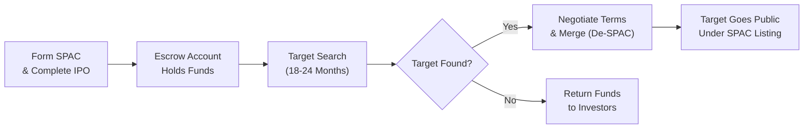

## Introduction

It’s funny how sometimes the best lessons in finance come from real-life stories. I still remember when a close colleague of mine excitedly phoned me about a “shortcut” for taking a private company public—something called a reverse merger. Of course, I promptly responded, “Wait, what’s a ‘reverse merger’? Aren’t we used to the typical route of an IPO?” That conversation quickly opened my eyes to the fascinating world of backdoor listings and, more recently, Special Purpose Acquisition Companies (SPACs).

When we talk about “going public,” our minds usually jump straight to the well-known initial public offering (IPO). But the truth is, not every business goes that route. Both reverse mergers and SPAC mergers can potentially streamline the journey from private to public status, while adding unique layers of risk, governance considerations, and essential due diligence steps.

Below we’ll explore the mechanics behind these lesser-known approaches for public market entry, highlight potential pros and cons, and tie it to real-world examples. Then we’ll finish with some best practices, pitfalls to watch out for, and practical exam tips.

## Understanding Reverse Mergers

A reverse merger is a transaction in which a private company acquires a controlling interest in a public “shell” company, effectively becoming publicly traded without doing a standard IPO. Think of it like sneaking in through the back door of a party—while everyone else is lining up for the formal red-carpet entrance, a private firm can merge with an already-listed entity to be trading on the exchange much faster.

### Key Steps in a Reverse Merger

1. An existing “shell” company: The shell is already publicly listed but typically has minimal operations and only a fraction of the typical public company’s assets.  
2. Merger agreement: The private entity negotiates ownership with the shell. The private firm’s shareholders receive the majority of the combined entity’s shares.  
3. Ownership swap: The private company’s management typically assumes control of the shell’s board of directors and executive function.  
4. Renaming and rebranding: The newly merged entity changes to the private company’s name and ticker symbol, thus becoming a publicly listed company.  

This path can be attractive because it often means fewer regulatory steps and less time spent on roadshows compared to a traditional IPO. But it also requires robust due diligence. One friend of mine once joked: “Buying a shell company is like buying a used car—you better check under the hood.” Indeed, historical liabilities, unknown lawsuits, or questionable financials can come back to haunt the merged entity.

### Potential Advantages of a Reverse Merger
• Speed to Market: Merging with an existing shell can be faster than the typical IPO route.  
• Reduced Market Risk: Avoids the extensive IPO process and potential volatility in pricing.  
• Access to Capital: Once publicly listed, the new entity may issue additional shares to raise capital (although terms vary).  

### Potential Drawbacks of a Reverse Merger
• Shell Company Risks: Shells can have undisclosed or hard-to-quantify liabilities.  
• Limited Capital Raised: Reverse mergers themselves don’t usually raise a massive amount of new capital (unlike a large IPO).  
• Reputation Concerns: Some investors remain wary if the shell’s track record is subpar or if the reverse merger route is chosen to bypass scrutiny.  

## Special Purpose Acquisition Companies (SPACs)

SPACs sound like something from science fiction, but they’re actually not that mysterious. A SPAC is a publicly listed investment vehicle formed explicitly to acquire or merge with a private company. In other words, a SPAC is created with one job in mind: find a private target and take it public. 

### Formation and IPO
Sponsors—often seasoned private equity professionals, CEOs, or industry experts—launch a SPAC by raising capital in an IPO. This capital goes into an escrow account. Investors typically purchase “units,” which include shares plus warrants or other sweeteners. The sponsors then have a set period (commonly 18–24 months) to search for a suitable private company to acquire.

### The De-SPAC Process

If all goes as planned, the SPAC merges with its target. After this “de-SPAC transaction,” the private company effectively becomes publicly traded through the SPAC’s stock listing. Here’s a simplified diagrammatic flow:

### SPAC Sponsor Incentives

Sponsors typically receive a substantial equity stake (sometimes ~20% of post-IPO shares) at a nominal cost, referred to as the “promote.” This can be extremely lucrative if the merged firm’s share price rises; but it also means potential dilution for other investors. In top-performing SPAC deals, the sponsor can reap huge rewards. In underperforming ones, sponsor incentives can be misaligned with public shareholders who might bear the brunt of falling share prices.

### Advantages of a SPAC Merger

• Speed and Pricing Certainty: Private companies can finalize a deal more quickly than a traditional IPO and lock in a negotiated price rather than leaving it to market sentiment on IPO day.  
• Experienced Sponsor Guidance: SPAC sponsors might bring industry expertise, operational know-how, or strong strategic connections.  
• Potential for Additional Capital: SPACs often raise additional financing (through PIPE—Private Investment in Public Equity) to help fund the acquisition and future growth.  

### Drawbacks and Risks of a SPAC

• Dilution: Sponsor promote and warrant holders can significantly dilute existing shareholders post-merger.  
• Short Deadline Pressures: Sponsors might feel forced to acquire a suboptimal target before the SPAC expiration date.  
• Regulatory and Disclosure Scrutiny: Regulators (e.g., the SEC in the US) increasingly scrutinize SPACs and target disclosures to ensure the transaction’s business rationale and sponsor compensation are clear.  

## Comparing Reverse Mergers and SPACs to Traditional IPOs

If you’re wondering why a private company would choose a reverse merger or SPAC over an IPO, it generally comes down to speed, cost, and certainty. In an IPO, the company undergoes an extensive regulatory review and markets shares to the public, which can involve underwriting fees, roadshows, and uncertain demand. Reverse mergers and SPACs can be swifter routes and—at least initially—somewhat less reliant on broad market sentiment.

But that doesn’t necessarily make them cheaper or easier in all respects. A reverse merger demands thorough research into the shell’s background. A SPAC requires substantial sponsor negotiations and careful analysis of dilution (the final share count can balloon, hurting existing shareholders). Borrowing from personal experience, I once observed a private company that jumped at a SPAC offer primarily to expedite its timeline. Later, the owners lamented that sponsor promote ended up costing them far more equity than anticipated.

## Due Diligence and Regulatory Considerations

Due diligence tends to be heightened in reverse mergers and SPAC transactions. When evaluating a reverse merger, it’s crucial to assess the historical liabilities of the shell company: financial statements, pending litigation, and any skeletons in the closet. For SPAC deals, key focus areas include:

• Sponsor Reputation: Does the sponsor have a track record of success, or is this their first rodeo?  
• Disclosure and Projections: Are the SPAC’s growth targets for the target business realistic, and has the sponsor been transparent about the basis of these figures?  
• Governance Structures: Will the post-transaction board include individuals who understand the target’s industry and can oversee management effectively?  

In terms of accounting standards, both IFRS and US GAAP require transparency on how the reverse merger or SPAC combination is treated, particularly regarding measurement of intangible assets, any goodwill recognized, and how sponsor shares or replacement share-based compensation are accounted for. Many jurisdictions have stepped up scrutiny. The U.S. SEC, for instance, has repeatedly issued guidance on SPAC disclosures, bridging the gap between the hype and the actual fundamentals.

## Post-Merger Performance and Stakeholder Considerations

Whether a private company enters public markets through a reverse merger or SPAC, stakeholders are intensely focused on operational performance and synergy extraction. Investors often decide, “Does the newly listed organization have the management skill, brand strength, and capital resources to thrive in public markets?” And not all do. While some enjoy surging share prices, others can falter if the underlying business wasn’t ready for prime time.

### Common Pitfalls
• Underestimating Management Complexity: Going public adds compliance burdens, investor relations, and stricter reporting deadlines.  
• Misaligned Incentives: SPAC sponsor compensation can create short-term focus rather than sustainable growth strategies.  
• Overvaluation: In hype-driven eras, a rushed transaction can inflate valuations beyond reasonable fundamentals.  

### Strategies for Overcoming Pitfalls
• Comprehensive Due Diligence: Validate all finances, historical operations, and intangible assets.  
• Strong Corporate Governance: Ensure the post-merger board has a blend of independence, expertise, and strategic oversight. (See also “Board Committees” in Chapter 3 for best practices).  
• Transparent Communication: Keep investors informed about integration progress, revenue drivers, synergy potential, and risk factors.  

## Practical Example: SPAC Acquisition in the Tech Sector

Consider a fictitious SPAC “Future Innovations Corp.,” sponsored by experienced fintech executives who raised $300 million in an IPO. The capital sits in escrow as they search for a late-stage software startup. They locate “ByteSolutions,” a private data analytics firm generating $50 million in annual revenue.  
• They negotiate a $600 million target valuation.  
• Future Innovations Corp. invests escrow plus $50 million from PIPE investors who appreciate the synergy with ByteSolutions.  
• The sponsor’s promote claims 20% of the post-merger entity, raising dilution concerns among ByteSolutions founders.  
• Eventually, they finalize a 15% sponsor promote to sweeten the deal for ByteSolutions.  

After the de-SPAC, ByteSolutions (now listed) invests heavily in product expansion. Investors monitor financial statements, the board’s independence, and sponsor involvement. If performance lags, the sponsor can face shareholder criticism and potential litigation, especially if projections prove overly optimistic.

## Exam Relevance and Key Takeaways

For CFA Level III candidates—particularly in Corporate Finance, M&A, and advanced portfolio management domains—reverse mergers and SPACs are relevant for understanding alternative routes to the public markets and how these transactions impact valuation, governance, and portfolio allocations. You might see item-set questions testing your capacity to identify pros/cons, evaluate sponsor motivations, or analyze post-merger capital structure.  

• Reverse mergers and SPACs can be purely domestically focused or cross-border, each with unique regulatory complexities.  
• Familiarize yourself with how to assess sponsor promotes, how to measure potential share dilution, and how to evaluate the synergy potential of a newly public firm.  
• Keep in mind that many of the same M&A considerations apply, from due diligence to integration risk and synergy achievement.

## Final Exam Tips

• Focus on the Relationship between Sponsor Incentives and Shareholder Value: Understand how sponsor promote impacts the equity structure.  
• Review Basic DCF Valuation for Potential Merger Targets: You might be asked to estimate the fair value of the private target in a SPAC or reverse merger scenario.  
• Understand IFRS vs. US GAAP for Business Combinations: Even though the underlying concepts are similar, exam scenarios may highlight differences in intangible asset and goodwill treatments.  
• Highlight Best Practices in Governance: Post-merger board composition and committees can underpin success or failure.

## References, Further Reading, and Resources

• Klausner, M., Ohlrogge, M., & Ruan, E. (2022). “A Sober Look at SPACs.” Yale Journal on Regulation.  
• U.S. Securities and Exchange Commission (SEC) guidelines on SPACs and reverse mergers: https://www.sec.gov/  
• Academic papers on SPAC performance in SSRN: https://www.ssrn.com/

--------------------------------------------------------------------------------

## Test Your Knowledge: Reverse Mergers and SPACs Quiz



### In a reverse merger, which of the following best describes the core mechanism?

- [ ] A private company creates a new entity and issues new shares directly to public investors.  
- [x] A private company merges with a dormant or “shell” public company, taking over its public listing.  
- [ ] A private company lists its own shares without involving underwriters.  
- [ ] A private company purchases a minority stake in a major competitor.  

> **Explanation:** Reverse mergers involve a private entity gaining control via a public shell to become publicly traded, bypassing the usual IPO route.

### Which of the following is a potential advantage of a reverse merger over a traditional IPO?

- [ ] Reverse mergers always result in higher valuations for the target.  
- [x] They can be completed more quickly and with fewer regulatory steps than an IPO.  
- [ ] They generally result in more capital raised than through a typical IPO.  
- [ ] They guarantee a higher level of investor protection from day one.  

> **Explanation:** Reverse mergers can offer a comparatively faster path without undergoing a lengthy IPO process. However, they often raise less capital and still require careful due diligence.

### SPAC sponsors may have which of the following incentives?

- [x] Retaining a “promote” that can dilute existing shareholders post-merger.  
- [ ] Reducing overall share count to avoid dilution entirely.  
- [ ] Giving majority ownership of the SPAC to initial investors as a goodwill gesture.  
- [ ] Securing the lowest possible share price for the combined company.  

> **Explanation:** SPAC sponsors typically get a sizeable equity stake (“promote”) that can dilute others’ ownership. This is a key aspect to analyze when assessing SPAC deals.

### If a SPAC sponsor fails to find a target within the designated timeframe (commonly 18–24 months), what usually happens?

- [ ] The sponsor can extend the search period indefinitely.  
- [ ] The SPAC automatically becomes a REIT (Real Estate Investment Trust).  
- [ ] The SPAC merges with a shell to remain public.  
- [x] Funds are returned to investors, and the SPAC is dissolved.  

> **Explanation:** After 18–24 months without an acceptable target, the SPAC must generally return the IPO proceeds to shareholders.

### One key difference between a SPAC merger and a traditional IPO is:

- [ ] In a traditional IPO, capital is raised after the company becomes public.  
- [x] In a SPAC, the shell entity raises capital first, then searches for a target to merge with.  
- [ ] A SPAC cannot trade publicly until the target is found.  
- [ ] SPAC mergers require no regulatory filings.  

> **Explanation:** The defining characteristic of a SPAC is that it raises capital upfront via its own IPO and then looks to acquire a private company.

### Which of the following is a primary reason a private firm might choose a SPAC merger rather than a standard IPO?

- [ ] Guaranteed share price appreciation.  
- [x] Potentially faster access to public capital and more certainty on pricing.  
- [ ] Avoidance of all compliance requirements post-merger.  
- [ ] Reduced liability for any misstatements in their financials.  

> **Explanation:** A SPAC merger can be quicker and offer a negotiated valuation, but it does not exempt the resulting public company from regulatory requirements or liability.

### In evaluating a reverse merger target or SPAC target, which due diligence factor is most critical?

- [ ] Investor demographics of the shell’s shareholder base.  
- [ ] The potential for turning the shell into a new operating division.  
- [ ] The limit on how many underwriters can be involved.  
- [x] Verification of historical financials, liabilities, and management track record.  

> **Explanation:** Thorough due diligence on finances, potential liabilities, and leadership capabilities is paramount in both reverse mergers and SPAC acquisitions.

### Which statement is true about share dilution in the SPAC context?

- [ ] SPACs do not cause any dilution because the sponsor invests at market price.  
- [x] Sponsor promotes and warrant redemptions can significantly dilute existing shareholders.  
- [ ] Dilution is strictly prevented by escrow regulations.  
- [ ] SPAC mergers cannot include warrants, so dilution doesn’t occur.  

> **Explanation:** The sponsor’s promote and warrants associated with SPAC units lead to additional share issuance, diluting existing ownership.

### Under IFRS and US GAAP, reverse mergers and SPAC transactions:

- [ ] Are not recognized as legitimate corporate actions.  
- [x] Must be accounted for as business combinations, recognizing assets and liabilities at fair value.  
- [ ] Never generate any goodwill, as intangible assets are disallowed.  
- [ ] Require only a single-line consolidation in financial statements.  

> **Explanation:** These transactions are typically accounted for under relevant business combination standards, potentially leading to goodwill or recognition of intangible assets.

### A SPAC sponsor’s promote is:

- [x] An equity stake granted to the SPAC founders, usually around 20% of shares, for a nominal fee.  
- [ ] The bonus paid to underwriters for marketing the private target.  
- [ ] Reserved shares offered to employees of the target company.  
- [ ] A tax credit offset provided by the exchange.  

> **Explanation:** A SPAC sponsor’s promote commonly refers to the relatively large equity stake sponsors receive, often at a significant discount.


