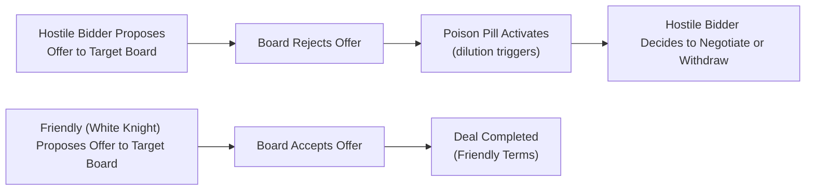

## Introduction

Let’s be honest: the term “anti-takeover provisions” sounds a bit dramatic, right? I remember the first time I heard about poison pills—my immediate thought was, “Wait, there’s poison involved in finance?!” Sure, it’s not literal poison, but in a sense, these strategies can be lethal to a hostile bidder’s plans. Anti-takeover defenses come into play when a target company wants to defend itself from an unwanted acquisition. They’re called “defenses” for a reason: they try to raise the cost, complexity, or difficulty of a hostile takeover.

In this discussion, we’ll explore some of the most common anti-takeover provisions—everything from poison pills to the architecture of a “staggered board.” We’ll look at how these tactics can help management maintain control, why they sometimes frustrate shareholders, and how regulatory bodies around the world tie in. We’ll add a few personal anecdotes, real-life examples, and maybe a chart or two so it all feels a bit less intimidating. And yes, we’ll keep it slightly informal. After all, we’re just two folks chatting finance over coffee.

## The Rationale Behind Anti-Takeover Defenses

At their core, anti-takeover provisions are corporate governance tools meant to prevent or at least discourage hostile takeovers. A hostile takeover is when an acquiring company (or group of investors) tries to gain control of a target company’s board or assets without the wholehearted blessing of the target’s management or board. You might wonder, “Why would a company resist a takeover if it could boost shareholder value?” That’s a million-dollar question—or, more accurately, a multi-billion dollar question in some deals.

Sometimes management genuinely believes the offer undervalues the company. Other times, managers might be reluctant to give up their control, especially if a new acquirer plans to replace them. So there’s this obvious tension. And from a shareholder’s perspective, anti-takeover defenses can be either beneficial (if they prompt higher bids and more strategic deals) or detrimental (if they entrench current managers who resist potentially value-enhancing takeovers).

## Common Anti-Takeover Strategies

Below we’ll walk through the most frequently encountered defenses. In practice, companies often mix and match them. The more complicated the tangle, the harder it is for a hostile acquirer to break through.

### The Poison Pill (Shareholder Rights Plan)

You’ve probably heard about the poison pill from newspaper headlines, investor presentations, or cameo appearances in business school case studies. The idea is simple: if a hostile bidder acquires more than a certain percentage—let’s call it 10%—of the company’s shares, all other shareholders (except that bidder) get to buy new shares at a steep discount. That discount dilutes the hostile bidder’s stake, making it painfully expensive to cross the ownership threshold.

• How It Works:  
  1. A company’s board adopts a poison pill provision.  
  2. The plan triggers once the acquirer’s stake exceeds a threshold (e.g., 10%).  
  3. Other shareholders get to buy shares at a discount, diluting the acquirer’s newly acquired ownership.  

The result is that the hostile bidder either has to negotiate directly with the board on friendlier terms or walk away. Ironically, what we call “poison pill” can actually be sweet for existing shareholders who get discounted shares. But for the bidder, it’s definitely “poisonous,” because the bidder’s ownership share shrinks in value due to dilution.

### Staggered Board

When a board is staggered or classified, only a fraction of directors—like a third—are up for re-election in any given year. A hostile bidder wanting to take over the board and gain control of the company typically needs to replace a majority of directors. With a staggered board, that bidder might have to wait multiple years for enough board seats to open for election. This significantly slows—and sometimes outright derails—a takeover attempt.

From an exam perspective, be aware that a staggered board can be layered on top of other defenses. Once you pair a staggered board with a poison pill, the hostile bidder sees big roadblocks in terms of time and money.

### Golden Parachute

If you’ve ever heard about executives who get multimillion-dollar payouts upon termination or change in control, that’s effectively a golden parachute clause. You could say these are generous severance packages that trigger if top executives lose their jobs following a merger or acquisition. It might include payouts of multiples of base salary, accelerated stock vesting, bonuses, and so on.

• Why It’s Used:  
  - On one hand, it raises the overall cost of acquisition. Acquirers know they need to budget for these hefty severance costs.  
  - On the other hand, golden parachutes can encourage management to accept beneficial deals for shareholders, because executives know they’ll be compensated even if they lose their jobs under new ownership.  

Opinions on golden parachutes differ. Some stakeholders see them as an entrenchment tool (executives are essentially paying themselves to be let go). Others see them as a way to align managers with shareholders (managers won’t be as hostile to good offers if they’re financially protected).

### Dual-Class Shares

In many high-profile tech companies, you’ll see multiple classes of shares. One class is widely held by the public, often with limited or no voting rights. Another class is held by founders or insiders and has significantly enhanced voting rights. This structure means the founders or insiders effectively retain control, even if the public invests billions in the company. For a hostile bidder, trying to buy up the public shares is often pointless because the major voting power sits with a different share class. Takeovers can be nearly impossible unless the insiders choose to sell.

You’ve likely seen this structure if you’ve read about companies like Alphabet (Google). They have different letter-labeled share classes and carefully guard voting control. For them, this can foster a long-term outlook. But critics argue it can entrench management and reduce accountability.

### White Knight and Alternative Allies

Though not strictly a “defensive mechanism” baked into a company’s governance, a white knight is a friendlier acquirer that a target company seeks out to evade the clutches of a hostile bidder. White knights typically offer more favorable terms—maybe a higher price or a promise to keep existing management. As a result, the original bidder can be forced to either walk away or sweeten their deal, potentially boosting shareholder value.

If you think about it in “story terms,” a white knight is the heroic suitor riding in on horseback, while the target tries to escape the unwelcome fortress approach of the hostile acquirer. The real question is who truly benefits: sometimes it’s the shareholders, sometimes it’s the managers who get to keep their seats.

## Mermaid Diagram: Hostile vs. Friendly Takeover Flows

Below is a simple Mermaid diagram illustrating two scenarios: one with a friendly “white knight” approach and one with a hostile bidder that encounters a poison pill.



This chart simplifies what can actually be a very complex process, but it helps visualize the different flows of a typical takeover attempt.

## Governance Implications of Anti-Takeover Defenses

It’s worth noting that anti-takeover defenses can raise eyebrows from a corporate governance perspective. Why? Because they can entrench existing management and block potentially value-enhancing deals. In practice, if a takeover threat is real and the board is ignoring it just to protect its own layer of control, that can harm shareholders in the long run.

• Some investors argue that poison pills, staggered boards, and golden parachutes shield managers from accountability.  
• Others say these tools are vital to protect the company’s strategic vision from short-term raiders.  

So there’s inherent tension. That tension often manifests in debates at annual shareholder meetings or in proxy fights where activist investors try to dismantle anti-takeover measures that they believe aren’t in the best interests of the company.

## Regulatory Considerations

Different jurisdictions have varying rules about what’s fair or not in an anti-takeover scenario. For example, in the United States, Delaware courts have historically been quite influential in shaping case law on poison pills and other such defenses. In some European markets, certain tactics might be more restricted or heavily regulated to protect minority shareholders.

Even stock exchanges have listing standards that can place constraints on how far a company can go with certain defense tactics. For instance, some exchanges might require shareholder approval before a company can adopt a poison pill with a significant dilutive effect. Meanwhile, securities regulators (like the SEC in the U.S.) keep an eye on disclosures, ensuring that boards aren’t quietly slipping in new anti-takeover devices without telling shareholders.

## Practical Examples and Anecdotes

• One well-known example of a poison pill in action was in the 1980s, when corporate lawyer Martin Lipton first introduced the concept. Companies of all shapes and sizes adopted it, much to the chagrin of corporate raiders.  
• More recently, you might recall Netflix adopting a poison pill in 2012 to deter activist investor Carl Icahn from acquiring more than 10% of the company. Netflix’s board worried that Icahn might push for a quick sale. The poison pill effectively put a lid on how much control he could acquire.  
• As for dual-class shares, Facebook (Meta) famously went public with a structure that gave Mark Zuckerberg extra voting power, ensuring that he maintained a leadership role. Many high-growth tech companies follow a similar pattern—though there remain heated debates among institutional investors about whether this is good or bad for long-term value creation.

## Balancing the Pros and Cons

If you’re preparing for the CFA exam, you should be able to discuss or write about the trade-offs. Weigh the potential benefits (protection from opportunistic bidders, more bargaining power for the board, possible higher takeover premiums) against the downsides (management entrenchment, shareholder dissatisfaction, controversy over whether such defenses harm firm value).

A typical exam question might ask you to evaluate how golden parachutes, for instance, can both align and misalign executives with shareholder interests. Another question might focus on the subtle interplay between staggered boards and poison pills. You’ll want to be sure you understand not just the definitions, but also how they interact in real scenarios.

## A Quick Numerical Illustration: Dilution from a Poison Pill

Let’s say a hostile bidder accumulates 9% of a company. The poison pill triggers if the bidder goes beyond 10%. Suppose the company has 100 million shares at $50 each. If the hostile bidder crosses 10 million shares, the plan might allow all other shareholders to buy additional shares at half price—say $25 per share. If half of the remaining 90 million shares are purchased at the discounted price, the total share count soars, drastically diluting that bidder. Let’s do a tiny snippet of Python-esque pseudo-code to illustrate:

```python
current_shares = 100_000_000
trigger_threshold = 0.10
bidder_shares = 10_000_001  # crosses 10%

new_shares_issued = 45_000_000
new_total_shares = current_shares + new_shares_issued

bidder_ownership_percentage = bidder_shares / new_total_shares
print(f"Bidder Ownership After Pill Activates: {bidder_ownership_percentage:.2%}")
```

While this code is just an illustration, you’d see the bidder’s percentage drop significantly below 10%, effectively undermining the takeover attempt unless the bidder invests substantially more.

## Best Practices: Striking the Right Balance

• Conduct a thorough cost-benefit analysis before adopting such defenses.  
• Consider shareholder sentiment. Some major institutional investors push back hard against robust defenses.  
• Evaluate external environment and regulatory requirements—particularly if operating in multiple jurisdictions.  
• Communicate openly with shareholders. If you’re adopting or modifying a poison pill, be transparent about your rationale.  

## Potential Pitfalls

• Overusing or combining too many defenses can scare away not just hostile bidders, but also potential friendly acquirers.  
• It can damage corporate reputation—some shareholders see these defenses as a sign that management is more focused on self-preservation.  
• Inconsistent or confusing terms within various defense strategies can create legal vulnerabilities or hamper day-to-day corporate governance.

## Final Thoughts for Exam Preparation

1. Know the definitions cold: poison pill, staggered board, golden parachute, dual-class shares, white knight.  
2. Understand the interplay: for instance, how a staggered board compounds the effect of a poison pill.  
3. Be ready to analyze scenarios in which a particular defense might be beneficial or harmful for shareholders.  
4. Practice applying these concepts to hypothetical acquisition offers—especially the numeric aspect if a pill triggers.  
5. Keep an eye on corporate governance rules, because the CFA exam loves to test your understanding of the Code and Standards (e.g., responsibilities of the board, fairness of treatment to all shareholders).

On exam day, you might see a question prompt describing a potential takeover scenario. The question might ask you to identify the most likely anti-takeover defense or interpret whether a board’s decision to implement a defense is in line with shareholders’ best interests. Make sure you can articulate the “why” behind each defense, not just the “what.”

## Glossary

• Poison Pill (Shareholder Rights Plan): Mechanism allowing target shareholders (excluding the bidder) to purchase shares at a discount upon a specified trigger, diluting the hostile bidder.  
• Staggered Board: Only a portion of board seats are up for election in any given year, prolonging the time it takes a hostile bidder to gain board control.  
• Golden Parachute: Lucrative severance deal promising top executives significant benefits if they’re terminated following a change in control.  
• White Knight: A friendly acquirer sought by the target company to avoid a takeover by a hostile bidder.  
• Dual-Class Share: A share structure in which one class carries superior voting rights versus a more widely held class with limited voting rights.  
• Entrenchment: Scenario where managers use defenses to remain in power, possibly at shareholders’ expense.

## References, Further Reading, and Resources

• Lipton, M. (1982). Originator of the poison pill. Explore commentary at Wachtell, Lipton, Rosen & Katz.  
• Bebchuk, L. A. (2002). “The Case Against Board Veto in Corporate Takeovers.” The University of Chicago Law Review.  
• Thomson Reuters Practical Law: Takeover Defense strategies and real-world precedents in different jurisdictions.  
• Corporate finance textbooks with coverage on M&A defenses and corporate governance best practices.  
• CFA Institute Level I and II materials on capital structure and corporate governance.  

## Test Your Knowledge: Anti-Takeover Provisions Quiz



### Which of the following best describes the main effect of a poison pill?

- [ ] It encourages the target's shareholders to sell their shares to the hostile bidder at a discount.
- [x] It dilutes the hostile bidder’s ownership by allowing existing shareholders to purchase shares at a discount.
- [ ] It accelerates the election of board members to expedite an acquisition.
- [ ] It guarantees a higher buyout price for existing shareholders.

> **Explanation:** A poison pill triggers dilution for the hostile bidder by enabling existing shareholders (excluding the bidder) to buy additional shares at a discount, thus reducing the bidder’s stake.

### A staggered board typically:

- [ ] Requires the entire board to stand for re-election every year.  
- [x] Elects only a fraction of the board each year, making it difficult for a hostile acquirer to gain majority control quickly.  
- [ ] Avoids elections altogether for a three-year period.  
- [ ] Is always disallowed by major securities regulators.  

> **Explanation:** With a staggered board, only a portion of the directors come up for election each year, thereby lengthening the time needed for a hostile acquirer to replace board members.

### Which of the following is a potential benefit of golden parachutes from a shareholder’s viewpoint?

- [ ] It guarantees that the company will never be taken over.  
- [ ] It allows employees to buy shares at a discount.  
- [x] It can encourage managers to negotiate in good faith with potential acquirers.  
- [ ] It always lowers the premium paid by acquiring firms.  

> **Explanation:** Large severance packages (golden parachutes) can relieve managers’ fears of job loss, making them potentially more open to beneficial takeovers.

### When a company implements dual-class shares:

- [ ] Every share class has the same voting rights.  
- [ ] The majority of shares go to new investors while founders retain few shares.  
- [x] A certain class of shares typically has superior voting rights, enabling founders or insiders to maintain control.  
- [ ] It automatically triggers a poison pill in the event of a hostile takeover.  

> **Explanation:** Dual-class structures commonly concentrate voting power with insiders, despite the fact that public investors may purchase a large portion of total shares.

### Which of the following statements most accurately describes a white knight?

- [ ] A competitor who initiates a rival hostile bid to undercut the current bidder.  
- [x] A friendly firm sought by the target to acquire it on more favorable terms than a hostile takeover.  
- [ ] A government agency enforcing anti-takeover laws.  
- [ ] An activist investor aiming to dissolve anti-takeover provisions via proxy battles.  

> **Explanation:** A white knight is a friendlier acquirer who steps in to outbid or counter a hostile offer, often preserving management and/or offering a higher price.

### Which of the following is a drawback of having too many anti-takeover defenses?

- [x] It can discourage both hostile and potentially friendly takeover attempts.  
- [ ] It always results in higher share prices.  
- [ ] It cannot be overturned by a court.  
- [ ] It is always preferred by shareholders.  

> **Explanation:** Multiple defenses can ward off an unwanted bidder but also deter desirable offers, possibly harming shareholder value.

### Which scenario might fuel claims of manager entrenchment?

- [ ] Management’s acceptance of an all-cash, above-market buyout offer.  
- [x] A company’s board consistently rejecting takeover bids and implementing new defenses without shareholder consultation.  
- [ ] A board that arranges for shareholders to vote on whether to adopt a poison pill.  
- [ ] A friendly takeover with no significant changes in board composition.  

> **Explanation:** Entrenchment can occur when a board or management team deploys defensive measures to preserve their positions despite potentially favorable offers for shareholders.

### In the context of a hostile takeover, one advantage of a poison pill to existing shareholders is that:

- [ x] They can purchase new shares at a discount.  
- [ ] They need to wait several months before re-selling shares.  
- [ ] They automatically receive a payout ensuring no loss.  
- [ ] It decreases total share count.  

> **Explanation:** Poison pills allow current shareholders (other than the bidder) to buy new shares at discounted prices, diluting the bidder’s position but rewarding other shareholders who opt to purchase additional shares.

### Which of the following statements is most accurate regarding staggered boards and shareholder value?

- [x] Staggered boards can prompt bidders to offer a higher premium to induce board support.  
- [ ] Shareholders typically gain immediate liquidity from a staggered board.  
- [ ] A staggered board always leads to an immediate drop in the stock price.  
- [ ] Staggered boards are mandated by all major stock exchanges.  

> **Explanation:** By making hostile takeovers more time-consuming, staggered boards can force bidders to negotiate more favorably, occasionally increasing the takeover premium.

### True or False: A golden parachute can be seen as both a cost to the acquiring firm and a potential alignment mechanism for the target’s management.

- [x] True  
- [ ] False  

> **Explanation:** Golden parachutes are often criticized for adding to the cost of acquisitions, but they also can remove management’s fear of job loss, potentially making them more willing to consider beneficial offers.


