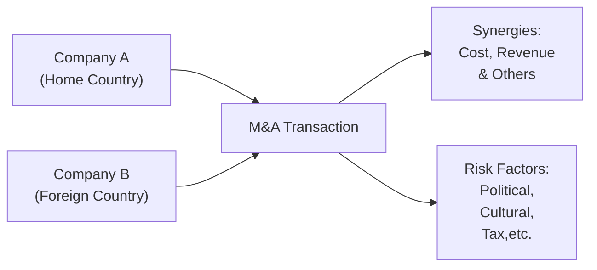

Introduction  
Sometimes folks look at mergers and acquisitions and think, “Well, we’ll just smash these two companies together, and the result is obviously going to be bigger and better, right?” But, um, not always. In reality, extracting real value from a merger is far more complicated than it first appears. This section explores how synergistic benefits can (and often do) arise from corporate combinations—especially those that happen across geographic and regulatory boundaries. We’ll also talk about the ways synergy is often overestimated—yes, we’ve all been there—and the complexities of cross-border deals from finance, culture, and tax perspectives. In other words, let’s get behind the scenes of why synergy is not just a buzzword and how to factor in global considerations that can make or break an international transaction.

The Essence of Synergies  
At its core, synergy is about making 1 + 1 = 3. In other words, synergy is the additional value created by combining two entities that you wouldn’t get if each entity operated independently. Plenty of us have sat in M&A pitch meetings where an ambitious CFO or banker touts tens or hundreds of millions in “synergies.” But how do we actually identify and measure them?

• Cost Synergy: Maybe you can eliminate overlapping production facilities or reduce headcount. Maybe a single, unified supply chain can unlock volume discounts or better logistics. These cost reductions can be quick wins in some cases—like consolidating real estate—while in others (especially workforce restructuring) they take time and have social or cultural repercussions.  
• Revenue Synergy: Often the real star of the show. Picture capturing new markets by leveraging unique distribution channels, cross-selling to each other’s clients, or bundling services in a way that neither firm could have done alone. Another angle is brand cross-pollination—one robust global brand can boost the sales of a lesser-known brand in new markets.  
• Economies of Scale: Here we talk about spreading fixed costs (like overhead or R&D) over a larger output base. If each entity is developing similar products, combining R&D efforts might be more efficient, letting your new, bigger R&D machine churn out innovative products at a lower average cost.  
• Sharing Best Practices: Often intangible but valuable is the transfer of management know-how. Think: one company has a superior data analytics division, the other has top-notch marketing. Once combined, they might produce more robust analytics-driven marketing than either could have done on their own.  

Valuing Potential Synergies  
Valuing synergy is about carefully projecting the incremental cash flows from combining the two firms. In a typical discounted cash flow (DCF) approach, you might start with a combined free cash flow forecast for the post-merger company, discount it at the appropriate weighted-average cost of capital (WACC), and then compare that combined value to the sum of each standalone firm’s value (plus any synergy-specific costs of integration). If you see a positive difference, that’s synergy. But watch out: synergy that exists only in a spreadsheet won’t magically appear in reality if you haven’t laid the groundwork for integration.

Below is a simplified synergy formula you might encounter, though in practice you could further dissect it for specific synergy sources:

(1)  
Synergy Value = [NPV(Combined Firm)] – [NPV(Firm A) + NPV(Firm B)] – Integration Costs  

Important: Integration costs include everything from severance packages to IT system migrations and even the dreaded “cultural assimilation” initiatives (like workshops, employee realignment programs, and often the intangible cost of morale disruptions). Overestimating synergy while underestimating real integration barriers is one of the most common pitfalls in M&A—some folks might say it’s the cautionary tale repeated in every business-school M&A class.  

Pitfalls and Overestimations  
Overenthusiasm can lead to a little phenomenon known as the “winner’s curse”: the acquirer gets the deal but pays much more than the company was intrinsically worth. A frequent culprit is synergy overestimation. Maybe the synergy model double-counts revenue improvements, or it fails to incorporate local regulations that hamper cost-saving efforts. Or sometimes the synergy timeline is too short, ignoring that cultural alignment, technology platform integration, and brand repositioning can take years—if not decades—to bear fruit.

You know, I once discussed synergy in a cross-border deal involving a consumer goods company with entirely different distribution models in two large continents. Everyone expected to cross-sell like crazy, but local managers were used to very different sales incentives. It took a lot longer to unify them—meaning synergy was delayed and, in the short term, actually cost more.  

Cross-Border Mergers: Key Considerations  
Now let’s dial it up to the complexity we see in cross-border transactions. All the synergy stuff becomes more complex when you have currency risk, regulatory mismatches, cultural differences, and possibly different sets of accounting standards. This typically means:

• Exchange Rate Uncertainties: If, for example, the target firm generates revenue in a currency that’s weakening against the acquirer’s currency, synergy might be offset by currency translation losses.  
• Political Risk: Changes in local governments, new trade barriers, or unexpected regulatory frameworks can reduce the synergy you thought you’d achieve. Real talk—some deals never close because political tension escalates.  
• Multiple Accounting Standards: IFRS 3 versus US GAAP (ASC 805) can affect how intangible assets, purchase price allocations, and goodwill are recognized. The projected synergy might shift once you unify reporting standards—especially where intangible valuation or impairment testing differs.  
• Differing Cultural Norms: In some regions, a top-down approach can be standard operating procedure, whereas in others, more democratic decision-making is key. Misaligning these norms can hamper resource sharing and hamper synergy realization.  

Let’s visualize a high-level process map that might help you see how these different elements flow together:

In this diagram, companies from different countries form a transaction. The synergy potential is tempered by a range of cross-border risk factors.  

Cultural Integration and People Issues  
It almost goes without saying that cultural integration can make or break your synergy success. An M&A deal can bring in conflicting approaches to hierarchy, work-life balance, or R&D creativity. Even if you see employees as “just another resource,” local labor laws and union negotiations might shape how you can (or can’t) reorganize or eliminate roles in a combined organization. So the synergy does not come “for free.” If you want to preserve morale and avoid the dreaded “us vs. them,” plan your cultural integration carefully and early.  

Foreign Exchange Risk  
Currency fluctuation can alter the real value of synergy. Let’s say you’re a US-based company acquiring a firm in the Eurozone that promises to add €50 million in incremental cash flow. If the EUR/USD exchange rate shifts in unexpected ways, that synergy may diminish when translated into your home currency. Practitioners often hedge some portion of these cash flows using forward contracts or currency swaps, but remember that hedging typically covers short to medium timeframes. If your synergy is realized over, say, 5–10 years, you’re looking at a more dynamic currency risk profile.  

Financing Cross-Border Mergers  
From a capital structure perspective, cross-border deals may require more creative financing. Firms might issue bonds in multiple currencies or arrange local bank loans to match local revenues—an approach known as “natural hedging.” Other times, the parents use cross-listing strategies to broaden their investor base and reduce the cost of equity where market conditions are more favorable. Collateral issues, covenant structures, and local legal frameworks for debt enforcement also differ widely, complicating due diligence.  

Tax Implications and Structuring  
If you don’t factor in tax treaties, withholding tax rates, or local corporate tax laws, you’re missing a big piece of cross-border synergy. Indeed, cross-border taxation can drastically change the net present value calculations. For instance, if dividends or interest from the foreign subsidiary are heavily taxed, your synergy from cost or revenue improvements might be offset by the extra tax burden. Many corporations set up special-purpose entities in tax-friendly jurisdictions to optimize tax outcomes, but these must be balanced against the risk of regulatory or reputational backlash. Always consider whether the synergy you’re projecting is robust to these possible tax frictions.

Real-World Example (Hypothetical)  
Picture an American tech firm named InnoPro acquiring an Indian analytics startup, DataSolve. The synergy pitch: combine InnoPro’s global client base with DataSolve’s advanced analytics platform to cross-sell a new range of data solutions. Initially, the synergy model predicts about $50 million incremental annual revenue by Year 3. But looking deeper, you realize that local pricing constraints, strict data-protection laws, and new taxes on foreign tech earnings might reduce that synergy in half. Factor in the cost of spinning up a brand-new compliance infrastructure in India, and you see that synergy gets watered down. Then you add cultural complexities—InnoPro’s hierarchical culture clashes with DataSolve’s more free-form innovation environment. Integration drags on, synergy timelines get pushed out, and the CFO is left to explain to investors why synergy is taking so long to show up in the bottom-line results.

Exam Tips for Synergy and Cross-Border M&A  
• In scenario-based constructed-response questions, clearly identify synergy categories (cost vs. revenue, economies of scale, etc.). Show the path for each synergy to materialize, acknowledging integration costs.  
• Demonstrate the impact of currency risk and potential hedging solutions in your calculations. If a question highlights a target that earns in multiple currencies, be sure to mention how you’d mitigate exchange risk or incorporate it in your valuation.  
• For cross-border deals, always consider local legal and political environments—this ties into your risk management framework. You may see a question where you have to adjust expected synergy for probable political or regulatory hurdles.  
• Watch out for intangible synergy: brand cross-licensing or the ability to co-develop R&D. Those intangible aspects can appear in advanced essay prompts or item sets.  
• Use best practices from IFRS 3 or US GAAP ASC 805 if the question focuses on the accounting treatment. For exam purposes, be prepared to explain how different accounting rules might alter goodwill valuations and synergy reporting.  

Conclusion  
Synergies are all about achieving something bigger than a sum of parts. They’re that magical extra that can make an M&A deal worthwhile—if they’re thoroughly researched and realistically valued. Cross-border mergers take all the synergy potential and inject extra complexity around currency, regulatory differences, tax frameworks, and culture. The bottom line? If you want synergy to materialize for the long haul, watch out for pitfalls like overestimation, plan carefully for cultural integration, hedge for currency swings, and remain vigilant about local regulatory changes. All these steps are crucial in ensuring that your 1 + 1 truly does equal 3 (or maybe 2.5 in reality—but still bigger than 2!).  

References and Further Reading  
- Marks, M. L., & Mirvis, P. H. (2010), “Joining Forces: Making One Plus One Equal Three in Mergers, Acquisitions, and Alliances.”  
- KPMG’s Cross-Border M&A Practice Publications: https://home.kpmg/xx/en/home.html  
- OECD Guidelines on Taxation: https://www.oecd.org/  

## Test Your Knowledge: Synergies and Cross-Border Mergers



### Which of the following best describes "cost synergy" in a merger or acquisition?
- [ ] It refers to the ability to combine marketing divisions for increased brand exposure.  
- [ ] It reflects improvements in top-line revenue from cross-selling opportunities.  
- [x] It involves reducing overlapping expenses, such as consolidating facilities or shared resources.  
- [ ] It refers to hedging strategies for foreign exchange exposure.  

> **Explanation:** Cost synergies focus on reducing operating expenses or overhead by merging similar functions and eliminating overlap.

### When calculating synergy value using a basic discounted cash flow approach, which of the following adjustments is most critical to include?
- [ ] The inflation rates for each country.  
- [x] Integration costs, such as severance and system migration expenses.  
- [ ] Past dividend payouts and stock splits.  
- [ ] Management’s personal risk tolerance.  

> **Explanation:** Integration costs are often overlooked but are essential to accurately derive the net synergy from an M&A deal.  

### A US company acquires a Canadian firm to expand its market share in North America. Which of the following risks would most likely arise from currency-related issues?
- [ ] Difficulty consolidating IT systems.  
- [ ] Understaffing of the finance department.  
- [x] Volatility in the exchange rate of USD/CAD impacting realized cash flows.  
- [ ] Lack of brand awareness.  

> **Explanation:** Currency fluctuation can erode the expected financial benefits when converting foreign-earned profits into the parent’s home currency.

### True or False: Overestimation of synergies is one of the primary reasons many M&A deals fail to deliver shareholder value.
- [x] True  
- [ ] False  

> **Explanation:** Overoptimistic synergy forecasts can lead to paying an excessive premium for the target and failing to realize planned benefits.

### Which of the following examples highlights a revenue synergy?
- [ ] Downsizing a redundant sales team.  
- [ ] Centralizing procurement processes with bulk purchasing.  
- [x] Cross-selling the target firm’s products through the acquirer’s existing distribution channels.  
- [ ] Selling off non-core assets of the target post-merger.  

> **Explanation:** Revenue synergy stems from combined offerings or access to broader channels that increase or improve the revenue streams of the merged entity.

### A cross-border acquisition faces “political risk” primarily because:
- [x] Government actions or regulations in the target’s host country could adversely impact business operations.  
- [ ] The acquired firm’s customer base speaks a different language.  
- [ ] Cultural integration is more challenging in emerging markets.  
- [ ] Exchange rate movements cause unpredictability in cash flow.  

> **Explanation:** Political risk often involves uncertainties in legislation, trade policies, or government stability that can affect a foreign investor’s operations.

### Which accounting standard topic is most relevant to valuing goodwill and intangible assets in a cross-border M&A under IFRS?
- [ ] IFRS 2 Share-Based Payment  
- [ ] IFRS 10 Consolidated Financial Statements  
- [x] IFRS 3 Business Combinations  
- [ ] IAS 19 Employee Benefits  

> **Explanation:** IFRS 3 provides the guidelines on identifying and valuing goodwill, intangible assets, and purchase price allocation in business combinations.

### Which best captures a key cultural integration challenge following a cross-border merger?
- [ ] Merging two firms’ websites for online sales.  
- [ ] Auditing each department’s operating costs to reduce overhead.  
- [x] Aligning different attitudes toward hierarchical decision-making in the workforce.  
- [ ] Converting financial statements from IFRS to US GAAP.  

> **Explanation:** Different management styles, hierarchy, and employee engagement approaches represent a core cultural integration challenge that impacts day-to-day operations.

### What is the primary reason an acquirer might use “natural hedging” when financing a cross-border deal?
- [ ] To project synergy forecasts in the parent’s currency.  
- [ ] To ensure compliance with local labor laws.  
- [ ] To leverage cost-saving synergies via supply chain integration.  
- [x] To match local currency revenues with local currency financing, reducing exchange rate risk.  

> **Explanation:** Natural hedging involves incurring debt or costs in the same currency as revenues, so currency fluctuations have a lesser net impact on profitability.

### In a scenario-based exam question, which of the following would be the best approach to demonstrate synergy realization in a cross-border deal?
- [x] Describe the cost and revenue synergies, factor in integration expenses, address local regulations, and incorporate currency hedges in your valuation.  
- [ ] Simply assume synergy gains are the difference between each firm’s historical EBITDA.  
- [ ] Focus only on the legal costs of acquisition.  
- [ ] Exclude cultural or political considerations as they rarely affect synergy.  

> **Explanation:** A thorough synergy analysis in a cross-border scenario must include both the financial projections (cost and revenue synergies) and the additional layers of integration expenses, currency risk management, and local regulations.


