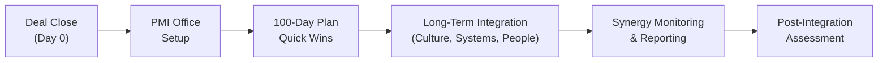

## Introduction

So, you’ve got a merger or acquisition all lined up—two companies are setting sail on a shared voyage. The financial models might look great, the synergy estimates might sparkle, and the press releases might be excitedly confident. But, well, the real test is what happens after the deal closes. That’s where Post-Merger Integration (PMI) comes into play. PMI is the process of unifying two organizations—people, systems, processes, culture, and all. It might sound straightforward, but ask almost anyone who has gone through it: it’s rarely a walk in the park. 

In this section, we look at how to navigate the complexities of post-merger integration, drawing on years of M&A best practices. Along the way, I’ll share a couple of personal experiences—like the time I watched a top-performing sales team exit because no one bothered to adapt the new annual sales bonus structure. And we’ll keep things practical with frameworks, synergy measurement approaches, and real-world examples of success (and missteps).

## Key Components of an Effective PMI

### Organizational Structure Alignment

One of the first things you notice after a merger is the organizational chart: it might look like a game of Tetris, with redundant roles, overlapping titles, and confusion about reporting lines. If you don’t address these issues quickly, you risk potential turf wars or duplication of efforts. 

• Reporting Lines: Decide which leaders stay, which teams merge, and how reporting will flow.  
• Department Consolidation: Identify areas (e.g., HR, procurement, logistics) where redundancies can be streamlined into a single department.  
• Decision Rights: Establish who can approve budgets, sign off on major expenditures, or set corporate policies.

Aligning organizational structure often sets the tone (formal and cultural) for the rest of the integration. A clear structure helps employees navigate the “who does what” in the combined entity.

### IT Systems and Data Integration

Ever tried to get two different enterprise resource planning (ERP) systems to speak to each other? It’s kind of like asking two people who speak different languages to hold an in-depth conversation—something will inevitably get lost in translation. Integrating IT systems is often among the most resource-intensive parts of PMI.

• Systems Audit: Catalog and evaluate all major IT systems (e.g., ERP, CRM, HRIS).  
• Data Cleansing: Merge customer or employee data without duplicating records or losing important information.  
• Platform Consolidation: Decide on a single system for each function to reduce costs and complexity.  
• Cybersecurity: Standardize security protocols to avoid vulnerabilities during system transitions.

### Cultural Integration and Talent Retention

Organizational “culture” can be intangible—like the water fish swim in. When two distinct cultures come into contact, friction can pop up in surprising ways. You might see disagreements on management style, risk tolerance, or even how to run team meetings.

• Cultural Assessments: Conduct surveys or interviews to identify each firm’s values and norms.  
• Leadership Modeling: Managers and executives should exemplify the desired culture—if they’re not aligned, employees pick up on that right away.  
• Talent Retention: Identify key employees and develop retention strategies (compensation adjustments, career growth opportunities) to keep them from jumping ship.  

Let me share a personal anecdote: in one project, we neglected to map out differences in how each company handled feedback. One was open and direct; the other was more formal and hierarchical. We ended up losing talented employees from the more direct-feedback culture because they felt stifled under the new environment. Lesson learned—culture matters, big time.

### Brand Identity

You might be merging two revered brand names, or maybe one brand is more recognized globally than the other. Determining how both brand identities will coexist (or consolidate) must happen early in the process. The brand strategy can shape how external stakeholders—customers, partners, and investors—perceive the combined firm.

• Unified Branding: Will you keep both logos or adopt a new combined identity?  
• Customer Perception: Understand how the market perceives each brand—sometimes local loyalty might outweigh the benefits of a single global identity.  
• Rolling Out the Change: Communicate consistently across social media, advertising, product packaging, etc.

## The Role of a Dedicated PMI Team

A dedicated PMI team is like the steering wheel of the integration process—keeping everyone focused on the right direction and ensuring tasks are completed on schedule. This group often includes senior executives, functional integration leads (finance, HR, operations, IT), and maybe an external consultant or two.

• Clear Charter: The PMI team should have a well-defined scope, including timelines, budgets, and authority.  
• Stakeholder Management: Keeping investors, board members, regulatory agencies, and employees informed is crucial.  
• Milestones and Key Performance Indicators (KPIs): The PMI team monitors synergy realization, cost savings, or any disruptions to daily operations.

A good chunk of synergy success depends on having a dedicated integration office or steering committee that’s empowered to escalate decisions and resource needs. If the PMI team lacks authority—or if top leadership is only half-involved—misalignment arises quickly.

## The 100-Day Integration Plan

In many private equity deals, you’ll hear about the “first 100 days.” It’s essentially a sprint to capture quick wins, stabilize operations, and implement the highest-impact changes. 

• Quick Wins: Examples might be renegotiating supplier contracts or consolidating redundant facilities.  
• Communication Blitz: Employees, customers, and suppliers should all know the rationale behind operational harmonization steps.  
• Performance Metrics: Track daily or weekly metrics to ensure your 100-day goals stay on target.

### Example 100-Day Plan Snapshot

1. Formalize new executive leadership roles within 2 weeks.  
2. Consolidate overlapping functions (e.g., finance or HR) within 30 days.  
3. Launch employee retention program, including revised equity incentives, by day 45.  
4. Integrate major IT systems or at least finalize the strategy for integration by day 90.  
5. Communicate synergy progress to all stakeholders by day 100, ensuring transparency.  

I’ve seen companies treat the 100-day plan like a security blanket. It provides structure, keeps morale high (people see progress happening fast), and sets the stage for more ambitious, long-term strategic changes.

## Synergy Realization and Performance Tracking

The big question after a merger is: are you actually delivering on the promised synergies? If the synergy story was central to the deal’s valuation, you need a robust system for measuring and reporting synergy realization.

Mathematically, synergy is often defined as:


\text{Synergy} = V_{A+B} - \bigl(V_A + V_B\bigr)


where  
• \\(V_{A+B}\\) is the combined value of the merged firm,  
• \\(V_A\\) and \\(V_B\\) are the standalone values of the two entities prior to the transaction.

Of course, that’s a simplified representation. In practice, synergy involves cost savings (e.g., reduced headcount, improved purchasing power) and revenue enhancements (e.g., cross-selling products, entering new geographic markets). 

#### Synergy Tracking Steps

1. Have synergy “owners”—specific leaders in charge of cost or revenue synergy targets.  
2. Establish a timeline with milestones for synergy capture.  
3. Monitor external factors (regulatory changes, new competitors) that could erode or amplify synergy potential.  
4. Use balanced scorecards or synergy dashboards to keep track of metrics such as cost savings, cross-selling volumes, and EBITDA margins.

Below is a quick Python snippet often used for synergy scenario modeling—merely to demonstrate how you might compare synergy projections under different assumptions:

```python
def calculate_synergy(synergy_scenarios):
    """
    synergy_scenarios: list of dict, each containing keys:
    'cost_savings', 'revenue_enhancements', 'probability'
    """
    expected_synergy = 0
    for scenario in synergy_scenarios:
        synergy_value = scenario['cost_savings'] + scenario['revenue_enhancements']
        expected_synergy += synergy_value * scenario['probability']
    return expected_synergy

scenarios = [
    {'cost_savings': 100, 'revenue_enhancements': 50, 'probability': 0.3},
    {'cost_savings': 150, 'revenue_enhancements': 80, 'probability': 0.5},
    {'cost_savings': 200, 'revenue_enhancements': 120, 'probability': 0.2},
]

print("Expected Synergy:", calculate_synergy(scenarios))
```

This snippet simply demonstrates how a financial analyst might run quick synergy estimates.

## Potential Pitfalls of PMI

### Culture Clash

Culture clash isn’t hypothetical; it’s one of the most frequent causes of post-merger “deal failure” in terms of synergy underperformance. A mismatch in leadership styles, communication norms, or even basic everyday practices (like dress code and remote-work flexibility) can lead to tension and employee turnover.  

### Loss of Key Personnel

If employees feel uncertain or undervalued—especially top performers—they may accept offers elsewhere. High turnover in specialized areas (like R&D or sales) can undermine synergy potential.

### IT Integration Delays

Delayed system integration can lead to data inconsistencies or operational disruptions (e.g., shipping errors, inaccurate client records), eroding brand reputation and negating cost savings.

### Overly Optimistic Synergy Estimates

Sometimes, synergy estimates turn out to be giant leaps of faith. In reality, synergy might take longer, cost more to achieve, or simply not materialize to the extent forecasted.

### Insufficient Communication

Silence can breed rumors and anxiety, so if management doesn’t communicate promptly and transparently, employees might assume the worst, leading to plummeting morale.

## Best Practices for Success

1. Establish a PMI Office: A central command center that coordinates tasks, tracks milestones, and manages budgets.  
2. Map Cultural Overlaps: Combine the best of both worlds whenever possible, but be clear about the ultimate culture you’re aiming for.  
3. Quick Wins: Identify low-hanging fruit to build momentum—like rationalizing overhead costs or negotiating better supplier terms.  
4. Align Incentives: Tailor compensation structures to reward behaviors that foster integration and synergy capture.  
5. Communicate, Communicate, Communicate: Regular updates, town halls, and open forums for Q&A.  

Below is a Mermaid diagram illustrating a simplified PMI workflow:



## Practical Example: A Manufacturing Merger

Let’s say we have two manufacturing firms, AlphaCo and BetaCo. They operate in adjacent market segments and share some common suppliers. The driver of the merger is to unify the supplier base, reduce overhead, and cross-sell each other’s products in overlapping geographies. 

• Organizational Structure: They create a single supply chain department, headed by BetaCo’s VP of Operations (who has a track record of negotiating supplier deals).  
• IT Systems: They choose AlphaCo’s ERP system because of its real-time inventory capabilities, phasing out BetaCo’s older system.  
• Culture: BetaCo’s leadership style is more top-down, while AlphaCo fosters open collaboration. They form joint cross-company teams to design best practices that preserve the efficiency of BetaCo’s structure but add AlphaCo’s transparency.  
• 100-Day Plan: Consolidate all raw material purchasing to a single system to leverage volume discounts. Launch a retention program aimed at top R&D engineers.  
• Tracking: The PMI team meets weekly, monitoring synergy progress, cultural alignment surveys, and monthly cost-savings vs. budget.  

After six months, the integrated firm has saved 5% more than forecast on supplier contracts, but it struggles with motivating R&D staff from the BetaCo side. In response, they pivot to a more collaborative approach in product design.

## Exam Tips for Post-Merger Integration

• When you see an M&A item set or essay question focusing on synergy, pay attention to whether the post-merger plan is realistic and well-structured.  
• Reference typical integration issues—culture, systems, leadership, redundancies—and how management can address them.  
• Consider time horizons: short-term (100 days) vs. long-term synergy tracking.  
• Don’t ignore intangible elements (brand identity, employee morale). They often appear in scenario-based questions.  

## Glossary

• **PMI (Post-Merger Integration)**: The process of unifying two companies operationally, financially, and culturally after a merger or acquisition.  
• **Integration Plan**: A roadmap of action steps, timelines, and responsibilities for combining business functions.  
• **Culture Clash**: Misalignment arising from different values, leadership styles, or internal practices in merging firms.  
• **Talent Retention**: Efforts to keep critical employees—especially those with specialized skills—engaged post-merger.  
• **Synergy Tracking**: Monitoring and measuring the ongoing realization of cost or revenue improvements initially forecast in the deal.  

## References and Further Reading

- Devine, M. (2002). Mergers and Acquisitions Integration Handbook. John Wiley & Sons.  
- BCG’s M&A Integration Insights: [https://www.bcg.com/](https://www.bcg.com/)  
- Accenture’s Case Studies on PMI Best Practices: [https://www.accenture.com/](https://www.accenture.com/)

---------------------------

## Test Your Knowledge: Post-Merger Integration Essentials



### Which of the following is most likely to cause a culture clash during post-merger integration?

- [ ] Having a dedicated PMI office with clear milestones.
- [ ] Employing a single unified ERP system for all business units.
- [x] Differing leadership and communication styles between the merged firms.
- [ ] Each company hosting an open house for the other’s employees.

> **Explanation:** Culture clash often arises from deep-seated differences in leadership, communication, and day-to-day norms—much more than from shared technologies or formal events.

### Which action is an example of a “quick win” in a 100-day integration plan?

- [ ] Redesigning the corporate brand and logos for both entities.
- [x] Renegotiating supplier contracts for immediate cost savings.
- [ ] Changing all middle-management roles within the first week.
- [ ] Letting employees gradually decide the new organizational structure.

> **Explanation:** Quick wins are tangible and quickly achievable. Renegotiating supplier contracts often yields immediate cost savings without large-scale system overhauls.

### Which of the following is a best practice for talent retention post-merger?

- [x] Providing retention bonuses or equity packages for high-value employees.
- [ ] Delaying communication about potential role changes.
- [ ] Applying uniform compensation structures without individual considerations.
- [ ] Releasing employees who had a top-tier performance rating in the acquired company.

> **Explanation:** Talent retention focuses on keeping high-value employees. Providing targeted bonuses and long-term incentives helps retain key personnel.

### A key component of successful post-merger IT integration typically includes:

- [ ] Cancelling all legacy systems without a backup plan.
- [ ] Leaving data to merge organically over time.
- [x] Conducting a thorough systems audit to determine the integration roadmap.
- [ ] Outsourcing every IT function immediately to a third-party vendor.

> **Explanation:** A detailed systems audit is critical to successful integration. It identifies overlaps, potential synergies, and security vulnerabilities before consolidating platforms.

### When tracking synergy realization, a common pitfall is:

- [ ] Using multiple metrics to gauge synergy.
- [ ] Assigning clear accountability for synergy targets.
- [ ] Updating synergy estimates over time based on new data.
- [x] Overestimating the cost savings or revenue enhancements that can be achieved.

> **Explanation:** Overly optimistic synergy assumptions lead to disappointment. Ongoing review and realistic planning help keep synergy estimates accurate.

### Which of the following is most likely the biggest risk of insufficient employee communication during post-merger integration?

- [ ] Reduced overhead costs.
- [ ] Higher synergy realization than forecast.
- [x] Loss of morale and increased turnover.
- [ ] Faster integration of IT systems.

> **Explanation:** Poor communication can create uncertainty and frustration, causing morale to drop and key employees to leave.

### The purpose of a dedicated PMI team or steering committee is primarily to:

- [ ] Execute all day-to-day operations for the merged entity.
- [x] Coordinate, oversee, and drive the integration process.
- [ ] Replace the Board of Directors once the merger is complete.
- [ ] Handle only cultural issues while ignoring financial or operational aspects.

> **Explanation:** A PMO (Project Management Office) or PMI steering committee ensures that integration steps are coordinated across all functions, budgets, and timelines.

### Which of the following actions best helps mitigate culture clashes?

- [ ] Forbidding any discussion of the differences.
- [ ] Only highlighting cost-savings goals in all communications.
- [x] Conducting cultural assessments and designing training programs to bridge gaps.
- [ ] Mandating one firm’s culture without any feedback loops.

> **Explanation:** Effective cultural integration starts with awareness—through assessments and training—so employees can recognize and address differences constructively.

### A 100-day plan in post-merger integration typically includes:

- [x] Short-term goals to capture immediate synergies and stabilize operations.
- [ ] An indefinite timeline with minimal reporting.
- [ ] Long-term synergy capture focusing solely on intangible benefits.
- [ ] Permanent retention of all organizational structures as they were pre-merger.

> **Explanation:** The 100-day plan is all about short-term actions and tangible milestones that generate momentum.

### True or False: Leaving the IT system integration to evolve naturally over time will typically improve synergy realizations.

- [x] True
- [ ] False

> **Explanation:** This is actually a tricky statement. In most cases, “letting IT integration evolve naturally” leads to misalignment in data, inefficiencies, and can even hamper synergy realization. However, thoughtful phasing can be necessary in certain scenarios. The reality is many organizations benefit from a structured approach that acknowledges system complexities. Overly rushed transitions can also cause disruptions. The best approach is a balance—meticulous planning and phased rollouts. In the practical sense, though, assuming “naturally evolving” means no structured plan often results in synergy shortfalls. So while “True” might be correct in extremely rare contexts, almost all best practices suggest structured integration is essential. Always carefully read question wording on exams.



---------------------------

**Final Exam Tip:** 
On the Level III exam, scenario-based questions about mergers and acquisitions might require you to evaluate not just the financial modeling but also the viability of the post-merger plan. Incorporate cultural, operational, and HR considerations when analyzing whether synergy targets are realistic and how effectively management is addressing transition risks. Think holistically and critically: does the narrative in the question suggest strong leadership and clear communication? Or are there signals of culture clash and unrealistic synergy assumptions waiting to be uncovered?
