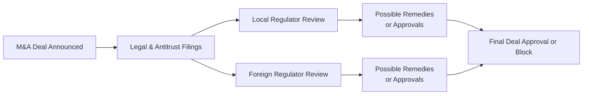

## Introduction

Regulatory approvals can easily be the make-or-break factor in M&A transactions—especially when deals cross international borders. I remember sitting in on a cross-border energy acquisition in my early days in finance, thinking, “Wow, everything’s lined up perfectly.” Then, we realized that we needed clearances from more than half a dozen regulators, each with its own agenda. You can imagine the scramble. So, let's dig into all those complexities, break them down, and figure out how best to navigate them.

In this section, we discuss the essential role regulators play in evaluating potential mergers and acquisitions (M&As) and how intricate it becomes when deals span different countries and jurisdictions. If you’ve read earlier chapters on M&A fundamentals (e.g., Chapter 9.1 on Mergers, Acquisitions, and Takeovers), you already have a sense of basic deal structures and rationale. Here, we add another dimension: the regulatory lens.

## Key Regulators and Their Roles

Regulatory authorities oversee M&A transactions to maintain fair competition, protect national security, and address any special concerns in particular industries. For instance, the U.S. Federal Trade Commission (FTC) and the European Commission’s Directorate-General for Competition ensure antitrust/competition laws aren’t violated. In some countries, such as those in Asia or Africa, local equivalents also exist—like the Competition Commission of India or the South African Competition Commission.

• Antitrust/Competition Laws: These laws are designed to protect market competition, ensuring that no single entity becomes so large that it restricts consumer choice or inflates prices unfairly.  
• Foreign Direct Investment (FDI) Screening: Certain proposals trigger additional scrutiny if there’s a foreign acquirer involved. Governments often want to be sure critical infrastructure doesn’t get controlled by potentially hostile or unknown foreign parties.  
• National Security Agencies: Authorities like the Committee on Foreign Investment in the United States (CFIUS) or other analogous bodies elsewhere review deals involving sensitive national assets.

## The M&A Approval Process

Whether your deal is domestic or cross-border, you’ll typically go through something like this:

1. Pre-Notification and Filing: Parties often file documents with relevant regulators, summarizing the deal’s structure, rationale, and competitive dynamics.  
2. Preliminary Review (Phase 1): Regulators check for obvious issues—like extremely high market concentration. If everything seems fine, your deal might get a green light early.  
3. In-Depth Review (Phase 2): If regulators see potential antitrust or competitive issues, they dig deeper. They might request more data, interview stakeholders, or consult independent experts.  
4. Negotiation and Remedies: If the regulator identifies any risk, the acquiring firm may offer remedies—like divesting a portion of the target’s business—to address concerns.  
5. Final Decision: The regulator approves (with or without remedies) or blocks the deal.

That’s the general flow, but, as you know, cross-border deals can multiply these steps because each jurisdiction’s regulator may have different criteria, timelines, and forms. 

## Cross-Border Complexity

Cross-border M&A means juggling multiple regulators and foreign investment rules. And, trust me, that can be tough. You might feel like you’re being pulled in a hundred directions. Here are some major considerations:

• Filing Requirements in Multiple Jurisdictions: Deals that reach certain revenue or asset thresholds will trigger approval processes in multiple locations. For example, acquiring a French tech company might spark a review not only in France, but also at the EU level, or even by U.S. regulators if the company does a significant portion of its business there.  
• Cultural and Legal Differences: Some countries have stricter attitudes toward foreign ownership (e.g., in defense or telecommunications). Others have more lenient frameworks. Understanding the local environment is essential.  
• Overlapping or Conflicting Regulations: One regulator might demand that you sell off a particular business line, while another regulator might want you to keep it. It can be a bit head-spinning.  
• FDI (Foreign Direct Investment) Rules: Many nations impose special approvals for foreign investment, particularly if it touches strategic resources, data-sensitive businesses, or infrastructure.  

### Example of Cross-Border Deal with Multiple Authorities

Let’s consider a hypothetical (but relatable) scenario:  
• An American automobile manufacturer aims to acquire a European electric vehicle (EV) battery startup.  
• The U.S. authorities (FTC) check if the acquisition lessens competition for EV batteries in the U.S.  
• The European Commission checks if it reduces competition in Europe.  
• Suppose the target also has operations in a country that requires a special sign-off from its Ministry of Science and Technology, due to advanced battery technology used in military applications.  

Suddenly, you’re dealing with three or more regulators, each with unique concerns—and that’s not even counting local tax authorities or environmental agencies.

## Sector-Specific and Politically Sensitive Deals

Certain industries—like banking, utilities, telecommunications, healthcare, and defense—often undergo deeper scrutiny. If your deal touches on national security, you might find yourself dealing with additional gatekeepers:

• Defense and National Security: If the target owns or develops sensitive technology, regulatory bodies may demand certain operational restrictions or block foreign ownership altogether.  
• Healthcare: Regulators may fear limited patient access to essential drugs or services if the market becomes too concentrated.  
• Telecommunications: Concerns may include data privacy, infiltration, or control over critical communication infrastructure.

On top of that, politically sensitive deals can spark public pressure: People may worry about job losses, or politicians might promise to block a transaction to “protect national interests.” I once saw a big telecom merger nearly derail because local politicians insisted the acquirer pledge not to close local offices or relocate employees. In the end, the acquirer agreed to keep certain call centers open.

## Strategies to Overcome Regulatory Hurdles

• Early Engagement with Regulators: Proactively discussing the transaction’s structure and potential competition issues can help identify red flags before they become full-blown crises.  
• Anticipating Remedies: Consider in advance what concessions you might make—like selling certain divisions or offering license agreements—if regulators raise concerns about market concentration.  
• Legal and Compliance Advisors: Employ specialized lawyers who know the ins and outs of each jurisdiction’s regulatory framework.  
• Political and Public Relations Efforts: If your deal is high-profile, be ready to engage the media, local communities, and stakeholders. This might involve guaranteeing local jobs or making infrastructure investments to gain favor.  
• Thorough Due Diligence: Make sure you fully understand the target’s regulatory profile—especially in cross-border deals—to avoid any hidden issues (like existing injunctions or national security restrictions).

## Best Practices for Managing Cross-Border M&A Risk

Here are a few best practices that might save serious headache:

• Build a Project Timeline: Lay out all the filing deadlines for each relevant regulator (e.g., 30 days for the FTC, 90 days for the EU Commission). Missing a filing date could add months or kill the deal.  
• Maintain Centralized Documentation: Keep critical documents updated in a secure, shared platform, so your team and legal counsel can quickly respond to regulatory requests.  
• Draft a “Plan B”: Prepare for possible remedial actions. If a regulator orders you to divest certain segments, do you have a buyer lined up?  
• Understand Local Culture: Regulators are not just about laws—they’re people within a broader national context. Building trust with them can go a long way.

## Diagram: Simplified Cross-Border Regulatory Approval Flow

Below is a Mermaid.js diagram illustrating a high-level overview of how multiple regulators might interact in a cross-border deal. This is a simplified depiction, but it highlights the parallel review processes that often happen simultaneously.

In some cases, you might have more than two sets of reviews. It’s not unusual to see five or more parallel regulatory tracks for truly global transactions.

## Example: Acquiring a Telecommunications Company

Let’s say Company X from Country A wants to acquire Company Y from Country B, an established telecom firm controlling essential communication infrastructure. Here’s a glimpse of what might unfold:

1. Company X must notify both Country A’s competition authority and Country B’s relevant telecom regulator.  
2. Because Company Y has operations spread across multiple regions (say, some in the European Union, some in Asia), more filings are triggered.  
3. The telecom regulator in Country B might demand that the new combined entity continue to operate certain consumer plans at or below specific price points. This is a remedy aimed at preventing consumer price hikes.  
4. Country A’s foreign investment agency might conduct an FDI review to ensure no sensitive intellectual property is transferred out of the country.  
5. Each regulator sets different deadlines. Delaying or mishandling one can derail the entire plan.  

When the dust settles, the deal closes—but only after Company X agrees to keep data centers in Country B for national security and user privacy reasons, plus invests in local technology R&D.

## Potential Risks and Mitigation

• Deal Uncertainty: Regulatory scrutiny can extend timelines and introduce unpredictability in final approvals.  
• Additional Costs: Negotiations, filing fees, divestitures, or operational changes can push up M&A expenses.  
• Reputational Issues: High-profile inquiries (or rejections) may taint corporate reputation or brand.  
• Market Reaction: Stock markets can quickly price in speculation about whether or not a transaction will survive regulatory review.  

Mitigating these risks involves robust planning, open dialogue with stakeholders, and a readiness to adapt deal structures or concession strategies.

## Key Takeaways

• Regulatory Approval is More Than a Box-Check: It’s central to whether an M&A deal will succeed.  
• Cross-Border = Multiple Layers of Scrutiny: Expect overlapping rules, different cultures, and political sensitivities.  
• Engage Early, Engage Often: Working with regulators and local advisors from the outset can help you steer clear of unexpected roadblocks.  
• Know Your Targets’ Regulatory Liability: A thorough due diligence process is critical to avoid hidden pitfalls.

## Glossary

• Antitrust/Competition Laws: Regulations designed to prevent anti-competitive practices and monopolies and ensure fair market competition.  
• Foreign Direct Investment (FDI) Screening: Reviews by government bodies that evaluate foreign investments in domestic companies, focusing on possible national security or economic concerns.  
• Regulatory Approval: Official consent from governmental or sector-specific regulators required for a transaction to proceed.  
• National Security Concerns: Potential threats perceived by a government if a foreign entity gains control over critical infrastructure or technology.  
• Remedies: Measures demanded by regulators—like asset sales or operational changes—to ensure that a proposed M&A deal isn’t anti-competitive or harmful to consumers.

## Further Reading and References

• The European Commission’s Merger Regulation: [https://ec.europa.eu/competition/](https://ec.europa.eu/competition/)  
• The FTC’s Guide to U.S. Antitrust Laws: [https://www.ftc.gov/](https://www.ftc.gov/)  
• CFIUS Guidelines for Foreign Acquisitions: [https://home.treasury.gov/policy-issues/cfius](https://home.treasury.gov/policy-issues/cfius)

---

## Test Your Knowledge: M&A Regulatory Approvals Quiz



### Which entity primarily reviews antitrust issues in the United States?  
- [ ] The World Trade Organization (WTO)  
- [x] The Federal Trade Commission (FTC)  
- [ ] The Internal Revenue Service (IRS)  
- [ ] The Environmental Protection Agency (EPA)  

> **Explanation:** The Federal Trade Commission (FTC) in the U.S. monitors transactions for potential antitrust or competitive concerns.

### Which of the following best describes a remedy in an M&A context?  
- [x] Actions required by regulators to address competitive concerns, such as divesting assets  
- [ ] A full rejection of the deal by the government  
- [ ] The initial filing required to begin approval procedures  
- [ ] Additional taxes applied after deal completion  

> **Explanation:** Remedies typically include measures like asset sales or licensing arrangements that mitigate monopoly risks or other regulatory concerns.

### In a cross-border deal, if the acquirer is from a foreign country, which type of additional review might they face?  
- [ ] Municipal government inspections  
- [x] Foreign Direct Investment (FDI) screening  
- [ ] Stock exchange listing compliance only  
- [ ] Mortgage underwriting  

> **Explanation:** A foreign acquirer often faces FDI screening, especially when critical or sensitive assets are being acquired.

### Which type of deal is most likely to face national security scrutiny?  
- [ ] Acquisition of a local bakery  
- [ ] Merger between two clothing retailers  
- [x] Acquisition of a company holding defense-related technology  
- [ ] Joint venture for social media marketing  

> **Explanation:** Deals involving defense technology or critical infrastructure are often subject to additional national security reviews.

### Among the following regulators, which is specifically focused on competition issues in the European Union?  
- [ ] International Monetary Fund (IMF)  
- [x] Directorate-General for Competition of the European Commission  
- [ ] European Central Bank (ECB)  
- [x] Local municipal planning authorities  

> **Explanation:** The Directorate-General for Competition in the European Commission oversees competition policy and M&A reviews in the EU.

### What is the primary purpose of a Phase 1 review in a regulatory approval process?  
- [x] Conduct a preliminary check for obvious competition or antitrust issues  
- [ ] Impose fines on the merging parties  
- [ ] Approve the deal if it’s too large  
- [ ] Conduct a full forensic audit of the target’s financial statements  

> **Explanation:** Phase 1 is an initial review where regulators examine whether the deal raises immediate red flags regarding competition. 

### What is the best general approach for companies to gain regulatory trust in a globally sensitive deal?  
- [ ] Maintain secrecy until the last possible moment  
- [ ] Submit incomplete data to strengthen their negotiation position  
- [x] Engage proactively with regulators and provide thorough, transparent information  
- [ ] Focus only on domestic filing requirements and see if foreign authorities object  

> **Explanation:** Proactive engagement and transparency with regulators is crucial to identify and address concerns early in the process.

### Why might politically sensitive M&A deals face public backlash?  
- [ ] Because politicians often want to learn new financial modeling techniques  
- [x] Because people fear job losses or foreign control of key domestic industries  
- [ ] Because M&A is inherently unpopular  
- [ ] Because all deals must be voted on by the public  

> **Explanation:** Political considerations often arise if the public or officials are worried about employment, national security, or other domestic interests.

### Which strategy helps mitigate cross-border regulatory complications?  
- [x] Preparing a timeline of all required filings and deadlines  
- [ ] Only filing in the acquirer’s home country  
- [ ] Withholding details from regulators  
- [ ] Announcing the deal after completing it  

> **Explanation:** A comprehensive timeline with each filing’s requirements provides structure, avoids missed deadlines, and helps manage expectations.

### True or False: Sector-specific regulators (e.g., in telecom or banking) may require additional approvals beyond standard antitrust reviews.  
- [x] True  
- [ ] False  

> **Explanation:** Many industries also have specialized agencies that can impose rules and conditions specific to their sector, adding another layer of review.


